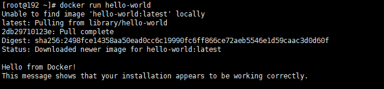
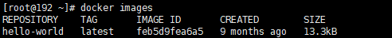
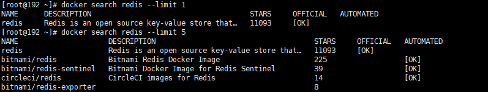
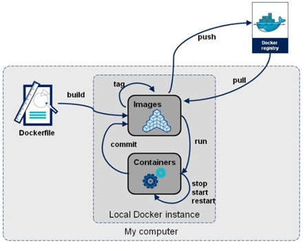
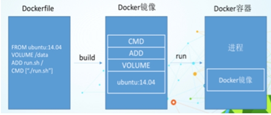
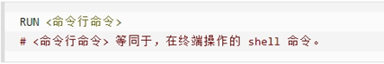
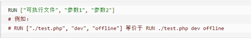

# 一、Docker在线安装

## 1.1、安装

```bash
#1.卸载之前的docker
sudo yum remove docker \
                  docker-client \
                  docker-client-latest \
                  docker-common \
                  docker-latest \
                  docker-latest-logrotate \
                  docker-logrotate \
                  docker-engine
#2.设置存储库
sudo yum install -y yum-utils
sudo yum-config-manager \
    --add-repo \
    https://download.docker.com/linux/centos/docker-ce.repo
#3.安装docker引擎
sudo yum install docker-ce docker-ce-cli containerd.io
#4.开机启动
sudo systemctl enable docker
```

## 1.2、设置阿里云镜像加速

```bash
sudo mkdir -p /etc/docker
sudo tee /etc/docker/daemon.json <<-'EOF'
{
  "registry-mirrors": ["https://rowhrf9a.mirror.aliyuncs.com"]
}
EOF
sudo systemctl daemon-reload
sudo systemctl restart docker
```

## 1.3、测试

```bash
#安装完毕，执行hello world测试
docker run hello-world
```



# 二、Docker离线安装

当服务器不能联网的时候，特别是在公司内部服务器安装docker，需要离线安装docker。

通过地址https://download.docker.com/linux/static/stable/x86_64/下载docker离线安装文件

```shell
docker-20.10.9.tgz 
#解压docker二进制文件
tar xzvf /path/to/<FILE>.tar.gz
#复制docker文件
sudo cp docker/* /usr/bin/
#目录下创建docker.service文件
/etc/systemd/system/
#添加文件权限
chmod +x /etc/systemd/system/docker.service
#启动守护进程
systemctl daemon-reload
#启动docker服务
systemctl start docker
#设置开机自启
systemctl enable docker.service
#查看docker版本
docker -v
#运行hello world进行测试
sudo docker run hello-world
```

也可执行脚本文件install.sh，一键离线安装

```sh
#!/bin/sh
echo '解压tar包...'
tar -xvf $1
echo '将docker目录移到/usr/bin目录下...'
cp docker/* /usr/bin/
echo '将docker.service 移到/etc/systemd/system/ 目录...'
cp docker.service /etc/systemd/system/
echo '添加文件权限...'
chmod +x /etc/systemd/system/docker.service
echo '重新加载配置文件...'
systemctl daemon-reload
echo '启动docker...'
systemctl start docker
echo '设置开机自启...'
systemctl enable docker.service
echo 'docker安装成功...'
docker -v
```

docker.service文件，将docker注册成系统文件

```sh
[Unit]
Description=Docker Application Container Engine
Documentation=https://docs.docker.com
After=network-online.target firewalld.service
Wants=network-online.target

[Service]
Type=notify
# the default is not to use systemd for cgroups because the delegate issues still
# exists and systemd currently does not support the cgroup feature set required
# for containers run by docker
ExecStart=/usr/bin/dockerd
ExecReload=/bin/kill -s HUP $MAINPID
# Having non-zero Limit*s causes performance problems due to accounting overhead
# in the kernel. We recommend using cgroups to do container-local accounting.
LimitNOFILE=infinity
LimitNPROC=infinity
LimitCORE=infinity
# Uncomment TasksMax if your systemd version supports it.
# Only systemd 226 and above support this version.
#TasksMax=infinity
TimeoutStartSec=0
# set delegate yes so that systemd does not reset the cgroups of docker containers
Delegate=yes
# kill only the docker process, not all processes in the cgroup
KillMode=process
# restart the docker process if it exits prematurely
Restart=on-failure
StartLimitBurst=3
StartLimitInterval=60s

[Install]
WantedBy=multi-user.target
```

卸载脚本 uninstall.sh

```sh
#!/bin/sh
echo '删除docker.service...'
rm -f /etc/systemd/system/docker.service
echo '删除docker文件...'
rm -rf /usr/bin/docker*
echo '重新加载配置文件'
systemctl daemon-reload
echo '卸载成功...'
```

# 三、Docker基本组成

## 3.1、images

Docker 镜像（Image）就是一个只读的模板。镜像可以用来创建 Docker 容器，一个镜像可以创建很多容器。比如一个Windows的安装文件ISO，就是一个系统镜像，可以将镜像安装到任何电脑上。相当于容器的源代码，可以基于源代码构建各种上层的容器服务。

## 3.2、container

Docker 利用容器（Container）独立运行的一个或一组应用，应用程序或服务运行在容器里面，容器就类似于一个虚拟化的运行环境，容器是用镜像创建的运行实例。比如构建的springboot项目jar包，可以看作是一个镜像，然后jar包可以起好多个不同的服务，这些服务可以看作是一个个基于jar包运行着的容器。

镜像是静态的定义，容器是镜像运行时的实体。容器为镜像提供了一个标准的和隔离的运行环境，它可以被启动、开始、停止、删除。每个容器都是相互隔离的、保证安全的平台。可以把容器看做是一个简易版的 Linux 环境（包括root用户权限、进程空间、用户空间和网络空间等）和运行在其中的应用程序。

## 3.3、repository

仓库（Repository）是集中存放镜像文件的场所。类似于Maven仓库，存放各种jar包的地方、github仓库，存放各种git项目的地方。
Docker公司提供的官方registry被称为Docker Hub，存放各种镜像模板的地方。

# 四、Docker常用命令

## 3.1、帮助启动类命令

```sh
#启动docker
systemctl start docker
#停止docker： 
systemctl stop docker
#重启docker： 
systemctl restart docker
#查看docker状态
systemctl status docker
#开机启动
systemctl enable docker
#查看docker概要信息
docker info
#查看docker总体帮助文档
docker --help
```

## 3.2、镜像命令

```bash
#列出镜像
docker images
#列出所有镜像
docker images -a 
#只显示镜像id
docker images -q
#过滤
docker images -f "dangling=true"
#dangling：显示标记为空的镜像，值只有true和false
#label：这个是根据标签进行过滤，其中lable的值，是docker在编译的时候配置的或者在Dockerfile中配置的
#before：这个是根据时间来进行过滤，其中before的value表示某个镜像构建时间之前的镜像列表
#since：跟before正好相反，表示的是在某个镜像构建之后构建的镜像
#reference：这个是添加正则进行匹配
```



- repository：镜像名称
- tag：版本标签，不指定则默认latest
- image id：镜像id
- created：镜像创建时间
- size：镜像大小

```bash
#搜索某个镜像
docker search xxx镜像name
```



主要看stars数量以及official是否为ok，为ok则代表是官方出品

```bash
#拉取镜像，镜像名称:tag 如果不加tag，则拉取latest最新版
docker pull redis:6.2
#查看docker占用资源情况（镜像、容器、容器卷）
docker system df
#删除镜像
docker rmi -f(强制) imageid:tag imageid2:tag
#删除所有镜像
docker rmi -f $(docker images -q -a)
```

### 虚悬镜像

仓库名、标签都是non>的镜像，俗称虚悬镜像dangling image。

## 3.3、容器命令

```bash
#运行容器
docker run options commond image:tag 
```

| 指令   | 含义                                                   |      |
| ------ | ------------------------------------------------------ | ---- |
| --name | 为容器指定一个名称                                     |      |
| -d     | 后台运行容器并返回容器ID，也即启动守护式容器(后台运行) |      |
| -i     | 以交互模式运行容器，通常与 -t 同时使用                 |      |
| -t     | 为容器重新分配一个伪输入终端，通常与 -i 同时使用       |      |
| -v     | 数据卷映射，将本地目录喝容器内的目录做绑定             |      |
| --net  | 网络模式                                               |      |
| -p     | 本机端口:docker端口，做端口映射                        |      |

```bash
#一般启动指令
docker run -d -p port:port -v localpath:dockerpath image:tag
#启动之后进入容器内部
docker exec -it 容器id /bin/bash
#列出当前所有的容器（包括退出、停止）
docker ps -a
```

- -a：列出当前所有正在运行的容器+历史上运行过的
- -l：显示最近创建的容器
- -n：显示最近n个创建的容器
- -q：静默模式，只显示容器编号。

```bash
#exec进入容器之后，退出
exit
#启动停止的容器
docker start 容器id
#重启容器
docker restart 容器id
#停止容器
docker stop 容器id //docker kill 容器id
#删除容器
docker rm -f 容器id1 容器id2 容器id3
#删除所有容器
docker rm -f $(docker ps -a -q)
#查看容器日志
docker logs 容器id
#查看容器内运行的进程
docker top 容器ID
#查看容器内部细节
docker inspect 容器ID
#容器内拷贝文件到本机
docker cp 容器ID:容器内路径 目的主机路径
```

### 导出导出容器

```bash
#导出为tar文件
docker export 容器ID > 文件名.tar
#导入容器，成为image
cat 文件名.tar | docker import - 镜像用户/镜像名:镜像版本号
```

```bash
load
```

## 3.4、容器卷

卷就是目录或文件，存在于一个或多个容器中，由docker挂载到容器，但不属于联合文件系统，因此能够绕过Union File System提供一些用于持续存储或共享数据的特性。

将运行的环境打包镜像，run后形成容器实例运行 ，但是我们对数据的要求希望是持久化的，Docker容器产生的数据，如果不备份，那么当容器实例删除后，容器内的数据自然也就没有了。为了能保存数据在docker中我们使用卷，卷的设计目的就是数据的持久化，完全独立于容器的生存周期，因此Docker不会在容器删除时删除其挂载的数据卷。

特点：

1. 数据卷可在容器之间共享或重用数据
2. 卷中的更改可以直接实时生效
3. 数据卷中的更改不会包含在镜像的更新中
4. 数据卷的生命周期一直持续到没有容器使用它为止

**容器卷记得加入--privileged=true**

如果是CentOS7，安全模块会比之前系统版本加强，不安全的会先禁止，所以目录挂载的情况被默认为不安全的行为，在SELinux里面挂载目录被禁止掉了，如果要开启，我们一般使用--privileged=true命令，扩大容器的权限解决挂载目录没有权限的问题，也即使用该参数，container内的root拥有真正的root权限，否则，container内的root只是外部的一个普通用户权限。

```bash
#使用-v 本地目录:docker目录，默认拥有读写权限
docker run -it --name XXX --privileged=true -v /tmp/myHostData:/tmp/myDockerData image:tag
#只赋予读权限 :ro 只读
docker run -it --privileged=true -v /宿主机绝对路径目录:/容器内目录:ro image:tag
```

# 五、Dockerfile

Dockerfile是用来构建Docker镜像的文本文件，是由一条条构建镜像所需的指令和参数构成的脚本。



构建三步骤

1. 编写Dockerfile文件
2. docker build命令构建镜像
3. docker run依镜像运行容器实例

dockerfile相当于构建镜像的脚本，内部规定镜像的名称、作者、参数、运行的commod指令等信息，build的时候首先拉取dockerfile文件，依据dockerfile文件中的配置进行镜像构建，构建成功之后就可以依据镜像创建容器了。

## 5.1、Dockerfile内容基础知识

1. 每条保留字指令都必须为大写字母且后面要跟随至少一个参数
2. 指令按照从上到下，顺序执行
3. #表示注释
4. 每条指令都会创建一个新的镜像层并对镜像进行提交

## 5.2、Docker执行Dockerfile的大致流程

1. docker从基础镜像运行一个容器
2. 执行一条指令并对容器作出修改
3. 执行类似docker commit的操作提交一个新的镜像层
4. docker再基于刚提交的镜像运行一个新容器
5. 执行dockerfile中的下一条指令直到所有指令都执行完成



## 5.3、Dockerfile常用保留字指令

- FROM

  基础镜像，当前新镜像是基于哪个镜像的，指定一个已经存在的镜像作为模板，第一条必须是from。一般springboot项目都是基于Java8或者openjdk8.

- MAINTAINER

  镜像维护者的姓名和邮箱地址

- RUN

  容器构建时需要运行的命令，docker build的时候执行的指令。

  1. shell格式

     

     ```shell
     RUN yum -y install vim
     RUN cp aaa/b docker/c
     ```

  2. exec格式

     

- EXPOSE

  当前容器对外暴露出的端口

- WORKDIR

  指定在创建容器后，终端登陆进来默认的工作目录，一个落脚点。

- USER

- 指定该镜像以什么样的用户去执行，如果都不指定，默认是root

- 
