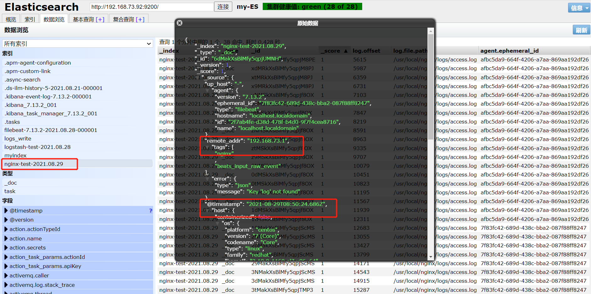

# ElasticStack综合案例

## 一、监控Nginx

### Nginx安装

```bash
#1.先安装gcc-c++编译器
yum install gcc-c++
yum install -y openssl openssl-devel
#2.再安装pcre包
yum install -y pcre pcre-devel
#3.再安装zlib包
yum install -y zlib zlib-devel
#4.下载
wget https://nginx.org/download/nginx-1.19.9.tar.gz
#5.解压并进入nginx目录
tar -zxvf nginx-1.19.9.tar.gz
cd nginx-1.19.9
#6.使用nginx默认配置
./configure
#7.编译安装
make
make install
#8.查找安装路径
whereis nginx #一般情况下是在这，nginx: /usr/local/nginx
#9.进入sbin目录，可以看到有一个可执行文件nginx，直接./nginx执行就OK了。
./nginx
#10.查看是否启动成功
ps -ef | grep nginx
```

修改nginx日志格式为json格式：/usr/local/nginx/conf/nginx.conf文件，在http模块下添加

```
    # json日志格式
    log_format log_json '{"@timestamp": "$time_local", '
                        '"remote_addr": "$remote_addr", '
                        '"referer": "$http_referer", '
                        '"request": "$request", '
                        '"status": $status, '
                        '"bytes": $body_bytes_sent, '
                        '"agent": "$http_user_agent", '
                        '"x_forwarded": "$http_x_forwarded_for", '
                        '"up_addr": "$upstream_addr",'
                        '"up_host": "$upstream_http_host",'
                        '"up_resp_time": "$upstream_response_time",'
                        '"request_time": "$request_time"'
                        ' }';
    access_log  logs/access.log  log_json;
```


### filebeat配置

编辑filebeat.yml文件，增加配置

```bash
filebeat.inputs:
- type: log
  enable: true
  paths:
    - /usr/local/nginx/logs/access.log
  tags: ["nginx"] #增加标签，用于区分是nginx
  json.keys_under_root: true #json格式的数据，将json的key添加到根节点
  json.add_error_key: true #发生错误的时候，增加error_key节点
  json.message_key: log
output.logstash:
  # The Logstash hosts
  hosts: ["127.0.0.1:5044"]
```

启动filebeat

```bash
./filebeat -e -c filebeat.yml
```

### logstash配置

```bash
input {
  beats {
    port => 5044 #默认开5044端口，用于beats上传数据
  }
}

output {
  if "nginx" in [tags] {
     stdout { codec => rubydebug } #本地输出，用于调试
	 elasticsearch {
       hosts => ["http://192.168.73.90:9200"]
       index => "nginx-test-%{+YYYY.MM.dd}" #自定义日志名称
       #user => "elastic" #如果es需要用户名、秘密
       #password => "changeme"
     }
   }
}
```

启动logstash

```bash
./bin/logstash -f ./config/logstash-sample.conf
```


### head插件查看es数据



## 二、监控ES集群

## 三、监控应用程序

