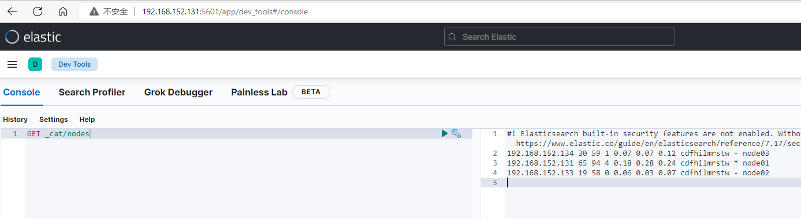

# Elasticsearch

## 安装和配置

### 1、windows安装（集群3个节点）

1. 下载链接https://artifacts.elastic.co/downloads/elasticsearch/elasticsearch-7.17.4-windows-x86_64.zip

2. 解压缩后复制三份。

   

3. config目录下，依次修改elasticsearch.yml文件

   - node01

     ```yaml
     cluster.name: es-cluster
     node.name: node01
     network.host: localhost
     http.port: 9201 #restful端口
     discovery.seed_hosts: ["127.0.0.1:9301","127.0.0.1:9302", "127.0.0.1:9303"]
     transport.tcp.port: 9301 #es各节点间通信端口
     cluster.initial_master_nodes: ["node01"]
     node.master: true
     node.data: true
     http.cors.enabled: true
     http.cors.allow-origin: "*"
     ```

   - node02

     ```yaml
     cluster.name: es-cluster
     node.name: node02
     network.host: localhost
     http.port: 9202
     discovery.seed_hosts: ["127.0.0.1:9301","127.0.0.1:9302", "127.0.0.1:9303"]
     transport.tcp.port: 9302
     cluster.initial_master_nodes: ["node01"]
     node.master: true
     node.data: true
     http.cors.enabled: true
     http.cors.allow-origin: "*"
     ```

   - node03

     ```yaml
     cluster.name: es-cluster
     node.name: node03
     network.host: localhost
     http.port: 9203
     discovery.seed_hosts: ["127.0.0.1:9301","127.0.0.1:9302", "127.0.0.1:9303"]
     transport.tcp.port: 9303
     cluster.initial_master_nodes: ["node01"]
     node.master: true
     node.data: true
     http.cors.enabled: true
     http.cors.allow-origin: "*"
     ```

4. 依次启动

   数据目录在

   ```java
   node01-elasticsearch-7.17.4\data\
   node02-elasticsearch-7.17.4\data\
   node03-elasticsearch-7.17.4\data\
   ```

   依次启动node01、node02、node03 bin目录下elasticsearch.bat文件

   
   
5. jdk环境依赖问题

   Elasticsearch 是使用 java 开发的，且 7.8 版本的 ES 需要 JDK 版本 1.8 以上，默认安装 包带有 jdk 环境，如果系统配置 JAVA_HOME，那么使用系统默认的 JDK，如果没有配 置使用自带的 JDK，一般建议使用系统配置的 JDK。

6. 内存问题

   双击启动窗口闪退，通过路径访问追踪错误，如果是“空间不足”，请修改 config/jvm.options 配置文件

   ```yaml
   # 设置 JVM 初始内存为 1G。此值可以设置与-Xmx 相同，以避免每次垃圾回收完成后 JVM 重新分配内存
   # Xms represents the initial size of total heap space
   # 设置 JVM 最大可用内存为 1G
   # Xmx represents the maximum size of total heap space
   -Xms1g
   -Xmx1g
   ```


### 2、Linux安装（集群3个节点）

#### 1、安装

1. 准备三台Linux虚拟机

2. 下载链接：https://artifacts.elastic.co/downloads/elasticsearch/elasticsearch-7.17.5-linux-x86_64.tar.gz

3. 解压缩

   ```bash
   #创建目录
   mkdir /usr/local/soft
   #进入目录后，可以下载后ftp上传，也可以直接Linux中下载
   wget https://artifacts.elastic.co/downloads/elasticsearch/elasticsearch-7.17.5-linux-x86_64.tar.gz
   #解压缩
   tar -xzf elasticsearch-7.17.5-linux-x86_64.tar.gz
   ```

   

4. config目录下，修改elasticsearch.yml文件

   - node01

     ```yaml
     cluster.name: es-cluster
     node.name: node01
     network.host: 192.168.152.131
     http.port: 9201 #restful端口
     discovery.seed_hosts: ["192.168.152.131:9301","192.168.152.133:9302", "192.168.152.134:9303"]
     transport.tcp.port: 9301 #es各节点间通信端口
     cluster.initial_master_nodes: ["node01"]
     node.master: true
     node.data: true
     http.cors.enabled: true
     http.cors.allow-origin: "*"
     ```

   - node02

     ```yaml
     cluster.name: es-cluster
     node.name: node02
     network.host: 192.168.152.133
     http.port: 9202 #restful端口
     discovery.seed_hosts: ["192.168.152.131:9301","192.168.152.133:9302", "192.168.152.134:9303"]
     transport.tcp.port: 9302 #es各节点间通信端口
     cluster.initial_master_nodes: ["node01"]
     node.master: true
     node.data: true
     http.cors.enabled: true
     http.cors.allow-origin: "*"
     ```

   - node03

     ```yaml
     cluster.name: es-cluster
     node.name: node03
     network.host: 192.168.152.131
     http.port: 9203 #restful端口
     discovery.seed_hosts: ["192.168.152.131:9301","192.168.152.133:9302", "192.168.152.134:9303"]
     transport.tcp.port: 9303 #es各节点间通信端口
     cluster.initial_master_nodes: ["node01"]
     node.master: true
     node.data: true
     http.cors.enabled: true
     http.cors.allow-origin: "*"
     ```

5. 创建非root用户

   ```bash
   #创建非root账户，es只能在非root账户下
   adduser esuser
   passwd esuser
   #给账户赋予目录权限
   chown -R elastic /usr/local/soft
   ```

6. 使用创建的非root用户登录

   ```bash
   cd /usr/local/soft/elasticsearch-7.17.5/bin/
   #启动
   ./elasticsearch
   ```

   

#### 2、访问测试

1. 浏览器访问

   - 单节点

   

   - 集群节点

     

2. 如果访问不了，关闭防火墙

   ```bash
   #>>>关闭防火墙
   #停止firewall
   systemctl stop firewalld.service
   #禁止firewall开机启动
   systemctl disable firewalld.service
   ```

#### 3、普遍遇到的问题

1. max file descriptors [4096] for elasticsearch process is too low, increase to at least [65535]

   ```bash
   vi /etc/security/limits.conf
   在最后增加配置
   * soft nofile 65536
   * hard nofile 65536
   ```

   此文件修改后需要重新登录用户，才会生效

   

2. max number of threads [3795] for user [esuser] is too low, increase to at least [4096]

   最大线程数不够

   ```bash
   vi  /etc/security/limits.conf
   在最后增加配置
   * soft nproc 4096
   * hard nproc 4096
   ```

   

3. max virtual memory areas vm.max_map_count [65530] is too low, increase to at least [262144]

   ```bash
   vi /etc/sysctl.conf
   在最后增加配置
   vm.max_map_count=262144
   然后执行命令/sbin/sysctl -p 立即生效
   ```

   

### 3、kibana安装（windows）

1. 下载链接https://artifacts.elastic.co/downloads/kibana/kibana-7.17.4-windows-x86_64.zip

2. 解压缩后进入config目录下，修改kibana.yml文件

   ```yaml
   elasticsearch.hosts: ["http://localhost:9201"]
   ```

3. 启动

   bin目录下执行kibana.bat文件，启动成功之后访问http://localhost:5601

   

### 4、kibana安装（Linux）

1. 下载链接：https://artifacts.elastic.co/downloads/kibana/kibana-7.17.5-linux-x86_64.tar.gz

2. 解压缩

   ```bash
   #创建目录
   mkdir /usr/local/soft
   #进入目录后，可以下载后ftp上传，也可以直接Linux中下载
   wget https://artifacts.elastic.co/downloads/kibana/kibana-7.17.5-linux-x86_64.tar.gz
   #解压缩
   tar -xvf kibana-7.17.5-linux-x86_64.tar.gz
   ```

3. 进入config目录下修改kibana.yml文件

   ```yaml
   server.port: 5601
   server.host: "192.168.152.131" #当前Linux的ip
   elasticsearch.hosts: ["http://192.168.152.131:9201"]
   ```

4. 非root用户启动

   ```
   #root用户赋权限
   chown -R elastic /usr/local/soft
   #非root用户bin目录下执行
   ./kibana
   ```

   

### 5、head插件安装

```
git clone git://github.com/mobz/elasticsearch-head.git
cd elasticsearch-head
npm install
npm run start
open http://localhost:9100/
```

如果无法发现ES节点，尝试在ES配置文件中设置允许跨域

```
http.cors.enabled: true
http.cors.allow-origin: "*"
```

安装成功效果图：


### 6、常用配置

- Cluster&Node

  ```yaml
  cluster.name:
  	配置elasticsearch的集群名称，默认是elasticsearch。建议修改成一个有意义的名称。
  node.name:
  	节点名，通常一台物理服务器就是一个节点，es会默认随机指定一个名字，建议指定一个有意义的名称，方便管理。
  	一个或多个节点组成一个cluster集群，集群是一个逻辑的概念，节点是物理概念。
  node.master: 
  	指定该节点是否有资格被选举成为master结点，默认是true，如果原来的master宕机会重新选举新的master。
  node.data: 
  	指定该节点是否存储索引数据，默认为true。
  ```
  
- Paths

  ```yaml
  path.conf:
  	设置配置文件的存储路径，tar或zip包安装默认在es根目录下的config文件夹，rpm安装默认在/etc/ elasticsearch
  path.data:
  	设置索引数据的存储路径，默认是es根目录下的data文件夹，可以设置多个存储路径，用逗号隔开。
  path.logs:
  	设置日志文件的存储路径，默认是es根目录下的logs文件夹
  path.plugins: 
  	设置插件的存放路径，默认是es根目录下的plugins文件夹
  ```
  
- Memory

  ```yaml
  bootstrap.memory_lock: true
  	设置为true可以锁住ES使用的内存，避免内存与swap分区交换数据。swap分区速度会非常慢。
  ```
  
- Network

  ```yaml
  network.host: 
  	设置绑定主机的ip地址，设置为0.0.0.0表示绑定任何ip，允许外网访问，生产环境建议设置为具体的ip。
  http.port: 9200
  	设置对外服务的http端口，默认为9200。
  transport.tcp.port: 9300  
      集群结点之间通信端口
  http.cors.enabled: 
      是否允许跨域
  http.cors.allow-origin: 
      "*"
  ```
  
- Discovery

  ```yaml
  discovery.seed_hosts:
      配置所有node.master为true的节点。
  cluster.initial_master_nodes: 
      设置初始master是哪个节点，启动服务后可以自动生效，省略选举过程，推荐配置集群中的仅master节点
  discovery.zen.ping.unicast.hosts: ["host1:port", "host2:port", "..."]
  	设置集群中master节点的初始列表。
  discovery.zen.ping.timeout: 3s
  	设置ES自动发现节点连接超时的时间，默认为3秒，如果网络延迟高可设置大些。
  discovery.zen.minimum_master_nodes:
  	主结点数量的最少值 ,此值的公式为：(master_eligible_nodes / 2) + 1 ，比如：有3个符合要求的主结点，那么这里要设置为2。
  node.max_local_storage_nodes: 
  	单机允许的最大存储结点数，通常单机启动一个结点建议设置为1，开发环境如果单机启动多个节点可设置大于1。
  ```
  
  
