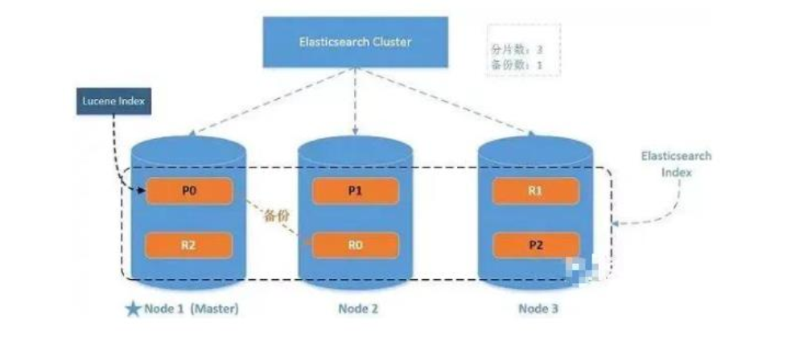

# Elasticsearch

## 一、核心概念

### 1.1、倒排索引


关系型数据库的正向索引，根据id可以定位到具体的某一条数据，是key-value模型。

倒排索引是反过来，将数据进行分词拆分，查找的时候根据某个词汇，按照相关度最终定位到id。类似value-key模型。

比如对brandName字段建立倒排索引，会对每条记录进行分词，并记录这个词汇出现在哪条记录中，“小米”出现在1、2、3中，"NFC"出现在2、3中。

倒排索引的结构：

- 包含这个关键词的document list
- TF term frequency:词频，搜索的关键词在每个doc中出现的次数，次数越多，代表相关性越高
- IDF inverse doc frequency：搜索的关键词在整体倒排索引中出现的次数，出现的次数越多，代表相关性越低，关键词越不重要，比如“是”、“了”这类词汇，就是非常不重要的数据。
- 每个doc的长度：越长相关度越低。
- 包含这个关键词的所有doc的平均长度。

### 1.2、优势

- 面向开发者友好，屏蔽了Lucene的复杂特性，集群自动发现（cluster discovery）
- 自动维护数据在多个节点上的建立
- 会帮我们做搜索请求的负载均衡
- 自动维护冗余副本，保证了部分节点宕机的情况下仍然不会有任何数据丢失
- ES基于Lucene提供了很多高级功能：复合查询、聚合分析、基于地理位置等。
- 对于大公司，可以构建几百台服务器的大型分布式集群，处理PB级别数据；对于小公司，开箱即用，门槛低上手简单。
- 相比较传统数据库，提供了全文检索，同义词处理（美丽的cls>漂亮的cls），相关度排名。聚合分析以及海量数据的近实时（NTR）处理，这些传统数据库完全做不到。

### 1.3、核心关键词


#### elasticsearch

elasticsearch相当于关系型数据库MySQL，是一个存储数据、提供搜索查询功能的整体应用程序。

#### index

索引。类似于数据库——它是我们存储和索引关联数据的地方。其实也可以按照一张数据库表的概念来理解。一个index会存储一类事务的数据，比如dog_index，会存储所有dog的数据。

```
提示：事实上，我们的数据被存储和索引在分片(shards)中，索引只是一个把一个或多个分片分组在一起的逻辑空间。然而，这只是一些内部细节——我们的程序完全不用关心分片。对于我们的程序而言，文档存储在索引(index)中。剩下的细节由Elasticsearch关心既可。
```

#### type

类型。可参照数据库中的table表的概念来理解，拥有自己的mapping结构。拥有field字段、属性等信息，但是在es7中逐渐被废弃，在es8中将被彻底废弃。一般es会默认设置type值为_doc。

#### document

- 存储在Elasticsearch中的主要实体叫文档（document）。用关系型数据库来类比的话，一个文档相当于数据库表中的一行记录，是json格式。
- Elasticsearch中的文档，可以有不同的mapping结构，但Elasticsearch的文档中，相同字段必须有相同类型。比如存储两条数据的时候，name字段的类型必须相同，不能一个是string，另一个integer。
- 文档由多个字段组成，每个字段可能多次出现在一个文档里，这样的字段叫多值字段（multivalued）。 每个字段的类型，可以是文本、数值、日期等。字段类型也可以是复杂类型，一个字段包含其他子文档或者数组。

#### field

字段。和MySQL中的字段类似，也有自己的类型，数据结构。

#### node

节点，一个ES实例就是一个node。不同的node可以建立在同一台物理机上，但是为了更好的性能，一般一台物理机上只会配置一个es实例，不会安装其他服务。

### 1.4shard分片和副本

为了将数据添加到Elasticsearch，我们需要索引(index)——一个存储关联数据的地方。实际上，索引只是一个用来指向一个或多个分片(shards)的“逻辑命名空间(logical namespace)”.

- 一个分片(shard)是一个最小级别“工作单元(worker unit)”,它只是保存了索引中所有数据的一部分。
- 我们需要知道是分片就是一个Lucene实例，并且它本身就是一个完整的搜索引擎。应用程序不会和它直接通信。
- 分片可以是主分片(primary shard)或者是复制分片(replica shard)。
- 索引中的每个文档属于一个单独的主分片，所以主分片的数量决定了索引最多能存储多少数据。
- 复制分片只是主分片的一个副本，它可以防止硬件故障导致的数据丢失，同时可以提供读请求，比如搜索或者从别的shard取回文档。
- 当索引创建完成的时候，主分片的数量(number_of_shards)就固定了，但是复制分片(number_of_replicas)的数量可以随时调整。
- 副本分片可以提供硬件故障时的容灾以及防止数据丢失，所以主分片和副本分片是不能在同一个es 实例node中的。
- 副本分片可以提供容灾、提高查询性能。但是副本分片不能提供写入功能。
- 

## 二、写入原理


1. 写入请求将数据写入到内存buffer。
2. 默认（可设置）1s创建一个segment 文件，将数据存到磁盘。同时会对每一个请求，将操作记录下来，存到translog文件中，用于容灾备份。
3. segment会立马将数据同步到OS Cache，并将segment的status置为open，读请求可以访问，进行读操作。
4. OS Cache文件大小达到阈值或者默认（可设置）每30分钟，触发一次flush，将数据写入磁盘持久化。
5. .del 文件：在删除或者修改操作中，会将原有数据进行逻辑删除，标记位置为isdelete。
6. segment文件：提供读请求的数据。读写分离，使ES达到实时搜索。
7. Commit Point：记录当前可用的segment。当segment数量太多时，会触发合并操作，将相似的segment进行合并merge。紧接着执行flush操作。创建新的Commit Point标记，标记新的segment，删除旧的标记。将新的segment搜索状态打开，删除旧的segment文件。
8. translog文件：会记录每一次的请求操作。用于系统宕机之后的数据容灾备份。
9. flush操作：当OS Cache文件大小达到阈值、默认30分钟、或者手动触发。执行commit，将内存buffer中的数据立马写入到segment中，并将segment同步到OS Cache、开启open状态。OS Cache执行fsync同步磁盘操作。最后清空translog文件。
           segment 和 translog 最终肯定都是写文件，但是两者是各自写各自的，不相干， segment 是索引类的文件，在写之前要经过大量的计算，比如分词、构建倒排索引等，它存的是索引相关的数据，而 translog 只是简单的追加数据增删改的操作记录，只是为了后面服务意外中止时通过回放这个记录来减少数据的丢失。segment 记录的数据与 translog 是不一样的。
           那么涉及到写文件逻辑就一样了，都要 fsync 后才能保证真正落盘不丢数据，fsync 前数据是存在 OS 文件系统 Cache 里面的，如果服务意外中止，那么这部分数据就丢失了，即便重启也不会再 fsync。因此 translog 其实也是会丢数据的，所以才有translog 的相关参数(index.translog.sync_interval)来控制它 fsync 的频率，这个频率越高，丢的数据就越少。translog 一样会丢数据，要设置好相关参数，确保自己可以接受相应的数据丢失。

## 三、系统架构

- 
- 一个运行中的 Elasticsearch 实例称为一个节点，而集群是由一个或者多个拥有相同cluster.name 配置的节点组成， 它们共同承担数据和负载的压力。当有节点加入集群中或者从集群中移除节点时，集群将会重新平均分布所有的数据。
- 当一个节点被选举成为主节点时， 它将负责管理集群范围内的所有变更，例如增加、删除索引，或者增加、删除节点等。 而主节点并不需要涉及到文档级别的变更和搜索等操作，所以当集群只拥有一个主节点的情况下，即使流量的增加它也不会成为瓶颈。 任何节
  点都可以成为主节点。
- 作为用户，我们可以将请求发送到集群中的任何节点 ，包括主节点。 每个节点都知道任意文档所处的位置，并且能够将我们的请求直接转发到存储我们所需文档的节点。 无论我们将请求发送到哪个节点，它都能负责从各个包含我们所需文档的节点收集回数据，并将最终结果返回給客户端。 Elasticsearch 对这一切的管理都是透明的。

## 四、路由计算

- 当索引一个文档的时候，文档会被存储到一个主分片中。 Elasticsearch 如何知道一个文档应该存放到哪个分片中呢？当我们创建文档时，它如何决定这个文档应当被存储在分片1 还是分片 2 中呢？首先这肯定不会是随机的，否则将来要获取文档的时候我们就不知道从何处寻找了。

- 实际上，这个过程是根据下面这个公式决定的：

  

- routing 是一个可变值，默认是文档的 _id ，也可以设置成一个自定义的值。 routing 通过hash 函数生成一个数字，然后这个数字再除以 number_of_primary_shards （主分片的数量）后得到余数 。这个分布在 0 到 number_of_primary_shards-1 之间的余数，就是我们所寻求的文档所在分片的位置。这就解释了为什么我们要在创建索引的时候就确定好主分片的数量并且永远不会改变这个数量：因为如果数量变化了，那么所有之前路由的值都会无效，文档也再也找不到了。

- 所有的文档 API（ get 、 index 、 delete 、 bulk 、 update 以及 mget ）都接受一个叫做 routing 的路由参数 ，通过这个参数我们可以自定义文档到分片的映射。一个自定义的路由参数可以用来确保所有相关的文档——例如所有属于同一个用户的文档——都被
  存储到同一个分片中。
