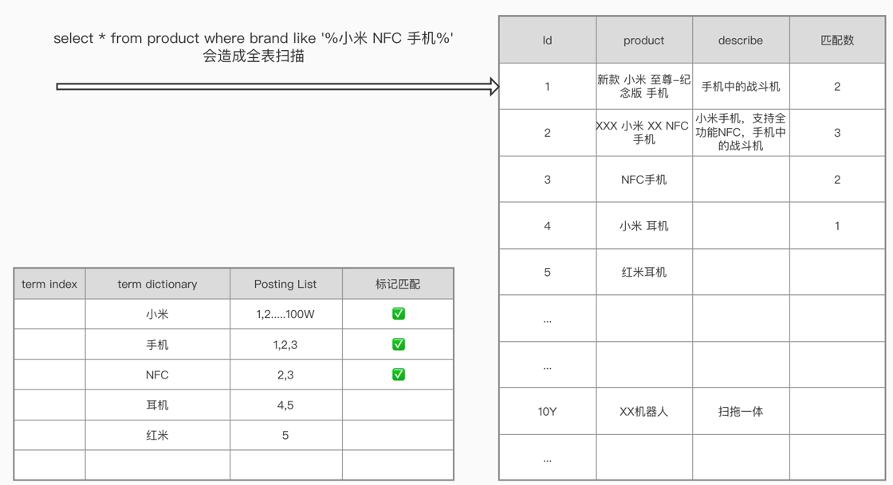
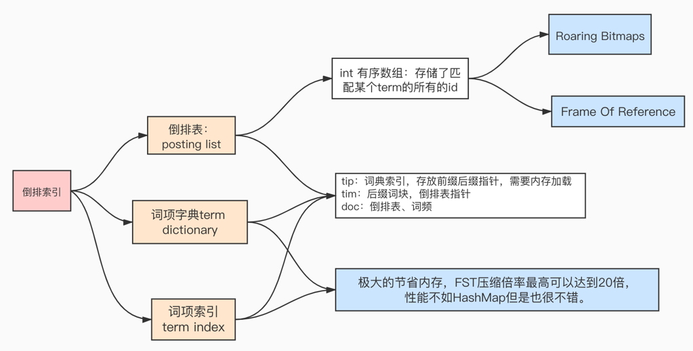
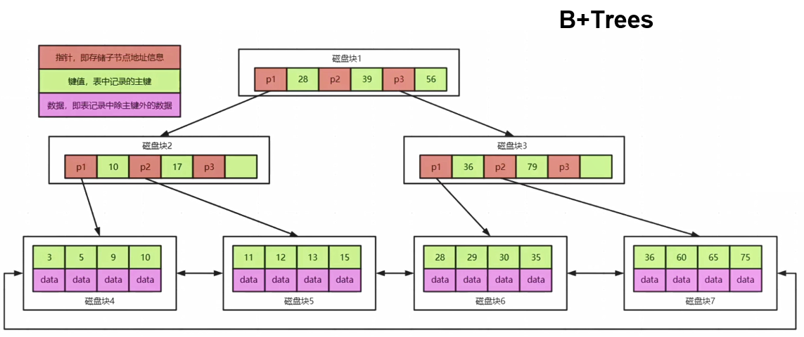
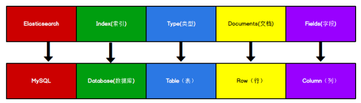
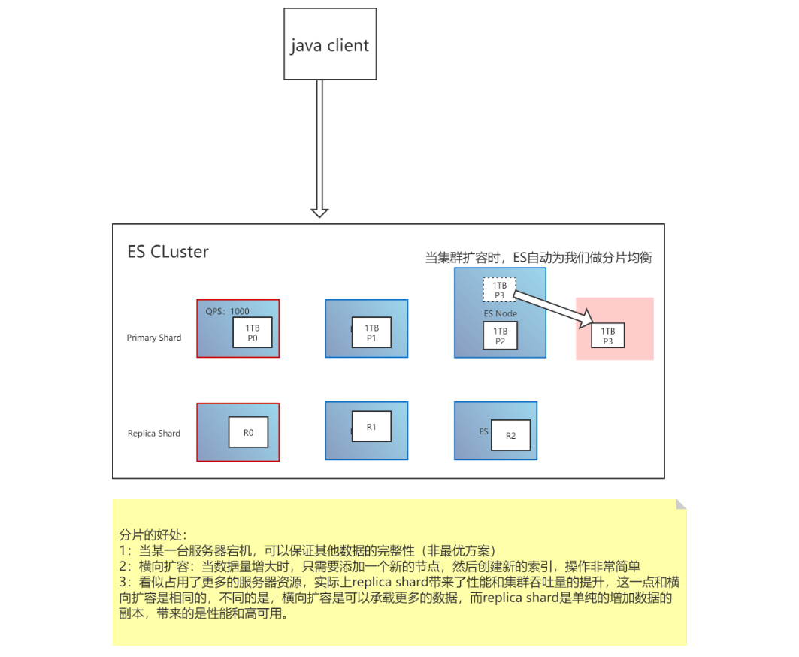

# ElasticSearch核心概念

## 一、全文检索

索引系统通过扫描文章中的每一个词，对其创建索引，指明在文章中出现的次数和位置，当用户查询时，索引系统就会根据事先建立的索引进行查找，并将查找的结果反馈给用户的检索方式。

## 二、核心概念

### 2.1、倒排索引

倒排索引会在存储数据时将关键词和数据进行关联，保存到倒排表中，然后查询时，将查询内容进行分词后在倒排表中进行查询，最后匹配数据即可。

关系型数据库的正向索引，根据id可以定位到具体的某一条数据，是key-value模型。倒排索引是反过来，将数据进行分词拆分，查找的时候根据某个词汇，按照相关度最终定位到id。类似value-key模型。

比如对brand Name字段建立倒排索引，会对每条记录进行分词，并记录这个词汇出现在哪条记录中，“小米”出现在1、2....100W中，"NFC"出现在2、3中。进行数据存储时会按照分词规则进行分词、倒排索引的构建，并且在查询时，也会针对query string进行分词。

### 2.2、倒排索引的结构

主要分为term index 词项索引、term dictionary词项字典、posting list倒排表。

- term dictionary：词项字典中存储分词后的各个词语。
- term index：是对词项字典中的各个词项建立索引。
- posting list：倒排表，在倒排表中主要会存储包含当前词项doc的ids。并且还会包含其他信息：
  - TF term frequency：词频，搜索的关键词在每个doc中出现的次数，次数越多，代表相关性越高。
  - IDF inverse doc frequency：搜索的关键词在整体倒排索引中出现的次数，出现的次数越多，代表相关性越低，关键词越不重要，比如“是”、“了”这类词汇，就是非常不重要的数据。
  - 每个doc的长度：越长相关度越低。
  - 包含这个关键词的所有doc的平均长度。

### 2.3、倒排索引的优势

类似MySQL的B+Tree索引结构，属于正向索引，当面对小数据量的时候，可以很好的提升检索速度，但是当用于大数据量以及检索需求的时候，就力不从心了。

- 当数据量上亿的时候，对于搜索引擎来说，数据量其实还小，但是如果使用MySQL这种正向索引，就会导致B+Tree的索引深度非常深，随之而来的IO就会变的很可怕。
- 检索数据的需求，并不是类似正排索引那样，使用like %XXX%即可搜索到数据，检索更多的场景是关键词“中国”，可以检索出中国、中华人民共和国、China这种的数据。
- 索引的字段往往是很长的大文本，也不适合建立正排索引。

基于倒排索引，可以检索海量数据，并可以支持诸如同义词转换、中英文转换、相关度评分等功能。

### 2.4、ES的核心关键词

#### ElasticSearch

ElasticSearch相当于关系型数据库MySQL，是一个存储数据、提供搜索查询功能的整体应用程序。

#### 索引（index）

索引。类似于数据库，它是我们存储和索引关联数据的地方。其实也可以按照一张数据库表的概念来理解。一个index会存储一类事务的数据，比如dog_index，会存储所有dog的数据。

[^提示：事实上，我们的数据被存储和索引在分片(shards)中，索引只是一个逻辑空间，这个逻辑空间把一个或多个分片分组在一起。然而，这只是一些内部细节——我们的程序完全不用关心分片。对于我们的程序而言，文档存储在索引(index)中。剩下的细节由Elasticsearch关心既可。]: 

#### 类型（type）

类型。如果把index理解成数据库，那么可参照数据库中的table表的概念来理解type。拥有自己的mapping结构、拥有field字段、属性等信息，但是在es7中逐渐被废弃，在es8中被彻底废弃。一般es会默认设置type值为_doc。

#### 文档（document）

- 存储在Elasticsearch中的主要实体叫文档（document）。用关系型数据库来类比的话，一个文档相当于数据库表中的一行记录，是json格式。
- Elasticsearch中的文档，可以有不同的mapping结构，但Elasticsearch的文档中，相同字段必须有相同类型。比如存储两条数据的时候，name字段的类型必须相同，不能一个是string，另一个integer。
- 文档由多个字段组成，每个字段可能多次出现在一个文档里，这样的字段叫多值字段（multivalued）。 每个字段的类型，可以是文本、数值、日期等。字段类型也可以是复杂类型，一个字段包含其他子文档或者数组。

#### 字段（field）

字段。和MySQL中的字段类似，也有自己的类型，数据结构。

#### 节点（node）

节点，一个ES实例就是一个node。不同的node可以建立在同一台物理机上，但是为了更好的性能，一般一台物理机上只会配置一个es实例，不会安装其他服务。

## 三、ES的分片和副本

### 3.1、分片

为了将数据添加到Elasticsearch，我们需要索引(index)——一个存储关联数据的地方。实际上，索引只是一个用来指向一个或多个分片(shards)的“逻辑命名空间(logical namespace)”.

- 一个分片(shard)是一个最小级别“工作单元(worker unit)”，它只是保存了索引中所有数据的一部分。
- 分片可以是主分片(primary shard)或者是副本分片(replica shard)。
- 一个索引包含一个或多个分片，在7.0之前默认五个主分片，每个主分片一个副本。在7.0之后默认一个主分片。副本可以在索引创建之后修改数量，但是主分片的数量一旦确定不可修改，只能创建索引。
- 每个分片都是一个Lucene实例，有完整的创建索引和处理请求的能力。
- ES会自动在nodes上做分片均衡。
- 一个doc不可能同时存在于多个主分片中，但是当每个主分片的副本数量不为1时，可以同时存在于多个副本中，所以主分片的数量决定了索引最多能存储多少数据。
- 每个主分片和其副本分片不能同时存在于同一个节点上，所以最低的可用配置是两个节点互为主备。

### 3.2、副本

在一个网络 / 云的环境里，失败随时都可能发生，在某个分片/节点不知怎么的就处于离线状态，或者由于任何原因消失了，这种情况下，有一个故障转移机制是非常有用并且是强烈推荐的。为此目的，Elasticsearch 允许你创建分片的一份或多份拷贝，这些拷贝叫做副本分片。

- 副本分片只是主分片的一个副本，它可以解决硬件故障导致数据丢失的问题，同时可以提供读请求，比如搜索或者从别的shard取回文档。
- 当索引创建完成的时候，主分片的数量(number_of_shards)就固定了，但是副本分片(number_of_replicas)的数量可以随时调整。
- 副本分片可以提供硬件故障时的容灾以及防止数据丢失的功能，所以主分片和副本分片是不能在同一个es 实例node中的。
- 副本分片可以提供容灾、提高查询性能。但是副本分片不能提供写入功能。

### 3.3、分配

将分片分配给某个节点的过程，包括分配主分片或者副本。如果是副本，还包含从主分片复制数据的过程。这个过程是由 master 节点完成的。

## 四、面试题：ES的优势有哪些

- 面向开发者友好，屏蔽了Lucene的复杂特性，集群自动发现（cluster discovery）
- 自动维护数据在多个节点上的建立
- 会帮我们做搜索请求的负载均衡
- 自动维护冗余副本，保证了部分节点宕机的情况下仍然不会有任何数据丢失
- ES基于Lucene提供了很多高级功能：复合查询、聚合分析、基于地理位置等。
- 对于大公司，可以构建几百台服务器的大型分布式集群，处理PB级别数据；对于小公司，开箱即用，门槛低上手简单。
- 相比较传统数据库，提供了全文检索，同义词处理（美丽的cls>漂亮的cls），相关度排名。聚合分析以及海量数据的近实时（NTR）处理，这些传统数据库完全做不到。