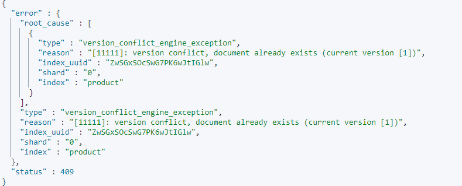

# Elasticsearch数据新增

## 一、数据新增

创建数据时，数据要为json格式。_doc代表type，默认为__doc，7.0中已经不提倡使用type，8.0之后会剔除。

当不指定id时，必须为post请求，ES会生成默认的id。当指定id（示例8888）时，也可以用put请求。

```json
#自动生成id
POST product/_doc
{
  "name": "AAA xiaomi phone",
  "desc": "shouji zhong de zhandouji",
  "price": 1199,
  "tags": [
    "xingjiabi",
    "fashao",
    "buka"
  ]
}
#指定id
PUT product/_doc/8888
{
  "name": "AAA xiaomi phone",
  "desc": "shouji zhong de zhandouji",
  "price": 1199,
  "tags": [
    "xingjiabi",
    "fashao",
    "buka"
  ]
}
```

## 二、强制创建_create

使用_create创建的时候，无数据才会创建成功，存在相同id数据，会抛异常，创建失败。

```json
POST product/_create/11111
{
  "name": "AAA xiaomi phone",
  "desc": "shouji zhong de zhandouji",
  "price": 1199,
  "tags": [
    "xingjiabi",
    "fashao",
    "buka"
  ]
}
```

