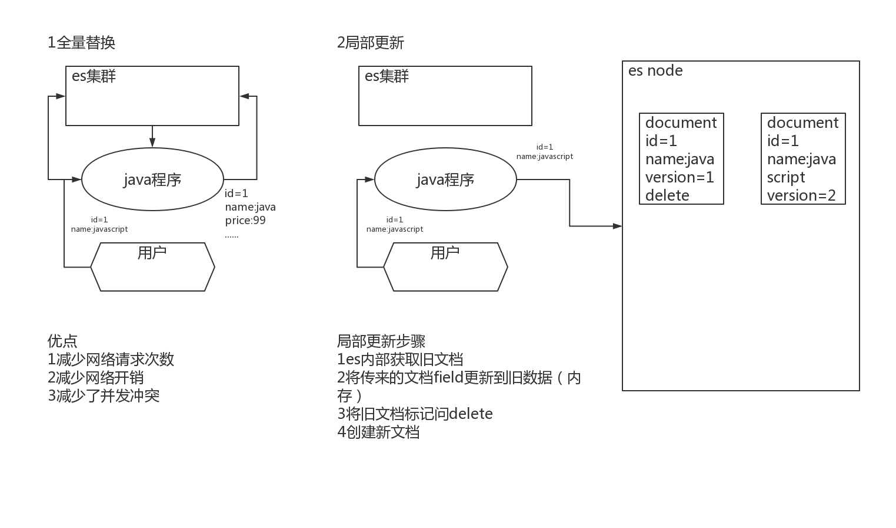

# **Elasticsearch**

## 数据修改

### 一、覆盖更新

- 单条覆盖更新

  使用与新增相同的url请求，当id不变时，每次新的请求体数据会覆盖旧的数据，并更新version。数据实际上没有被修改，只是按照唯一id，对数据生成了最新的版本。

  ```
  POST product/_doc/8888
  {
    "name": "AAA xiaomi phone",
    "desc": "shouji zhong de zhandouji",
    "price": 1199,
    "tags": [
      "xingjiabi",
      "fashao",
      "buka"
    ]
  }
  ```

- 批量覆盖更新


### 二、增量修改字段

- 单条数据修改

  使用_update关键字，对指定id下具体数据进行更新。“doc”实际为type，因为7.0之后弱化了type，默认为doc，所以更新时使用默认的“doc”。

  ```json
  POST product/_update/8888
  {
    "doc": {
      "price": 2999//将price更新为2999
    }
  }
  ```

  ```json
  POST product2/_update/1
  {
    "doc": {
      "createtime":"2021-07-15"
    }
  }
  
  POST product2/_update/2
  {
    "script": {
     "source": "ctx._source.createtime = '2021-08-11'"
    }
  }
  ```

  

- 批量数据修改

### 三、update内部原理

- 无论时覆盖更新还是增量修改指定字段，内部都是对旧文档做delete标记，生成新文档，更新version版本号，并在后续由ES集群对标记为delete的历史数据进行清理操作。

  

### 四、bulk批量增删改

- bulk可以完成批量增删改的操作，并且bulk单个操作的成功或失败不会影响请求中的其他操作。

- 每个json不能换行。相邻json必须换行。

  ```json
  POST /_bulk
  #路径中不指定索引，则在action中必须指定，如果action中指定了index，则以指定的为准。
  POST /<target>/_bulk
  格式
  {"action": {"metadata"}}
  {"data"}
  ```

- 请求参数格式

  ```json
  create
  只有当索引中不存在id的数据时，才会创建成功，否则将报错。
  {
      "_index":索引
      "_id":id 未指定，则自动生成
  }
  #单条
  PUT /test/_create/10/
  {
    "field":"test"
  }
  delete
  {
      "_index":索引
      "_id":id 必填
  }
  index
  索引中存在数据，执行更新，否则执行创建
  {
      "_index":索引
      "_id":id 未指定，则自动生成
  }
  update
  {
      "_index":索引
      "_id":id 未指定，则自动生成
      "retry_on_conflict":1 失败重试的次数
  }
  { "update" : {"_id" : "1", "_index" : "test"} }
  #字段更新
  { "doc" : {"field2" : "value2"} }
  #仅返回失败的信息
  POST /_bulk?filter_path=items.*.error
  ```

- 响应

  ```json
  took
  处理请求的时间，整数，单位毫秒
  errors
  值为true，代表有失败的，false，代表全部成功
  items
  返回数据
  ```

- 完整参数示例，每个操作的json，不能换行。

  ```json
  POST _bulk
  #index创建数据，有则更新，无则创建
  { "index" : { "_index" : "test", "_id" : "1" } }
  { "field1" : "value1" }
  #删除
  { "delete" : { "_index" : "test", "_id" : "2" } }
  #创建
  { "create" : { "_index" : "test", "_id" : "3" } }
  { "field1" : "value3" }
  #更新
  { "update" : {"_id" : "1", "_index" : "test"} }
  { "doc" : {"field2" : "value2"} }    
  
  #仅返回失败的信息
  POST _bulk?filter_path=items.*.error
  {"update":{"_id":"1","_index":"index1","retry_on_conflict":3}}
  {"doc":{"field":"value"}}
  {"update":{"_id":"0","_index":"index1","retry_on_conflict":3}}
  {"script":{"source":"ctx._source.counter += params.param1","lang":"painless","params":{"param1":1}},"upsert":{"counter":1}}
  {"update":{"_id":"2","_index":"index1","retry_on_conflict":3}}
  {"doc":{"field":"value"},"doc_as_upsert":true}
  {"update":{"_id":"3","_index":"index1","_source":true}}
  {"doc":{"field":"value"}}
  {"update":{"_id":"4","_index":"index1"}}
  {"doc":{"field":"value"},"_source":true}
  ```

- 

### 五、painless脚本script

- Painless脚本语言，类似Java语法，是ES支持的默认的脚本语言，其他的还支持expression、mustache、java，但是支持的不是很好，有限制。

- ES首次执行脚本的时候，会对脚本进行编译并缓存。所以脚本中使用到的数据最好定义成变量，放到params中。这样不会影响到编译缓存，否则每次修改，ES都会重新编译。

- ctx._source默认语法，代表获取元数据。支持params定义参数。

  ```json
  POST product/_update/1
  {
    "script": {
      "lang": "painless",
      "source": "ctx._source.price += params.num",
      "params": {
        "num": 2
      }
    }
  }
  ```

- 查询时使用painless，source指定具体字段，使用doc['filedName'].value

  ```json
  GET product/_search
  {
    "script_fields": {
      "price_query": {
        "script": {
          "lang": "painless",
          "source": "doc['price'].value+params.num",
          "params": {
            "num": 2
          }
        }
      }
    }
  }
  ```

- ddd
