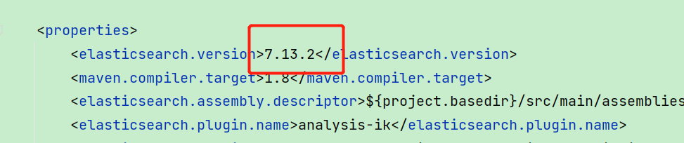
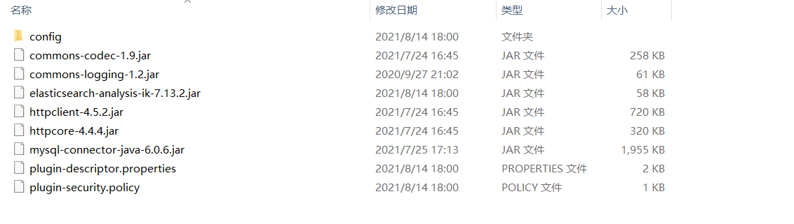
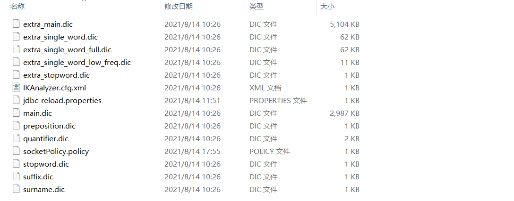
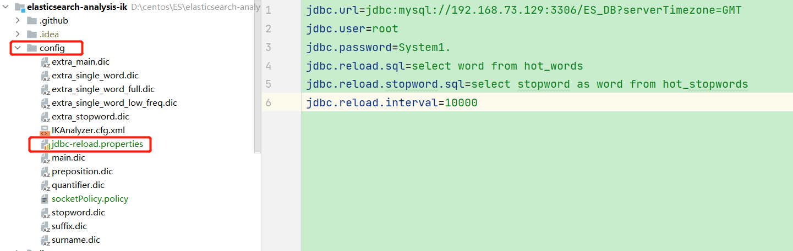
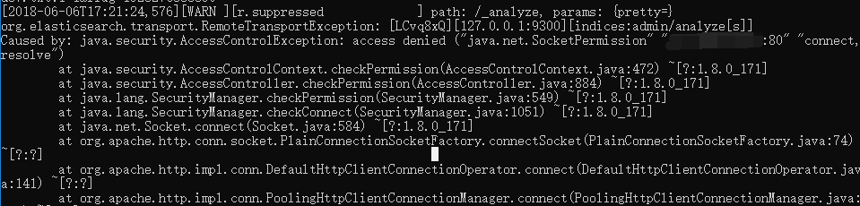

# **Elasticsearch**

## 安装ik中文分词器

- git地址：https://github.com/medcl/elasticsearch-analysis-ik

1. 从git上下载下来源码包，使用maven工具进行package打包。

2. 注意pom文件中依赖的elasticsearch版本要和自己使用的es版本相同

   

3. 在target/releases目录下找到zip文件，解压到es安装目录\plugins\ik目录下。

4. 注意es安装目录不能有中文以及空格等特殊字符。

   

5. 重新启动es即可。

## ik分词器介绍

1. 分词器标识以及含义

   - ik_max_word 细粒度
   - ik_smart 粗粒度
   - 常用的是ik_max_word

2. 配置文件

   - 配置文件IKAnalyzer.cfg.xml

     ```xml
     <properties>
     	<comment>IK Analyzer 扩展配置</comment>
     	<!--用户可以在这里配置自己的扩展字典 -->
     	<entry key="ext_dict">custom/mydict.dic;custom/single_word_low_freq.dic</entry>
     	 <!--用户可以在这里配置自己的扩展停止词字典-->
     	<entry key="ext_stopwords">custom/ext_stopword.dic</entry>
      	<!--用户可以在这里配置远程扩展字典 -->
     	<entry key="remote_ext_dict">location</entry>
      	<!--用户可以在这里配置远程扩展停止词字典-->
     	<entry key="remote_ext_stopwords">http://xxx.com/xxx.dic</entry>
     </properties>
     ```

   - 其他配置文件

     1. main.dic：主要热词库
     2. stopword.dic：英文停用词，不会建立在倒排索引中。
     3. quantifier.dic：计量单位等
     4. suffix.dic：后缀名
     5. surname.dic：百家姓
     6. preposition：语气词

   

## ik分词器热词自动更新

通过MySQL数据库配置热词。比如创建一张热词表，修改ik源码，创建定时器。定时从MySQL中查询hot word，并更新到ik中。

简单实现：

- 这是ik分词的源码，initial方法负责加载热词。

```java
/**
     * 词典初始化 由于IK Analyzer的词典采用Dictionary类的静态方法进行词典初始化
     * 只有当Dictionary类被实际调用时，才会开始载入词典， 这将延长首次分词操作的时间 该方法提供了一个在应用加载阶段就初始化字典的手段
     *
     * @return Dictionary
     */
    public static synchronized void initial(Configuration cfg) {
        if (singleton == null) {
            synchronized (Dictionary.class) {
                if (singleton == null) {

                    singleton = new Dictionary(cfg);
                    //加载热词
                    singleton.loadMainDict();
                    singleton.loadSurnameDict();
                    singleton.loadQuantifierDict();
                    singleton.loadSuffixDict();
                    singleton.loadPrepDict();
                    //加载停用词
                    singleton.loadStopWordDict();
                    //自己扩展：开启一个线程，一直重新加载热词。
                    new Thread(new HotDict()).start();
                    if (cfg.isEnableRemoteDict()) {
                        // 建立监控线程
                        for (String location : singleton.getRemoteExtDictionarys()) {
                            // 10 秒是初始延迟可以修改的 60是间隔时间 单位秒
                            pool.scheduleAtFixedRate(new Monitor(location), 10, 60, TimeUnit.SECONDS);
                        }
                        for (String location : singleton.getRemoteExtStopWordDictionarys()) {
                            pool.scheduleAtFixedRate(new Monitor(location), 10, 60, TimeUnit.SECONDS);
                        }
                    }

                }
            }
        }
    }
```

- 在singleton.loadMainDict();方法中，加入自己加载热词的逻辑，_MainDict是ik自己的对象，ik往里面设置热词，自己扩展的时候，也向这个对象中放入热词就能完成热词更新。

```java
/**
     * 加载主词典及扩展词典
     */
    private void loadMainDict() {
        // 建立一个主词典实例
        _MainDict = new DictSegment((char) 0);

        // 读取主词典文件
        Path file = PathUtils.get(getDictRoot(), Dictionary.PATH_DIC_MAIN);
        loadDictFile(_MainDict, file, false, "Main Dict");
        // 加载扩展词典
        this.loadExtDict();
        // 加载远程自定义词库
        this.loadRemoteExtDict();
        //自己扩展：从mysql加载词典
        this.loadMySQLExtDict();
    }
```

```java
/**
     * 从mysql加载热更新词典
     */
    private void loadMySQLExtDict() {
        Connection conn = null;
        Statement stmt = null;
        ResultSet rs = null;

        try {
            Path file = PathUtils.get(getDictRoot(), "jdbc-reload.properties");
            prop.load(new FileInputStream(file.toFile()));
            logger.info("dbc-reload.properties");
            logger.info("start load mysql hot words ************************************");
            long start = System.currentTimeMillis();
            for (Object key : prop.keySet()) {
                logger.info("" + key + "=" + prop.getProperty(String.valueOf(key)));
            }
            logger.info(" hot dict " + prop.getProperty("jdbc.reload.sql") + "......");
            conn = DriverManager.getConnection(
                    prop.getProperty("jdbc.url"),
                    prop.getProperty("jdbc.user"),
                    prop.getProperty("jdbc.password"));
            stmt = conn.createStatement();
            rs = stmt.executeQuery(prop.getProperty("jdbc.reload.sql"));
            int num = 0;
            while (rs.next()) {
                String theWord = rs.getString("word");
                logger.info("hot word: " + theWord);
                //查询出来的热词放进ik自己的_MainDict中
                _MainDict.fillSegment(theWord.trim().toCharArray());
                num++;
            }
            long end = System.currentTimeMillis();
            long time = end - start;
            logger.info("load end mysql hot words************************************");
            logger.info("load hot words time {}ms,update hot words num {}", time, num);
            //休眠时间
            Thread.sleep(Integer.valueOf(String.valueOf(prop.get("jdbc.reload.interval"))));
        } catch (Exception e) {
            logger.error("erorr", e);
        } finally {
            if (rs != null) {
                try {
                    rs.close();
                } catch (SQLException e) {
                    logger.error("error", e);
                }
            }
            if (stmt != null) {
                try {
                    stmt.close();
                } catch (SQLException e) {
                    logger.error("error", e);
                }
            }
            if (conn != null) {
                try {
                    conn.close();
                } catch (SQLException e) {
                    logger.error("error", e);
                }
            }
        }
    }
```

```java
private static Properties prop = new Properties();

    static {
        try {
            Class.forName("com.mysql.cj.jdbc.Driver");
        } catch (ClassNotFoundException e) {
            logger.error("error", e);
        }
    }
```

- stop word更新方法同上

```java
/**
     * 加载用户扩展的停止词词典
     */
    private void loadStopWordDict() {
        // 建立主词典实例
        _StopWords = new DictSegment((char) 0);

        // 读取主词典文件
        Path file = PathUtils.get(getDictRoot(), Dictionary.PATH_DIC_STOP);
        loadDictFile(_StopWords, file, false, "Main Stopwords");

        // 加载扩展停止词典
        List<String> extStopWordDictFiles = getExtStopWordDictionarys();
        if (extStopWordDictFiles != null) {
            for (String extStopWordDictName : extStopWordDictFiles) {
                logger.info("[Dict Loading] " + extStopWordDictName);

                // 读取扩展词典文件
                file = PathUtils.get(extStopWordDictName);
                loadDictFile(_StopWords, file, false, "Extra Stopwords");
            }
        }

        // 加载远程停用词典
        List<String> remoteExtStopWordDictFiles = getRemoteExtStopWordDictionarys();
        for (String location : remoteExtStopWordDictFiles) {
            logger.info("[Dict Loading] " + location);
            List<String> lists = getRemoteWords(location);
            // 如果找不到扩展的字典，则忽略
            if (lists == null) {
                logger.error("[Dict Loading] " + location + " load failed");
                continue;
            }
            for (String theWord : lists) {
                if (theWord != null && !"".equals(theWord.trim())) {
                    // 加载远程词典数据到主内存中
                    logger.info(theWord);
                    _StopWords.fillSegment(theWord.trim().toLowerCase().toCharArray());
                }
            }
        }
        //自己扩展：加载停用词
        this.loadMySQLStopWordDict();
    }
```

```java
/**
     * 从mysql加载停用词
     */
    private void loadMySQLStopWordDict() {
        Connection conn = null;
        Statement stmt = null;
        ResultSet rs = null;

        try {
            Path file = PathUtils.get(getDictRoot(), "jdbc-reload.properties");
            prop.load(new FileInputStream(file.toFile()));

            logger.info("jdbc-reload.properties");
            for (Object key : prop.keySet()) {
                logger.info("" + key + "=" + prop.getProperty(String.valueOf(key)));
            }
            logger.info("start load mysql stop words************************************");
            long start = System.currentTimeMillis();
            logger.info("StopWord, " + prop.getProperty("jdbc.reload.stopword.sql") + "......");

            conn = DriverManager.getConnection(
                    prop.getProperty("jdbc.url"),
                    prop.getProperty("jdbc.user"),
                    prop.getProperty("jdbc.password"));
            stmt = conn.createStatement();
            rs = stmt.executeQuery(prop.getProperty("jdbc.reload.stopword.sql"));
            int num = 0;
            while (rs.next()) {
                String theWord = rs.getString("word");
                logger.info("hot stopword from mysql: " + theWord);
                //将停用词放入到ik自己的_StopWords中
                _StopWords.fillSegment(theWord.trim().toCharArray());
                num++;
            }
            logger.info("load end mysql stop words************************************");
            long end = System.currentTimeMillis();
            long time = end - start;
            logger.info("update stop words time {}ms,update num {}", time, num);
            //休眠时间
            Thread.sleep(Integer.valueOf(String.valueOf(prop.get("jdbc.reload.interval"))));
        } catch (Exception e) {
            logger.error("erorr", e);
        } finally {
            if (rs != null) {
                try {
                    rs.close();
                } catch (SQLException e) {
                    logger.error("error", e);
                }
            }
            if (stmt != null) {
                try {
                    stmt.close();
                } catch (SQLException e) {
                    logger.error("error", e);
                }
            }
            if (conn != null) {
                try {
                    conn.close();
                } catch (SQLException e) {
                    logger.error("error", e);
                }
            }
        }
    }
```

- 线程一直执行

```java
public class HotDict implements Runnable {
    @Override
    public void run() {
        while (true) {
            Dictionary.getSingleton().reLoadMainDict();
        }
    }
}
```

- 配置文件



## 遇到问题



- es的config目录文件jvm.option文件增加配置，指定权限配置文件

```java
-Djava.security.policy=D:\centos\ES\elasticsearch-7.13.2-node1\plugins\ik\config\socketPolicy.policy
```

- 新建文件socketPolicy.policy

```
grant {
	permission java.net.SocketPermission "*:*","connect,resolve";
};
```

