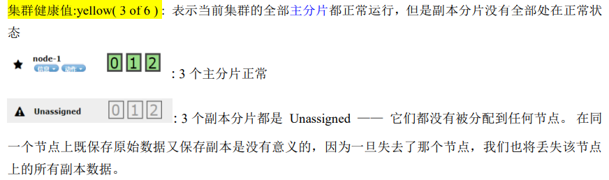
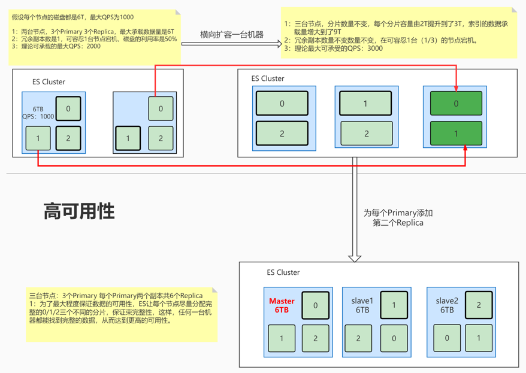
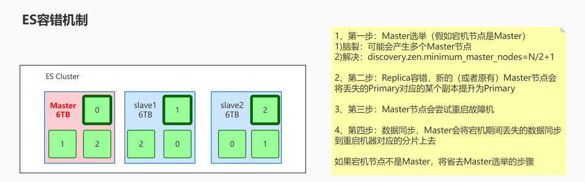

# Elasticsearch集群分布式

## 一、相关概念

- 单机服务有哪些问题

  单机服务性能有限

  可用性差

  维护不便

- 分布式的好处

  高可用性：集群可容忍部分节点宕机而保持服务的可用性和数据的完整性。

  易扩展：当集群的性能不满足业务要求时，可以方便快速的扩容集群，而无需停止服务。

  高性能：集群通过负载均衡器分摊并发请求压力，可以大大提高集群的吞吐能力和并发能力。

配置服务器集群时，集群中节点数量没有限制，大于等于 2 个节点就可以看做是集群了。一般出于高性能及高可用方面来考虑，集群中节点数量都是 3 个以上。

### 1.1、集群 Cluster

一个集群是由一个或多个服务器节点组织在一起，共同持有整个的数据，并一起提供索引和搜索功能。一个 Elasticsearch 集群有一个唯一的名字标识，这个名字通过cluster.name进行配置，这个名字是重要的，因为一个节点只能通过指定某个集群的名字，来加入这个集群。

### 1.2、节点 Node

集群中包含很多服务器，一个节点就是其中的一个服务器。作为集群的一部分，它存储数据，参与集群的索引和搜索功能。

一个节点也是由一个名字来标识的，通过node.name配置项进行配置，这个名字会在启动的时候赋予节点。这个名字对于管理工作来说挺重要的，因为在
这个管理过程中，你会去确定网络中的哪些服务器对应于 Elasticsearch 集群中的哪些节点。

一个节点可以通过配置集群名称的方式来加入一个指定的集群。默认情况下，每个节点都会被安排加入到一个叫做“elasticsearch”的集群中，这意味着，如果你在你的网络中启动了若干个节点，并假定它们能够相互发现彼此，它们将会自动地形成并加入到一个叫做“elasticsearch”的集群中。

在一个集群里，只要你想，可以拥有任意多个节点。而且，如果当前你的网络中没有运行任何 Elasticsearch 节点，这时启动一个节点，会默认创建并加入一个叫做“elasticsearch”的集群。

### 1.3、系统架构

一个运行中的 Elasticsearch 实例称为一个节点，而集群是由一个或者多个拥有相同cluster.name 配置的节点组成， 它们共同承担数据和负载的压力。当有节点加入集群中或者从集群中移除节点时，集群将会重新平均分布所有的数据。

当一个节点被选举成为主节点时， 它将负责管理集群范围内的所有变更，例如增加、删除索引，或者增加、删除节点等。 而主节点并不需要涉及到文档级别的变更和搜索等操作，所以当集群只拥有一个主节点的情况下，即使流量的增加它也不会成为瓶颈。 任何节点都可以成为主节点。

作为用户，我们可以将请求发送到集群中的任何节点 ，包括主节点。 每个节点都知道任意文档所处的位置，并且能够将我们的请求直接转发到存储我们所需文档的节点。 无论我们将请求发送到哪个节点，它都能负责从各个包含我们所需文档的节点收集回数据，并将最终结果返回給客户端。 Elasticsearch 对这一切的管理都是透明的。

### 1.4、集群健康值



- 健康值状态

  1. Green：所有Primary和Replica均为active，集群健康
  2. Yellow：至少一个Replica不可用，但是所有Primary均为active，数据仍然是可以保证完整性的。
  3. Red：至少有一个Primary为不可用状态，数据不完整，集群不可用。

- 健康值检查

  _cat/health

  _cluster/health

## 二、ElasticSearch配置文件

### 2.1、基础配置

config/elasticsearch.yml配置文件

```yaml
#集群名称，节点之间要保持一致
cluster.name: my-ES
#节点名称，集群内要唯一
node.name: node-001
#配置当前节点是否为master节点，设置为true，才会参与选举
node.master: true
#配置当前节点是否存储数据
node.data: true
#存储数据的路径，自定义。
path.data: /path/to/data
#存储日志的路径，自定义
path.logs: /path/to/logs
#是否锁定内存，禁止使用swap区。建议为true。否则会带来性能问题
bootstrap.memory_lock: true
#对外暴露的ip地址，最佳状态下一个es节点占用一台机器
network.host: 当前所在服务器的ip
#设置对外服务的http端口，默认为9200
http.port: 9200
#集群节点之间通信端口
transport.tcp.port: 9300
#配置集群中其他节点地址。
discovery.seed_hosts: ["192.168.73.92:9300", "192.168.73.93:9300"]
#可配置一个或多个节点，用于在es集群初始化时选举主节点master，仅在集群第一次启动时生效。
#一般配置一个节点，省略初始情况下的集群选举
cluster.initial_master_nodes: ["node-001"]
#控制master选举过程中，发现其他node存活的超时设置，主要影响选举的耗时，默认3s就好。
discovery.zen.ping_timeout: 3s
#判断节点是否脱离的超时设置
discovery.zen.fd.ping_timeout: 1m
#节点超时重试次数
discovery.zen.fd.ping_retries: 5
#开启或关闭 TCP 长连接，默认值为 true
network.tcp.keep_alive: true
#开启或关闭 TCP 无延迟设置。默认值为 true
network.tcp.no_delay: true
#设置是否压缩tcp传输时的数据，默认为false，不压缩
transport.tcp.compress: true
#禁止使用通配符或_all删除索引，必须使用名称或别名才能删除索引
action.destructive_requires_name: true
#集群内同时启动的数据任务个数，默认是 2 个
cluster.routing.allocation.cluster_concurrent_rebalance: 16
#添加或删除节点及负载均衡时并发恢复的线程个数，默认 4 个
cluster.routing.allocation.node_concurrent_recoveries: 16
#初始化数据恢复时，并发恢复线程的个数，默认 4 个
cluster.routing.allocation.node_initial_primaries_recoveries: 16
#跨域配置，允许跨域
http.cors.enabled: true
http.cors.allow-origin: "*"
http.max_content_length: 200mb
```

### 2.2、本地网关模块集群恢复配置

当你集群重启时，几个配置项影响你的分片恢复的表现。 首先，我们需要明白如果什么也没配置将会发生什么。

想象一下假设你有 10 个节点，每个节点只保存一个分片，这个分片是一个主分片或者是一个副本分片，或者说有一个有 5 个主分片／1 个副本分片的索引。有时你需要为整个集群做离线维护（比如，为了安装一个新的驱动程序）， 当你重启你的集群，恰巧出现了 5 个节点已经启动，还有 5 个还没启动的场景。

假设其它 5 个节点出问题，或者他们根本没有收到立即重启的命令。不管什么原因，你有 5 个节点在线上，这五个节点会相互通信，选出一个 master，从而形成一个集群。 他们注意到数据不再均匀分布，因为有 5 个节点在集群中丢失了，所以他们之间会立即启动分片复制。

最后，你的其它 5 个节点打开加入了集群。这些节点会发现它们的数据正在被复制到其他节点，所以他们删除本地数据（因为这份数据要么是多余的，要么是过时的）。 然后整个集群重新进行平衡，因为集群的大小已经从 5 变成了 10。

在整个过程中，你的节点会消耗磁盘和网络带宽，来回移动数据，因为没有更好的办法。对于有 TB 数据的大集群, 这种无用的数据传输需要 很长时间 。如果等待所有的节点重启好了，整个集群再上线，所有的本地的数据都不需要移动。

本地网关模块在整个集群重新启动时存储集群状态和分片数据。

以下参数是配置 尝试恢复集群状态和集群数据 的触发点，必须在每个主节点上都做做如下配置。

config/elasticsearch.yml配置文件

```yaml
#预期在集群中的（数据或主）节点数。只要预期的节点数已加入集群，就会启动本地分片的恢复。默认为0
gateway.expected_nodes: 3
#预期在集群中的主节点数。一旦预期的主节点数加入集群，就会开始恢复本地分片。默认为0
gateway.expected_master_nodes: 5
#预期在集群中的数据节点数。一旦预期数量的节点已加入集群，就会启动本地分片的恢复。默认为0
gateway.expected_data_nodes: 5
#如果未达到预期的节点数，则恢复过程将等待配置的时间量，然后再尝试恢复。如果只配置了expected_nodes，则这个参数值默认为5m
gateway.recover_after_time: 3
#一旦recover_after_time持续时间超时，只要满足以下条件，恢复就会开始：
#只要此数量的数据或主节点已加入集群，即可恢复。
gateway.recover_after_nodes: 3
#只要这么多主节点已加入集群，就可以恢复。
gateway.recover_after_master_nodes: 2
#只要这么多数据节点已加入集群，就可以恢复。
gateway.recover_after_data_nodes: 3
```

## 三、ES常用节点类型

### 3.1、候选节点/投票节点master

默认情况下，master-eligible（有时候也叫master节点）节点是那些在集群状态发布期间参与选举并执行某些任务的节点，配置了master角色的节点都是有效的投票节点，可以参与选举也可以投票

硬件要求：

CPU：高

内存：高

网络：高

存储：高

------

### 3.2、仅投票节点voting_only

配置了master和voting_only角色的节点将成为仅投票节点，仅投票节点虽然也是候选节点，但是在选举过程中仅可以投票而不参与竞选。不过仅投票节点可以同时也是数据节点，这样的话，其不具备被选举为Master的资格，但是参与投票，可以在选举过程中发挥关键票的作用。

硬件要求：

CPU：高

内存：低

网络：高

存储：高

------

### 3.3、主节点（active master）

- 避免重负载：主节点负责轻量级集群范围的操作，例如创建或删除索引、跟踪哪些节点是集群的一部分以及决定将哪些分片分配给哪些节点。拥有一个稳定的主节点对于集群健康很重要。当选的主节点拥有履行其职责所需的资源，这对于集群的健康非常重要。如果所选的主节点承载了其他任务，那么集群将不能很好地运行。避免 master 被其他任务超载的最可靠方法是将所有符合 master 的节点配置为仅具有 master 角色的专用 master 节点，使它们能够专注于管理集群。专用master节点仍将充当协调节点，将请求从客户端路由到集群中的其他节点，但是不要以负载均衡器的目的而设置候选节点。
- 一般来说，如果小型或轻负载集群的主节点具有其他角色和职责，则其可能运行良好，但是一旦集群包含多个节点，使用专用的主节点通常是有意义的。
- 任何不是`voting-only`的`master-eligible`节点都可以被选举为`active master`。
- 主节点必须有一个`path.data`目录，其内容在重启后仍然存在，就像数据节点一样，因为这是存储集群元数据的地方。集群元数据描述了如何读取存储在数据节点上的数据，因此如果丢失，则无法读取存储在数据节点上的数据。
- 高可用性 (HA) 集群需要至少三个候选节点，其中至少两个不是仅投票节点。这样即使其中一个节点发生故障，也可以保证剩下的节点能够选举出一个主节点。

硬件要求：

CPU：高

内存：高

网络：高

存储：高 但是无需 大

------

### 3.4、数据节点data

数据节点保存包含已编入索引的文档的分片。数据节点处理数据相关操作，如 CRUD、搜索和聚合。这些操作是 I/O 密集型、内存密集型和 CPU 密集型的。监控这些资源并在它们过载时添加更多数据节点非常重要。

硬件要求：

CPU：高

内存：高

网络：高

存储：速度快、容量大

------

### 3.5、协调节点

- 如果主动关闭了master、data和ingest的角色配置，当前节点就剩下一个只能路由请求、处理搜索减少阶段和分发批量索引功能的**仅协调节点**。本质上，仅协调节点的就相当于一个智能负载均衡器。换句话说，你是没有办法配置一个不具备协调转发能力的节点的。
- 仅协调节点过多会增加集群负担，因为主节点更新集群状态必须等待每个节点的确认，而仅协调节点从这个角度上讲纯粹是一种负担。数据节点可以愉快地完成转发任务。

## 四、分片创建策略

Shard即数据分片，是ES的数据载体。在ES中数据分为primary shard（主分片）和replica shard（副本分片），每一个primary承载单个索引的一部分数据，分布于各个节点，replica为某个primary的副本，即备份。分片分配的原则是尽量均匀的分配在集群中的各个节点，以最大程度降低部分shard在出现意外时对整个集群乃至服务造成的影响。

每个分片就是一个Lucene的实例，具有完整的功能。

### 4.1、分片创建策略

分片产生的目的是为了实现分布式，而分布式的好处之一就是实现“高可用性”（还包括高性能如提高吞吐量等会再后面内容展开讲），分片的分配策略极大程度上都是围绕如何提高可用性而来的，如**分片分配感知**、**强制感知**等。

互联网开发没有“银弹”，分片的数量分配也没有适用于所有场景的最佳值，创建分片策略的最佳方法是使用您在生产中看到的相同查询和索引负载在生产硬件上对生产数据进行基准测试。分片的分配策略主要从两个指标来衡量：即数量和单个分片的大小。

#### 分片分配策略

- ES使用数据分片（shard）来提高服务的可用性，将数据分散保存在不同的节点上以降低当单个节点发生故障时对数据完整性的影响，同时使用副本（repiica）来保证数据的完整性。关于分片的默认分配策略，在7.x之前，默认5个primary shard，每个primary shard默认分配一个replica，即5主1副，而7.x之后，默认1主1副
- ES在分配单个索引的分片时会将每个分片尽可能分配到更多的节点上。但是，实际情况取决于集群拥有的分片和索引的数量以及它们的大小，不一定总是能均匀地分布。
- Paimary只能在索引创建时配置数量，而replica可以在任何时间分配，并且primary支持读和写操作，而replica只支持客户端的读取操作，数据由es自动管理，从primary同步。
- ES不允许Primary和它的Replica放在同一个节点中，并且同一个节点不接受完全相同的两个Replica。
- 同一个节点允许多个索引的分片同时存在。

#### 分片的数量

- 避免分片过多：大多数搜索会命中多个分片。每个分片在单个 CPU 线程上运行搜索。虽然分片可以运行多个并发搜索，但跨大量分片的[搜索](https://www.elastic.co/guide/en/elasticsearch/reference/7.17/modules-threadpool.html)会耗尽节点的[搜索线程池](https://www.elastic.co/guide/en/elasticsearch/reference/7.17/modules-threadpool.html)。这会导致低吞吐量和缓慢的搜索速度。
- 分片越少越好：每个分片都使用内存和 CPU 资源。在大多数情况下，一小组大分片比许多小分片使用更少的资源。

#### 分片的大小决策

- 分片的合理容量：10GB-50GB。虽然不是硬性限制，但 10GB 到 50GB 之间的分片往往效果很好。根据网络和用例，也许可以使用更大的分片。在索引的生命周期管理中，一般设置50GB为单个索引的最大阈值。
- 堆内存容量和分片数量的关联：小于20分片/每GB堆内存，一个节点可以容纳的分片数量与节点的堆内存成正比。例如，一个拥有 30GB 堆内存的节点最多应该有 600 个分片。如果节点超过每 GB 20 个分片，考虑添加另一个节点。

查询当前节点堆内存大小：

```json
GET _cat/nodes?v=true&h=heap.current
```

- 避免重负载节点：如果分配给特定节点的分片过多，会造成当前节点为重负载节点。

### 4.2、重要的配置

#### 自定义属性

在elasticsearch.yml中增加自定义属性

```yaml
node.attr.{attribute}: xxx
```

查看节点属性

```json
GET _cat/nodeattrs?v
```

#### 索引级配置

- index.routing.allocation.include.{attribute}：表示索引可以分配在包含多个值中其中一个的节点上。
- index.routing.allocation.require.{attribute}：表示索引要分配在包含索引指定值的节点上（通常一般设置一个值）。
- index.routing.allocation.exclude.{attribute}：表示索引只能分配在不包含所有指定值的节点上。

```json
//索引创建之前执行
PUT <index_name>
{
  "settings": {
    "number_of_shards": 3,
    "number_of_replicas": 1,
    "index.routing.allocation.include._name": "node1"
  }
}
```

#### 集群级配置

elasticsearch修改集群范围设置提供两种方式，

- persistent：永久性修改，persistent相关的修改保存在了`/path.data/cluster.name/nodes/0/_state/global-n.st`，如果想删除设置，删除此文件即可。
- transient：集群重启后失效。

```json
PUT _cluster/settings
{
  "persistent": {
    "cluster.routing.allocation.awareness.attributes": "rack_id"
  }
}
```

### 4.3、索引分片分配：Index Shard Allocation

#### 分片均衡策略：shard rebalance

当集群在每个节点上具有相同数量的分片而没有集中在任何节点上的任何索引的分片时，集群是平衡的。Elasticsearch 运行一个称为**rebalancing** 的自动过程，它在集群中的节点之间移动分片以改善其平衡。重新平衡遵循所有其他分片分配规则，例如[分配过滤](https://www.elastic.co/guide/en/elasticsearch/reference/7.17/modules-cluster.html#cluster-shard-allocation-filtering)和[强制意识](https://www.elastic.co/guide/en/elasticsearch/reference/7.17/modules-cluster.html#forced-awareness)，这可能会阻止它完全平衡集群。在这种情况下，重新平衡会努力在配置的规则内实现最平衡的集群。如果使用[数据层](https://www.elastic.co/guide/en/elasticsearch/reference/7.17/data-tiers.html)然后 Elasticsearch 会自动应用分配过滤规则将每个分片放置在适当的层中。这些规则意味着平衡器在每一层内独立工作。

**cluster.routing.rebalance.enable**

([动态](https://www.elastic.co/guide/en/elasticsearch/reference/7.17/settings.html#dynamic-cluster-setting)) 为特定类型的分片启用或禁用重新平衡：

- `all` -（默认）允许对所有类型的分片进行分片平衡。
- `primaries` - 只允许主分片的分片平衡。
- `replicas` - 仅允许对副本分片进行分片平衡。
- `none` - 任何索引都不允许进行任何类型的分片平衡。

**cluster.routing.allocation.allow_rebalance**

([动态](https://www.elastic.co/guide/en/elasticsearch/reference/7.17/settings.html#dynamic-cluster-setting)) 指定何时允许分片重新平衡：

- `always` - 始终允许重新平衡。
- `indices_primaries_active` - 仅当集群中的所有主节点都已分配时。
- `indices_all_active` -（默认）仅当集群中的所有分片（主分片和副本）都被分配时。

#### 延迟分配策略（默认1m）：

当节点出于任何原因（有意或无意）离开集群时，主节点会做出以下反应

- 将副本分片提升为主分片以替换节点上的任何主分片。
- 分配副本分片以替换丢失的副本（假设有足够的节点）。
- 在其余节点之间均匀地重新平衡分片。

这些操作旨在通过确保尽快完全复制每个分片来保护集群免受数据丢失。即使我们在[节点级别](https://www.elastic.co/guide/en/elasticsearch/reference/7.17/recovery.html)和[集群级别](https://www.elastic.co/guide/en/elasticsearch/reference/7.17/shards-allocation.html)限制并发恢复 ，这种“分片洗牌”仍然会给集群带来很多额外的负载，如果丢失的节点可能很快就会返回，这可能是不必要的

#### 分片过滤：即（[Shard allocation filtering](https://www.elastic.co/guide/en/elasticsearch/reference/7.17/shard-allocation-filtering.html)），控制那个分片分配给哪个节点。

- index.routing.allocation.include.{attribute}：表示索引可以分配在包含多个值中其中一个的至少节点上。
- index.routing.allocation.require.{attribute}：表示索引要分配在包含索引指定值的节点上（通常一般设置一个值）。
- index.routing.allocation.exclude.{attribute}：表示索引只能分配在不包含所有指定值的节点上。

### 4.4、分片分配感知：Shard Allocation Awareness

Shard Allocation Awareness的设计初衷是为了提高服务的可用性，通过自定义节点属性作为感知属性，让 Elasticsearch 在分配分片时将物理硬件配置考虑在内。如果 Elasticsearch 知道哪些节点位于同一物理服务器上、同一机架中或同一区域中，则它可以分离主副本分片，以最大程度地降低在发生故障时丢失数据的风险。

#### 启用分片感知策略

elasticsearch.yml配置节点属性

```yaml
node.attr.rack_id: rack1
```

通过以下设置告诉主节点在分配分片的时候需要考虑哪些属性。这些信息会保存在每个候选节点的集群状态信息中

```json
PUT _cluster/settings
{
  "persistent": {
    "cluster.routing.allocation.awareness.attributes": "rack_id" #依据配置的rack机架id，将分片依据不同的机架进行分配
  }
}
```

### 4.5、强制感知策略：Forced awareness

默认情况下，如果一个区域发生故障，Elasticsearch 会将所有故障的副本分片分配给其他区域。但是剩余区域可能没有足够的性能冗余来承载这些分片。

为了防止在发生故障时单个位置过载，可以设置为`cluster.routing.allocation.awareness.force`不分配副本，直到另一个位置的节点可用。

#### 部署强制感知策略

设置强制感知策略，告诉主节点当前通过某个属性来划分区域，并且告知区域有哪些值

```yaml
cluster.routing.allocation.awareness.attributes: zone
cluster.routing.allocation.awareness.force.zone.values: zone1,zone2 
```

## 五、高可用性（HA）

高可用性即：High Availability（HA），高可用性是分布式系统架构设计的重要因素之一，简单来说，可用性越高的集群在发生意外情况（如断电、节点宕机）的时候，服务发生故障而不可用的可能性越低，也就是降低了意外情况而对整体服务产生的影响的可能性。

### 5.1、高可用性原理

- 通过“分布式”的概念实现多个节点的负载均衡，并且使服务具备可扩展能力。
- 通过针对分片、节点的一列策略降低单个故障点对整体服务产生的影响。
- 通过容灾机制，尽可能把故障点还原，以恢复服务的最大可用性。



- 尽可能的将节点均匀的分布在多个节点上，并且可以尽量少的节点就可以找到完整数据，可以提升服务负载能力，也可以提升可用性。例如上图，1个副本的可用性是容忍1台宕机，但是2个副本的分片策略，就可以容忍2台节点宕机。

### 5.2、ES的容灾机制（故障转移）

容错性可以理解为系统容忍的局部发生异常情况的比率和当异常发生时自行恢复的能力。在`ES`中表现为对节点宕机的处理机制。



步骤：

1. Master选举：假如宕机的是master，首先选出集群中的新Leader。
2. Replica容错：新的`Active Master`会将丢失的Primary的某个Replica提升为Primary。
3. 尝试恢复故障节点：Master尝试恢复故障节点。
4. 数据同步：Master将宕机期间丢失的数据同步到重启节点对应的分片上去，从而使服务恢复正常。

### 5.3、Master节点和投票节点

#### 主节点职责

负责轻量级集群范围的操作，比如：

- 创建或删除索引
- 规划和执行分片策略
- 发布、修改集群状态

选择的主节点拥有履行其职责所需的资源，这对于集群的健康非常重要。如果选择的主节点被其他任务重载，那么集群将无法正常运行。避免主机因其他任务而过载的最可靠方法是将所有符合主机条件的节点配置为`dedicated master`

配置角色为master

```yaml
node.roles: [ master ]
```

#### 投票节点

每个候选节点默认有**选举权**和**被选举权**，称之为投票节点。投票节点可以参加Master竞选，同时也可以参加投票。

但是有一种投票节点比较特殊，其只具备选举权而不具备被选举权，也就是“仅投票”节点，仅投票节点只能在Master选举过程中参与投票，而不能参加竞选。仅投票在某些场景下发挥着极其重要的作用：

- 当现有票数不足以选出Master的时候，充当决胜票。
- 在小型集群中仅投票节点可同时作为数据节点避免资源浪费

配置仅投票节点

```yaml
node.roles: [ master, voting_only ]
```

### 5.4、高可用性集群：

高可用性的中心思想就是采取一切可能的策略，降低集群中任意一部分节点出现问题后导致服务整体不可用的概率。其包含数据的完整性，集群的存活概率以及选主等。

#### 小规模集群

- 单节点集群：

  一般用于学习或者开发、测试环境，不推荐在生产环境中使用单节点集群。由于集群只有单个节点，为了适应这一点，ES默认会给集群分配所有角色。单节点角色不具备高可用性，并且无法分配副本分片。为了使集群保持健康，单节点模式下创建索引，需要使用[`index.number_of_replicas`](https://www.elastic.co/guide/en/elasticsearch/reference/7.17/index-modules.html#dynamic-index-settings)设置副本数量为0。

- 两节点集群：

  - 如果出于硬件成本考虑，集群中只允许有两个节点，那么一般来说最好把两个节点都设置成数据节点。您还应该通过设置索引确保每个分片都在两个节点上冗余存储。每个非可搜索快照索引上的`Number_of_replicas`为1。这是默认行为，但可能会被[索引模板](https://www.elastic.co/guide/en/elasticsearch/reference/7.17/index-templates.html)覆盖。[Auto-expand replicas](https://www.elastic.co/guide/en/elasticsearch/reference/7.17/index-modules.html#dynamic-index-settings)也可以达到同样的效果，但是在这么小的集群中没有必要使用这个功能。
  - 推荐在两个节点之一设置`node.master: false`明确告知其不具备候选节点资格。目的是为了确定哪个节点是主节点。集群可以容忍另一个不具备候选资格的节点的丢失。如果不做此设置，这时两个节点都会具有候选资格，但是其中一个节点如果宕机，由于选主需要票数过半（票数>N/2+1），也就是票数必须是两票才能选出active master，所以会导致无法选主。此时集群无法容忍任何一个节点宕机
  - 默认情况下，ES会为每个节点分配所有角色，如果手动分配角色，一般建议为每个节点分配所有角色，如果其中一个节点宕机，另一个节点可以取而代之。
  - 两个节点的集群，只允许其中一个固定的节点宕机，而不是任意一个节点。因为如果允许两个节点可以独立选举，那么如果集群由于网络或者其他原因导致节点连接断开，那么两个节点没办法确定另一个节点是否是宕机了，也就是会产生所谓的”脑裂“问题，而产生多主的情况。Elasticsearch 避免了这种情况并通过不选择任何一个节点作为主节点来保护数据，直到该节点可以确保它具有最新的集群状态并且集群中没有其他主节点。这可能导致集群在连接恢复之前没有主节点。

- 三节点集群 <HA的最低配置>：

  - 三节点部署：如果整个集群中所有节点一共只有三个，建议把三个节点全部部署为数据节点和候选节点。虽然active master节点一般只负责轻量级任务不做数据节点。但是通常来说三节点集群一般不会承载很大的业务量，也就不必考虑那么多了。这也是处于成本考虑不得已而为之。三节点集群的容错能力是1，即允许一台节点故障。
  - 二加一部署：即两个候选节点，一个仅投票节点，若干数据节点。这种配置的最大好处就是在保证高可用的前提下性价比更高，适用于小规模集群。由于在避免脑裂的前提下，要选举出主节点的最小节点数量是3，也就是选主的必要条件是票数过半也就是2票。而候选节点一般是不负责其他的任务的，也就不会为其分配data角色，那么集群通常会出现三个节点不存放数据的局面。此时会产生造成资源浪费。因为`active master`只存在一个，另外两个master作为候选节点，在及群众仅仅是充当了负载均衡器。为了避免这种资源浪费，通常的做法是把其中一个候选节点设置为仅投票节点，即`node.roles: [ data, master, voting_only ]`，此时，当前节点在选举过程中，仅有选举权而没有被选举权，这样就可以同时给他分配数据节点的角色，因为其不会被选举为`active master`。三节点集群中，三个节点必须都具有`master`角色，并且仅投票节点最多只能有一个。仅投票节点由叫`仲裁节点`起着`决胜票`的作用。

- 多节点集群

  - 一旦集群增长到三个以上的节点，可以开始根据它们的职责对这些节点做职责专一化。主要根据需要配置尽可能多的[数据节点](https://www.elastic.co/guide/en/elasticsearch/reference/7.17/modules-node.html#data-node)、[预处理节点](https://www.elastic.co/guide/en/elasticsearch/reference/7.17/ingest.html)、[机器学习节点](https://www.elastic.co/guide/en/elasticsearch/reference/7.17/modules-node.html#ml-node)等来均衡工作负载。随着集群变大，一般建议给每个角色使用专用节点，以便为每个任务独立扩展资源。

    但是，最好将集群中候选节点数量限制为三个。主节点不像其他节点类型那样扩展，因为集群总是只选择其中之一作为集群的主节点。如果有太多候选节点，那么主选举可能需要更长的时间才能完成。在较大的集群中，一般建议把候选节点设置为专用候选节点，即不分配其他角色，并避免向这些专用节点发送任何客户端请求。以免候选节点被不必要的额外工作所拖累导致集群服务不稳定。

    但是可以把候选节点之一配置为[仅投票节点](https://www.elastic.co/guide/en/elasticsearch/reference/7.17/modules-node.html#voting-only-node)以便它永远不会被选为主节点。例如，集群可能有两个专用的候选节点和一个既是数据节点又是仅投票的候选节点的第三个节点。这第三个仅投票节点将在Master选举中投出决胜票，但是自己永远不会被选举为active master。

#### 大规模集群

- 单集群
  - 避免跨数据中心：ES对网络和宽带要求较高，并且一般来说要尽量避免服务跨多个数据中心。因为一旦遇到分区恢复问题，它必须重新同步任何丢失的数据并重新平衡集群。如果一定要跨多个数据中心，建议在每个数据中心部署独立集群，然后配置[跨集群搜索](https://www.elastic.co/guide/en/elasticsearch/reference/7.17/modules-cross-cluster-search.html)或[跨集群复制](https://www.elastic.co/guide/en/elasticsearch/reference/7.17/xpack-ccr.html)。
  - 部署分片分配感知：为了降低当集群出现单个或区域节点（比如一个机架）宕机对整个服务造成的影响，一般策略是通过[分配感知来实现](https://www.elastic.co/guide/en/elasticsearch/reference/7.17/allocation-awareness.html)。
- 双区集群：
  - 如果集群部署在两个区域比如两个机房内，应该在每个区域中拥有不同数量的候选节点，这样在其中一个区域出现问题的时候，会增加另一个区域的存活概率。比如两个机房部署同一个集群，那么两个机房的候选节点避免相等，因为此时如果一个机房意外断电，两个机房的服务都会停止。配置单数投票节点可避免此问题。此时其中一个机房断电，服务可用的概率为50%。
  - 双区集群理论上能容忍一个区域的数据丢失，但不是任意一个区域，打个比方：服务部署在两个机房，机房A和机房B，要么是仅允许A机房出现故障而不允许B机房出现故障，也就是A机房断电服务可用，但是B机房断电服务中断；要么是仅允许B机房出现故障而不允许A机房出现故障，也就是B机房断电服务可用，但是A机房断电服务中断。从高可用的角度想，我们更希望任意一个机房断电，另一个机房的服务都不受影响，但是这是不可能的。因为没有断电的机房不知道出现故障的机房是断网了还是断电了，也就不知道应该是发起独立选举还是等待下去。如果两个机房都可以独立选主，那么就无法避免脑裂，可能会产生两个机房选出active master。解决办法是在两个区域中都配置一个仅投票节点并在独立的第三个区域添加一个额外的候选节点。这样两个区域其中之一断电，额外的投票节点就可以投出关键票。这个额外的节点也叫`专用tiebreaker`节点，此节点可以用低配服务器。
- 多区集群
  - 如果集群中有三个区域，那么每个区域中应该有一个候选节点。如果集群包含三个以上的区域，那么应该选择其中的三个区域，并在这三个区域中的每一个区域中放置一个候选节点。这意味着即使其中一个区域发生故障，集群仍然可以选举主节点。
- 多集群
  - Elasticsearch是主从结构，主节点能管理的节点上线一般不超过一千个，如果继续增加节点，可能会导致active master不稳定，如果集群想突破集群规模带来的性能瓶颈，一般可配置多集群，利用跨集群搜索单个超大集群拆分成多个小集群（相对小，千节点级别）来完成对集群的性能扩展。

#### 总结

- 集群应该至少有两个区域包含数据节点。
- 除了主分片之外，每个不是[可搜索快照索引的索引](https://www.elastic.co/guide/en/elasticsearch/reference/7.17/searchable-snapshots.html)都应该有每个主分片的至少一个副本。
- 分片分配感知配置为避免将分片的所有副本集中在单个区域内。
- 集群至少有三个候选节点。这些节点中至少有两个不是仅投票节点，均衡分配在至少三个区域中。
- 客户端被配置为将其请求发送到多个区域中的节点，或者被配置为使用负载平衡器来平衡一组适当的节点之间的请求。