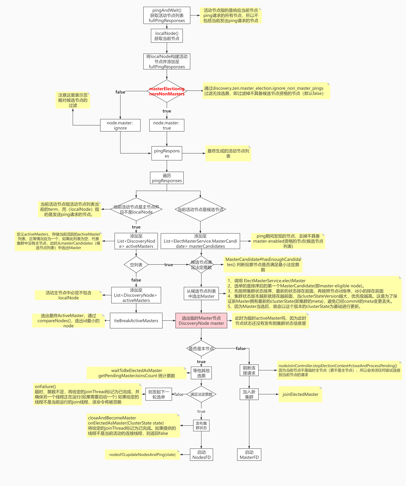
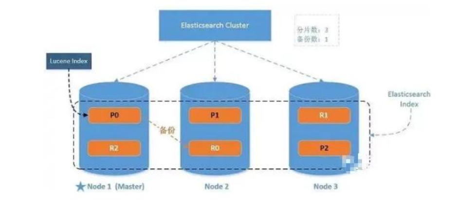

# ElasticSearch相关原理

## 一、master选举

### 	1.1、设计思路

所有分布式系统都需要解决数据的一致性问题，处理这类问题一般采取两种策略：

- 避免数据不一致情况的发生
- 定义数据不一致后的处理策略

通过一个简单的例子解释：
假设有一个单节点系统，对于此示例，可以认为我们的节点是一个只存储一个值的数据库服务器。我们还有一个客户端去向服务器发送存储的值，在单节点的时候，存的这个值很容易达成一致或者共识。但是，如果我们有多个节点，那么怎么达成共识呢？这就是分布式一致性的问题。

### 1.2、ES的选举算法

ES基于Bully和Paxos两种算法实现，而并非就是两种算法或之一。 ES 7.x 基于以上算法，加入了基于Raft的优化。

- Bully：Bully是Leader选举的基本算法之一，基本原理就是按照节点ID进行排序，任何时候当前Leader的节点ID都是集群中最高节点ID。该算法非常易于实现但是当Leader处于不稳定状态的时候，如因负载过重而假死，此时可能会触发选主，选出第二大ID的节点为新的Leader。ES通过推迟选举直到Master失效（Master放弃Active Master资格触发选举）来解决问题，但是会产生双主或多主（也就是脑裂）问题。
- Paxos：Paxos非常强大，在选举方面的灵活性比Bully算法有很大的优势，但是其原理非常复杂。
- Raft：Raft是一种使用较为广泛的分布式一致性的协议，在Raft中，节点可能的状态有三种：
  - Leader：主节点
  - Candidate：候选节点
  - Follower：跟随节点

所有的节点开始都是跟随节点。如果跟随节点收不89到领导节点的信号，则他们可以成为候选节点候选节点接着请求其他节点投票节点将以他们的投票回复候选节点如果候选节点获取到大多数节点的投票，则他将会成为领导节点此过程称为Leader选举。此时，所有对系统的修改将通过Leader节点进行。任意改变将以entry的形式添加到节点的日志中。这个日志的entry此时是没有提交的，所以，它不会更新节点的值。为了提交entry，节点首先会备份至跟随节点，然后leader等待，知直到多数节点将entry写入（自己的日志），此时Leader节点将提交entry，并且节点的数据被修改，接着Leader通知其他跟随者entry已经被提交了。此时集群的系统状态称为一致的。这个过程称为日志复制

在Raft中有两个设置超时时间的地方去控制选举
**选举超时**：
此时间就是跟随节点等待Leader信号直到成为候选节点的时间。选举超时时间随机设置在150ms到300ms之间。当选举超时以后，跟随节点成为候选节点，然后为自己发起一轮新的选举，并且向其他节点发起投票请求。如果收到请求的节点本轮没有发出投票，则候选节点的投票。并且节点重置选举超时时间
一旦候选节点收到大多数投票，那么他将成为Leader。Leader开始对其他跟随节点发送追加entry的消息。这些消息按心跳超时指定的时间间隔发送。跟随节点接着响应每一个追加entry的消息。在选举任期持续直到跟随节点停止接收到心跳消息，并成为候选节点。
**重新选举**：
和Leader选举一样。要求大多数投票，保证了本期选举只能有一个Leader被选中。如果两个节点同时成为候选节点，则会发送分裂投票。
**分裂投票**：
两个节点在同一期间都开始选举，并且每个都在其他节点之前到达一个单一节点。此时，每个候选节点都有两票，并且本次投票无法再收到更多投票，则节点将等待新的选举并重试。

#### 候选节点与投票节点

- **候选节点：**具备`master`角色的节点默认都有“被选举权”，即是一个候选节点。候选节点可以参与Master选举过程
- **投票节点：**每个候选节点默认都有投票权，即每个候选节点默认都是一个投票节点，但如果配置了“voting_only ”的候选节点将只有选举权而没有被选举权，即仅投票节点。

#### 有效选票与法定票数

- **有效选票**：包括非候选节点的所有节点都会参与选举并参与投票，但是只有投票节点的投票才是有效投票。
- **法定票数**：即当选Master所需的最小票数，可通过：discovery.zen.minimum_master_nodes配置，通常情况下法定票数为投票数过半（不包含一半）。为了避免平票而导致脑裂，一般候选节点数量一般设置为奇数，即便是偶数，系统默认也会阉割掉其中一个节点的投票权，以保证不出选平票或多主。

### 1.3、选举过程

#### 节点失效监测：FaultDetection类

在源码的描述文件中有这样一段描述：

```
There are two fault detection processes running. The first is by the
master, to ping all the other nodes in the cluster and verify that they
are alive. And on the other end, each node pings to master to verify if
its still alive or an election process needs to be initiated
```

1. NodesFaultDetection：即NodesFD，用于定期检查集群中的节点是否存活。
2. MasterFaultDetection：即MasterFD，作用是定期检查Master节点是否存活。



### 1.4、脑裂问题

- 何为脑裂：双主或多主
- 解决办法：discovery.zen.minimum_master_nodes=N/2+1，N为有效投票节点数。

## 二、写入原理


1. 写入请求将数据写入到内存buffer。
2. 默认（可设置）1s创建一个segment 文件，将数据存到磁盘。同时会对每一个请求，将操作记录下来，存到translog文件中，用于容灾备份。
3. segment会立马将数据同步到OS Cache，并将segment的status置为open，读请求可以访问，进行读操作。
4. OS Cache文件大小达到阈值或者默认（可设置）每30分钟，触发一次flush，将数据写入磁盘持久化。
5. .del 文件：在删除或者修改操作中，会将原有数据进行逻辑删除，标记位置为isdelete。
6. segment文件：提供读请求的数据。读写分离，使ES达到实时搜索。
7. Commit Point：记录当前可用的segment。当segment数量太多时，会触发合并操作，将相似的segment进行合并merge。紧接着执行flush操作。创建新的Commit Point标记，标记新的segment，删除旧的标记。将新的segment搜索状态打开，删除旧的segment文件。
8. translog文件：会记录每一次的请求操作。用于系统宕机之后的数据容灾备份。
9. flush操作：当OS Cache文件大小达到阈值、默认30分钟、或者手动触发。执行commit，将内存buffer中的数据立马写入到segment中，并将segment同步到OS Cache、开启open状态。OS Cache执行fsync同步磁盘操作。最后清空translog文件。
       segment 和 translog 最终肯定都是写文件，但是两者是各自写各自的，不相干， segment 是索引类的文件，在写之前要经过大量的计算，比如分词、构建倒排索引等，它存的是索引相关的数据，而 translog 只是简单的追加数据增删改的操作记录，只是为了后面服务意外中止时通过回放这个记录来减少数据的丢失。segment 记录的数据与 translog 是不一样的。
       那么涉及到写文件逻辑就一样了，都要 fsync 后才能保证真正落盘不丢数据，fsync 前数据是存在 OS 文件系统 Cache 里面的，如果服务意外中止，那么这部分数据就丢失了，即便重启也不会再 fsync。因此 translog 其实也是会丢数据的，所以才有translog 的相关参数(index.translog.sync_interval)来控制它 fsync 的频率，这个频率越高，丢的数据就越少。translog 一样会丢数据，要设置好相关参数，确保自己可以接受相应的数据丢失。

## 三、系统架构



- 一个运行中的 Elasticsearch 实例称为一个节点，而集群是由一个或者多个拥有相同cluster.name 配置的节点组成， 它们共同承担数据和负载的压力。当有节点加入集群中或者从集群中移除节点时，集群将会重新平均分布所有的数据。
- 当一个节点被选举成为主节点时， 它将负责管理集群范围内的所有变更，例如增加、删除索引，或者增加、删除节点等。 而主节点并不需要涉及到文档级别的变更和搜索等操作，所以当集群只拥有一个主节点的情况下，即使流量的增加它也不会成为瓶颈。 任何节
  点都可以成为主节点。
- 作为用户，我们可以将请求发送到集群中的任何节点 ，包括主节点。 每个节点都知道任意文档所处的位置，并且能够将我们的请求直接转发到存储我们所需文档的节点。 无论我们将请求发送到哪个节点，它都能负责从各个包含我们所需文档的节点收集回数据，并将最终结果返回給客户端。 Elasticsearch 对这一切的管理都是透明的。

## 四、路由计算

- 当索引一个文档的时候，文档会被存储到一个主分片中。 Elasticsearch 如何知道一个文档应该存放到哪个分片中呢？当我们创建文档时，它如何决定这个文档应当被存储在分片1 还是分片 2 中呢？首先这肯定不会是随机的，否则将来要获取文档的时候我们就不知道从何处寻找了。

- 实际上，这个过程是根据下面这个公式决定的：

  

- routing 是一个可变值，默认是文档的 _id ，也可以设置成一个自定义的值。 routing 通过hash 函数生成一个数字，然后这个数字再除以 number_of_primary_shards （主分片的数量）后得到余数 。这个分布在 0 到 number_of_primary_shards-1 之间的余数，就是我们所寻求的文档所在分片的位置。这就解释了为什么我们要在创建索引的时候就确定好主分片的数量并且永远不会改变这个数量：因为如果数量变化了，那么所有之前路由的值都会无效，文档也再也找不到了。

- 所有的文档 API（ get 、 index 、 delete 、 bulk 、 update 以及 mget ）都接受一个叫做 routing 的路由参数 ，通过这个参数我们可以自定义文档到分片的映射。一个自定义的路由参数可以用来确保所有相关的文档——例如所有属于同一个用户的文档——都被
  存储到同一个分片中。