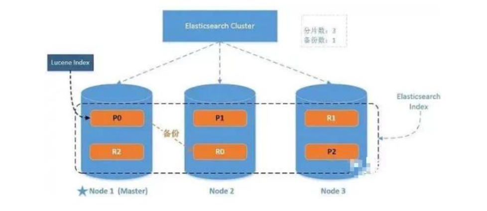

## 二、写入原理

1. 写入请求将数据写入到内存buffer。
2. 默认（可设置）1s创建一个segment 文件，将数据存到磁盘。同时会对每一个请求，将操作记录下来，存到translog文件中，用于容灾备份。
3. segment会立马将数据同步到OS Cache，并将segment的status置为open，读请求可以访问，进行读操作。
4. OS Cache文件大小达到阈值或者默认（可设置）每30分钟，触发一次flush，将数据写入磁盘持久化。
5. .del 文件：在删除或者修改操作中，会将原有数据进行逻辑删除，标记位置为isdelete。
6. segment文件：提供读请求的数据。读写分离，使ES达到实时搜索。
7. Commit Point：记录当前可用的segment。当segment数量太多时，会触发合并操作，将相似的segment进行合并merge。紧接着执行flush操作。创建新的Commit Point标记，标记新的segment，删除旧的标记。将新的segment搜索状态打开，删除旧的segment文件。
8. translog文件：会记录每一次的请求操作。用于系统宕机之后的数据容灾备份。
9. flush操作：当OS Cache文件大小达到阈值、默认30分钟、或者手动触发。执行commit，将内存buffer中的数据立马写入到segment中，并将segment同步到OS Cache、开启open状态。OS Cache执行fsync同步磁盘操作。最后清空translog文件。
       segment 和 translog 最终肯定都是写文件，但是两者是各自写各自的，不相干， segment 是索引类的文件，在写之前要经过大量的计算，比如分词、构建倒排索引等，它存的是索引相关的数据，而 translog 只是简单的追加数据增删改的操作记录，只是为了后面服务意外中止时通过回放这个记录来减少数据的丢失。segment 记录的数据与 translog 是不一样的。
       那么涉及到写文件逻辑就一样了，都要 fsync 后才能保证真正落盘不丢数据，fsync 前数据是存在 OS 文件系统 Cache 里面的，如果服务意外中止，那么这部分数据就丢失了，即便重启也不会再 fsync。因此 translog 其实也是会丢数据的，所以才有translog 的相关参数(index.translog.sync_interval)来控制它 fsync 的频率，这个频率越高，丢的数据就越少。translog 一样会丢数据，要设置好相关参数，确保自己可以接受相应的数据丢失。

## 三、系统架构

- 
- 一个运行中的 Elasticsearch 实例称为一个节点，而集群是由一个或者多个拥有相同cluster.name 配置的节点组成， 它们共同承担数据和负载的压力。当有节点加入集群中或者从集群中移除节点时，集群将会重新平均分布所有的数据。
- 当一个节点被选举成为主节点时， 它将负责管理集群范围内的所有变更，例如增加、删除索引，或者增加、删除节点等。 而主节点并不需要涉及到文档级别的变更和搜索等操作，所以当集群只拥有一个主节点的情况下，即使流量的增加它也不会成为瓶颈。 任何节
  点都可以成为主节点。
- 作为用户，我们可以将请求发送到集群中的任何节点 ，包括主节点。 每个节点都知道任意文档所处的位置，并且能够将我们的请求直接转发到存储我们所需文档的节点。 无论我们将请求发送到哪个节点，它都能负责从各个包含我们所需文档的节点收集回数据，并将最终结果返回給客户端。 Elasticsearch 对这一切的管理都是透明的。

## 四、路由计算

- 当索引一个文档的时候，文档会被存储到一个主分片中。 Elasticsearch 如何知道一个文档应该存放到哪个分片中呢？当我们创建文档时，它如何决定这个文档应当被存储在分片1 还是分片 2 中呢？首先这肯定不会是随机的，否则将来要获取文档的时候我们就不知道从何处寻找了。

- 实际上，这个过程是根据下面这个公式决定的：

  

- routing 是一个可变值，默认是文档的 _id ，也可以设置成一个自定义的值。 routing 通过hash 函数生成一个数字，然后这个数字再除以 number_of_primary_shards （主分片的数量）后得到余数 。这个分布在 0 到 number_of_primary_shards-1 之间的余数，就是我们所寻求的文档所在分片的位置。这就解释了为什么我们要在创建索引的时候就确定好主分片的数量并且永远不会改变这个数量：因为如果数量变化了，那么所有之前路由的值都会无效，文档也再也找不到了。

- 所有的文档 API（ get 、 index 、 delete 、 bulk 、 update 以及 mget ）都接受一个叫做 routing 的路由参数 ，通过这个参数我们可以自定义文档到分片的映射。一个自定义的路由参数可以用来确保所有相关的文档——例如所有属于同一个用户的文档——都被
  存储到同一个分片中。