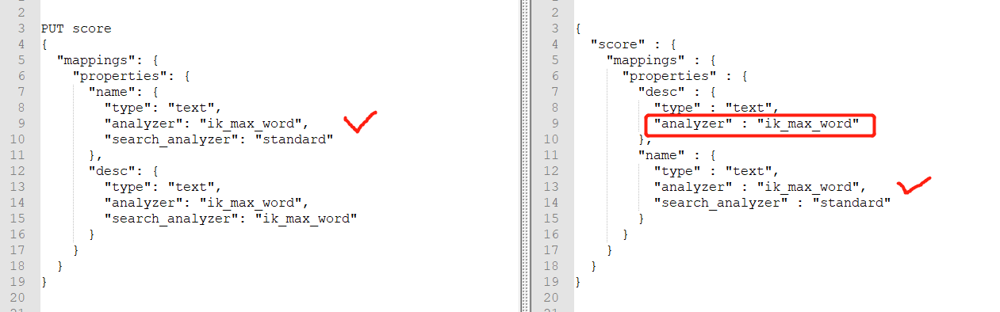
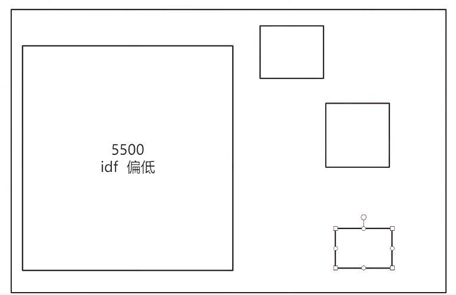
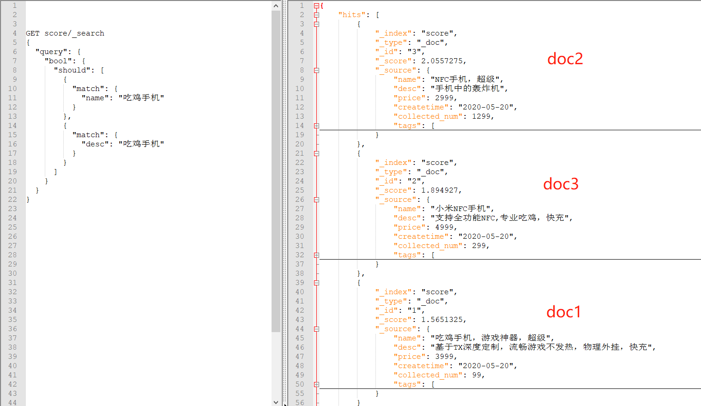
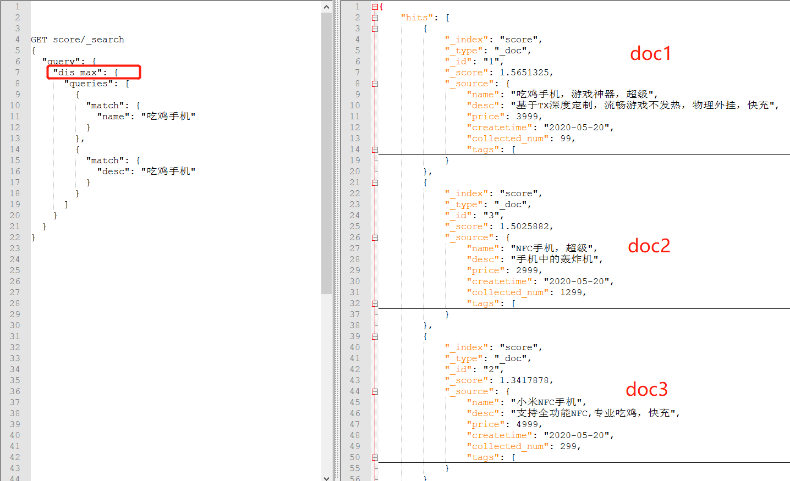

## 十、相关性得分原理及排序规则优化

### 1、analyzer和search_analyzer

- analyzer：创建索引时，指定了analyzer分析器。会在插入数据的时候，根据指定的分析器进行分词，创建倒排索引。
- search_analyzer：在使用关键词进行搜索时，会使用search_analyzer分析器对关键词进行分词。如果没有特殊指定，一般情况下search_analyzer和analyzer是相同的，并且在查询mapping时，只会将两者不同的search_analyzer进行展示。
- 

### 2、shard local IDF和global IDF（多shard下评分不准确问题解析）

- ES在计算相关性得分score时，会遵循三个条件：TF、IDF、相同条件下数据短的评分高。IDF评分是计算词条在当前分片下整个索引内的相关性，如果词频非常高，那么IDF评分就会比较低。所以如果数据分配不均，就会出现多shard下评分不准确的问题。比如某个分片下1万条数据，另一个分片下只10条数据，那么同一关键词在不同shard下的IDF评分就不同，当发生跨分片查询数据的情况时，就会导致数据不准确。
- 解决：各个分片大小尽量设置成一样大，并且生产环境极少出现这种问题，因为生产环境数据量大，各个分片配置的比较合理，最终误差会非常小。
- 

### 3、multi_match多字段搜索

- 测试数据

  ```json
  注意：中文分词需要把吃鸡、手机、快充、超级设置为热词。
  PUT score
  {
    "mappings": {
      "properties": {
        "name": {
          "type": "text",
          "analyzer": "ik_max_word",
          "search_analyzer": "ik_max_word"
        },
        "desc":{
          "type": "text",
          "analyzer": "ik_max_word",
          "search_analyzer": "ik_max_word"
        }
      }
    }
  }
  PUT /score/_doc/1
  {
    "name": "吃鸡手机，游戏神器，超级",
    "desc": "基于TX深度定制，流畅游戏不发热，物理外挂，快充",
    "price": 3999,
    "createtime": "2020-05-20",
    "collected_num": 99,
    "tags": [
      "性价比",
      "发烧",
      "不卡"
    ]
  }
  PUT /score/_doc/2
  {
    "name": "小米NFC手机",
    "desc": "支持全功能NFC,专业吃鸡，快充",
    "price": 4999,
    "createtime": "2020-05-20",
    "collected_num": 299,
    "tags": [
      "性价比",
      "发烧",
      "公交卡"
    ]
  }
  PUT /score/_doc/3
  {
    "name": "NFC手机，超级",
    "desc": "手机中的轰炸机",
    "price": 2999,
    "createtime": "2020-05-20",
    "collected_num": 1299,
    "tags": [
      "性价比",
      "发烧",
      "门禁卡"
    ]
  }
  PUT /score/_doc/4
  {
    "name": "小米耳机",
    "desc": "耳机中的黄焖鸡",
    "price": 999,
    "createtime": "2020-05-20",
    "collected_num": 9,
    "tags": [
      "低调",
      "防水",
      "音质好"
    ]
  }
  PUT /score/_doc/5
  {
    "name": "红米耳机",
    "desc": "耳机中的肯德基",
    "price": 399,
    "createtime": "2020-05-20",
    "collected_num": 0,
    "tags": [
      "牛逼",
      "续航长",
      "质量好"
    ]
  }
  ```

- 相关性分数计算规则

  ```
  搜索关键词：吃鸡手机
  GET score/_search
  {
    "query": {
      "bool": {
        "should": [
          {"match": {"name": "吃鸡手机"}},
          {"match": {"desc": "吃鸡手机"}}
        ]
      }
    }
  }
  结果分析：
  期望的匹配结果是doc1>doc2>doc3
  TF/IDF:
  TF: 关键词在每个doc中出现的次数
  IDF: 关键词在整个索引中出现的次数
  relevance score计算规则：每个query的分数，乘以matched query数量，除以总query数量
  1.它会执行 should 语句中的两个查询。
  2.加和两个查询的评分。
  3.乘以匹配语句的总数。
  4.除以所有语句总数
  算一下doc1的分数
  {"match": {"name": "吃鸡手机"}},
  	doc1:	吃鸡1次，手机1次，计2分	
  	doc2:	吃鸡0次，手机1次，计1分
  	doc3:	吃鸡0次，手机1次，计1分
  {"match": {"desc": "吃鸡手机"}}
  	doc1:	吃鸡0次，手机0次，计0分	
  	doc2:	吃鸡0次，手机1次，计1分
  	doc3:	吃鸡0次，手机1次，计1分
  总分：（query1+query2）*matched query / total query
  	doc1:	query1+query2：2		matched：1	total query：2		result：2*1/2=1
  	doc2:	query1+query2：2		matched：2	total query：2		result：2*2/2=2
  	doc3:	query1+query2：2		matched：2	total query：2		result：2*2/2=2
  matched query数量 = 2
  总query数量 = 2
  ```

  

  因为相关性评分的计算规则，最应该匹配的doc1，相关性反而最低。结果是错误的。

- best_fields

  默认的搜索策略。对于同一个query，单个field匹配更多的term，则优先排序。当查询多个字段时，如果关键词在某个字段中被匹配的次数比较多，则这个字段是best_ields，最好的字段。其余字段匹配的相关性分数就会被忽略，这个词条的相关性分数就会以best_fields为准。

  使用dis_max，默认的搜索策略是best_fields。因为name这个字段，匹配“吃鸡手机”次数最多，score评分最高，所以是best_fields.

  

- most_fields

  如果一次请求中，对于同一个doc，匹配到某个term的field越多，则越优先排序。比如doc1，四个字段匹配到了关键词，doc2是3个字段匹配到了关键词。那么doc1优先展示。因为匹配的field最多。

- cross_fields

  测试数据：

  ```json
  POST /teacher/_bulk
  { "index": { "_id": "1"} }
  { "name" : {"姓" : "吴", "名" : "磊"} }
  { "index": { "_id": "2"} }	
  { "name" : {"姓" : "连", "名" : "鹏鹏"} }
  { "index": { "_id": "3"} }
  { "name" : { "姓" : "张","名" : "明明"} }
  { "index": { "_id": "4"} }
  { "name" : { "姓" : "周","名" : "志志"} }
  { "index": { "_id": "5"} }
  { "name" : {"姓" : "吴", "名" : "亦凡"} }
  { "index": { "_id": "6"} }
  { "name" : {"姓" : "吴", "名" : "京"} }
  { "index": { "_id": "7"} }
  { "name" : {"姓" : "吴", "名" : "彦祖"} }
  { "index": { "_id": "8"} }
  { "name" : {"姓" : "帅", "名" : "吴"} }
  { "index": { "_id": "9"} }
  { "name" : {"姓" : "连", "名" : "磊"} }
  { "index": { "_id": "10"} }
  { "name" : {"姓" : "周", "名" : "磊"} }
  { "index": { "_id": "11"} }
  { "name" : {"姓" : "张", "名" : "磊"} }
  { "index": { "_id": "12"} }
  { "name" : {"姓" : "马", "名" : "磊"} }
  { "name" : {"姓" : "诸葛", "名" : "吴磊"} }
  ```

  ```json
  GET teacher/_search
  {
    "query": {
      "multi_match": {
        "query": "吴磊",
        "type": "most_fields",
        "fields": [
          "name.姓",
          "name.名"
        ]
      }
    }
  }
  ```

  使用默认搜索策略或者most_fields进行搜索时，期望的吴磊不会在第一条。因为相关性评分有问题。在姓中，“吴”比较多，所以IDF会比较低，相反在名中IDF就会比较高。对于名“磊”，在名中IDF分低，姓中分高，所以就会导致问题。

  cross_fields交叉的字段。含义是关键词分词之后，每个关键字，必须在其中至少一个字段中匹配。

  比如“吴磊”，使用cross_fields策略，会产生俩个条件:

  1、姓或者名中,必须有吴
  2、姓或者名中,必须有磊

  默认是或操作。满足一条就行,存在吴,或者磊即可。可以使用and操作,只有两条都满足,存在完整的吴磊，才可以。

  

- dix_max

  dix_max查询（Disjunction Max Query）：将任何与任一查询匹配的文档作为结果返回，但只将最佳匹配的评分作为查询的评分结果返回。比如查询时name、desc两个字段，name的评分结果比desc高，则以name的评分为准进行返回，desc字段的评分将被忽略。

  dix_max默认的best_fields策略，会带来一个问题，当搜索词在fields字段中全部存在时，只会以其中一个字段的评分为准，当doc1只匹配一个字段，但是评分高，doc2匹配的2个字段，正常情况下，匹配2个字段的应该优先展示，但是因为best_fields策略，导致其余字段不参与评分，最终结果不准确。所以可以使用tie_breaker设置其余字段的参与度，官方建议0.1-0.4之间。太大的话，有可能导致喧宾夺主。

  ```json
  GET score/_search
  {
    "query": {
      "dis_max": {
        "queries": [
          {
            "match": {
              "name": "超级快充"
            }
          },
          {
            "match": {
              "desc": "超级快充"
            }
          }
        ],
        "tie_breaker": 0.3
      }
    }
  }
  ```

- tie_breaker

  取值范围 [0,1]，其中 0 代表使用 dis_max 最佳匹配语句的普通逻辑，1表示所有匹配语句同等重要。最佳的精确值需要根据数据与查询调试得出，但是合理值应该与零接近（处于 0.1 - 0.4 之间），这样就不会颠覆 dis_max 最佳匹配性质的根本。

- multi_match

  ```json
  GET score/_search
  {
    "query": {
      "multi_match": {
        "query": "超级快充",
        "fields": ["name","desc"],
        "type": "most_fields",
        "tie_breaker": 0.3
      }
    }
  }
  ```


### 4、function score query

- 必须定义一个查询和一个或多个函数，自定义函数会为查询返回的每个文档计算一个新分数。

  ```json
  {
  	"query": {
  		"function_score": {
  			"query": {},
  			"functions": [
  				{}
  			]
  		}
  	}
  }
  ```

1. field_value_factor

   ```json
   {
   	"query": {
   		"function_score": {
   			"query": {
   				"match_all": {}
   			},
   			"functions": [
   				{
   					"field_value_factor": {
   						"field": "collected_num",
   						"modifier": "ln2p",
   						"factor": 1.2
   					},
   					"weight": 1
   				}
   			]
   		}
   	}
   }
   ```

   将某个字段的值进行计算得出分数。

   - field：要计算的字段，（需要是数值型）
   - factor：当前分数计算，对整个结果产生的权重比。
   - modifier：以何种运算方式计算，接受以下枚举。
     1. none：不处理
     2. log：计算对数
     3. log1p：先将字段值 +1，再计算对数
     4. log2p：先将字段值 +2，再计算对数
     5. ln：计算自然对数
     6. ln1p：先将字段值 +1，再计算自然对数
     7. ln2p：先将字段值 +2，再计算自然对数
     8. square：计算平方
     9. sqrt：计算平方根
     10. reciprocal：计算倒数
   - weight：当前的分数计算函数，对整个结果产生的权重比。

2. random_score

   随机得到 0 到 1 分数。

   ```json
   {
   	"query": {
   		"function_score": {
   			"query": {
   				"match_all": {}
   			},
   			"random_score": {}
   		}
   	}
   }
   ```

3. script_score

   通过自定义脚本计算分值

   ```json
   {
   	"query": {
   		"function_score": {
   			"query": {
   				"match_all": {}
   			},
   			"script_score": {
   				"script": {
   					"source": "Math.log(1 + doc['price'].value)"
   				}
   			}
   		}
   	}
   }
   ```

4. boost_mode

   指定计算后的分数与原始的_score如何合并，有以下选项：

   1. imultiply：查询分数和函数分数相乘
   2. sum：查询分数和函数分数相加
   3. avg：取平均值
   4. replace：替换原始分数
   5. min：取查询分数和函数分数的最小值
   6. max：取查询分数和函数分数的最大值

   ```json
   {
   	"query": {
   		"function_score": {
   			"query": {
   				"match_all": {}
   			},
   			"boost_mode": "multiply"
   		}
   	}
   }
   ```

5. max_boost

   设置相关性分数的上限，比如"max_boost": 10，则计算的相关性分数最大为10，超过的限制为10，小于10的，仍然是原数据。
