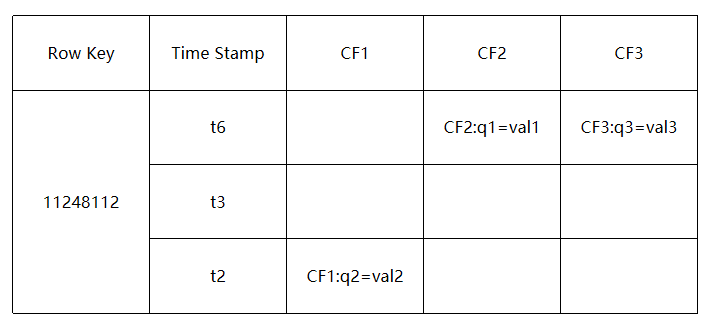
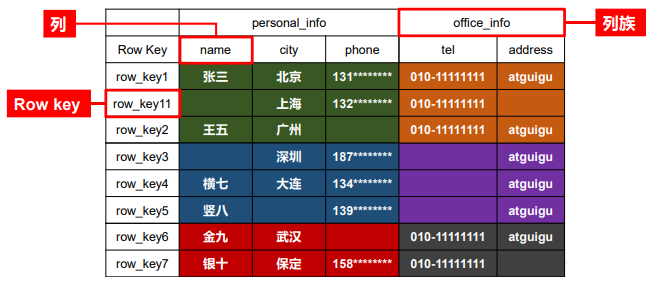
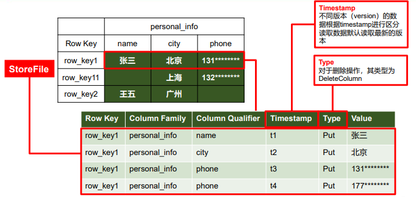
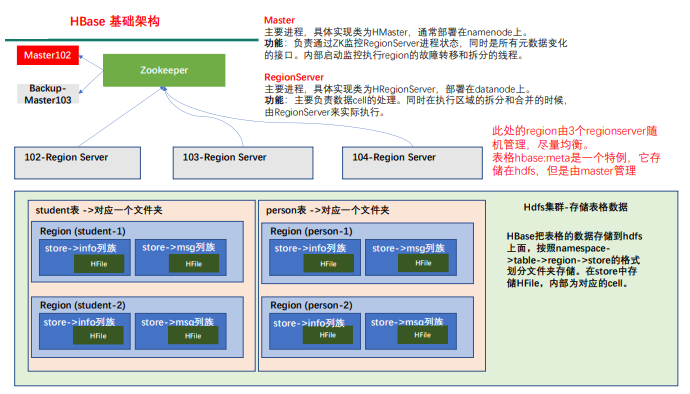
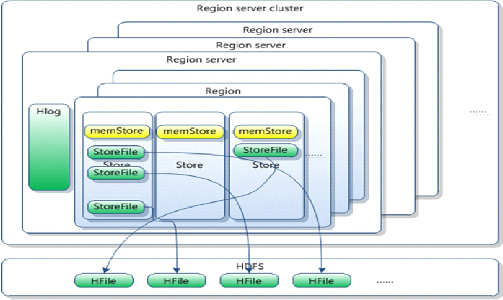

# HBase

### 一、简介

HBase的全称是Hadoop Database，是一个以HDFS为数据存储的高可靠性、高性能、面向列、可伸缩、实时读写的分布式NoSQL数据库。利用Hadoop HDFS作为其文件存储系统，利用Hadoop MapReduce来处理HBase中的海量数据，利用Zookeeper作为其分布式协同服务。

HBase主要用来存储非结构化和半结构化数据的松散数据（列存NoSQL数据库）。 

HBase 数据模型的关键在于稀疏、分布式、多维、排序的映射。其中映射 map指代非关系型数据库的 key-Value 结构。

### 二、HBase的数据模型

Hbase中的数据是按照RowKey、多个列族、以及列族下多个列的形式进行存储的，并且查询数据的时候，只能根据RowKey进行查询。

- Name Space

  命名空间，类似于关系型数据库的 database 概念，每个命名空间下有多个表。HBase 有两个自带的命名空间，分别是 hbase 和 default，hbase 中存放的是 HBase 内置的表以及meta元数据信息，default表是用户默认使用的命名空间。

- Table

  类似于关系型数据库的表概念。不同的是，HBase 定义表时只需要声明列族即可，不需要声明具体的列。因为数据存储是稀疏的，所有往 HBase 写入数据时，字段可以动态、按需指定。因此，和关系型数据库相比，HBase 能够轻松应对字段变更的场景。

  需要注意的是，在HBase中，数据都是以byte的形式进行存储的。

- Row

  HBase 表中的每行数据都由一个 RowKey 和多个列族以及列族下多个 Column（列）组成。

- Row Key

  RowKey是决定一行数据，每行记录的唯一标识，RowKey之间是按照字典序排序，比如RowKey分别为1、2、3、11，则最终的排序顺序为1、11、2、3。

  查询数据的时候只能根据RowKey进行查询，并且RowKey只能存储64K的字节数据，所以RowKey的设计十分重要。

- Column Family

  HBase表中的每个列都归属于某个列族，列族必须作为表模式(schema)定义的一部分预先给出。

  列名以列族作为前缀，每个“列族”都可以有多个列成员(column)，如 info：name，info：age，新的列族成员（列）可以随后按需、动态加入。

  权限控制、存储以及调优都是在列族层面进行的，HBase把同一列族里面的数据存储在同一目录下，由几个文件保存。

- Column

  列一定是和列族绑定在一起的，如 info：name，info：age，列族为info，列为name、age。

- Cell

  由{rowkey, column Family：column Qualifier, timestamp} 唯一确定的单元。cell 中的数据全部是字节码形式存储。

- TimeStamp时间戳

  用于标识数据的不同版本（version），每条数据写入时，系统会自动为其加上该字段，其值为写入 HBase 的时间。

  在HBase每个cell存储单元对同一份数据有多个版本，根据唯一的时间戳来区分每个版本之间的差异，不同版本的数据按照时间倒序排序，最新的数据版本排在最前面。

  1. 时间戳的类型是 64位整型。
  2. 时间戳可以由HBase(在数据写入时自动)赋值，此时间戳是精确到毫秒的当前系统时间。
  3. 时间戳也可以由客户显式赋值，如果应用程序要避免数据版本冲突，就必须自己生成具有唯一性的时间戳。

  

### 三、HBase架构设计

- Zookeeper

  HBase 通过 Zookeeper 来做 master 的高可用、记录 RegionServer 的部署信息、并且存储有 meta 表的位置信息。
  HBase 对于数据的读写操作是直接访问 Zookeeper 的，在 2.3 版本推出 Master Registry模式，客户端可以直接访问 master。使用此功能，会加大对 master 的压力，减轻对 Zookeeper的压力。

  1. 保证任何时候，集群中只有一个活跃master

  2. 存储所有region的寻址入口，客户端从zookeeper中获取meta表所在的regionserver节点信息，找到meta表在哪里之后，访问meta表所在的regionserver节点，通过meta表获取到region所在的regionserver信息。

     也就是说，zookeeper只存储meta表在哪个Region Server上

  3. 实时监控region server的上线和下线信息，并实时通知master

  4. 存储HBase的schema和table元数据

- Master

  1. 负责监控集群中所有的 RegionServer 实例，并且为 RegionServer分配Region
  2. 负责 RegionServer 的负载均衡，监控 Region 是否需要进行负载均衡，故障转移和 Region 的拆分
  3. 发现失效的 RegionServer 并重新分配其上的Region
  4. 管理元数据表格 hbase:meta，接收用户对表格创建修改删除的命令并执行。

  Master通过启动多个后台线程监控实现上述功能：

  - LoadBalancer 负载均衡器
    周期性监控 Region 分布在 RegionServer 上面是否均衡，由参数 hbase.balancer.period 控制周期时间，默认 5 分钟。
  - CatalogJanitor 元数据管理器
    定期检查和清理 hbase:meta 中的数据。meta 表中会存储各种元数据信息。
  - MasterProcWAL master 预写日志处理器
    把 master 需要执行的任务记录到预写日志 WAL 中，如果 master 宕机，让 backupMaster读取日志继续干。

- Region Server 

  1. 负责维护Region ，处理对这些Region 的IO请求
  2. 负责数据 cell 的处理，例如写入数据 put，查询数据 get 等
  3. 负责切分在运行过程中变得过大的region，拆分合并 region 的实际执行者，master进行 监控，regionServer 负责执行。

- Region

  HBase自动把表水平划分成多个区域(Region)，每个Region会保存一个表里某段连续的数据。

  每个表一开始只有一个Region，随着数据不断插入表，Region不断增大，当增大到一个阈值的时候，Region就会等分会两个新的Region（裂变）

  当table中的行不断增多，就会有越来越多的Region。这样一张完整的表被保存在多个Region Server 上。

- Memstore与storefile

  1. 一个Region由多个store组成，一个store对应一个CF（列族）

  2. store包括位于内存中的memstore和位于磁盘的storefile，写操作先写入memstore，当memstore中的数据达到某个阈值，Region Server会启动flashcache进程写入storefile，每次写入形成单独的一个storefile。

     当storefile文件的数量增长到一定阈值后，系统会进行合并（minor、major ），在合并过程中会进行版本合并和删除工作（majar），形成更大的storefile。当一个region所有storefile的大小和数量超过一定阈值后，会把当前的region分割为两个，并由master分配到相应的Region Server服务器，实现负载均衡

  客户端检索数据，先在memstore找，找不到去blockcache，找不到再找storefile。

- HDFS

  HDFS 为 Hbase 提供最终的底层数据存储服务，同时为 HBase 提供高容错的支持。

#### 注意问题：

- Region是HBase中分布式存储和负载均衡的最小单元。最小单元就表示不同的Region可以分布在不同的 Region server上。
- Region由一个或者多个Store组成，每个store保存一个列族columns family。
- 每个Strore又由一个memStore和0至多个StoreFile组成。
- StoreFile以HFile格式保存在HDFS上。