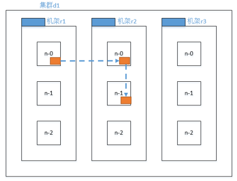
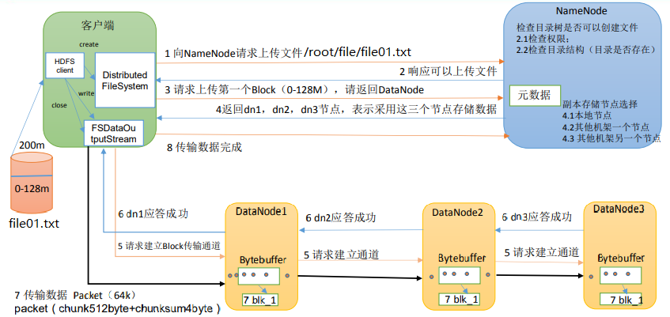
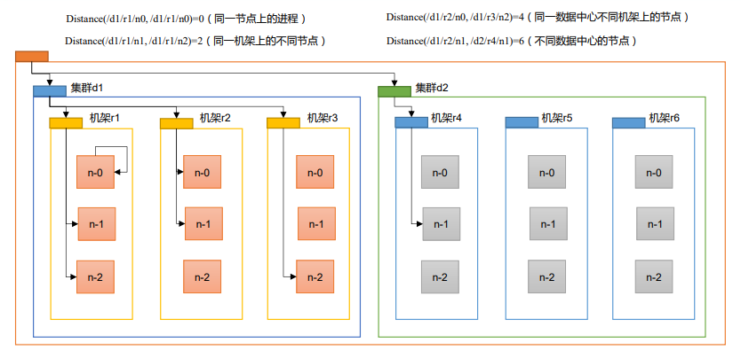
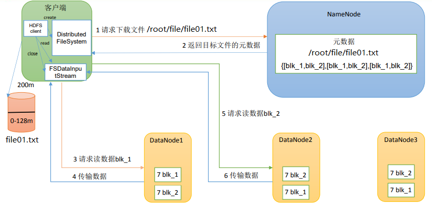
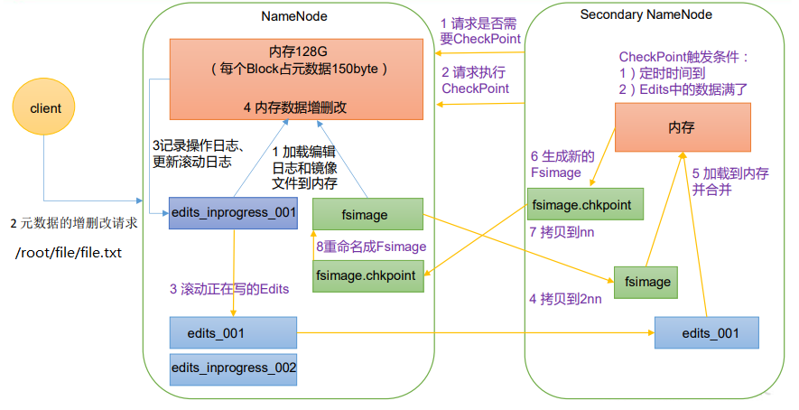

# HDFS

## 一、HDFS概述

HDFS是分布式文件管理系统中的一种。

- 分布式文件管理系统：随着数据量越来越大，在一个操作系统存不下所有的数据，那么就分配到更多的操作系统管理的磁盘中，但是这样就不方便对文件进行管理和维护，所以迫切需要一种系统来管理多台机器上的文件，这就是分布式文件管理系统。

HDFS 定义 HDFS（Hadoop Distributed File System），它是一个文件系统，用于存储文件，通过目录树来定位文件。其次，它是分布式的，由很多服务器联合起来实现其功能，集群中的服务器有各自的角色。 

HDFS 的使用场景：适合一次写入，多次读取的场景。一个文件经过创建、写入和关闭之后就不需要改变。

## 二、存储模型

1、HDFS中的文件在物理上是分块存储（Block），HDFS将文件线性按字节切割成块(Block)，每个Block具有offset，id的属性。不同文件的block大小可以不一样，一个文件除最后一个block，其他block大小一致。

- 比如设置Block为64M大小，那么将一个129M的文件进行上传的时候，会分为3个Block，分别为64M、64M、1M。
- 进行文件切割的时候，因为是按照字节进行切割，所以是有可能将文件切坏的，但是在HDFS系统下，会在读取文件时进行reduce计算，所以可以保证最终的文件是正确无误的。

2、Block块的大小一般是依据硬件的I/O特性调整，可以通过配置参数( dfs.blocksize）来设置默认的块大小。

- 默认大小在Hadoop2.x/3.x版本中是128M，1.x版本中是64M。现在一般性能好一些的硬盘，读写速率都在百兆/sy以上。

  

- HDFS的块设置太小，会增加寻址时间，程序一直在找块的开始位置。

- 如果块设置的太大，从磁盘传输数据的时间会明显大于定位这个块开始位置所需的时间。导致程序在处理这块数据时，会非常慢。

3、Block被分散存放在集群的各个节点中，具有location的特性，每个块都会记录当前被放置在集群中的哪个节点上，并将位置信息进行上报。

4、Block具有副本(replication)，没有主从概念，副本不能出现在同一个节点，这样可以在机器出现故障时满足可靠性，并且在并发读的时候可以提升读取的性能。

- 比如当前Block-0有3个副本，那么在集群中就只会看到3个Block-0，而不是4个

- 当数据分成5个Block，2个副本时，在一个4台DataNodes中进行存储时，会进行相对均匀的分配。

  

5、文件上传可以指定Block大小和副本数，上传后只能修改副本数，一次写入多次读取，不支持修改，支持追加数据。

- HDFS会对上传的文件进行切割，并且将切割后的Block块分配到不同的节点上，每个Block有自己的offset偏移量，当对文件进行修改的时候，会改变相关块的offset，并且改变其中一个块的offset时，会产生连锁反应，对后续所有的块都要重新计算偏移量，此时就涉及到后续所有Block的重新计算，重新分配，以及不同DataNode节点之间数据的疯狂拷贝。仅仅因为一个操作，就会对现有系统产生极大的计算以及IO压力。

  如果仅把HDFS当作一个支持增删改查的文件系统，那么是可以接受的，但是HDFS的设计初衷是为了分布式计算而产生的，修改操作带来的大量系统资源占用，会影响计算性能，因此就舍弃了修改操作，但是追加是支持的，追加只是在最后一个Block后面增加内容，影响面很小。所以可接受。

## 三、架构设计

HDFS是一个主从(Master/Slaves)架构，由一个NameNode和一些DataNode组成

- NameNode

  充当Master，是一个管理者。

  1. 基于内存的、负责存储和管理文件元数据，并维护了一个层次型的文件目录树。
  2. 需要持久化方案保证数据可靠性
  3. 配置副本策略
  4. 管理数据块（Block）映射信息
  5. 处理客户端读写请求

- DataNode

  Slave角色，接收NameNode下达的命令。

  1. 存储实际的数据块
  2. 执行数据块的读/写操作
  3. 与NameNode维持心跳，并汇报自己持有的block信息

- Client客户端

  1. 文件切分。文件上传HDFS的时候，Client将文件切分成一个一个的Block，然后进行上传
  2. 与NameNode交互，获取文件的位置信息
  3. 与DataNode交互，读取或者写入数据
  4. Client提供一些命令来管理HDFS，比如NameNode格式化
  5. Client可以通过一些命令来访问HDFS

## 四、Block的副本放置策略

- 第一个副本

  第一个副本在Client所处的节点上的DN，如果是集群外提交，则随机挑选一台磁盘不太满，CPU不太忙的节点。

- 第二个副本

  放置在与第一个副本不同的机架的节点上。

- 第三个副本

  与第二个副本相同机架的节点。

- 更多副本

  随机节点，尽可能保持均衡。

### 机架的理解

一台机架可以理解为一个架子，在架子上会有很多的小格子，在格子里放置服务器。一台机架会放置一批服务器，这批服务器共享电源，并且通过机架上的网卡进行网络通信。不同机架之间还会通过外部的网络交换机进行网络通信，多机架部署，可以提高整体服务的抗风险能力。

## 五、HDFS读写流程

### 5.1、写入数据流程

1. 客户端通过 Distributed FileSystem 模块和NameNode连接，创建文件元数据，向 NameNode 请求上传文件，NameNode 检查目标文件是否已存在，父目录是否存在、以及是否有权限上传。
2. NameNode 判定元数据是否有效，并且返回是否可以上传。若不可以上传，将终止此次上传动作，可以上传则继续向下进行。
3. 客户端请求第一个 Block 上传到哪几个 DataNode 服务器上。
4. NameNode 进行副本放置策略的分配，并返回有序的DataNode列表，如果三个节点，则分别为 dn1、dn2、dn3。
5. 客户端和DataNode建立Pipeline连接，拿到有序DN列表中的第一个，比如dn1，通过 FSDataOutputStream 模块请求 dn1 上传数据，与dn1建立连接，并且把有序列表后面的列表数据传给dn1，dn1 收到请求后，会依据有序列表中的第一个，继续调用（此时是dn2），然后将有序列表后面的数据传给dn2（也就是dn3），dn2再调用dn3，将这个通信管道建立完成。也就是说客户端只需要关注和列表中的第一个保持连接即可。
6. dn1、dn2、dn3 逐级应答客户端。
7. 客户端开始往 dn1 上传第一个 Block（先从磁盘读取数据放到一个本地内存缓存），以 Packet 为单位，dn1 收到一个Packet后会本地保存，并且传给 dn2，dn2 传给 dn3，dn1 每传一个 packet会放入一个应答队列等待应答。
8. 当一个 Block 传输完成之后，客户端再次请求 NameNode 上传第二个 Block。

- 当传输过程中DN有挂掉的怎么办呢？

  如果dn2挂掉，dn1会跨过dn2与dn3建立连接，并且每次传输的packet都有offset偏移量记录，当dn1要传3的数据时，如果dn3说我现在只有1的数据，2还没有，那么dn1会重新把2之后的数据传输给dn3。NameNode保存的Block数据，是由DataNode上传的，与client无关，client只复制将文件分块、上传。如果DN数量不够，NameNode会复制出来一个可用的DN。

### 5.2、节点距离计算

- 在 HDFS 写数据的过程中，NameNode 会选择距离待上传数据最近距离的 DataNode 接收数据。那么这个最近距离怎么计算呢？

  节点距离：两个节点到达最近的共同祖先的距离总和。

例如，假设有数据中心 d1，机架 r1 中的节点 n1。该节点可以表示为/d1/r1/n1。利用这种标记，这里给出四种距离描述。

- r1上的n0到n0距离为0
- r1上的n1到n2的距离为2
- r2上的n0到r3上的n2距离为4
- r2上的n1到r4上的n1距离为6

### 5.3、读数据流程

为了降低整体的带宽消耗和读取延时，HDFS会尽量让读取程序读取离它最近的副本。如果在读取程序的同一个机架上有一个副本，那么就读取该副本。如果一个HDFS集群跨越多个数据中心，那么客户端也将首先读本地数据中心的副本。

1. 客户端通过 DistributedFileSystem 向 NameNode 请求下载文件，NameNode 通过查询元数据，找到文件块所在的 DataNode 地址。
2. 挑选一台 DataNode（就近原则，然后随机）服务器，请求读取数据。
3. DataNode 开始传输数据给客户端（从磁盘里面读取数据输入流，以 Packet 为单位来做校验）。
4. 客户端以 Packet 为单位接收，先在本地缓存，然后写入目标文件。

## 六、元数据持久化

##### 思考：NameNode 中的元数据是存储在哪里的？

首先，我们做个假设，如果存储在 NameNode 节点的磁盘中，因为经常需要进行随机访问，还有响应客户请求，必然是效率过低。因此，元数据需要存放在内存中。但如果只存在内存中，一旦断电，元数据丢失，整个集群就无法工作了。因此产生在磁盘中备份元数据的FsImage。

这样又会带来新的问题，当在内存中的元数据更新时，如果同时更新 FsImage，就会导致效率过低，但如果不更新，就会发生一致性问题，一旦 NameNode 节点断电，就会产生数据丢失。因此，引入 Edits 文件（只进行追加操作，效率很高）。每当元数据有更新或者添加元数据时，修改内存中的元数据并追加到 Edits中。这样，一旦 NameNode 节点断电，可以通过 FsImage 和 Edits 的合并，合成元数据。

但是，如果长时间添加数据到 Edits 中，会导致该文件数据过大，效率降低，而且一旦断电，恢复元数据需要的时间过长。因此，需要定期进行 FsImage 和 Edits 的合并，如果这个操作由NameNode节点完成，又会效率过低。因此，引入一个新的节点SecondaryNamenode，专门用于 FsImage 和 Edits 的合并。

- EditLog

  任何对文件系统元数据产生修改的操作，NameNode都会使用一种称为EditLog的事务日志记录下来

  EditLog具有完整性，数据丢失少，但恢复速度慢，并有体积膨胀风险

- FsImage

  使用FsImage存储内存所有的元数据状态，使用本地磁盘保存EditLog和FsImage

  FsImage具有恢复速度快，体积与内存数据相当，但不能实时保存，数据丢失多的问题

NameNode使用了FsImage+EditLog整合的方案：滚动将增量的EditLog更新到FsImage，以保证更近时点的FsImage和更小的EditLog体积。

### 安全模式

HDFS搭建时，在第一次启动时，会进行格式化，格式化操作会产生一个空的FsImage和Edits文件。

当NameNode启动时，它从硬盘中读取Editlog和FsImage，将所有Editlog中的事务作用在内存中的FsImage上，并将这个新版本的FsImage从内存中保存到本地磁盘上，然后删除旧的Editlog，因为这个旧的Editlog的事务都已经作用在FsImage上了。

NameNode启动后进入一个称为安全模式的特殊状态。处于安全模式的NameNode是不会进行数据块的复制的。

NameNode从所有的 DataNode接收心跳信号和块状态报告。每当NameNode检测确认某个数据块的副本数目达到这个最小值，那么该数据块就会被认为是副本安全(safely replicated)的。

在一定百分比（这个参数可配置）的数据块被Namenode检测确认是安全之后（加上一个额外的30秒等待时间），NameNode将退出安全模式状态。接下来它会确定还有哪些数据块的副本没有达到指定数目，并将这些数据块复制到其他DataNode上。

- 在持久化的时候：文件属性会持久化，但是文件的每一个块不会持久化，恢复的时候，NN会丢失块的位置信息，块的位置信息是等到DataNode与NameNode建立通信之后，上报给NameNode的。

### SecondaryNameNode（SNN）

在非HA(高可用)模式下，SNN一般是独立的节点，周期完成对NN的EditLog向FsImage合并，减少EditLog大小，减少NN启动时间。

合并的触发时机：

- 根据配置文件设置的时间间隔fs.checkpoint.period  默认3600秒
- 根据配置文件设置edits log大小 fs.checkpoint.size 规定edits文件的最大值默认是64MB

当达到时间周期或者edits文件大小限制，SNN就会触发FsImage合并操作

1. Secondary NameNode 请求执行 CheckPoint。
2. NameNode 滚动正在写的 Edits 日志。
3. 将滚动前的编辑日志和镜像文件拷贝到 Secondary NameNode。
4. Secondary NameNode 加载编辑日志和镜像文件到内存，并合并。
5. 生成新的镜像文件 fsimage.chkpoint。
6. 拷贝 fsimage.chkpoint 到 NameNode。
7. NameNode 将 fsimage.chkpoint 重新命名成 fsimage。

[^备注：]: 一般企业中不会用SNN这种模式，SNN也是一台NameNode，避免不了单点问题。企业实际会使用多NameNode的HA模式，但是日志文件合并的原理是相同的

