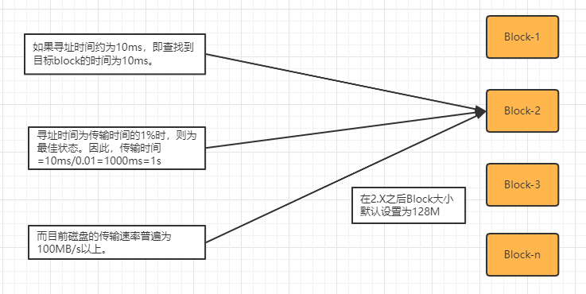
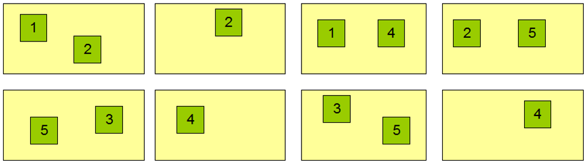
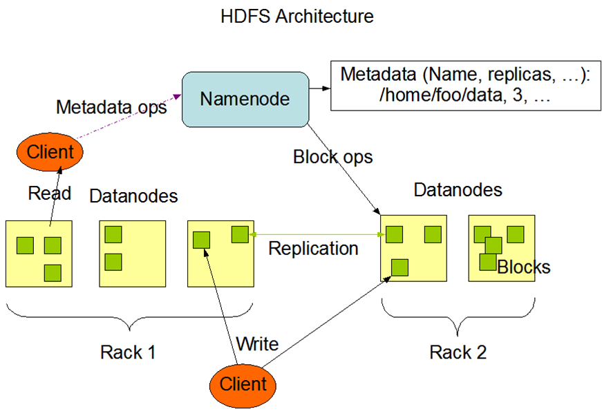

# HDFS

## 一、HDFS概述

HDFS是分布式文件管理系统中的一种。

- 分布式文件管理系统：随着数据量越来越大，在一个操作系统存不下所有的数据，那么就分配到更多的操作系统管理的磁盘中，但是这样就不方便对文件进行管理和维护，所以迫切需要一种系统来管理多台机器上的文件，这就是分布式文件管理系统。

HDFS 定义 HDFS（Hadoop Distributed File System），它是一个文件系统，用于存储文件，通过目录树来定位文件。其次，它是分布式的，由很多服务器联合起来实现其功能，集群中的服务器有各自的角色。 

HDFS 的使用场景：适合一次写入，多次读取的场景。一个文件经过创建、写入和关闭之后就不需要改变。

## 二、存储模型

1、HDFS中的文件在物理上是分块存储（Block），HDFS将文件线性按字节切割成块(Block)，每个Block具有offset，id的属性。不同文件的block大小可以不一样，一个文件除最后一个block，其他block大小一致。

- 比如设置Block为64M大小，那么将一个129M的文件进行上传的时候，会分为3个Block，分别为64M、64M、1M。
- 进行文件切割的时候，因为是按照字节进行切割，所以是有可能将文件切坏的，但是在HDFS系统下，会在读取文件时进行reduce计算，所以可以保证最终的文件是正确无误的。

2、Block块的大小一般是依据硬件的I/O特性调整，可以通过配置参数( dfs.blocksize）来设置默认的块大小。

- 默认大小在Hadoop2.x/3.x版本中是128M，1.x版本中是64M。现在一般性能好一些的硬盘，读写速率都在百兆/sy以上。

  

- HDFS的块设置太小，会增加寻址时间，程序一直在找块的开始位置。

- 如果块设置的太大，从磁盘传输数据的时间会明显大于定位这个块开始位置所需的时间。导致程序在处理这块数据时，会非常慢。

3、Block被分散存放在集群的各个节点中，具有location的特性，每个块都会记录当前被放置在集群中的哪个节点上，并将位置信息进行上报。

4、Block具有副本(replication)，没有主从概念，副本不能出现在同一个节点，这样可以在机器出现故障时满足可靠性，并且在并发读的时候可以提升读取的性能。

- 比如当前Block-0有3个副本，那么在集群中就只会看到3个Block-0，而不是4个

- 当数据分成5个Block，2个副本时，在一个4台DataNodes中进行存储时，会进行相对均匀的分配。

  

5、文件上传可以指定Block大小和副本数，上传后只能修改副本数，一次写入多次读取，不支持修改，支持追加数据。

- HDFS会对上传的文件进行切割，并且将切割后的Block块分配到不同的节点上，每个Block有自己的offset偏移量，当对文件进行修改的时候，会改变相关块的offset，并且改变其中一个块的offset时，会产生连锁反应，对后续所有的块都要重新计算偏移量，此时就涉及到后续所有Block的重新计算，重新分配，以及不同DataNode节点之间数据的疯狂拷贝。仅仅因为一个操作，就会对现有系统产生极大的计算以及IO压力。

  如果仅把HDFS当作一个支持增删改查的文件系统，那么是可以接受的，但是HDFS的设计初衷是为了分布式计算而产生的，修改操作带来的大量系统资源占用，会影响计算性能，因此就舍弃了修改操作，但是追加是支持的，追加只是在最后一个Block后面增加内容，影响面很小。所以可接受。

## 三、架构设计

HDFS是一个主从(Master/Slaves)架构，由一个NameNode和一些DataNode组成

- NameNode

  充当Master，是一个管理者。

  1. 基于内存的、负责存储和管理文件元数据，并维护了一个层次型的文件目录树。
  2. 需要持久化方案保证数据可靠性
  3. 配置副本策略
  4. 管理数据块（Block）映射信息
  5. 处理客户端读写请求

- DataNode

  Slave角色，接收NameNode下达的命令。

  1. 存储实际的数据块
  2. 执行数据块的读/写操作
  3. 与NameNode维持心跳，并汇报自己持有的block信息

- Client客户端

  1. 文件切分。文件上传HDFS的时候，Client将文件切分成一个一个的Block，然后进行上传
  2. 与NameNode交互，获取文件的位置信息
  3. 与DataNode交互，读取或者写入数据
  4. Client提供一些命令来管理HDFS，比如NameNode格式化
  5. Client可以通过一些命令来访问HDFS

