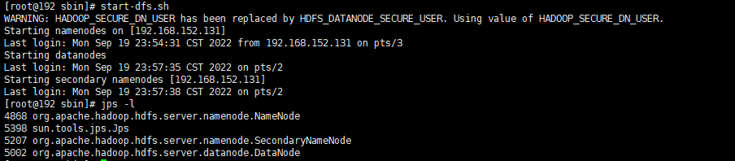

### 一、安装Java环境

```sh
#创建目录，并将jdk包上传到指定目录
mkdir /usr/local/soft/jdk-1.8/
#解压jdk
mkdir /usr/local/jdk/
tar -xvf jdk-8u291-linux-x64.tar.gz -C /usr/local/jdk
#配置jdk环境变量
vim /etc/profile
#环境变量添加到profile文件中
export JAVA_HOME=/usr/local/jdk/jdk1.8.0_291
export CLASSPATH=.:$JAVA_HOME/jre/lib/rt.jar:$JAVA_HOME/lib/dt.jar:$JAVA_HOME/lib/tools.jar
export PATH=$PATH:$JAVA_HOME/bin
#环境配置生效
source /etc/profile
```

### 二、关闭防火墙

```sh
systemctl stop firewalld
systemctl disable firewalld.service
```

### 三、做时间同步

```sh
#安装ntp软件
yum install ntp  -y
#修改配置文件
vi /etc/ntp.conf 
#添加server，与阿里云保持时间同步
server ntp1.aliyun.com
#启动时间同步
service ntpd start
#开机运行
chkconfig ntpd on
```

### 四、配置ssh免密

```sh
#ssh访问一下自己，会在/root/.ssh/目录下生成known_hosts文件
ssh localhost
#创建密钥
ssh-keygen -t dsa -P '' -f ~/.ssh/id_dsa
#创建公钥
cat ~/.ssh/id_dsa.pub >> ~/.ssh/authorized_keys
#目标服务器创建目录（目标服务器执行）
mkdir /root/.ssh/
#传输公钥到目标服务器（当前服务器执行）
scp id_dsa.pub 192.168.152.133:/root/.ssh/node01.pub
#目标服务器生成公钥，生成公钥之后，就可以免密登录（目标服务器执行）
cat node01.pub >> authorized_keys
```

### 五、单机安装Hadoop

```sh
#将Hadoop安装包上传到服务器上。
scp hadoop-3.3.3.tar.gz root@ip:/usr/local/soft/
#Hadoop安装包所在目录进行解压
tar -zxvf hadoop-3.1.3.tar.gz
#创建目录
mkdir /opt/bigdata
mv /usr/local/soft/hadoop-3.3.3/ /opt/bigdata/
```


```sh
#配置Hadoop环境变量
vi /etc/profile
#增加配置
export HADOOP_HOME=/opt/bigdata/hadoop-3.3.3
#path后追加
:$HADOOP_HOME/bin:$HADOOP_HOME/sbin
#保存********************
#配置生效
source /etc/profile
#路径下存放Hadoop配置文件
/opt/bigdata/hadoop-3.3.3/etc/hadoop
cd /opt/bigdata/hadoop-3.3.3/etc/hadoop
```

#### 编辑配置文件-环境变量

```sh
#编辑配置文件
vi hadoop-env.sh
#增加Java_home配置
export JAVA_HOME=/usr/local/jdk/jdk1.8.0_291
#wq保存***********
```


#### 配置NameNode

core-site中配置的value，代表NameNode在哪台机器上以什么端口启用

```sh
vi core-site.xml
<configuration>
    <property>
        <name>fs.defaultFS</name>
        <value>hdfs://192.168.152.131:9000</value>
    </property>
        <!-- 配置HDFS网页登录使用的静态用户为“你想要进行删除操作的用户名” -->
    <property>
        <name>hadoop.http.staticuser.user</name>
        <value>你的用户名</value>
    </property>
</configuration>
```


#### 配置hdfs-site

vi hdfs-site.xml

```xml
<configuration>
    <property>
        <name>dfs.replication</name>
        <value>1</value>
    </property>
    <property>
        <!-->namenode元数据存放目录<-->
        <name>dfs.namenode.name.dir</name>
        <value>/var/bigdata/hadoop/local/dfs/name</value>
    </property>
        <property>
            <!-->datanode元数据存放目录<-->
        <name>dfs.datanode.data.dir</name>
        <value>/var/bigdata/hadoop/local/dfs/data</value>
    </property>
    <property>
        <!-->secondary地址<-->
        <name>dfs.namenode.secondary.http-address</name>
        <value>192.168.152.131:50090</value>
    </property>
    <property>
        <!-->secondary文件路径<-->
        <name>dfs.namenode.checkpoint.dir</name>
        <value>/var/bigdata/hadoop/local/dfs/secondary</value>
    </property>
</configuration>
```

#### 配置DataNode

```sh
#配置DN这个角色再那里启动
vi workers
#将服务器ip添加进去
```

#### 启动

- 第一次启动，格式化

  hdfs namenode -format

  

  初始化的时候，会生成一个空的fsimage

- 启动脚本

  将start-dfs.sh，stop-dfs.sh两个文件顶部添加以下参数

  ```sh
  #!/usr/bin/env bash
  HDFS_DATANODE_USER=root
  HADOOP_SECURE_DN_USER=hdfs
  HDFS_NAMENODE_USER=root
  HDFS_SECONDARYNAMENODE_USER=root
  ```

  执行start-dfs.sh

  

- 访问http://192.168.152.131:9870/

  

