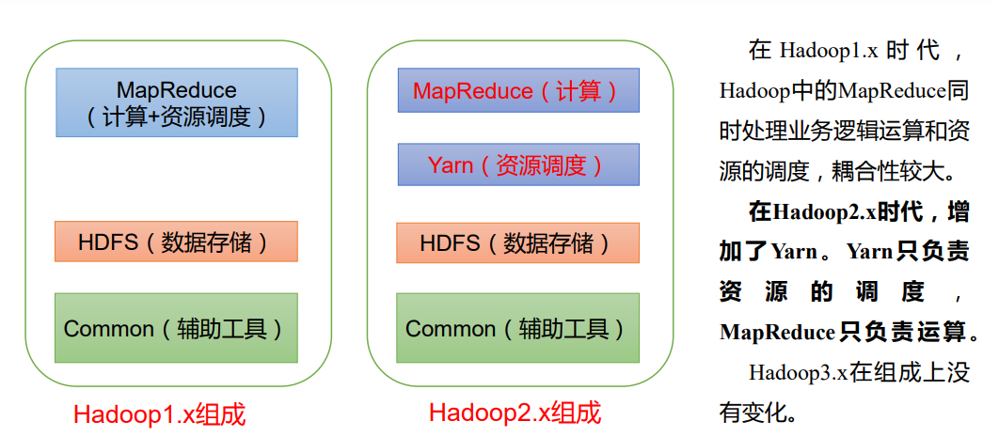
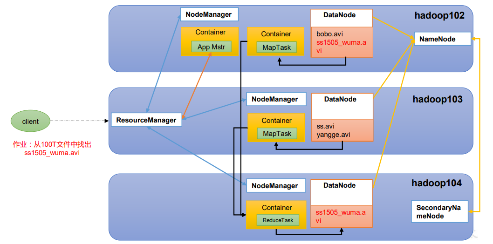
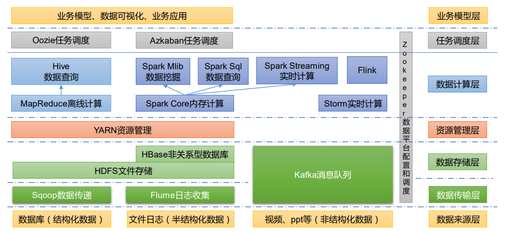
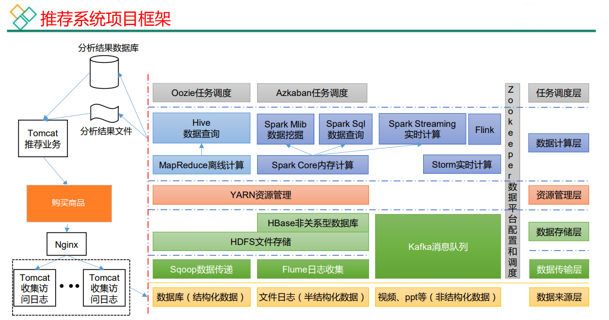

# Hadoop的组成

主要分为三大组件：HDFS、MapReduce、Yarn

HDFS：是一个分布式文件系统。

MapReduce：处理业务逻辑运算。

Yarn：负责整套存储、运算系统的资源调度

# 大数据生态体系

- Sqoop：Sqoop 是一款开源的工具，主要用于在 Hadoop、Hive 与传统的数据库（MySQL）间进行数据的传递，可以将一个关系型数据库（例如 ：MySQL，Oracle 等）中的数据导进到 Hadoop 的 HDFS 中，也可以将 HDFS 的数据导进到关系型数据库中。
- Flume：Flume是一个高可用的，高可靠的，分布式的海量日志采集、聚合和传输的系统，Flume 支持在日志系统中定制各类数据发送方，用于收集数据。
- Kafka：Kafka 是一种高吞吐量的分布式发布订阅消息系统；
- Spark：Spark 是当前最流行的开源大数据内存计算框架。可以基于 Hadoop 上存储的大数据进行计算。
- Flink：Flink 是当前最流行的开源大数据内存计算框架。用于实时计算的场景较多。
- Oozie：Oozie 是一个管理 Hadoop 作业（job）的工作流程调度管理系统。
- Hbase：HBase 是一个分布式的、面向列的开源数据库。HBase 不同于一般的关系数据库，它是一个适合于非结构化数据存储的数据库。
- Hive：Hive 是基于 Hadoop 的一个数据仓库工具，可以将结构化的数据文件映射为一张数据库表，并提供简单的 SQL 查询功能，可以将 SQL 语句转换为 MapReduce 任务进行运行。其优点是学习成本低，可以通过类 SQL 语句快速实现简单的 MapReduce 统计，不必开发专门的 MapReduce 应用，十分适合数据仓库的统计分析。
- ZooKeeper：它是一个针对大型分布式系统的可靠协调系统，提供的功能包括：配置维护、名称服务、分布式同步、组服务等。

# 推荐系统框架图

