# 一、CompletableFuture

## FutureTask

- Future接口定义了操作异步任务执行一些方法，如获取异步任务的执行结果、取消任务的执行、判断任务是否被取消、判断任务执行是否完毕等。

- Callable接口中定义了需要有返回结果的任务需要实现的方法。比如主线程让一个子线程去执行任务，子线程可能比较耗时，启动子线程开始执行任务后，主线程就去做其他事情了，过了一会才去获取子任务的执行结果。

  ```java
  public class FutureTaskDemo {
      public static void main(String[] args) {
          FutureTask<Integer> futureTask = new FutureTask<>(() -> {
              return 1;
          });
          try {
              new Thread(futureTask).start();
              //get方法阻塞。
              Integer integer = futureTask.get();
              System.out.println(integer);
          } catch (InterruptedException e) {
              e.printStackTrace();
          } catch (ExecutionException e) {
              e.printStackTrace();
          }
      }
  }
  ```

## CompletableFuture

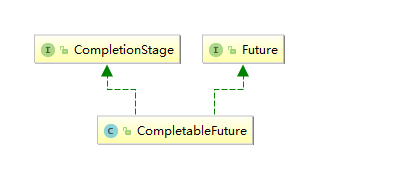

- CompletableFuture

  - CompletableFuture提供了非常强大的Future的扩展功能，可以帮助我们简化异步编程的复杂性，并且提供了函数式编程的能力，通过回调的方式处理计算结果，也提供了转换和组合CompletableFuture的方法。
  - 它可能代表一个明确完成的Future，也有可能代表一个完成阶段(CompletionStage)，它支持在计算完成以后触发一些函数或执行某些动作。
  - 实现了Future和CompletionStage接口

- CompletionStage

  代表异步计算过程中的某一个阶段，一个阶段完成以后可能会触发另外一个阶段，有些类似Linux系统的管道分隔符传参数。

- 核心方法

  1. runAsync无返回值

     ```java
     public static CompletableFuture<Void> runAsync(Runnable runnable)
     //自定义线程池作为参数
     //没有指定Executor的方法，直接使用默认的ForkJoinPool.commonPool() 作为它的线程池执行异步代码。
     public static CompletableFuture<Void> runAsync(Runnable runnable,Executor executor)
     ```

     ```java
     private static void m1() {
             ThreadPoolExecutor threadPoolExecutor = new ThreadPoolExecutor(1, 20, 1L, TimeUnit.SECONDS, new LinkedBlockingQueue<>(50), Executors.defaultThreadFactory(), new ThreadPoolExecutor.AbortPolicy());
             CompletableFuture<Void> completableFuture = CompletableFuture.runAsync(() -> {
                 System.out.println("111");
             }, threadPoolExecutor);
         }
     ```

  2. supplyAsync有返回值

     ```java
     public static <U> CompletableFuture<U> supplyAsync(Supplier<U> supplier)
     //自定义线程池作为参数
     //没有指定Executor的方法，直接使用默认的ForkJoinPool.commonPool() 作为它的线程池执行异步代码。
     public static <U> CompletableFuture<U> supplyAsync(Supplier<U> supplier,Executor executor)
     ```

     ```java
     private static void m2() throws ExecutionException, InterruptedException {
             ThreadPoolExecutor threadPoolExecutor = new ThreadPoolExecutor(1, 20, 1L, TimeUnit.SECONDS, new LinkedBlockingQueue<>(50), Executors.defaultThreadFactory(), new ThreadPoolExecutor.AbortPolicy());
             CompletableFuture<Integer> supplyAsync = CompletableFuture.supplyAsync(() -> {
                 return 11;
             }, threadPoolExecutor);
             Integer integer = supplyAsync.get();
             System.out.println(integer);
             threadPoolExecutor.shutdown();
         }
     ```

  3. thenApply

     - 异步任务结束时，当前异步任务的线程会自动回调下一个异步任务。
     - thenApplyAsync是会新起一个线程，回调下一个异步任务。

  4. whenComplete

     当任务执行完执行的回调。参数包括任务的结果和异常。

     当任务执行的过程中抛出了异常，也会调用whenComplete，但是传递的任务结果为null

  5. exceptionally

     当异步任务抛出异常时，会执行exceptionally的回调。

     ```java
     private static void m2() throws ExecutionException, InterruptedException {
             ThreadPoolExecutor threadPoolExecutor = new ThreadPoolExecutor(1, 20, 1L, TimeUnit.SECONDS, new LinkedBlockingQueue<>(50), Executors.defaultThreadFactory(), new ThreadPoolExecutor.AbortPolicy());
             CompletableFuture<Integer> supplyAsync = CompletableFuture.supplyAsync(() -> {
                 System.out.println(Thread.currentThread().getName());
                 try {
                     Thread.sleep(2000);
                 } catch (InterruptedException e) {
                     e.printStackTrace();
                 }
                 return 11;
             }, threadPoolExecutor).thenApply(r -> {
     //            System.out.println(10/0);
                 System.out.println(Thread.currentThread().getName() + "----" + r);
                 return r + 10;
             }).whenComplete((r, throwable) -> {
                 System.out.println(Thread.currentThread().getName() + "----" + r);
             }).exceptionally(throwable -> {
                 throwable.printStackTrace();
                 return 20;
             });
             Integer integer = supplyAsync.get();
             System.out.println(Thread.currentThread().getName() + "----" + integer);
             threadPoolExecutor.shutdown();
         }
     ```

     方法中带async的和不带async的方法，主要的区别就是带async的回调不会沿用之前的线程，会重启启动一个线程执行任务，这样会有可能导致效率问题，因为涉及到线程的启动、切换。

- 优点

  1. 异步任务结束时，会自动回调某个对象的方法
  2. 异步任务出错时，会自动回调某个对象的方法
  3. 主线程设置好回调后，不再关心异步任务的执行，异步任务之间可以顺序执行

- 函数式编程

  ```java
  public static List<String> getPriceByASync(List<NetMall> list, String productName) {
          return list
                  .stream()
                  .map(netMall -> CompletableFuture.supplyAsync(() -> String.format(productName + " is %s price is %.2f", netMall.getMallName(), netMall.calcPrice(productName))))
                  .collect(Collectors.toList())
                  .stream()
                  .map(CompletableFuture::join)
                  .collect(Collectors.toList());
      }
  ```

  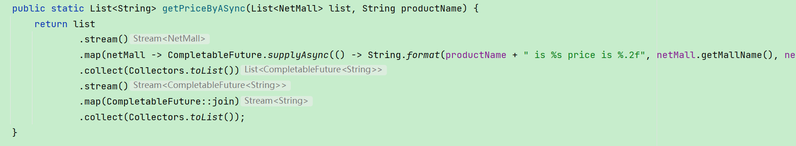

## CompletableFuture常用方法

### 1、获得结果和触发计算

- 获取结果

  ```java
  public T get()
  public T get(long timeout, TimeUnit unit)
  //立即获取结果不阻塞，如果还没有结果，则返回设定的默认值
  public T getNow(T valueIfAbsent)
  //加入当前线程，顺序执行
  public T join()
  //当调用CompletableFuture.get()被阻塞的时候,complete方法就是结束阻塞并get()获取设置的complete里面的值.
  completableFuture.complete(value)
  ```

### 2、对计算结果进行处理

- thenApply

  计算结果存在依赖关系，两个线程串行化。当前步骤有异常的话就叫停，不走下一步。

- handle

  有异常也可以往下一步走，根据带的异常参数可以进一步处理

  ```java
  private static void m3() throws ExecutionException, InterruptedException {
          ThreadPoolExecutor threadPoolExecutor = new ThreadPoolExecutor(1, 20, 1L, TimeUnit.SECONDS, new LinkedBlockingQueue<>(50), Executors.defaultThreadFactory(), new ThreadPoolExecutor.AbortPolicy());
          CompletableFuture<Integer> supplyAsync = CompletableFuture.supplyAsync(() -> {
                      System.out.println(Thread.currentThread().getName());
                      try {
                          Thread.sleep(2000);
                      } catch (InterruptedException e) {
                          e.printStackTrace();
                      }
                      return 11;
                  }, threadPoolExecutor).thenApply(r -> {
                      System.out.println(10 / 0);
                      System.out.println(Thread.currentThread().getName() + "----" + r);
                      return r + 10;
                  }).handle((r, throwable) -> {
                      System.out.println("yichang");
                      return r + 11;
                  }).whenComplete((r, e) -> {
                      System.out.println(r);
                  }).
                  exceptionally(throwable -> {
                      throwable.printStackTrace();
                      return 200;
                  });
          Integer integer = supplyAsync.get();
          System.out.println(Thread.currentThread().getName() + "----" + integer);
          threadPoolExecutor.shutdown();
      }
  ```

### 3、对计算结果进行消费

- thenAccept

  接收任务的处理结果，并消费处理，无返回结果。

  ```java
  private static void m4() throws ExecutionException, InterruptedException {
          ThreadPoolExecutor threadPoolExecutor = new ThreadPoolExecutor(1, 20, 1L, TimeUnit.SECONDS, new LinkedBlockingQueue<>(50), Executors.defaultThreadFactory(), new ThreadPoolExecutor.AbortPolicy());
          CompletableFuture.supplyAsync(() -> {
              System.out.println(Thread.currentThread().getName());
              try {
                  Thread.sleep(2000);
              } catch (InterruptedException e) {
                  e.printStackTrace();
              }
              return 11;
          }, threadPoolExecutor).thenAccept(r -> {
              System.out.println("结果" + r);
          });
          threadPoolExecutor.shutdown();
      }
  ```

### 4、对计算速度进行选用

- applyToEither

  哪个线程执行的快，先出结果，就使用哪个线程的结果

  ```java
  private static void m5() throws ExecutionException, InterruptedException {
          ThreadPoolExecutor threadPoolExecutor = new ThreadPoolExecutor(10, 20, 1L, TimeUnit.SECONDS, new LinkedBlockingQueue<>(50), Executors.defaultThreadFactory(), new ThreadPoolExecutor.AbortPolicy());
          CompletableFuture<Integer> completableFuture1 = CompletableFuture.supplyAsync(() -> {
              System.out.println(Thread.currentThread().getName());
              try {
                  Thread.sleep(2000);
              } catch (InterruptedException e) {
                  e.printStackTrace();
              }
              return 11;
          },threadPoolExecutor);
          CompletableFuture<Integer> completableFuture2 = CompletableFuture.supplyAsync(() -> {
              System.out.println(Thread.currentThread().getName());
              try {
                  Thread.sleep(1000);
              } catch (InterruptedException e) {
                  e.printStackTrace();
              }
              return 22;
          },threadPoolExecutor);
          CompletableFuture<Object> objectCompletableFuture = completableFuture1.applyToEither(completableFuture2, integer -> {
              System.out.println(integer);
              return integer;
          });
          threadPoolExecutor.shutdown();
      }
  ```

### 5、对计算结果进行合并

两个CompletionStage任务都完成后，最终能把两个任务的结果一起交给thenCombine 来处理。

- thenCombine

  ```java
  private static void m6() throws ExecutionException, InterruptedException {
          CompletableFuture<Integer> completableFuture1 = CompletableFuture.supplyAsync(() -> {
              System.out.println(Thread.currentThread().getName() + "\t" + "---come in ");
              return 10;
          });
  
          CompletableFuture<Integer> completableFuture2 = CompletableFuture.supplyAsync(() -> {
              System.out.println(Thread.currentThread().getName() + "\t" + "---come in ");
              return 20;
          });
  
          CompletableFuture<Integer> thenCombineResult = completableFuture1.thenCombine(completableFuture2, (x, y) -> {
              System.out.println(Thread.currentThread().getName() + "\t" + "---come in ");
              return x + y;
          });
  
          System.out.println(thenCombineResult.get());
      }
  ```


# 二、JAVA中的锁

## 锁分类

- 乐观锁

  1. 乐观锁认为自己在使用数据时不会有别的线程修改数据，所以不会添加锁，只是在更新数据的时候去判断之前有没有别的线程更新了这个数据。
  2. 如果这个数据没有被更新，当前线程将自己修改的数据成功写入。如果数据已经被其他线程更新，则根据不同的实现方式执行不同的操作。
  3. 乐观锁在Java中是通过使用无锁编程来实现，最常采用的是CAS算法，Java原子类中的递增操作就通过CAS自旋实现的。
  4. 适合读操作多的场景，不加锁的特点能够使其读操作的性能大幅提升。
  5. 乐观锁一般有两种实现方式：
     - 采用版本号机制
     - CAS（Compare-and-Swap，即比较并替换）算法实现

- 悲观锁

  认为自己在使用数据的时候一定有别的线程来修改数据，因此在获取数据的时候会先加锁，确保数据不会被别的线程修改。适合写操作多的场景，先加锁可以保证写操作时数据正确，显式的锁定之后再操作同步资源。

  synchronized关键字和Lock的实现类都是悲观锁。

- 公平锁

  ReentrantLock默认为非公平锁

  ```java
  public ReentrantLock() {
      sync = new NonfairSync();
  }
  ```

  会有先来后到的意思，内部有一个等待队列，后到的都在队列中排队等待。lock加锁时，判断同步队列是否还有先驱节点的存在，如果没有先驱节点才能获取锁。

  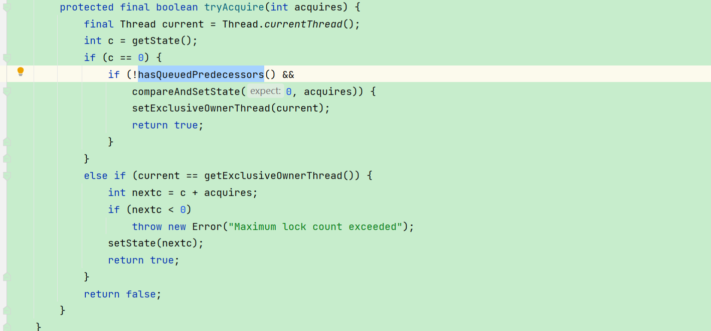

- 非公平锁

  非公平锁在lock的时候，没有等待队列，直接争抢锁，效率会高些。但是容易出现锁饥饿的现象(因为存在锁偏向的问题)

  ```properties
  如果一个线程的cpu执行时间都被其他线程抢占了，导致得不到cpu执行，这种情况就叫做“饥饿”，这个线程就会出现饥饿致死的现象，因为永远无法得到cpu的执行。解决饥饿现象的方法就是实现公平，保证所有线程都公平的获得执行的机会。
  ```

  

  什么时候用公平？什么时候用非公平？

  - 如果为了更高的吞吐量，很显然非公平锁是比较合适的，因为节省很多线程切换时间，吞吐量自然就上去了。否则那就用公平锁，大家公平使用。

- 可重入锁(又名递归锁)

  - 是指在同一个线程在外层方法获取锁的时候，再进入该线程的内层方法会自动获取锁(前提，锁对象得是同一个对象)，不会因为之前已经获取过还没释放而阻塞。

  - 一个线程中的多个流程可以获取同一把锁，持有这把同步锁可以再次进入。

  - synchronized可重入锁的实现原理

    每个锁对象拥有一个锁计数器和一个指向持有该锁的线程的指针。

    当执行monitorenter时，如果目标锁对象的计数器为零，那么说明它没有被其他线程所持有，Java虚拟机会将该锁对象的持有线程设置为当前线程，并且将其计数器加1。

    在目标锁对象的计数器不为零的情况下，如果锁对象的持有线程是当前线程，那么 Java 虚拟机可以将其计数器加1，否则需要等待，直至持有线程释放该锁。

    当执行monitorexit时，Java虚拟机则需将锁对象的计数器减1。计数器为零代表锁已被释放。

  - ReentrantLock可重入锁的实现原理

    实现原理和synchronized类似，但是因为synchronized是隐式的加锁、解锁，不需要人为控制，自动实现锁计数器的加减。

    ReentrantLock是显式的手动lock、unlock。所以加锁几次就要解锁几次。否则容易造成死锁。

- 死锁及排查

  - 死锁是指两个或两个以上的线程在执行过程中，因争夺资源而造成的一种互相等待的现象，若无外力干涉那它们都将无法推进下去，如果系统资源充足，进程的资源请求都能够得到满足，死锁出现的可能性就很低，否则就会因争夺有限的资源而陷入死锁。

    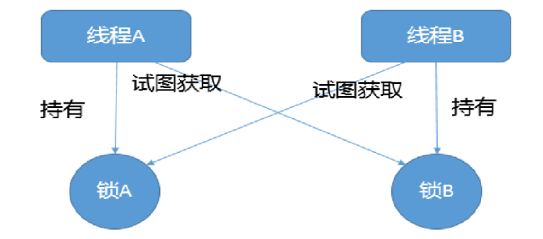

  - 排查死锁

    ```java
    jstack 进程编号
    ```

    线程堆栈会分析出死锁

- 不可以String同一把锁

## synchronized

- 从字节码角度分析synchronized实现

  1. synchronized同步代码块

     使用monitorenter和monitorexit指令实现，monitorenter代表进入锁定，monitorexit代表退出锁定。

     

     正常情况下，是一个monitorenter对应两个monitorexit，一个为正常情况下的退出，另一个为程序发生异常时的退出。

     如果程序里手动抛出异常，则只会对应一个monitorexit，不过一般也不会这么写程序，即使抛出异常，也会在某些条件下抛出，那样的话，仍然是一个monitorenter对应两个monitorexit。

     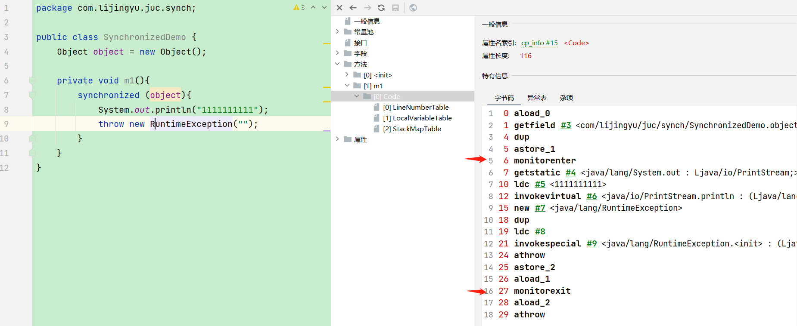

  2. synchronized普通同步方法

     调用指令将会检查方法的ACC_SYNCHRONIZED访问标志是否被设置，如果设置了，执行线程会先持有monitor然后再执行方法，最后在方法完成(无论是正常完成还是非正常完成)时释放 monitor。

     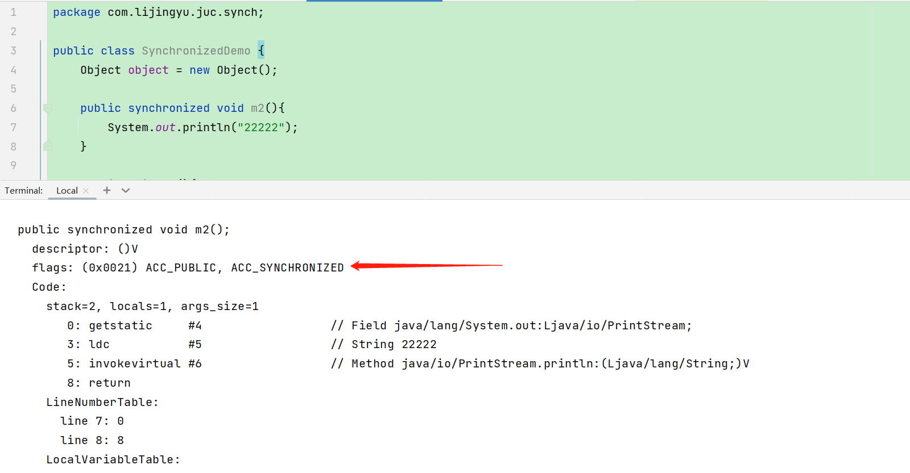

  3. synchronized静态同步方法

     ACC_SYNCHRONIZED访问标志区分该方法是否静态同步方法。

     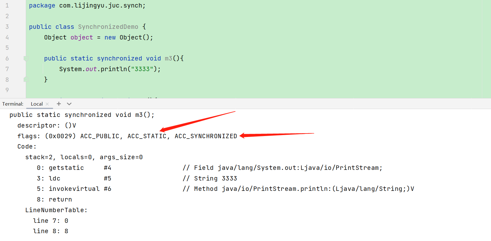

  4. s

# 三、LockSupport与线程中断

## 线程中断机制

### 什么是中断

- 首先

  一个线程不应该由其他线程来强制中断或停止，而是应该由线程自己自行停止。所以，Thread.stop, Thread.suspend, Thread.resume 都已经被废弃了。

- 其次
  在Java中没有办法立即停止一条线程，然而停止线程却显得尤为重要，如取消一个耗时操作。因此，Java提供了一种用于停止线程的机制——中断。

  中断只是一种协作机制，Java没有给中断增加任何语法，中断的过程完全需要程序员自己实现。若要中断一个线程，你需要手动调用该线程的interrupt方法，该方法也仅仅是将线程对象的中断标识设成true。

  接着你需要自己写代码不断地检测当前线程的标识位，如果为true，表示别的线程要求这条线程中断，此时究竟该做什么需要你自己写代码实现。

- 每个线程对象中都有一个标识，用于表示线程是否被中断

  该标识位为true表示中断，为false表示未中断。通过调用线程对象的interrupt方法将该线程的标识位设为true，可以在别的线程中调用，也可以在自己的线程中调用。

### 中断相关的api

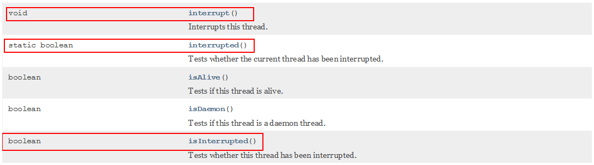

| public void interrupt()             | 实例方法interrupt()仅仅是设置线程的中断状态为true，不会停止线程 |
| ----------------------------------- | ------------------------------------------------------------ |
| public static boolean interrupted() | 静态方法，Thread.interrupted();  <br />判断线程是否被中断，并清除当前中断状态。<br />这个方法做了两件事： <br />1 返回当前线程的中断状态 <br />2 将当前线程的中断状态设为false<br /> |
| public boolean isInterrupted()      | 判断当前线程是否被中断（通过检查中断标志位）                 |

- 中断异常

  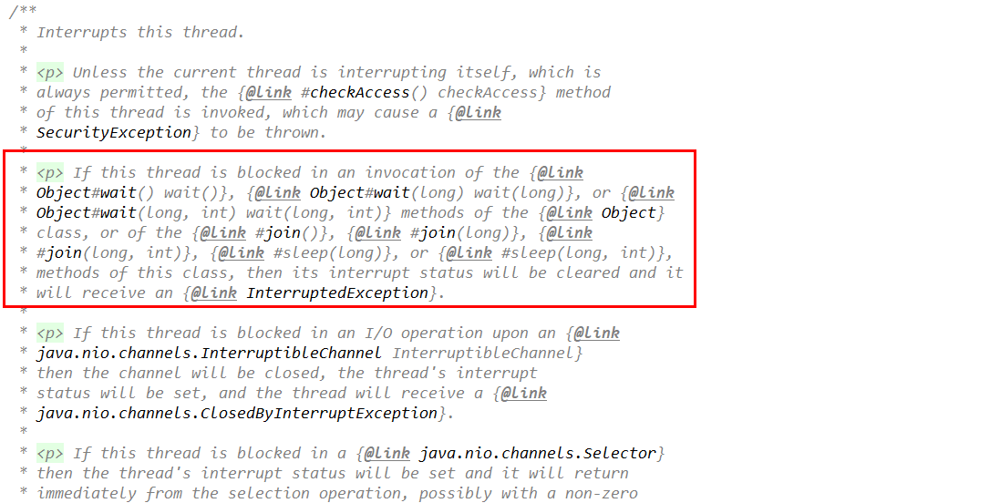

  当线程处于sleep、wait、join状态时，如果调用interrupt中断，会抛出interruptedException异常，需要针对异常进行处理。

- 具体来说，当对一个线程，调用 interrupt() 时

  1. 如果线程处于正常活动状态，那么会将该线程的中断标志设置为 true，仅此而已。

  2. 被设置中断标志的线程将继续正常运行，不受影响。所以， interrupt() 并不能真正的中断线程，需要被调用的线程自己进行配合才行。

  3. 如果线程处于被阻塞状态（例如处于sleep, wait, join 等状态），在别的线程中调用当前线程对象的interrupt方法，
     那么线程将立即退出被阻塞状态，并抛出一个InterruptedException异常。

  4. 如果catch住InterruptedException异常，线程不会停止，中断标志被重置为false，线程仍然会继续运行。

     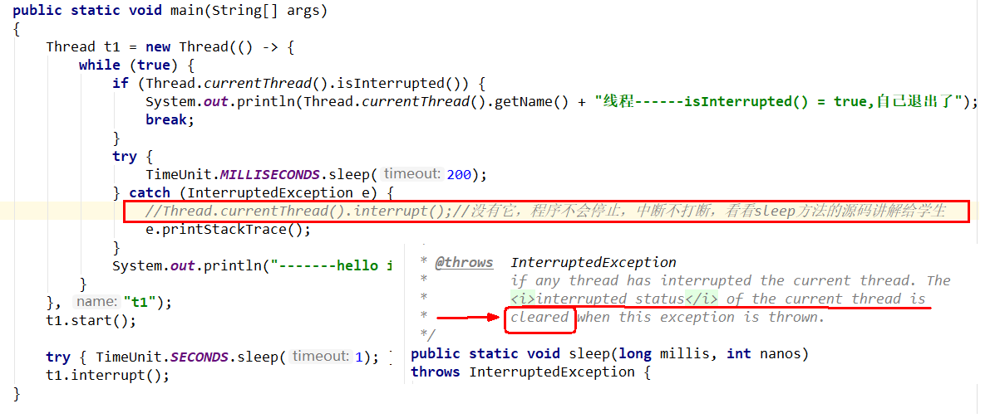

- 静态方法Thread.interrupted()

  返回当前线程的中断状态，并重置中断状态为false。

## LockSupport

- LockSupport是用来创建锁和其他同步类的基本线程阻塞原语。
- LockSupport中的park() 和 unpark() 的作用分别是阻塞线程和解除阻塞线程。

### 3种让线程等待和唤醒的方法

1. wait、notify

   使用Object中的wait()方法让线程等待，使用Object中的notify()方法唤醒线程。

   ```java
   public class WaitNotifyDemo {
       public static void main(String[] args) {
           //同一把锁，类似资源类
           Object objectLock = new Object();
   
           new Thread(() -> {
               synchronized (objectLock) {
                   System.out.println(Thread.currentThread().getName() + "\t" + "阻塞了");
                   try {
                       objectLock.wait();
                   } catch (InterruptedException e) {
                       e.printStackTrace();
                   }
               }
               System.out.println(Thread.currentThread().getName() + "\t" + "被唤醒了");
           }, "t1").start();
   
           //暂停几秒钟线程
           try {
               TimeUnit.SECONDS.sleep(3L);
           } catch (InterruptedException e) {
               e.printStackTrace();
           }
   
           new Thread(() -> {
               synchronized (objectLock) {
                   objectLock.notify();
               }
   
           }, "t2").start();
       }
   }
   ```

   - Object类中的wait、notify、notifyAll用于线程等待和唤醒的方法，都必须在synchronized内部执行（必须用到关键字synchronized）。

     放在synchronized外部，会抛出异常。

     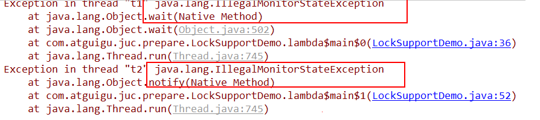

   - 将notify放在wait方法前面，程序一直无法结束。

    * 先wait后notify、notifyall方法，等待中的线程才会被唤醒，否则无法唤醒。

2. Condition

   使用JUC包中Condition的await()方法让线程等待，使用signal()方法唤醒线程。

   ```java
   public class ConditionDemo {
       public static void main(String[] args) {
           Lock lock = new ReentrantLock();
           Condition condition = lock.newCondition();
   
           new Thread(() -> {
               lock.lock();
               try {
                   System.out.println(Thread.currentThread().getName() + "\t" + "start");
                   condition.await();
                   System.out.println(Thread.currentThread().getName() + "\t" + "被唤醒");
               } catch (InterruptedException e) {
                   e.printStackTrace();
               } finally {
                   lock.unlock();
               }
           }, "t1").start();
   
           //暂停几秒钟线程
           try {
               TimeUnit.SECONDS.sleep(3L);
           } catch (InterruptedException e) {
               e.printStackTrace();
           }
   
           new Thread(() -> {
               lock.lock();
               try {
                   condition.signal();
               } catch (Exception e) {
                   e.printStackTrace();
               } finally {
                   lock.unlock();
               }
               System.out.println(Thread.currentThread().getName() + "\t" + "通知了");
           }, "t2").start();
       }
   }
   ```

   - 先await()后signal才OK，否则线程无法被唤醒。
   - 调用condition中线程等待和唤醒的方法的前提是，要在lock和unlock方法中,要有锁才能调用

3. park、unpark

   LockSupport是用来创建锁和其他同步类的基本线程阻塞原语。

   LockSupport类使用了一种名为Permit（许可）的概念来做到阻塞和唤醒线程的功能， 每个线程都有一个许可(permit)，permit只有两个值1和零，默认是零。

   可以把许可看成是一种(0,1)信号量（Semaphore），但与 Semaphore 不同的是，许可的累加上限是1。

   - permit默认是零，所以一开始调用park()方法，当前线程就会阻塞，直到别的线程将当前线程的permit设置为1时，park方法会被唤醒，然后会将permit再次设置为零并返回。

     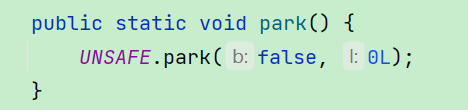

   - 调用unpark(thread)方法后，就会将thread线程的许可permit设置成1(注意多次调用unpark方法，不会累加，permit值还是1)会自动唤醒thread线程，即之前阻塞中的LockSupport.park()方法会立即返回。

     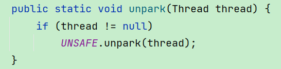

   - park和unpark一定要成对使用。

   ```java
   public class LockSupportDemo {
       public static void main(String[] args) {
           //正常使用+不需要锁块
           Thread t1 = new Thread(() -> {
               System.out.println(Thread.currentThread().getName() + " " + "1");
               LockSupport.park();
               System.out.println(Thread.currentThread().getName() + " " + "2-end被唤醒");
           }, "t1");
           t1.start();
           //暂停几秒钟线程
           try {
               TimeUnit.SECONDS.sleep(3);
           } catch (InterruptedException e) {
               e.printStackTrace();
           }
   
           LockSupport.unpark(t1);
           System.out.println(Thread.currentThread().getName() + "-----LockSupport.unparrk() invoked over");
       }
   }
   ```


# 四、Java内存模型之JMM

CPU的运行并不是直接操作内存而是先把内存里边的数据读到缓存，由于存在多级的缓存以及cpu和物理主内存的速度不同，内存的读和写操作的时候就会造成数据不一致的问题。

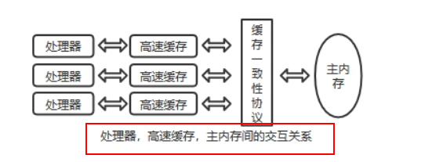

- Java虚拟机规范中试图定义一种Java内存模型（java Memory Model，简称JMM) 来屏蔽掉各种硬件和操作系统的内存访问差异，以实现让Java程序在各种平台下都能达到一致的内存访问效果。这就是我们知道的JMM。

- JMM(Java内存模型Java Memory Model，简称JMM)本身是一种抽象的概念并不真实存在它仅仅描述的是一组约定或规范，通过这组规范定义了程序中(尤其是多线程)各个变量的读写访问方式并决定一个线程对共享变量的写入何时以及如何变成对另一个线程可见，关键技术点都是围绕多线程的原子性、可见性和有序性展开的。

-  JMM的关键技术点都是围绕多线程的原子性、可见性和有序性展开的

- 能干嘛？

  通过JMM来实现线程和主内存之间的抽象关系。

  屏蔽各个硬件平台和操作系统的内存访问差异以实现让Java程序在各种平台下都能达到一致的内存访问效果。

## JMM三大特性

1. 可见性

   - 可见性是指当一个线程修改了某一个共享变量的值，其他线程是否能够立即知道该变更 ，JMM规定了所有的变量都存储在主内存中。

   

   - Java中普通的共享变量不保证可见性，因为数据修改被写入内存的时机是不确定的，多线程并发下很可能出现"脏读"，所以每个线程都有自己的工作内存，线程自己的工作内存中保存了该线程使用到的变量的主内存副本拷贝，线程对变量的所有操作（读取，赋值等 ）都必需在线程自己的工作内存中进行，而不能够直接读写主内存中的变量。不同线程之间也无法直接访问对方工作内存中的变量，线程间变量值的传递均需要通过主内存来完成。

   - 线程脏读：如果没有可见性保证

     ```
     1、主内存中有变量 x，初始值为 0
     2、线程 A 要将 x 加 1，先将 x=0 拷贝到自己的私有内存中，然后更新 x 的值
     3、线程 A 将更新后的 x 值回刷到主内存的时间是不固定的
     4、刚好在线程 A 没有回刷 x 到主内存时，线程 B 同样从主内存中读取 x，此时为 0，和线程 A 一样的操作，最后期盼的 x=2 就会变成 x=1
     ```

2. 原子性

   指一个操作是不可中断的，即多线程环境下，操作不能被其他线程干扰。

3. 有序性

   - 对于一个线程的执行代码而言，我们总是习惯性认为代码的执行总是从上到下，有序执行。但为了提供性能，编译器和处理器通常会对指令序列进行重新排序。

   - 指令重排可以保证串行语义一致，但没有义务保证多线程间的语义也一致，即可能产生"脏读"，简单说，两行以上不相干的代码在执行的时候有可能先执行的不是第一条，不见得是从上到下顺序执行，执行顺序会被优化。

     

   - 单线程环境里面确保程序最终执行结果和代码顺序执行的结果一致。处理器在进行重排序时必须要考虑指令之间的数据依赖性，多线程环境中线程交替执行,由于编译器优化重排的存在，两个线程中使用的变量能否保证一致性是无法确定的，结果无法预测。

## 多线程对变量的读写过程

1. 由于JVM运行程序的实体是线程，而每个线程创建时JVM都会为其创建一个工作内存(有些地方称为栈空间)，工作内存是每个线程的私有数据区域，而Java内存模型中规定所有变量都存储在主内存，主内存是共享内存区域，所有线程都可以访问，但线程对变量的操作(读取赋值等)必须在工作内存中进行。

2. 首先线程要将变量从主内存拷贝到自己的工作内存空间，然后对变量进行操作，操作完成后再将变量写回主内存，不能直接操作主内存中的变量。

3. 各个线程中的工作内存中存储着主内存中的变量副本拷贝，因此不同的线程间无法访问对方的工作内存，线程间的通信(传值)必须通过主内存来完成。

   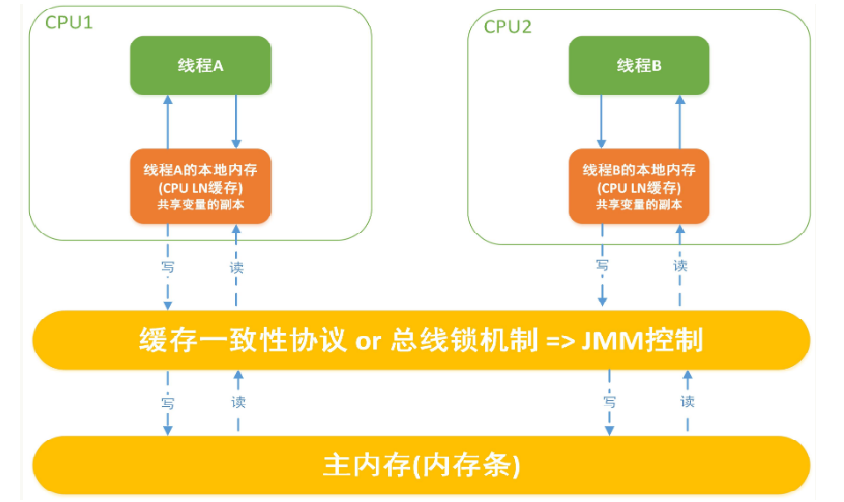

## happens-before先行发生原则

在JMM中，如果一个操作执行的结果需要对另一个操作可见或者代码重排序，那么这两个操作之间必须存在happens-before关系。

如果Java内存模型中所有的有序性都仅靠volatile和synchronized来完成，那么有很多操作都将会变得非常啰嗦，但是我们在编写Java并发代码的时候并没有察觉到这一点。我们没有时时、处处、次次，添加volatile和synchronized来完成程序，这是因为Java语言中JMM原则下有一个“先行发生”(Happens-Before)的原则限制和规矩。

这个原则非常重要，它是判断数据是否存在竞争，线程是否安全的非常有用的手段。依赖这个原则，我们可以通过几条简单规则一揽子解决并发环境下两个操作之间是否可能存在冲突的所有问题，而不需要陷入Java内存模型苦涩难懂的底层编译原理之中。

- 理论介绍

  如果一个操作happens-before另一个操作，那么第一个操作的执行结果将对第二个操作可见，而且第一个操作的执行顺序排在第二个操作之前。

  两个操作之间存在happens-before关系，并不意味着一定要按照happens-before原则制定的顺序来执行。如果重排序之后的执行结果与按照happens-before关系来执行的结果一致，那么这种重排序并不非法。

- happens-before之8条规则

  1. 次序规则

     一个线程内，按照代码顺序，写在前面的操作先行发生于写在后面的操作。前一个操作的结果可以被后续的操作获取。
     讲白点就是前面一个操作把变量X赋值为1，那后面一个操作肯定能知道X已经变成了1。

  2. 锁定规则

     一个unLock操作先行发生于后面（这里的“后面”是指时间上的先后）对同一个锁的lock操作，也就是同一把锁，一定会前一个unlock释放锁了，后一个线程才能lock获取到锁。

  3. volatile变量规则

     对一个volatile变量的写操作先行发生于后面对这个变量的读操作，前面的写对后面的读是可见的，这里的“后面”同样是指时间上的先后。

  4. 传递规则

     如果操作A先行发生于操作B，而操作B又先行发生于操作C，则可以得出操作A先行发生于操作C。

  5. 线程启动规则(Thread Start Rule)

     Thread对象的start()方法先行发生于此线程的每一个动作。

  6. 线程中断规则(Thread Interruption Rule)

     对线程interrupt()方法的调用先行发生于被中断线程的代码检测到中断事件的发生。

  7. 线程终止规则(Thread Termination Rule)

     线程中的所有操作都先行发生于对此线程的终止检测，我们可以通过Thread::join()方法是否结束、Thread::isAlive()的返回值等手段检测线程是否已经终止执行。

  8. 对象终结规则(Finalizer Rule)

     一个对象的初始化完成（构造函数执行结束）先行发生于它的finalize()方法的开始。对象没有完成初始化之前，是不能调用finalized()方法的。

# 五、volatile与Java内存模型

- volatile可以保证可见性和有序性，禁止指令重排序
- 当写一个volatile变量时，JMM会把该线程对应的本地内存中的共享变量值立即刷新回主内存中。
- 当读一个volatile变量时，JMM会把该线程对应的本地内存设置为无效，直接从主内存中读取共享变量。
- 所以volatile的写内存语义是直接刷新到主内存中，读的内存语义是直接从主内存中读取。

## 内存屏障

- 内存屏障也称内存栅栏，内存栅障，屏障指令等，是一类同步屏障指令，是CPU或编译器在对内存随机访问的操作中的一个同步点，使得此点之前的所有读写操作都执行后才可以开始执行此点之后的操作，避免代码重排序。
- 内存屏障其实就是一种JVM指令，Java内存模型的重排规则会要求Java编译器在生成JVM指令时插入特定的内存屏障指令，通过这些内存屏障指令，volatile实现了Java内存模型中的可见性和有序性，但volatile无法保证原子性。
- 内存屏障之前的所有写操作都要回写到主内存，内存屏障之后的所有读操作都能获得内存屏障之前的所有写操作的最新结果(实现了可见性)。因此重排序时，不允许把内存屏障之后的指令重排序到内存屏障之前。
- 对一个 volatile 域的写, happens-before 于任意后续对这个 volatile 域的读，也叫写后读。

四大内存屏障

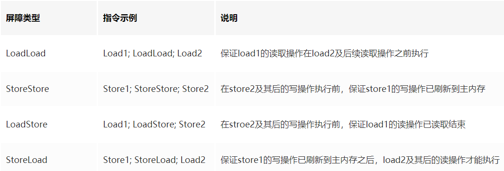

## happens-before 之volatile 变量规则


```
1、当第一个操作为volatile读时，不论第二个操作是什么，都不能重排序。这个操作保证了volatile读之后的操作不会被重排到volatile读之前。
2、当第二个操作为volatile写时，不论第一个操作是什么，都不能重排序。这个操作保证了volatile写之前的操作不会被重排到volatile写之后。
3、当第一个操作为volatile写时，第二个操作为volatile读时，不能重排。
```

- volatile写操作

  1. 在每个 volatile 写操作的前⾯插⼊⼀个 StoreStore 屏障

  2. 在每个 volatile 写操作的后⾯插⼊⼀个 StoreLoad 屏障

     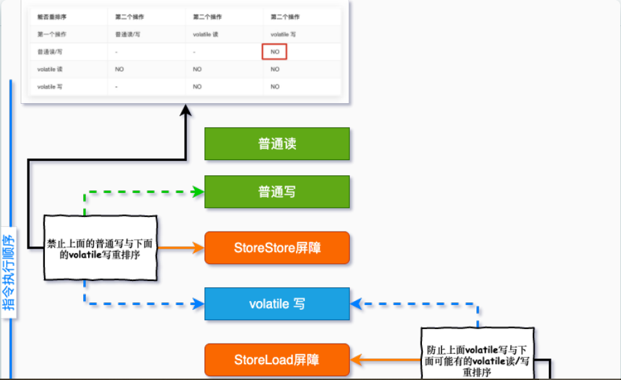

     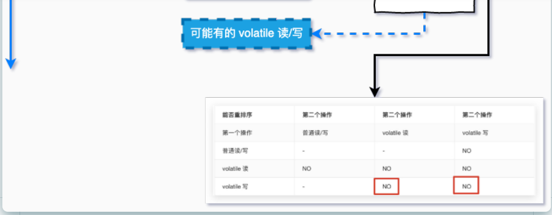
     
     

- volatile读操作

  1. 在每个 volatile 读操作的后⾯插⼊⼀个 LoadLoad 屏障

  2. 在每个 volatile 读操作的后⾯插⼊⼀个 LoadStore 屏障

     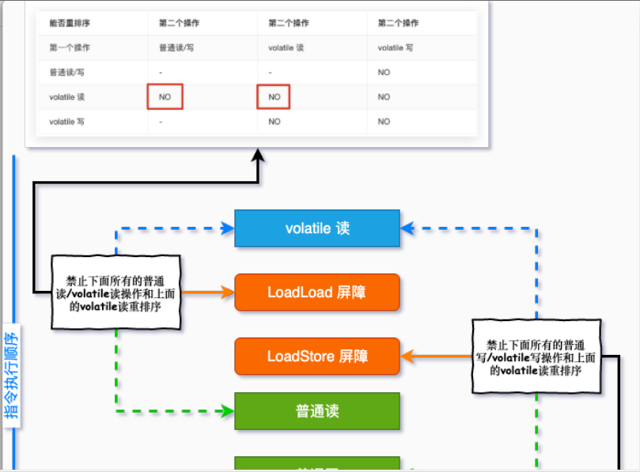

     
     
     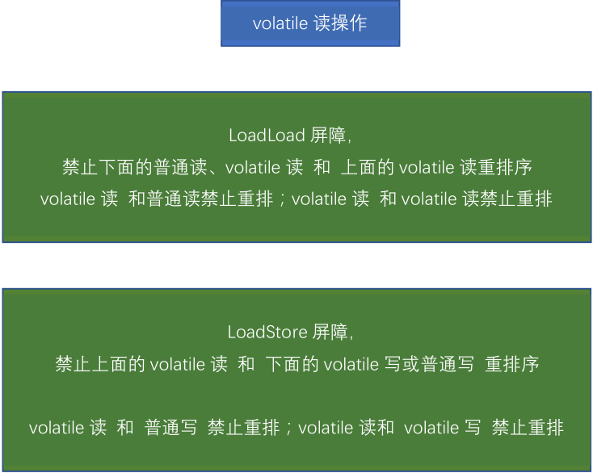

## volatile特性

1. 保证可见性

   保证不同线程对这个变量进行操作时的可见性，即变量一旦改变所有线程立即可见。

   volatile变量的读写过程：

   read(读取)→load(加载)→use(使用)→assign(赋值)→store(存储)→write(写入)→lock(锁定)→unlock(解锁)

   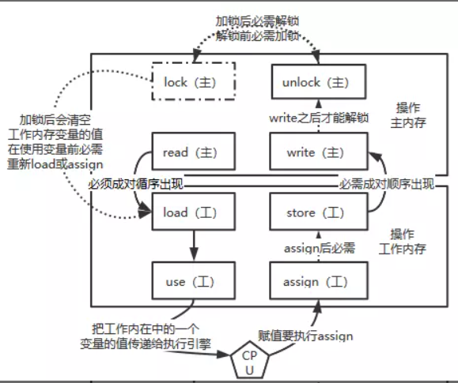

   1. read: 作用于主内存，将变量的值从主内存传输到工作内存，主内存到工作内存。
   2. load: 作用于工作内存，将read从主内存传输的变量值放入工作内存变量副本中，即数据加载。
   3. use: 作用于工作内存，将工作内存变量副本的值传递给执行引擎，每当JVM遇到需要该变量的字节码指令时会执行该操作
   4. assign: 作用于工作内存，将从执行引擎接收到的值赋值给工作内存变量，每当JVM遇到一个给变量赋值字节码指令时会执行该操作。
   5. store: 作用于工作内存，将赋值完毕的工作变量的值写回给主内存
   6. write: 作用于主内存，将store传输过来的变量值赋值给主内存中的变量
      由于上述只能保证单条指令的原子性，针对多条指令的组合性原子保证，没有大面积加锁，所以，JVM提供了另外两个原子指令：
   7. lock: 作用于主内存，将一个变量标记为一个线程独占的状态，只是写时候加锁，就只是锁了写变量的过程。
   8. unlock: 作用于主内存，把一个处于锁定状态的变量释放，然后才能被其他线程占用

2. 没有原子性

   volatile变量的复合操作(如i++)不具有原子性。

   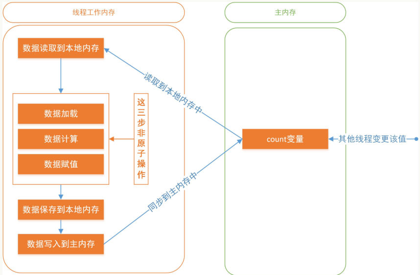

   多线程环境下，"数据计算"和"数据赋值"操作可能多次出现，即操作非原子。若数据在加载之后，主内存count变量发生修改之后，由于线程工作内存中的值在此前已经加载，从而不会对变更操作做出相应变化，即私有内存和公共内存中变量不同步，进而导致数据不一致

   对于volatile变量，JVM只是保证从主内存加载到线程工作内存的值是最新的，也就是数据加载时是最新的。由此可见volatile解决的是变量读时的可见性问题，但无法保证原子性，对于多线程修改共享变量的场景必须使用加锁同步。

3. 指令禁止重排序

   volatile的底层实现是通过内存屏障实现的。

## 使用volatile

- 状态标志，判断业务是否结束

  ```java
  /**
   * 使用：作为一个布尔状态标志，用于指示发生了一个重要的一次性事件，例如完成初始化或任务结束
   * 理由：状态标志并不依赖于程序内任何其他状态，且通常只有一种状态转换
   * 例子：判断业务是否结束
   */
  public class VolatileDemo {
      private volatile static boolean flag = true;
  
      public static void main(String[] args) {
          new Thread(() -> {
              while (flag) {
                  //do something......
              }
          }, "t1").start();
  
          //暂停几秒钟线程
          try {
              TimeUnit.SECONDS.sleep(2L);
          } catch (InterruptedException e) {
              e.printStackTrace();
          }
  
          new Thread(() -> {
              flag = false;
          }, "t2").start();
      }
  }
  ```

- 开销较低的读，写锁策略

  ```java
  /**
   * 使用：当读远多于写，结合使用内部锁和 volatile 变量来减少同步的开销
   * 理由：利用volatile保证读取操作的可见性；利用synchronized保证复合操作的原子性
   */
  public class VolatileLock {
      private volatile int value;
  
      public int getValue() {
          return value;   //利用volatile保证读取操作的可见性
      }
  
      public synchronized int increment() {
          return value++; //利用synchronized保证复合操作的原子性
      }
  }
  ```

- DCL双端锁

  ```java
  public class SafeDoubleCheckSingleton {
      //通过volatile声明，实现线程安全的延迟初始化。
      private volatile static SafeDoubleCheckSingleton singleton;
  
      //私有化构造方法
      private SafeDoubleCheckSingleton() {
      }
  
      //双重锁设计
      public static SafeDoubleCheckSingleton getInstance() {
          if (singleton == null) {
              //1.多线程并发创建对象时，会通过加锁保证只有一个线程能创建对象
              synchronized (SafeDoubleCheckSingleton.class) {
                  if (singleton == null) {
                      //隐患：多线程环境下，由于重排序，该对象可能还未完成初始化就被其他线程读取
                      //原理:利用volatile，禁止 "初始化对象" 和 "设置singleton指向内存空间"的指令重排序
                      singleton = new SafeDoubleCheckSingleton();
                  }
              }
          }
          //2.对象创建完毕，执行getInstance()将不需要获取锁，直接返回创建对象
          return singleton;
      }
  }
  ```

  隐患：多线程环境下，在"问题代码处"，会执行如下操作，由于重排序导致2,3乱序，后果就是其他线程得到的是null而不是完成初始化的对象。

  

  问题排序：

  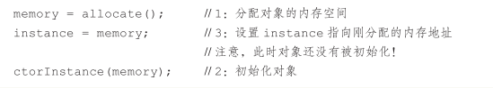

字节码层面会生成ACC_VOLATILE，JVM会按照JMM要求，在适当位置生成内存屏障。

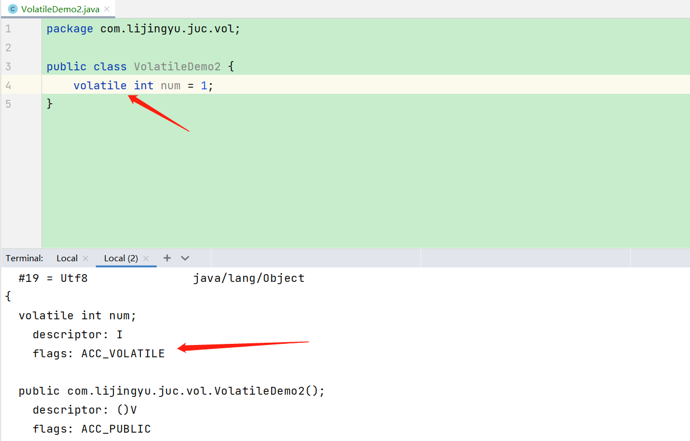
