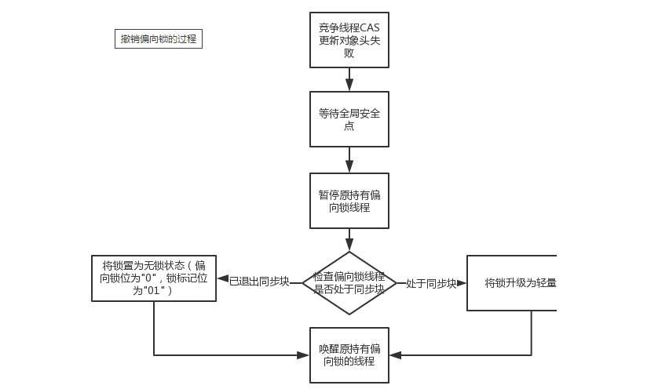

# 一、Synchronized与锁升级

## 为什么每一个对象都可以成为一个锁


Monitor可以理解为一种同步工具，也可理解为一种同步机制，常常被描述为一个Java对象。

Java对象是天生的Monitor，每一个Java对象都有成为Monitor的潜质，因为在Java的设计中 ，每一个Java对象都带了一把看不见的锁，它叫做内部锁或者Monitor锁。

Monitor的本质是依赖于底层操作系统的Mutex Lock实现，操作系统实现线程之间的切换需要从用户态到内核态的转换，成本非常高。

- Mutex Lock 

  Monitor是在jvm底层实现的，底层代码是c++。本质是依赖于底层操作系统的Mutex Lock实现，操作系统实现线程之间的切换需要从用户态到内核态的转换，状态转换需要耗费很多的系统资源，时间成本非常高。所以synchronized是Java语言中的一个重量级操作。 

- Monitor与java对象以及线程是如何关联

  1. 如果一个java对象被某个线程锁住，则该java对象的Mark Word字段中LockWord指向monitor的起始地址
  2. Monitor的Owner字段会存放拥有相关联对象锁的线程id

- Mutex Lock 的切换需要从用户态转换到核心态中，因此状态转换需要耗费很多的处理器时间。


## synchronized锁种类及升级步骤

- 多线程访问的三种情况
  1. 只有一个线程来访问，有且唯一Only One
  2. 有2个线程A、B来交替访问
  3. 竞争激烈，多个线程来访问

synchronized用的锁是存在Java对象头里的Mark Word中，锁升级功能主要依赖MarkWord中锁标志位和释放偏向锁标志位。

- 升级过程

  

  synchronized锁：由对象头中的Mark Word根据锁标志位的不同而被复用及锁升级策略

- 无锁

  不加锁

- 偏向锁

  多线程的情况下，锁不仅不存在多线程竞争，还存在锁由同一线程多次获得的情况，偏向锁就是在这种情况下出现的，它的出现是为了解决只有在一个线程执行同步时提高性能。

  当一段同步代码一直被同一个线程多次访问，由于只有一个线程那么该线程在后续访问时便会自动获得锁。

  理论落地：

  - 在实际应用运行过程中发现，“锁总是同一个线程持有，很少发生竞争”，也就是说锁总是被第一个占用他的线程拥有，这个线程就是锁的偏向线程。那么只需要在锁第一次被拥有的时候，记录下偏向线程ID。这样偏向线程就一直持有着锁。

    后续这个线程进入和退出这段加了同步锁的代码块时，不需要再次加锁和释放锁。而是直接比较对象头里面是否存储了指向当前线程的偏向锁。

  - 如果相等表示偏向锁是偏向于当前线程的，就不需要再尝试获得锁了，直到竞争发生才释放锁。以后每次同步，检查锁的偏向线程ID与当前线程ID是否一致，如果一致直接进入同步。无需每次加锁解锁都去CAS更新对象头。如果自始至终使用锁的线程只有一个，很明显偏向锁几乎没有额外开销，性能极高。

  - 假如不一致意味着发生了竞争，锁已经不是总是偏向于同一个线程了，这时候可能需要升级变为轻量级锁，才能保证线程间公平竞争锁。偏向锁只有遇到其他线程尝试竞争偏向锁时，持有偏向锁的线程才会释放锁，线程是不会主动释放偏向锁的。

  技术实现：

  - 一个synchronized方法被一个线程抢到了锁时，那这个方法所在的对象就会在其所在的Mark Word中将偏向锁修改状态位，同时还会占用前54位来存储线程指针作为标识，通过CAS方式修改markword中的线程ID。若该线程再次访问同一个synchronized方法时，该线程只需去对象头的Mark Word 中去判断一下是否有偏向锁指向本身的ID，无需再进入 Monitor 去竞争对象了。

  

  偏向锁的撤销：

  偏向锁使用一种等到竞争出现才释放锁的机制，只有当其他线程竞争锁时，持有偏向锁的原来线程才会被撤销。撤销需要等待全局安全点(该时间点上没有字节码正在执行)，同时检查持有偏向锁的线程是否还在执行

  1. 第一个线程正在执行synchronized方法(处于同步块)，它还没有执行完，其它线程来抢夺，该偏向锁会被取消掉并出现锁升级。此时轻量级锁由原持有偏向锁的线程持有，继续执行其同步代码，而正在竞争的线程会进入自旋等待获得该轻量级锁。

  2. 第一个线程执行完成synchronized方法(退出同步块)，则将对象头设置成无锁状态并撤销偏向锁，重新偏向 。

     

- 轻量级锁

  轻量级锁是为了在线程近乎交替执行同步块时提高性能。

  主要目的：在没有多线程竞争的前提下，通过CAS减少重量级锁使用操作系统互斥量产生的性能消耗，说白了先自旋再阻塞。

  升级时机：当关闭偏向锁功能或多线程竞争偏向锁会导致偏向锁升级为轻量级锁

  假如线程A已经拿到锁，这时线程B又来抢该对象的锁，由于该对象的锁已经被线程A拿到，当前该锁已是偏向锁了。而线程B在争抢时发现对象头Mark Word中的线程ID不是线程B自己的线程ID(而是线程A)，那线程B就会进行CAS操作希望能获得锁。

  此时线程B操作中有两种情况：

  1. 如果锁获取成功，直接替换Mark Word中的线程ID为B自己的ID(A → B)，重新偏向于其他线程(即将偏向锁交给其他线程，相当于当前线程"被"释放了锁)，该锁会保持偏向锁状态，A线程Over，B线程上位。
  2. 如果锁获取失败，则偏向锁升级为轻量级锁，此时轻量级锁由原持有偏向锁的线程持有，继续执行其同步代码，而正在竞争的线程B会进入自旋等待获得该轻量级锁。

  

  注意：jdk8之后自旋的次数和程度是jvm控制，自适应的。根据同一个锁上一次自旋的时间以及拥有锁线程的状态来决定。轻量级锁每次退出同步块都需要释放锁，而偏向锁是在竞争发生时才释放锁。

- 重量级锁

  有大量的线程参与锁的竞争，冲突性很高。

## 锁的优缺点对比


synchronized锁升级过程总结：一句话，就是先自旋，不行再阻塞。实际上是把之前的悲观锁(重量级锁)变成在一定条件下使用偏向锁以及使用轻量级(自旋锁CAS)的形式。

synchronized修饰方法和代码块在字节码上实现方式有很大差异，但是内部实现还是基于对象头的MarkWord来实现的。JDK1.6之前synchronized使用的是重量级锁，JDK1.6之后进行了优化，拥有了无锁->偏向锁->轻量级锁->重量级锁的升级过程，而不是无论什么情况都使用重量级锁。

- 偏向锁：适用于单线程的情况，在不存在锁竞争的时候进入同步方法/代码块则使用偏向锁。
- 轻量级锁：适用于竞争不激烈的情况(这和乐观锁的使用范围类似)， 存在竞争时升级为轻量级锁，轻量级锁采用的是自旋锁，如果同步方法/代码块执行时间很短的话，采用轻量级锁虽然会占用cpu资源但是相对比使用重量级锁还是更高效。
- 重量级锁：适用于竞争激烈的情况，如果同步方法/代码块执行时间很长，那么使用轻量级锁自旋带来的性能消耗就比使用重量级锁更严重，这时候就需要升级为重量级锁。

## JIT编译器对锁的优化

- 锁消除

  从JIT角度看相当于无视它，synchronized (o)不存在了，这个锁对象并没有被共用扩散到其它线程使用，极端的说就是根本没有加这个锁对象的底层机器码，消除了锁的使用。

  ```java
  public void m1() {
      //锁消除,JIT会无视它，synchronized(对象锁)不存在了。不正常的
      Object o = new Object();
      synchronized (o) {
          System.out.println("-----hello LockClearUPDemo" + "\t" + o.hashCode() + "\t" + objectLock.hashCode());
      }
  }
  ```

- 锁粗化

  假如方法中首尾相接，前后相邻的都是同一个锁对象，那JIT编译器就会把这几个synchronized块合并成一个大块，加粗加大范围，一次申请锁使用即可，避免次次的申请和释放锁，提升了性能。

  ```java
  public class LockBigDemo {
      static Object objectLock = new Object();
      public static void main(String[] args) {
          new Thread(() -> {
              //会合并为一个锁
              synchronized (objectLock) {
                  System.out.println("11111");
              }
              synchronized (objectLock) {
                  System.out.println("22222");
              }
              synchronized (objectLock) {
                  System.out.println("33333");
              }
          }, "a").start();
      }
  }
  ```

# 二、AbstractQueuedSynchronizer之AQS

是用来构建锁或者其它同步器组件的重量级基础框架及整个JUC体系的基石，通过内置的FIFO队列来完成资源获取线程的排队工作，并通过一个int类型变量表示持有锁的状态。

- 作用：

  抢到资源的线程直接使用处理业务，抢不到资源的必然涉及一种排队等候机制。抢占资源失败的线程继续去等待(类似银行业务办理窗口都满了，暂时没有受理窗口的顾客只能去候客区排队等候)，但等候线程仍然保留获取锁的可能且获取锁流程仍在继续(候客区的顾客也在等着叫号，轮到了再去受理窗口办理业务)。

  既然说到了排队等候机制，那么就一定会有某种队列形成，这样的队列是什么数据结构呢？

  如果共享资源被占用，就需要一定的阻塞等待唤醒机制来保证锁分配。这个机制主要用的是CLH队列的变体实现的，将暂时获取不到锁的线程加入到队列中，这个队列就是AQS的抽象表现。它将请求共享资源的线程封装成队列的结点（Node），通过CAS、自旋以及LockSupport.park()的方式，维护state变量的状态，使并发达到同步的效果。


## AQS内部体系结构

- AQS使用一个volatile的int类型的成员变量来表示同步状态，通过内置的FIFO队列来完成资源获取的排队工作将每条要去抢占资源的线程封装成一个Node节点来实现锁的分配，通过CAS完成对State值的修改。

  

- AQS体系结构

  

  1. AQS的同步状态State成员变量

     ```java
     private volatile int state;
     ```

     state=0代表当前没有线程占有锁，state>0代表已经被其他线程持有锁。volatile修饰，可以保证线程间的可见性。

  2. NodeCLH队列

     ```java
     //内部类
     static final class Node;
     //链表头
     private transient volatile Node head;
     //链表尾
     private transient volatile Node tail;
     ```

- 内部类Node

  ```java
  //共享节点
  static final Node SHARED = new Node();
  //排他节点
  static final Node EXCLUSIVE = null;
  //线程被取消执行
  static final int CANCELLED =  1;
  //后继线程需要被唤醒
  static final int SIGNAL    = -1;
  //等待condition唤醒
  static final int CONDITION = -2;
  //共享式同步状态的获取会无条件向下传递
  static final int PROPAGATE = -3;
  //当前node的状态，初始为0，代表以上那几种之一
  volatile int waitStatus;
  //前置节点
  volatile Node prev;
  //后置节点
  volatile Node next;
  //持有的线程
  volatile Thread thread;
  ```

  

- 链表结构图

  

## 从ReentrantLock解读AQS源码

1. 执行lock()方法时，实际调用的是Sync的lock()

   

   Sync有两个实现类，公平锁、非公平锁

   公平锁：公平锁讲究先来先到，线程在获取锁时，如果这个锁的等待队列中已经有线程在等待，那么当前线程就会进入等待队列中。

   非公平锁：不管是否有等待队列，如果可以获取锁，则立刻占有锁对象。也就是说队列的第一个排队线程在unpark()，之后还是需要竞争锁（存在线程竞争的情况下）。

   ```java
   final void lock() {
       //非公平锁会首先尝试让自己获得锁，锁定成功直接将排他线程设置为自己，直接返回
       if (compareAndSetState(0, 1))
           setExclusiveOwnerThread(Thread.currentThread());
       else
           //公平锁会省略上一步，直接执行acquire
           acquire(1);
   }
   ```

2. 执行tryAcquire

   公平锁和非公平锁的区别是公平锁有一个获得队列的操作

   

3. compareAndSetState

   ```java
   private volatile int state;
   public final void acquire(int arg) {
   if (!tryAcquire(arg) && acquireQueued(addWaiter(Node.EXCLUSIVE), arg))
       selfInterrupt();
   }
   ```

   首先获取到当前AQS状态state，初始值为0，如果当前是0，代表此前没有线程抢到锁，当前线程将状态字段state设置为1，排他线程设置为自己。成功拿到锁。

   如果state ！= 0，并且当前线程也不是设定的排他线程，返回false。

   

4. addWaiter

   ```java
   private Node addWaiter(Node mode) {
       //当前线程存储到Node节点中
           Node node = new Node(Thread.currentThread(), mode);
           // Try the fast path of enq; backup to full enq on failure
           Node pred = tail; //缓存链表的尾
           if (pred != null) { //第一次争抢时，tail默认为null
               node.prev = pred;//如果不为null，当前新new的节点的前置节点设置为之前的尾节点
               if (compareAndSetTail(pred, node)) {//将尾节点设置为当前节点
                   pred.next = node;//上一个尾节点的后置节点设置为当前节点
                   return node; //返回当前节点
               }
           }
           enq(node);//如果是第一次，还没有尾节点，将当前节点放到队列尾
           return node;//返回当前节点
       }
   
   private Node enq(final Node node) {
           for (;;) {//cas
               Node t = tail;
               if (t == null) { // Must initialize
                   if (compareAndSetHead(new Node())) //new一个空的节点作为哨兵节点，作为头节点
                       tail = head;//尾节点=头节点
               } else {
                   node.prev = t;//有了哨兵节点之后，就会走到这里，将哨兵节点设置为头节点，当前线程作为尾节点
                   if (compareAndSetTail(t, node)) {
                       t.next = node;
                       return t;
                   }
               }
           }
       }
   ```

5. acquireQueued

   ```java
   final boolean acquireQueued(final Node node, int arg) {
           boolean failed = true;
           try {
               boolean interrupted = false;//是否被中断
               for (;;) {
                   final Node p = node.predecessor();//获取当前线程的前置节点
                   if (p == head && tryAcquire(arg)) {//如果前置节点是head，并且获取到锁
                       setHead(node);//将当前节点设置为头节点，并且缓存的thread引用设置为null
                       p.next = null; // help GC
                       failed = false;
                       return interrupted;//当前线程抢到锁，执行任务
                   }
                   if (shouldParkAfterFailedAcquire(p, node) &&
                       parkAndCheckInterrupt()) //判断是否应该停下来等待锁
                       interrupted = true;
               }
           } finally {
               if (failed)
                   cancelAcquire(node);
           }
       }
   ```

   ```java
   private void setHead(Node node) {
           head = node;
           node.thread = null;
           node.prev = null;
       }
   ```

6. shouldParkAfterFailedAcquire 是否应该停下来等待锁

   ```java
   private static boolean shouldParkAfterFailedAcquire(Node pred, Node node) {
           int ws = pred.waitStatus;//初始为0
           if (ws == Node.SIGNAL) //如果前置节点的状态为-1，代表应该park等待锁
               /*
                * This node has already set status asking a release
                * to signal it, so it can safely park.
                */
               return true;
           if (ws > 0) { //如果前置节点状态 > 0，代表前置节点被取消执行了，需要重新设置链表的前后置关系
               /*
                * Predecessor was cancelled. Skip over predecessors and
                * indicate retry.
                */
               do {
                   node.prev = pred = pred.prev;
               } while (pred.waitStatus > 0);
               pred.next = node;
           } else {
               /*
                * waitStatus must be 0 or PROPAGATE.  Indicate that we
                * need a signal, but don't park yet.  Caller will need to
                * retry to make sure it cannot acquire before parking.
                */
               compareAndSetWaitStatus(pred, ws, Node.SIGNAL);//将前置节点状态设置为-1，代表当前节点应该park
           }
           return false;
       }
   ```

7. parkAndCheckInterrupt

   ```java
   private final boolean parkAndCheckInterrupt() {
           LockSupport.park(this);//暂停当前线程，等待锁
           return Thread.interrupted();
       }
   ```


unlock释放锁

# 三、ReentrantLock、ReentrantReadWriteLock、StampedLock讲解

## ReentrantReadWriteLock

读写锁定义为：

- 一个资源能够被多个读线程访问，或者被一个写线程访问，但是不能同时存在读写线程。
- 读写锁ReentrantReadWriteLock并不是真正意义上的读写分离，它只允许读读共存，而读写和写写依然是互斥的，大多实际场景是“读/读”线程间并不存在互斥关系，只有"读/写"线程或"写/写"线程间的操作需要互斥的。因此引入ReentrantReadWriteLock。
- 一个ReentrantReadWriteLock同时只能存在一个写锁但是可以存在多个读锁，但不能同时存在写锁和读锁。也即一个资源可以被多个读操作访问或一个写操作访问，但两者不能同时进行。
- 只有在读多写少情境之下，读写锁才具有较高的性能体现。

特点：

- 可重入

- 读写分离

- 锁降级

  从写锁→读锁，ReentrantReadWriteLock可以降级。

  遵循获取写锁、获取读锁再释放写锁的次序，写锁能够降级为读锁。

  在ReentrantReadWriteLock中，当读锁被使用时，如果有线程尝试获取写锁，该写线程会被阻塞。所以，需要释放所有读锁，才可获取写锁。

  

  锁降级是为了让当前线程感知到数据的变化，因为加了读锁，其他写数据的线程就不能工作，当前写入的数据为最新数据，目的是保证数据可见性。

  线程获取读锁是不能直接升级为写入锁的。

  ```java
  public class LockDownGradingDemo {
      public static void main(String[] args) {
          ReentrantReadWriteLock readWriteLock = new ReentrantReadWriteLock();
          ReentrantReadWriteLock.ReadLock readLock = readWriteLock.readLock();
          ReentrantReadWriteLock.WriteLock writeLock = readWriteLock.writeLock();
          writeLock.lock();
          System.out.println("-------正在写入");
          readLock.lock();
          System.out.println("-------正在读取");
          writeLock.unlock();
      }
  }
  ```

  
