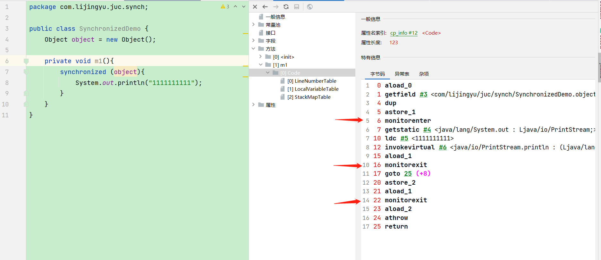
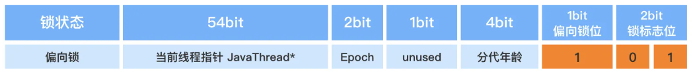
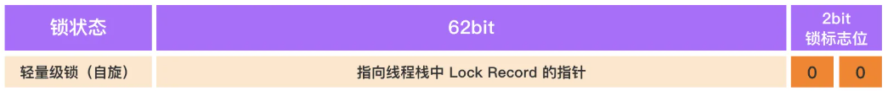

# synchronized底层原理

Synchronized同步方法可以支持使用一种简单的策略来防止线程干扰和内存一致性错误：如果一个对象对多个线程可见，则对该对象变量的所有读取或写入都是通过同步方法完成的。

简单说就是Synchronized的作用是Java中解决并发问题的一种最常用最简单的方法 ，他可以确保同一个时刻最多只有一个线程执行同步代码，从而保证多线程环境下并发安全的效果。 如果有一段代码被Synchronized修饰，那么这段代码就会以原子的方式执行，当多个线程在执行这段代码的时候，它们是互斥的，不会相互干扰，不会同时执行。

Synchronized工作机制是在多线程环境中使用一把锁，在第一个线程去执行的时候去获取这把锁才能执行，一旦获取就独占这把锁直到执行完毕或者在一定条件下才会去释放这把锁，在这把锁释放之前其他的线程只能阻塞等待。

## Synchronized的使用以及原理

Synchronized的锁是基于对象实现的，Synchronized的使用一般就是同步方法和同步代码块。

- 同步代码块

  

  在需要同步的代码块上，用synchronized进行加锁，锁的可以是对象也可以是当前类。在多线程情况下，线程执行到同步代码块时，就会保证同步、线程安全。

  通过Javap -v class或者使用jclass lib 插件翻译字节码指令可以看到，在m1方法的实现上，添加了monitorenter和monitorexit指令，其中monitorenter代表进入锁定，monitorexit代表退出锁定。

  正常情况下，一个monitorenter对应两个monitorexit，一个为正常情况下的退出，另一个为程序发生异常时的退出。如果程序里手动抛出异常，则只会对应一个monitorexit，不过一般也不会这么写程序，即使抛出异常，也会在某些条件下抛出，那样的话，仍然是一个monitorenter对应两个monitorexit。

  

- 普通非static同步方法

  

  当对非static方法进行加锁时，此时使用的是当前对象做为锁（对象锁）。通过字节码可以看到，调用指令将会检查方法的ACC_SYNCHRONIZED访问标志是否被设置，如果设置了，执行线程会先持有monitor然后再执行方法，最后在方法完成(无论是正常完成还是非正常完成)时释放monitor。

- 静态static同步方法

  

  当对static方法加锁时，锁的是当前class，并且全局仅有一个class。在字节码层面，也会增加ACC_STATIC标记，用于标志区分该方法是否静态同步方法。

## 对象的内存布局

synchronized是基于对象实现的，先了解对象再内存中是如何存储的。

在HotSpot虚拟机里，对象在堆内存中的存储布局可以划分为三个部分：对象头(Header)、实例数据( Instance Data）和对齐填充（Padding)（保证8个字节的倍数）。


对象头分为对象标记Mark Word、和类元信息(又叫类型指针)，类元信息存储的是指向该对象类元数据（class）的首地址。

- 对象标记Mark Word

  

  

  默认存储对象的HashCode、分代年龄和锁标志位等信息。这些信息都是与对象自身定义无关的数据，所以MarkWord被设计成一个非固定的数据结构以便在极小的空间内存储尽量多的数据。

  它会根据对象的状态复用自己的存储空间，也就是说在运行期间MarkWord里存储的数据会随着锁标志位的变化而变化。

  对象布局、GC回收以及锁升级就是对象标记MarkWord里面标志位的变化。

  GC年龄采用4位bit存储，最大为15，例如MaxTenuringThreshold参数默认值就是15。

- 类元信息(类型指针)

  对象指向它的类元数据的指针，虚拟机通过这个指针来确定这个对象是哪个类的实例。

  对象头有多大？

  在64位系统中，不开启指针压缩的情况下，Mark Word占了8个字节，类型指针占了8个字节，一共是16个字节。开启指针压缩，类型指针会占4个字节。

  ```bash
  #开启指针压缩，默认是压缩的
  -XX:+UseCompressedClassPointers
  ```

- 实例数据

  存放类的属性(Field)数据信息，包括父类的属性信息，如果是数组的实例，还包括数组的长度，这部分内存按4字节对齐。

- 对齐填充

  虚拟机要求对象起始地址必须是8字节的整数倍。填充数据不是必须存在的，仅仅是为了字节对齐。

  这部分内存按8字节补充对齐。

## Synchronized的优化

**锁消除**：在synchronized修饰的代码中，如果不存在操作临界资源的情况，会触发锁消除，你即便写了synchronized，他也不会触发。

```java
public synchronized void method(){
    // 没有操作临界资源
    // 此时这个方法的synchronized你可以认为木有~~
}
```

**锁膨胀**：如果在一个循环中，频繁的获取和释放做资源，这样带来的消耗很大，锁膨胀就是将锁的范围扩大，避免频繁的竞争和获取锁资源带来不必要的消耗。

```java
public void method(){
    for(int i = 0;i < 999999;i++){
        synchronized(对象){

        }
    }
    // 这是上面的代码会触发锁膨胀
    synchronized(对象){
        for(int i = 0;i < 999999;i++){

        }
    }
}
```

**锁升级**：ReentrantLock的实现，是先基于乐观锁的CAS尝试获取锁资源，如果拿不到锁资源，才会挂起线程。synchronized在JDK1.6之前，完全就是获取不到锁，立即挂起当前线程，所以synchronized性能比较差。

synchronized就在JDK1.6做了锁升级的优化

* **无锁、匿名偏向**：当前对象没有作为锁存在。
* **偏向锁**：如果当前锁资源，只有一个线程在频繁的获取和释放，那么这个线程过来，只需要判断，当前指向的线程是否是当前线程 。
  * 如果是，直接拿着锁资源走。
  * 如果当前线程不是我，基于CAS的方式，尝试将偏向锁指向当前线程。如果获取不到，触发锁升级，升级为轻量级锁。（偏向锁状态出现了锁竞争的情况）
* **轻量级锁**：会采用自旋锁的方式去频繁的以CAS的形式获取锁资源（采用的是**自适应自旋锁**）
  * 如果成功获取到，拿着锁资源走
  * 如果自旋了一定次数，没拿到锁资源，锁升级。
* **重量级锁**：就是最传统的synchronized方式，拿不到锁资源，就挂起当前线程。（用户态&内核态）

## Synchronized锁种类及升级步骤

- 多线程访问的三种情况
  1. 只有一个线程来访问，有且唯一Only One
  2. 有2个线程A、B来交替访问
  3. 竞争激烈，多个线程来访问

synchronized用的锁是存在Java对象头里的Mark Word中，锁升级功能主要依赖MarkWord中锁标志位和释放偏向锁标志位。

- 升级过程

  

  synchronized锁：由对象头中的Mark Word根据锁标志位的不同而被复用及锁升级策略

- **无锁**

  不加锁

- **偏向锁**

  多线程的情况下，锁不仅不存在多线程竞争，还存在锁由同一线程多次获得的情况，偏向锁就是在这种情况下出现的，它的出现是为了解决只有在一个线程执行同步时提高性能。

  当一段同步代码一直被同一个线程多次访问，由于只有一个线程那么该线程在后续访问时便会自动获得锁。

  理论落地：

  - 在实际应用运行过程中发现，“锁总是同一个线程持有，很少发生竞争”，也就是说锁总是被第一个占用他的线程拥有，这个线程就是锁的偏向线程。那么只需要在锁第一次被拥有的时候，记录下偏向线程ID。这样偏向线程就一直持有着锁。

    后续这个线程进入和退出这段加了同步锁的代码块时，不需要再次加锁和释放锁。而是直接比较对象头里面是否存储了指向当前线程的偏向锁。

  - 如果相等表示偏向锁是偏向于当前线程的，就不需要再尝试获得锁了，直到竞争发生才释放锁。以后每次同步，检查锁的偏向线程ID与当前线程ID是否一致，如果一致直接进入同步。无需每次加锁解锁都去CAS更新对象头。如果自始至终使用锁的线程只有一个，很明显偏向锁几乎没有额外开销，性能极高。

  - 假如不一致意味着发生了竞争，锁已经不是总是偏向于同一个线程了，这时候可能需要升级变为轻量级锁，才能保证线程间公平竞争锁。偏向锁只有遇到其他线程尝试竞争偏向锁时，持有偏向锁的线程才会释放锁，线程是不会主动释放偏向锁的。

  技术实现：

  - 一个synchronized方法被一个线程抢到了锁时，那这个方法所在的对象就会在其所在的Mark Word中将偏向锁修改状态位，同时还会占用前54位来存储线程指针作为标识，通过CAS方式修改markword中的线程ID。若该线程再次访问同一个synchronized方法时，该线程只需去对象头的Mark Word 中去判断一下是否有偏向锁指向本身的ID，无需再进入 Monitor 去竞争对象了。

  

  偏向锁的撤销：

  偏向锁使用一种等到竞争出现才释放锁的机制，只有当其他线程竞争锁时，持有偏向锁的原来线程才会被撤销。撤销需要等待全局安全点(该时间点上没有字节码正在执行)，同时检查持有偏向锁的线程是否还在执行

  1. 第一个线程正在执行synchronized方法(处于同步块)，它还没有执行完，其它线程来抢夺，该偏向锁会被取消掉并出现锁升级。此时轻量级锁由原持有偏向锁的线程持有，继续执行其同步代码，而正在竞争的线程会进入自旋等待获得该轻量级锁。

  2. 第一个线程执行完成synchronized方法(退出同步块)，则将对象头设置成无锁状态并撤销偏向锁，重新偏向 。

     

- **轻量级锁**

  轻量级锁是为了在线程近乎交替执行同步块时提高性能。

  主要目的：在没有多线程竞争的前提下，通过CAS减少重量级锁使用操作系统互斥量产生的性能消耗，说白了先自旋再阻塞。

  升级时机：当关闭偏向锁功能或多线程竞争偏向锁会导致偏向锁升级为轻量级锁

  假如线程A已经拿到锁，这时线程B又来抢该对象的锁，由于该对象的锁已经被线程A拿到，当前该锁已是偏向锁了。而线程B在争抢时发现对象头Mark Word中的线程ID不是线程B自己的线程ID(而是线程A)，那线程B就会进行CAS操作希望能获得锁。

  此时线程B操作中有两种情况：

  1. 如果锁获取成功，直接替换Mark Word中的线程ID为B自己的ID(A → B)，重新偏向于其他线程(即将偏向锁交给其他线程，相当于当前线程"被"释放了锁)，该锁会保持偏向锁状态，A线程Over，B线程上位。
  2. 如果锁获取失败，则偏向锁升级为轻量级锁，此时轻量级锁由原持有偏向锁的线程持有，继续执行其同步代码，而正在竞争的线程B会进入自旋等待获得该轻量级锁。

  

  注意：jdk8之后自旋的次数和程度是jvm控制，自适应的。根据同一个锁上一次自旋的时间以及拥有锁线程的状态来决定。轻量级锁每次退出同步块都需要释放锁，而偏向锁是在竞争发生时才释放锁。

- **重量级锁**

  轻量级锁CAS一段次数后，没有拿到锁资源，升级为重量级锁（其实CAS操作是在重量级锁时执行的）。重量级锁就是线程拿不到锁，就挂起。

## JIT编译器对锁的优化

- 锁消除

  从JIT角度看相当于无视它，synchronized (o)不存在了，这个锁对象并没有被共用扩散到其它线程使用，极端的说就是根本没有加这个锁对象的底层机器码，消除了锁的使用。

  ```java
  public void m1() {
      //锁消除,JIT会无视它，synchronized(对象锁)不存在了。不正常的
      Object o = new Object();
      synchronized (o) {
          System.out.println("-----hello LockClearUPDemo" + "\t" + o.hashCode() + "\t" + objectLock.hashCode());
      }
  }
  ```

- 锁粗化

  假如方法中首尾相接，前后相邻的都是同一个锁对象，那JIT编译器就会把这几个synchronized块合并成一个大块，加粗加大范围，一次申请锁使用即可，避免次次的申请和释放锁，提升了性能。

  ```java
  public class LockBigDemo {
      static Object objectLock = new Object();
      public static void main(String[] args) {
          new Thread(() -> {
              //会合并为一个锁
              synchronized (objectLock) {
                  System.out.println("11111");
              }
              synchronized (objectLock) {
                  System.out.println("22222");
              }
              synchronized (objectLock) {
                  System.out.println("33333");
              }
          }, "a").start();
      }
  }
  ```
