# 一、CAS

- compare and swap的缩写，中文翻译成比较并交换，实现并发算法时常用到的一种技术。它包含三个操作数：内存位置、预期原值及更新值。

- 执行CAS操作的时候，将内存位置的值与预期原值比较：

  - 如果相匹配，那么处理器会自动将该位置值更新为新值
  - 如果不匹配，处理器不做任何操作，多个线程同时执行CAS操作只有一个会成功。

  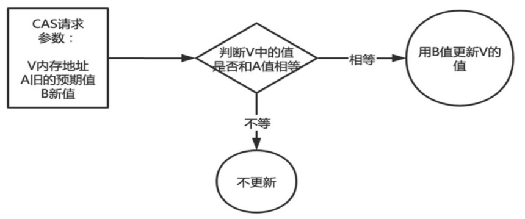

- CAS有3个操作数，位置内存值V，旧的预期值A，要修改的更新值B。当且仅当旧的预期值A和内存值V相同时，将内存值V修改为B，否则什么都不做或重来。

## 如何保证原子性

- 硬件级别保证

  CAS是一条CPU的原子指令（cmpxchg指令），不会造成所谓的数据不一致问题。

  原语的执行必须是连续的，在执行过程中不允许被中断。

  执行cmpxchg指令的时候，会判断当前系统是否为多核系统，如果是就给总线加锁，只有一个线程会对总线加锁成功，加锁成功之后会执行cas操作，也就是说CAS的原子性实际上是CPU实现的， 其实在这一点上还是有排他锁的，只是比起用synchronized， 这里的排他时间要短的多， 所以在多线程情况下性能会比较好。

- JDK实现

  底层是由Unsafe类提供的CAS方法（如compareAndSwapXXX）保证原子性。Unsafe底层实现也为CPU指令cmpxchg。

  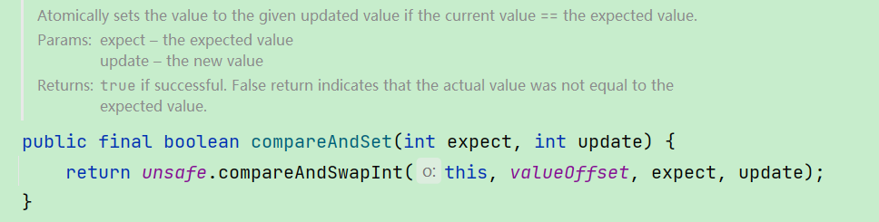

  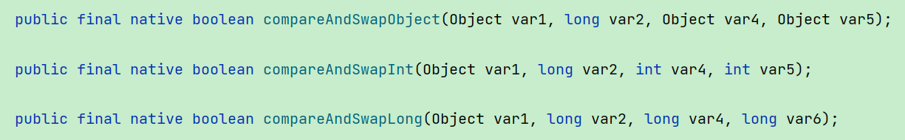

  ```
  var1：表示要操作的对象
  var2：表示要操作对象中属性地址的偏移量
  var4：表示需要修改数据的期望的值
  var5/var6：表示需要修改为的新值
  ```

## Unsafe

- CAS的核心类，由于Java方法无法直接访问底层系统，需要通过本地（native）方法来访问，Unsafe相当于一个后门，基于该类可以直接操作特定内存的数据。

- Unsafe类存在于sun.misc包中，其内部方法操作可以像C的指针一样直接操作内存，Java中CAS操作的执行依赖于Unsafe类的方法。

- Unsafe类中的所有方法都是native修饰的，也就是说Unsafe类中的方法都直接调用操作系统底层资源执行相应任务 。

  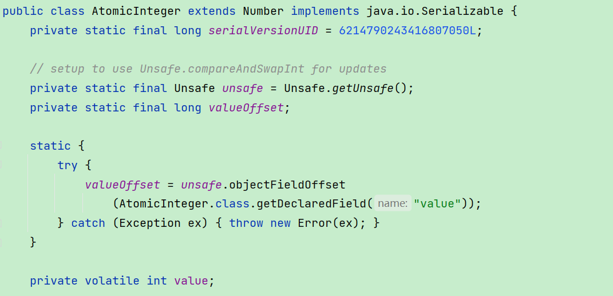

  valueOffset，表示该变量值在内存中的偏移地址。

  变量value用volatile修饰，保证了多线程之间的内存可见性。

- getAndIncrement

  通过valueOffset定位内存地址，直接操作内存地址。

  ```java
  public final int getAndIncrement() {
      return unsafe.getAndAddInt(this, valueOffset, 1);
  }
  ```

  AtomicInteger 类主要利用 CAS (compare and swap) + volatile 和 native 方法来保证原子操作，从而避免 synchronized 的高开销，执行效率大为提升。

## 自旋锁（spinlock）

是指尝试获取锁的线程不会立即阻塞，而是采用循环的方式去尝试获取锁，当线程发现锁被占用时，会不断循环判断锁的状态，直到获取。这样的好处是减少线程上下文切换的消耗，缺点是循环会消耗CPU。

## CAS缺点

- 循环时间长开销很大

  如果CAS失败，会一直进行尝试。如果CAS长时间一直不成功，可能会给CPU带来很大的开销。

- ABA问题

  CAS算法实现的一个重要前提是需要取出内存中某时刻的数据并在当下时刻比较并替换，那么在这个时间差内数据可能会发生变化。

  比如说一个线程one从内存位置V中取出A，这时候另一个线程two也从内存中取出A，并且线程two进行了一些操作将值变成了B，
  然后线程two又将V位置的数据变成A，这时候线程one进行CAS操作发现内存中仍然是A，然后线程one操作成功。尽管线程one的CAS操作成功，但是不代表这个过程就是没有问题的。

- 解决ABA问题

  版本号、时间戳

  ```java
  AtomicStampedReference atomicStampedReference = new AtomicStampedReference(100,1);
  int stamp = atomicStampedReference.getStamp();
  System.out.println(Thread.currentThread().getName()+"\t 首次版本号:"+stamp);//1
  //暂停一会儿线程，获得初始值100和初始版本号1，故意暂停3秒钟让t3线程完成一次ABA操作产生问题
  boolean result = atomicStampedReference.compareAndSet(100,2019,stamp,stamp+1);
  ```

# 二、原子操作类

## 基本类型原子类

AtomicInteger、AtomicBoolean、AtomicLong

```java
public final int get() //获取当前的值
public final int getAndSet(int newValue)//获取当前的值，并设置新的值
public final int getAndIncrement()//获取当前的值，并自增
public final int getAndDecrement() //获取当前的值，并自减
public final int getAndAdd(int delta) //获取当前的值，并加上预期的值
boolean compareAndSet(int expect, int update) //如果输入的数值等于预期值，则以原子方式将该值设置为输入值（update）
```

## 数组类型原子类

AtomicIntegerArray、AtomicLongArray、AtomicReferenceArray

```java
AtomicIntegerArray atomicIntegerArray = new AtomicIntegerArray(5);
for (int i = 0; i < 5; i++) {
    int andDecrement = atomicIntegerArray.getAndDecrement(i);
    atomicIntegerArray.getAndSet(i, 200);
}
```

相当于将类似AtomicInteger的基本类型原子类封装进一个数组之中。

## 引用类型原子类

1. AtomicReference

   ```java
   public static void main(String[] args) {
       AtomicReference<Student> atomicReference = new AtomicReference<>();
       Student student1 = new Student();
       Student student2 = new Student();
       atomicReference.getAndSet(student1);
       atomicReference.compareAndSet(student1, student2);
   }
   //可以用来实现自旋锁
   public class SpinLockDemo {
   
       AtomicReference<Thread> atomicReference = new AtomicReference<>();
   
       public static void main(String[] args) {
           SpinLockDemo spinLockDemo = new SpinLockDemo();
           final int[] i = {0};
           for (int j = 0; j < 100; j++) {
               new Thread(() -> {
                   spinLockDemo.lock();
                   i[0] = i[0] + 1;
                   spinLockDemo.unLock();
               }, "thread-" + j).start();
           }
           try {
               TimeUnit.SECONDS.sleep(2);
           } catch (InterruptedException e) {
               e.printStackTrace();
           }
           System.out.println(i[0]);
       }
   
       public void lock() {
           Thread thread = Thread.currentThread();
           while (!atomicReference.compareAndSet(null, thread)) {
   
           }
           System.out.println(thread.getName() + "get lock");
       }
   
       public void unLock() {
           Thread thread = Thread.currentThread();
           atomicReference.compareAndSet(thread, null);
           System.out.println(thread.getName() + "del lock");
       }
   }
   ```

2. AtomicStampedReference

   携带版本号的引用类型原子类，可以解决ABA问题。

   AtomicStampedReference(初始引用,初始版本号)，后续在compareAndSet更新值的时候，需要先获取到stamp邮戳版本号，然后在执行数据compareAndSet时，将版本号传进去，如果版本号匹配，则返回true，更新成功。

   ```java
   public class ABADemo {
       static AtomicStampedReference atomicStampedReference = new AtomicStampedReference(100, 1);
   
       public static void main(String[] args) {
           abaResolve();
       }
   
       public static void abaResolve() {
           new Thread(() -> {
               int stamp = atomicStampedReference.getStamp();
               System.out.println("t3 ----第1次stamp  " + stamp);
               try {
                   TimeUnit.SECONDS.sleep(1);
               } catch (InterruptedException e) {
                   e.printStackTrace();
               }
               atomicStampedReference.compareAndSet(100, 101, stamp, stamp + 1);
               System.out.println("t3 ----第2次stamp  " + atomicStampedReference.getStamp());
               atomicStampedReference.compareAndSet(101, 100, atomicStampedReference.getStamp(), atomicStampedReference.getStamp() + 1);
               System.out.println("t3 ----第3次stamp  " + atomicStampedReference.getStamp());
           }, "t3").start();
   
           new Thread(() -> {
               int stamp = atomicStampedReference.getStamp();
               System.out.println("t4 ----第1次stamp  " + stamp);
               //暂停几秒钟线程
               try {
                   TimeUnit.SECONDS.sleep(3);
               } catch (InterruptedException e) {
                   e.printStackTrace();
               }
               boolean result = atomicStampedReference.compareAndSet(100, 20210308, stamp, stamp + 1);
               System.out.println(Thread.currentThread().getName() + "\t" + result + "\t" + atomicStampedReference.getReference());
           }, "t4").start();
       }
   }
   ```

3. AtomicMarkableReference

   原子更新带有标记位的引用类型对象，判断是否修改过，将状态戳简化为true|false，因为只一种改变状态，所以只适用于一次性的。推荐使用AtomicStampedReference。

   ```java
   public class ABADemo2 {
       static AtomicMarkableReference<Integer> markableReference = new AtomicMarkableReference<>(100, false);
   
       public static void main(String[] args) {
           new Thread(() -> {
               boolean marked = markableReference.isMarked();
               System.out.println(Thread.currentThread().getName() + "\t 1次版本号" + marked);
               try {
                   TimeUnit.MILLISECONDS.sleep(100);
               } catch (InterruptedException e) {
                   e.printStackTrace();
               }
               markableReference.compareAndSet(100, 101, marked, !marked);
               System.out.println(Thread.currentThread().getName() + "\t 2次版本号" + markableReference.isMarked());
               markableReference.compareAndSet(101, 100, markableReference.isMarked(), !markableReference.isMarked());
               System.out.println(Thread.currentThread().getName() + "\t 3次版本号" + markableReference.isMarked());
           }, "t5").start();
   
           new Thread(() -> {
               boolean marked = markableReference.isMarked();
               System.out.println(Thread.currentThread().getName() + "\t 1次版本号" + marked);
               //暂停几秒钟线程
               try {
                   TimeUnit.MILLISECONDS.sleep(300);
               } catch (InterruptedException e) {
                   e.printStackTrace();
               }
               markableReference.compareAndSet(100, 2020, marked, !marked);
               System.out.println(Thread.currentThread().getName() + "\t" + markableReference.getReference() + "\t" + markableReference.isMarked());
           }, "t6").start();
       }
   }
   ```

## 对象的属性修改原子类

以一种线程安全的方式操作非线程安全对象内的某些字段，可以减小锁的范围，只更新某些字段的时候，才使用锁，可以提高效率。

要求：

1. 更新的对象属性必须使用 public volatile 修饰符。
2. 因为对象的属性修改类型原子类都是抽象类，所以每次使用都必须使用静态方法newUpdater()创建一个更新器，并且需要设置想要更新的类和属性。

- AtomicIntegerFieldUpdater

  原子更新对象中int类型字段的值。

  ```java
  public class AtomicFieldUpdaterTest {
      public static void main(String[] args) {
          AtomicIntegerFieldUpdater atomicIntegerFieldUpdater = AtomicIntegerFieldUpdater.newUpdater(Student.class, "age");
          Student student = new Student();
          int andIncrement = atomicIntegerFieldUpdater.getAndIncrement(student);
      }
  }
  ```

- AtomicLongFieldUpdater

  原子更新对象中Long类型字段的值。用法与AtomicIntegerFieldUpdater一样。

- AtomicReferenceFieldUpdater

  原子更新引用类型字段的值。

  AtomicReferenceFieldUpdater.newUpdater(对象类型, 对象中的引用类型, 引用类型的属性名);

  ```java
  public class AtomicFieldUpdaterTest {
      public static void main(String[] args) {
          Student student = new Student();
          AtomicReferenceFieldUpdater atomicReferenceFieldUpdater = AtomicReferenceFieldUpdater.newUpdater(Student.class, Address.class, "address");
          Address address = new Address();
          Address address1 = new Address();
          boolean result = atomicReferenceFieldUpdater.compareAndSet(student, address, address1);
      }
  }
  ```

## 原子操作增强类原理深度解析

DoubleAccumulator、DoubleAdder、LongAccumulator、LongAdder

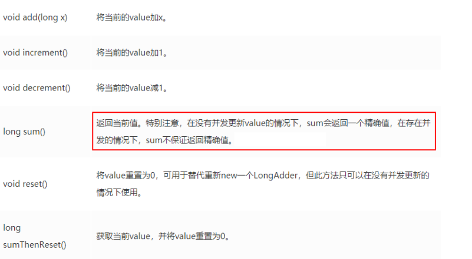

LongAdder、DoubleAdder只能用来计算加法，且从零开始计算。LongAccumulator、DoubleAccumulator提供了自定义函数。

```java
        LongBinaryOperator longBinaryOperator = new LongBinaryOperator() {

            @Override
            public long applyAsLong(long left, long right) {
                return left - right;
            }
        };
        LongAccumulator longAccumulator = new LongAccumulator(longBinaryOperator,1);
        longAccumulator.longValue();
        DoubleBinaryOperator doubleBinaryOperator = new DoubleBinaryOperator() {

            @Override
            public double applyAsDouble(double left, double right) {
                return left - right;
            }
        };
        DoubleAccumulator doubleAccumulator = new DoubleAccumulator(doubleBinaryOperator,0);
        doubleAccumulator.doubleValue();
```

- 比较

  - AtomicLong

    线程安全，可允许一些性能损耗，要求高精度时可使用。

    AtomicLong是多个线程针对单个热点值value进行原子操作。

  - LongAdder

    当需要在高并发下有较好的性能表现，且对值的精确度要求不高时，可以使用。

    LongAdder是每个线程拥有自己的槽，各个线程一般只对自己槽中的那个值进行CAS操作，最后再进行sum。

# 三、ThreadLocal

ThreadLocal提供线程局部变量。这些变量与正常的变量不同，因为每一个线程在访问ThreadLocal实例的时候（通过其get或set方法）都有自己的、独立初始化的变量副本。ThreadLocal实例通常是类中的私有静态字段，使用它的目的是希望将状态（例如，用户ID或事务ID）与线程关联起来，避免了线程安全问题。

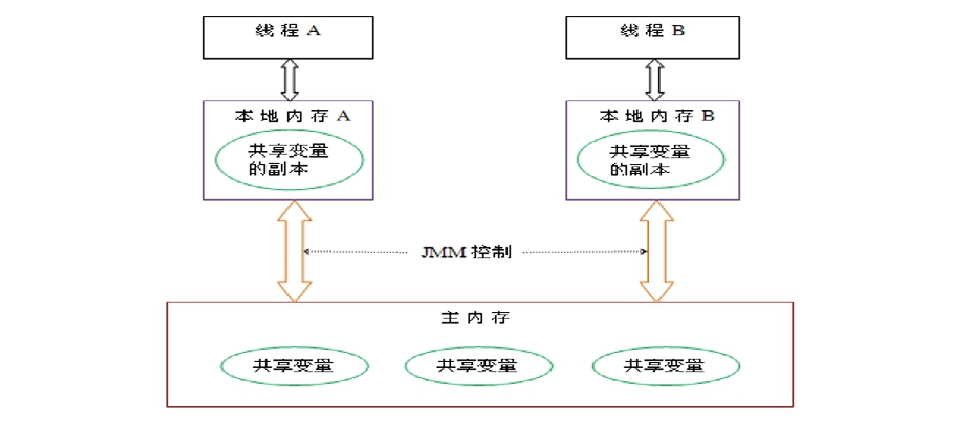

## ThreadLocal特点

1. ThreadLocal 并不解决线程间共享数据的问题。
2. ThreadLocal 适用于变量在线程间隔离且在方法间共享的场景。
3. ThreadLocal 通过隐式的在不同线程内创建独立实例副本避免了实例线程安全的问题。
4. 每个线程持有一个只属于自己的专属Map并维护了ThreadLocal对象与具体实例的映射，该Map由于只被持有它的线程访问，故不存在线程安全以及锁的问题。
5. ThreadLocalMap的Entry对ThreadLocal的引用为弱引用，避免了ThreadLocal对象无法被回收的问题。

## 强、软、弱、虚引用

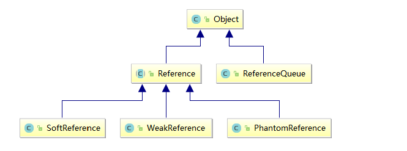

Java 技术允许使用 finalize() 方法在垃圾收集器将对象从内存中清除出去之前做必要的清理工作。

1. 强引用

   当内存不足，JVM开始垃圾回收，对于强引用的对象，就算是出现了OOM也不会对该对象进行回收。

   强引用是我们最常见的普通对象引用，只要还有强引用指向一个对象，就能表明对象还“活着”，垃圾收集器不会碰这种对象。在 Java 中最常见的就是强引用，把一个对象赋给一个引用变量，这个引用变量就是一个强引用。当一个对象被强引用变量引用时，它处于可达状态，它是不可能被垃圾回收机制回收的，即使该对象以后永远都不会被用到JVM也不会回收。因此强引用是造成Java内存泄漏的主要原因之一。

   对于一个普通的对象，如果没有其他的引用关系，只要超过了引用的作用域或者显式地将相应（强）引用赋值为 null，一般认为就是可以被垃圾收集的了(当然具体回收时机还是要看垃圾收集策略)。

2. 软引用

   软引用是一种相对强引用弱化了一些的引用，需要用java.lang.ref.SoftReference类来实现，可以让对象豁免一些GC。

   对于只有软引用的对象来说，当系统内存充足时它不会被回收，当系统内存不足时它会被回收。

   软引用通常用在对内存敏感的程序中，比如高速缓存就有用到软引用，内存够用的时候就保留，不够用就回收。

   场景：

   - 假如有一个应用需要读取大量的本地图片，每次读取图片都从硬盘读取则会严重影响性能，但是如果一次性全部加载到内存中又可能造成内存溢出。此时使用软引用可以解决这个问题。

     设计思路是：用一个HashMap来保存图片的路径和相应图片对象关联的软引用之间的映射关系，在内存不足时，JVM会自动回收这些缓存图片对象所占用的空间，从而有效地避免了OOM的问题。

     ```java
     Map<String, SoftReference<Bitmap>> imageCache = new HashMap<String, SoftReference<Bitmap>>();
     ```

3. 弱引用

   弱引用需要用java.lang.ref.WeakReference类来实现，它比软引用的生存期更短，对于只有弱引用的对象来说，只要垃圾回收机制一运行，不管JVM的内存空间是否足够，都会回收该对象占用的内存。

4. 虚引用

   虚引用需要java.lang.ref.PhantomReference类来实现。顾名思义，就是形同虚设，与其他几种引用都不同，虚引用并不会决定对象的生命周期。

   如果一个对象仅持有虚引用，那么它就和没有任何引用一样，在任何时候都可能被垃圾回收器回收，它不能单独使用也不能通过它访问对象，虚引用必须和引用队列 (ReferenceQueue)联合使用。

   虚引用的主要作用是跟踪对象被垃圾回收的状态。 仅仅是提供了一种确保对象被 finalize以后，做某些事情的机制。 PhantomReference的get方法总是返回null，因此无法访问对应的引用对象。其意义在于：说明一个对象已经进入finalization阶段，可以被gc回收，用来实现比finalization机制更灵活的回收操作。换句话说，设置虚引用关联的唯一目的，就是在这个对象被收集器回收的时候收到一个系统通知或者后续添加进一步的处理。

   ```java
   ReferenceQueue<MyObject> referenceQueue = new ReferenceQueue();
           PhantomReference<MyObject> phantomReference = new PhantomReference<>(new MyObject(), referenceQueue);
   //对象被回收之后会进入队列
   Reference<? extends MyObject> reference = referenceQueue.poll();
   if (reference != null) {
       System.out.println("***********有虚对象加入队列了");
   }
   ```

## 源码分析

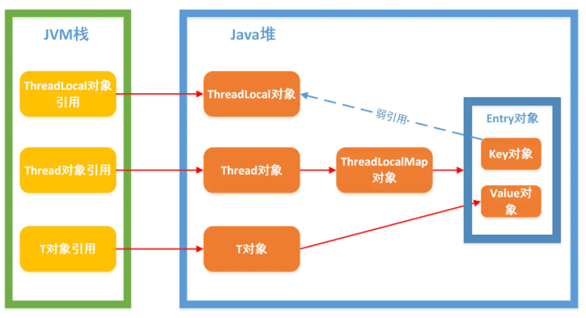

1. 每个Thread对象内部维护着一个ThreadLocalMap的引用

   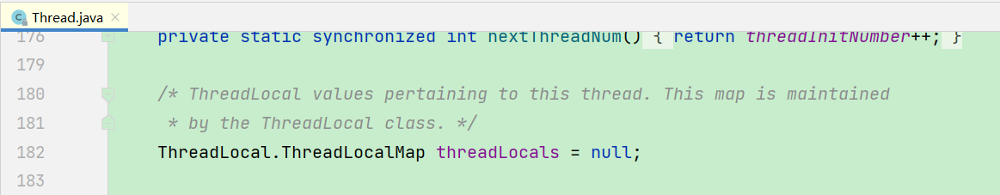

2. ThreadLocalMap是ThreadLocal的内部类，用Entry来进行存储，Entry继承Weakreference弱引用，作为key的threadlocal即为弱引用，遇到垃圾回收就会被回收。

   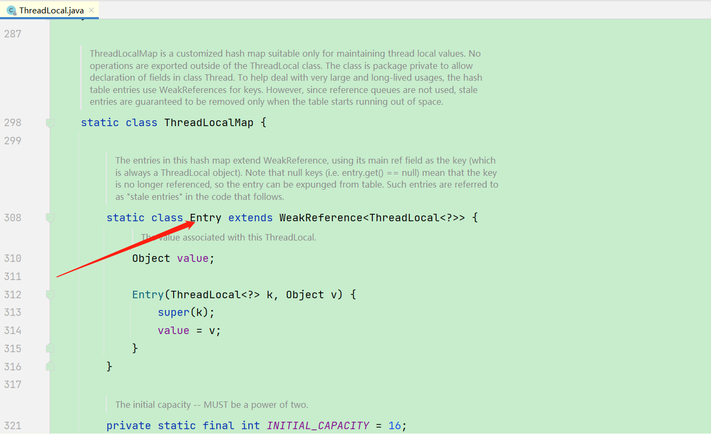

3. 调用ThreadLocal的set()方法时，实际上就是往ThreadLocalMap设置值，key是ThreadLocal对象，值Value是传递进来的对象

   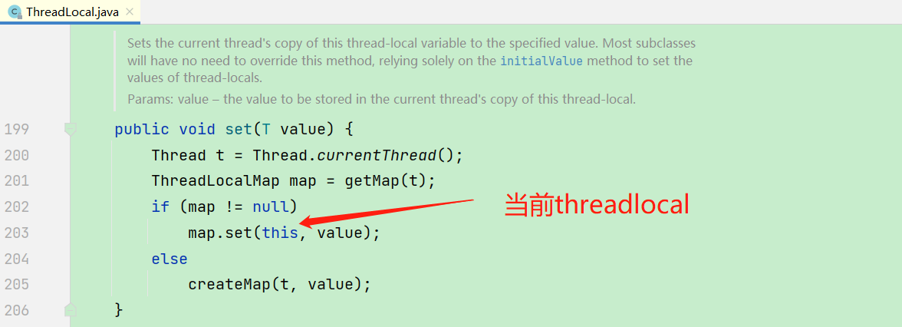

4. ThreadLocal的set()方法将当前threadlocal存储到ThreadLocalMap的Entry[]数组中，数组下标由当前threadlocal的hashcode计算得出。

   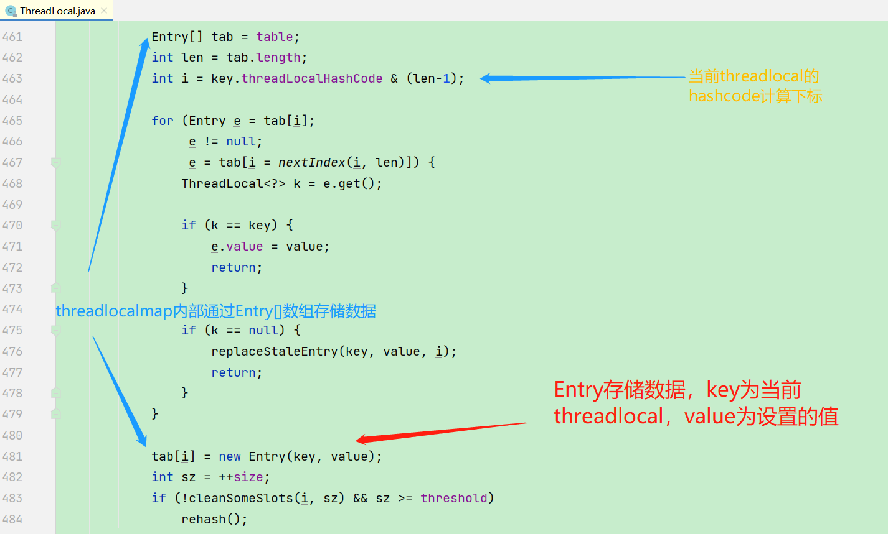

   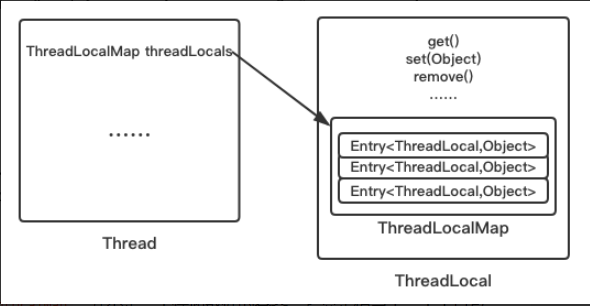

5. 调用ThreadLocal的get()方法时，实际上就是往ThreadLocalMap获取值，key是ThreadLocal对象

6. 调用ThreadLocal的remove()方法时，将当前threadlocal存的数据清空。

   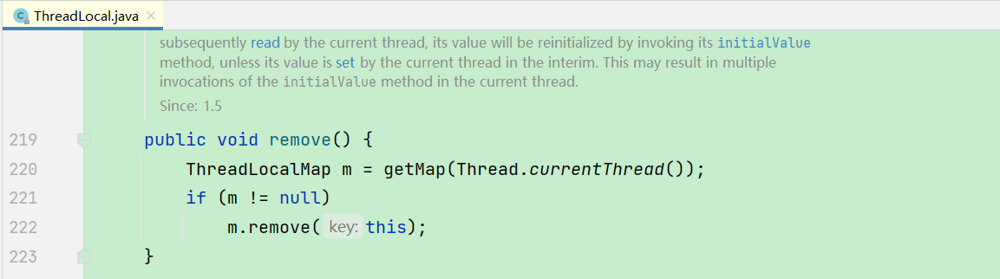

7. threadlocal的get()、set()方法会去检查所有键为null的Entry对象，并移除

   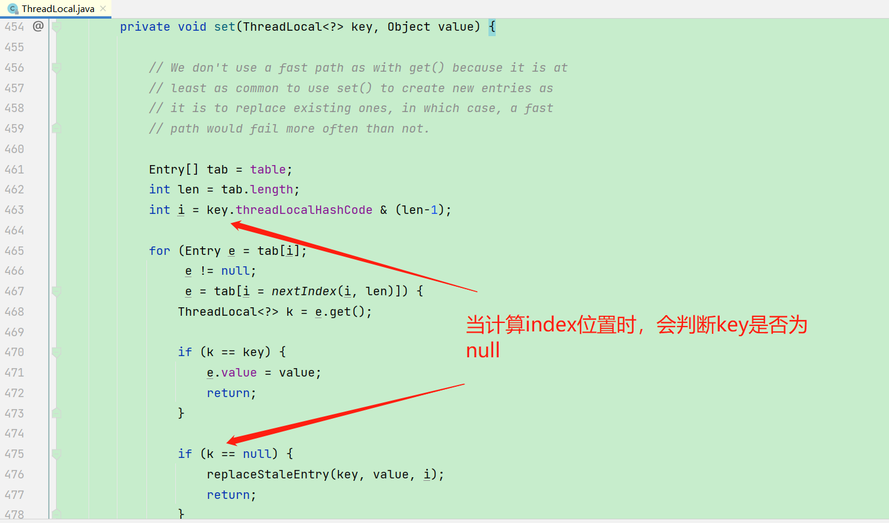

## 内存泄漏分析

### 为什么源代码用弱引用?

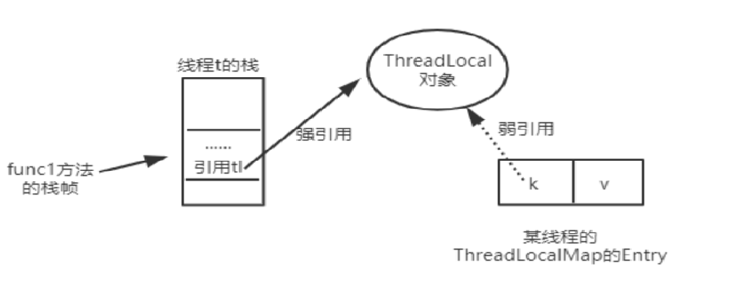

- 当function01方法执行完毕后，栈帧销毁强引用，tl也就没有了。但此时线程的ThreadLocalMap里某个entry的key引用还指向这个对象，若这个key引用是强引用，就会导致key指向的ThreadLocal对象及value指向的对象不能被gc回收，造成内存泄漏。
- 若这个key引用是弱引用就大概率会减少内存泄漏的问题(还有一个key为null的雷)。使用弱引用，就可以使ThreadLocal对象在方法执行完毕后顺利被回收且Entry的key引用指向为null。

### 内存泄漏原因


1. 当我们为threadLocal变量赋值，实际上就是当前的Entry(threadLocal实例为key，值为value)往这个threadLocalMap中存放。Entry中的key是弱引用，当threadLocal外部强引用被置为null(tl=null)，那么系统 GC 的时候，根据可达性分析，这个threadLocal实例就没有任何一条链路能够引用到它，这个ThreadLocal势必会被回收，这样一来，ThreadLocalMap中就会出现key为null的Entry，就没有办法访问这些key为null的Entry的value，如果当前线程再迟迟不结束的话，这些key为null的Entry的value就会一直存在一条强引用链：Thread Ref -> Thread -> ThreaLocalMap -> Entry -> value永远无法回收，造成内存泄漏。
2. 如果当前thread运行结束，threadLocal，threadLocalMap,Entry没有引用链可达，在垃圾回收的时候都会被系统进行回收。但在实际使用中我们有时候会用线程池去维护我们的线程，比如在Executors.newFixedThreadPool()时创建线程的时候，为了复用线程是不会结束的，所以threadLocal内存泄漏就值得我们小心。
3. 虽然弱引用，保证了key指向的ThreadLocal对象能被及时回收，但是v指向的value对象是需要ThreadLocalMap调用get、set时发现key为null时才会去回收整个entry、value。因此弱引用不能100%保证内存不泄露。我们要在不使用某个ThreadLocal对象后，手动调用remoev方法来删除它，尤其是在线程池中，不仅仅是内存泄露的问题，因为线程池中的线程是重复使用的，意味着这个线程的ThreadLocalMap对象也是重复使用的，如果我们不手动调用remove方法，那么后面的线程就有可能获取到上个线程遗留下来的value值，造成bug。
4. 用完记得手动remove

# 四、Java对象内存布局和对象头

## 对象的内存布局

在HotSpot虚拟机里，对象在堆内存中的存储布局可以划分为三个部分：对象头(Header)、实例数据( Instance Data）和对齐填充（Padding)（保证8个字节的倍数）。

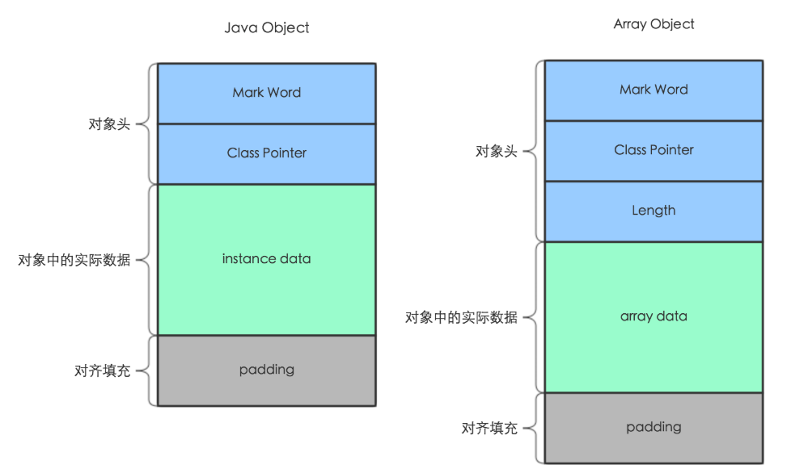

对象头分为对象标记Mark Word、和类元信息(又叫类型指针)，类元信息存储的是指向该对象类元数据（klass）的首地址。

- 对象标记Mark Word

  

  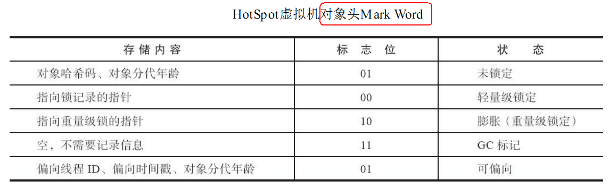

  默认存储对象的HashCode、分代年龄和锁标志位等信息。这些信息都是与对象自身定义无关的数据，所以MarkWord被设计成一个非固定的数据结构以便在极小的空间内存储尽量多的数据。

  它会根据对象的状态复用自己的存储空间，也就是说在运行期间MarkWord里存储的数据会随着锁标志位的变化而变化。

  对象布局、GC回收和后面的锁升级就是对象标记MarkWord里面标志位的变化。

  GC年龄采用4位bit存储，最大为15，例如MaxTenuringThreshold参数默认值就是15。

- 类元信息(类型指针)

  对象指向它的类元数据的指针，虚拟机通过这个指针来确定这个对象是哪个类的实例。

  对象头有多大

  在64位系统中，不开启指针压缩的情况下，Mark Word占了8个字节，类型指针占了8个字节，一共是16个字节。开启指针压缩，类型指针会占4个字节。

  ```bash
  #开启指针压缩，默认是压缩的
  -XX:+UseCompressedClassPointers
  ```

- 实例数据

  存放类的属性(Field)数据信息，包括父类的属性信息，如果是数组的实例，还包括数组的长度，这部分内存按4字节对齐。

- 对齐填充

  虚拟机要求对象起始地址必须是8字节的整数倍。填充数据不是必须存在的，仅仅是为了字节对齐。

  这部分内存按8字节补充对齐。

## JDK8中new一个对象占多少内存空间

16个字节，Mark Word8字节+类型指针8字节。
