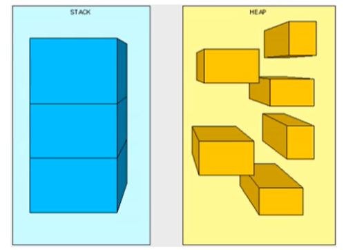
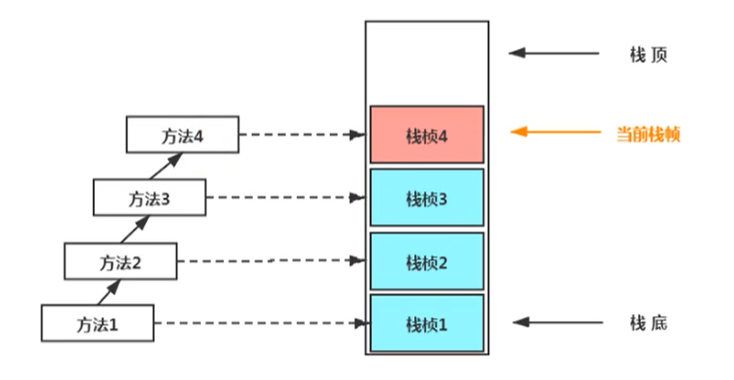
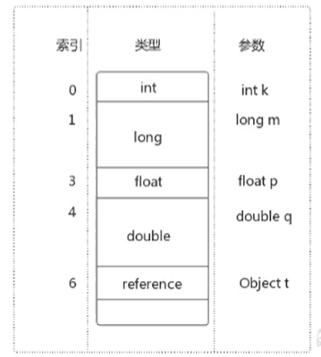
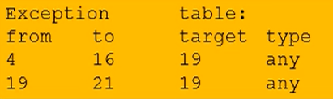

# JVM

## 一、JVM以及Java体系

- JVM是一种规范，Java是编译+解释混合执行的。

- JIT优化：

  Jvm会对调用频率非常高的代码进行编译，生成本地文件（类似于exe的可执行文件）。下次再执行的时候，就不需要解释器再去解释执行了。能够提高代码执行效率。

### jvm生命周期

- 虚拟机的启动

  Java虚拟机的启动是通过引导类加载器（bootstrap class loader）创建一个初始类（initial class）来完成的，这个类是由虚拟机的具体实现指定的。

- 虚拟机的执行

  - 一个运行中的Java虚拟机有着一个清晰的任务：执行Java程序。
  - 程序开始执行时他才运行，程序结束时他就停止。
  - 执行一个所谓的Java程序的时候，真真正正在执行的是一个叫做Java虚拟机的进程。

- 虚拟机的退出

  虚拟机遇到以下几种情况会发生退出：

  1. 程序正常执行结束。
  2. 程序在执行过程中遇到了异常或错误而异常终止。
  3. 由于操作系统出现错误而导致Java虚拟机进程终止。
  4. 某线程调用Runtime类或System类的exit()方法，或Runtime类的halt()方法，并且Java安全管理器也允许这次exit()或halt()操作。
  5. 除此之外，JNI（Java Native Interface）规范描述了用JNI Invocation API来加载或卸载 Java虚拟机时，Java虚拟机的退出情况。

## 二、类加载子系统

### 总览


### 类加载器子系统作用

1.  类加载器子系统负责从文件系统或者网络中加载Class文件，class文件在文件开头有特定的文件标识。
2.  ClassLoader只负责class文件的加载，至于它是否可以运行，则由执行引擎(Execution Engine)决定。
3.  加载的类信息存放于一块称为方法区的内存空间。除了类的信息外，方法区中还会存放运行时常量池信息，可能还包括字符串字面量和数字常量（这部分常量信息是Class文件中常量池部分的内存映射）

### 加载器ClassLoader角色

- class文件存在于本地硬盘上，执行的时候需要加载到JVM当中，根据这个文件实例化出N个一模一样的实例。
- class文件加载到JVM中，被称为DNA元数据模板，放在方法区。
- 在.class文件->JVM->最终成为元数据模板，此过程就要一个运输工具（类装载器Class Loader），扮演一个快递员的角色。

### 类加载过程

类加载主要分为loading(加载)、linking(链接)、initializing(初始化)三个步骤，其中linking可以细分为Verify(验证)、preparation(准备)、resolution(解析)三个阶段。


- loading(加载)

  1. 通过一个类的全限定名获取定义此类的二进制字节流，并将这个字节流所代表的静态存储结构转化为方法区的运行时数据结构。
  2. 在内存中生成一个代表这个类的java.lang.Class对象，class对象指向内存中的class文件内容。并且作为方法区这个类的各种数据的访问入口。
  3. 加载class的方式
     - 从本地系统中直接加载。
     - 通过网络获取，典型场景：Web Applet。
     - 从zip压缩包中读取，成为日后jar、war格式的基础。
     - 运行时计算生成，使用最多的是：动态代理技术。
     - 由其他文件生成，典型场景：JSP应用从专有数据库中提取.class文件，比较少见。
     - 从加密文件中获取，典型的防Class文件被反编译的保护措施。

- linking(链接)

  1. Verify(验证)

     目的在于确保Class文件的字节流中包含信息符合当前虚拟机要求，保证被加载类的正确性，不会危害虚拟机自身安全。

     主要包括四种验证：文件格式验证、元数据验证、字节码验证、符号引用验证。比如class文件格式需要以cafe babe开头。

     

  2. preparation(准备)

     - 为类静态变量（static变量）分配内存并且设置该类变量的默认值。

       ```java
       public class HelloApp {
           private static int a = 1;  // 准备阶段为0，在下个阶段，也就是初始化的时候才是1
           public static void main(String[] args) {
               System.out.println(a);
           }
       }
       ```

     - 这里不包含用final修饰的static，因为final在编译的时候就会分配好了默认值，准备阶段会显式初始化。

       编译时Javac将会为value生成ConstantValue属性，在准备阶段虚拟机就会根据ConstantValue的设置将value赋值为123。

       ```java
       public static final int value = 123;
       ```

     -  注意：这里不会为实例变量分配初始化，类变量会分配在方法区中，而实例变量是会随着对象一起分配到Java堆中。

  3. resolution(解析)

     - 将常量池内的符号引用转换为直接引用的过程

       

       - 符号引用：符号引用以一组符号来描述所引用的目标，符号可以是任何形式的字面量，只要使用时能无歧义地定位到目标即可。
       - 直接引用：直接引用可以是直接指向目标的指针、相对偏移量或是一个能间接定位到目标的句柄。如果有了直接引用，那么引用的目标一定是已经存在于内存中。

     - 事实上，解析操作往往会伴随着JVM在执行完初始化之后再执行。

     - 解析动作主要针对类或接口、字段、类方法、接口方法、方法类型等。对应常量池中的CONSTANT Class info、CONSTANT Fieldref info、CONSTANT Methodref info等。

- initializing(初始化)

  1. 对静态变量设置初始值，以及执行静态语句块。

  2. 初始化阶段就是执行类构造器法clinit()的过程。此方法不需定义，是javac编译器自动收集类中的所有类变量的赋值动作和静态代码块中的语句合并而来。

     ```bash
     也就是说，当我们代码中包含static变量的时候，就会有clinit方法
     ```

     

  3. 构造器方法中指令按语句在源文件中出现的顺序执行。

  4. clinit()不同于类的构造器。

  5. 若该类具有父类，JVM会保证子类的clinit()执行前，父类的clinit()已经执行完毕。

  6. 虚拟机必须保证一个类的clinit()方法在多线程下被同步加锁。

     ```java
     public class DeadThreadTest {
         public static void main(String[] args) {
             new Thread(() -> {
                 System.out.println(Thread.currentThread().getName() + "\t 线程t1开始");
                 new DeadThread();
             }, "t1").start();
     
             new Thread(() -> {
                 System.out.println(Thread.currentThread().getName() + "\t 线程t2开始");
                 new DeadThread();
             }, "t2").start();
         }
     }
     
     class DeadThread {
         static {
             if (true) {
                 System.out.println(Thread.currentThread().getName() + "\t 初始化当前类");
                 while (true) {
     
                 }
             }
         }
     }
     ```

     输出结果：

     ```bash
     线程t1开始
     线程t2开始
     线程t2 初始化当前类
     ```

### 类加载器的分类

- JVM支持两种类型的类加载器 。分别为引导类加载器（Bootstrap ClassLoader）和自定义类加载器（User-Defined ClassLoader）。

- 从概念上来讲，自定义类加载器一般指的是程序中由开发人员自定义的一类类加载器，但是Java虚拟机规范却没有这么定义，而是将所有派生于抽象类ClassLoader的类加载器都划分为自定义类加载器。

- 无论类加载器的类型如何划分，在程序中我们最常见的类加载器始终只有3个，如下所示：

  

  这里的四者之间是包含关系，不是上层和下层，也不是子系统的继承关系。

#### 启动类加载器（引导类加载器，Bootstrap ClassLoader）

- 这个类加载使用C/C++语言实现的，嵌套在JVM内部。
- 它用来加载Java的核心库（JAVAHOME/jre/1ib/rt.jar、resources.jar或sun.boot.class.path路径下的内容），用于提供JVM自身需要的类。
- 并不继承自ava.lang.ClassLoader，没有父加载器。
- 加载扩展类和应用程序类加载器，并指定为他们的父类加载器。
- 出于安全考虑，Bootstrap启动类加载器只加载包名为java、javax、sun等开头的类。

#### 扩展类加载器（Extension ClassLoader）

- Java语言编写，由sun.misc.Launcher$ExtClassLoader实现。
- 派生于ClassLoader类。
- 父类加载器为启动类加载器。
- 从java.ext.dirs系统属性所指定的目录中加载类库，或从JDK的安装目录的jre/1ib/ext子目录（扩展目录）下加载类库。如果用户创建的JAR放在此目录下，也会自动由扩展类加载器加载。

#### 应用程序类加载器（系统类加载器，AppClassLoader）

- java语言编写，由sun.misc.LaunchersAppClassLoader实现。
- 派生于ClassLoader类。
- 父类加载器为扩展类加载器。
- 它负责加载环境变量classpath或系统属性java.class.path指定路径下的类库。
- 该类加载是程序中默认的类加载器，一般来说，Java应用的类都是由它来完成加载。
- 通过classLoader#getSystemclassLoader（）方法可以获取到该类加载器。

#### 用户自定义类加载器

1. 什么时候需要自定义类加载器？

   在Java的日常应用程序开发中，类的加载几乎是由上述3种类加载器相互配合执行的，在必要时，我们还可以自定义类加载器，来定制类的加载方式。那为什么还需要自定义类加载器？

   - 隔离加载类（比如说现在Spring框架，和RocketMQ有包名路径完全一样的类，类名也一样，这个时候类就冲突了。不过一般的主流框架和中间件都会自定义类加载器，实现不同的框架，中间件之间是隔离的）。
   - 修改类加载的方式。
   - 扩展加载源（还可以考虑从数据库中加载类，路由器等等不同的地方）。
   - 防止源码泄漏（对字节码文件进行解密，自己用的时候通过自定义类加载器来对其进行解密）。

2. 如何自定义类加载器？

   - 可以通过继承抽象类ava.1ang.ClassLoader类的方式，实现自己的类加载器，以满足一些特殊的需求。
   - 重写findclass()方法。
   - super(parent)可以指定parent。

   - 在编写自定义类加载器时，如果没有太过于复杂的需求，可以直接继承URIClassLoader类，这样就可以避免自己去编写findclass方法及其获取字节码流的方式，使自定义类加载器编写更加简洁。

     ```java
     public class MyClassLoader extends ClassLoader {
         public static void main(String[] args) throws Exception {
             ClassLoader l = new MyClassLoader();
             Class clazz = l.loadClass("com.lijingyu.jvm.Hello");
             Class clazz1 = l.loadClass("com.lijingyu.jvm.Hello");
             System.out.println(clazz == clazz1);
             Hello h = (Hello) clazz.newInstance();
             h.m();
             System.out.println(l.getClass().getClassLoader());
             System.out.println(l.getParent());
             System.out.println(getSystemClassLoader());
         }
     
         @Override
         protected Class<?> findClass(String name) throws ClassNotFoundException {
             File f = new File("c:/test/", name.replace(".", "/").concat(".class"));
             try {
                 FileInputStream fis = new FileInputStream(f);
                 ByteArrayOutputStream baos = new ByteArrayOutputStream();
                 int b = 0;
                 while ((b = fis.read()) != 0) {
                     baos.write(b);
                 }
                 byte[] bytes = baos.toByteArray();
                 baos.close();
                 fis.close();//可以写的更加严谨
                 return defineClass(name, bytes, 0, bytes.length);
             } catch (Exception e) {
                 e.printStackTrace();
             }
             return super.findClass(name);
             //throws ClassNotFoundException
         }
     }
     ```

### 双亲委派机制

- Java虚拟机对class文件采用的是按需加载的方式，也就是说当需要使用该类时才会将它的class文件加载到内存生成class对象。而且加载某个类的class文件时，Java虚拟机采用的是双亲委派模式，即把请求交由父类处理，它是一种任务委派模式。

- 双亲委派工作原理

  - 如果一个类加载器收到了类加载请求，它并不会自己先去加载，而是把这个请求委托给父类的加载器去执行。

  - 如果父类加载器还存在其父类加载器，则进一步向上委托，依次递归，请求最终将到达顶层的启动类加载器。

  - 如果父类加载器可以完成类加载任务，就成功返回，倘若父类加载器无法完成此加载任务，子加载器才会尝试自己去加载，这就是双亲委派模式。

    

- 双亲委派机制的优势

  通过上面的例子，我们可以知道，双亲机制可以

  ```bash
  1、避免类的重复加载
  2、保护程序安全，防止核心API被随意篡改
      自定义类：java.lang.String
      自定义类：java.lang.ShkStart（报错：阻止创建 java.lang开头的类）
  ```

### 如何判断两个class对象是否相同

在JVM中表示两个class对象是否为同一个类存在两个必要条件：

- 类的完整类名必须一致，包括包名。
- 加载这个类的ClassLoader（指ClassLoader实例对象）必须相同。

换句话说，在JvM中，即使这两个类对象（class对象）来源同一个Class文件，被同一个虚拟机所加载，但只要加载它们的ClassLoader实例对象不同，那么这两个类对象也是不相等的。

JVM必须知道一个类型是由启动加载器加载的还是由用户类加载器加载的。如果一个类型是由用户类加载器加载的，那么JVM会将这个类加载器的一个引用作为类型信息的一部分保存在方法区中。当解析一个类型到另一个类型的引用的时候，JVM需要保证这两个类型的类加载器是相同的。

### 类的主动使用和被动使用

Java程序对类的使用方式分为：王动使用和被动使用。 主动使用，又分为七种情况：

- 创建类的实例
- 访问某个类或接口的静态变量，或者对该静态变量赋值
- 调用类的静态方法I
- 反射（比如：Class.forName（"com.atguigu.Test"））
- 初始化一个类的子类
- Java虚拟机启动时被标明为启动类的类
- JDK7开始提供的动态语言支持：
- java.lang.invoke.MethodHandle实例的解析结果REF getStatic、REF putStatic、REF invokeStatic句柄对应的类没有初始化，则初始化

除了以上七种情况，其他使用Java类的方式都被看作是对类的被动使用，都不会导致类的初始化。

## 三、运行时数据区


### 3.1、程序计数器

#### 介绍

- 它是一块很小的内存空间，几乎可以忽略不记。也是运行速度最快的存储区域。

- 在JVM规范中，每个线程都有它自己的程序计数器，是线程私有的，生命周期与线程的生命周期保持一致。

- 任何时间一个线程都只有一个方法在执行，也就是所谓的当前方法。程序计数器会存储当前线程正在执行的Java方法的JVM指令地址；或者，如果是在执行native方法，则是未指定值（undefned）。

- 它是程序控制流的指示器，分支、循环、跳转、异常处理、线程恢复等基础功能都需要依赖这个计数器来完成。字节码解释器工作时就是通过改变这个计数器的值来选取下一条需要执行的字节码指令。

- 它是唯一一个在Java虚拟机规范中没有规定任何outotMemoryError情况的区域。

- PC寄存器用来存储指向下一条指令的地址，也即将要执行的指令代码。由执行引擎读取下一条指令。

  

#### 使用PC寄存器存储字节码指令地址有什么用呢？

- 因为CPU需要不停的切换各个线程，这时候切换回来以后，就得知道接着从哪开始继续执行。

- JVM的字节码解释器就需要通过改变PC寄存器的值来明确下一条应该执行什么样的字节码指令。

  

#### PC寄存器为什么被设定为私有的？

我们都知道所谓的多线程在一个特定的时间段内只会执行其中某一个线程的方法，CPU会不停地做任务切换，这样必然导致经常中断或恢复，如何保证分毫无差呢？为了能够准确地记录各个线程正在执行的当前字节码指令地址，最好的办法自然是为每一个线程都分配一个PC寄存器，这样一来各个线程之间便可以进行独立计算，从而不会出现相互干扰的情况。

#### CPU时间片

- CPU时间片即CPU分配给各个程序的时间，每个线程被分配一个时间段，称作它的时间片。

- 在宏观上：我们可以同时打开多个应用程序，每个程序并行，同时运行。

- 在微观上：由于只有一个CPU，一次只能处理程序要求的一部分，如何处理公平，一种方法就是引入时间片，每个程序轮流执行。

  

### 3.2、虚拟机栈

#### 概述

由于跨平台性的设计，Java的指令都是根据栈来设计的。不同平台CPU架构不同，所以不能设计为基于寄存器的。 优点是跨平台，指令集小，编译器容易实现，缺点是性能下降，实现同样的功能需要更多的指令。

- 栈是运行时的单位，而堆是存储的单位

  - 栈解决程序的运行问题，即程序如何执行，或者说如何处理数据。

  - 堆解决的是数据存储的问题，即数据怎么放，放哪里。



- 每个线程在创建时都会创建一个虚拟机栈，其内部保存一个个的栈帧（Stack Frame），对应着一次次的Java方法调用。

  

- 生命周期

  生命周期和线程一致，也就是线程结束了，该虚拟机栈也销毁了。

- 作用

  主管Java程序的运行，它保存方法的局部变量、部分结果，并参与方法的调用和返回。

- 特点

  栈是一种快速有效的分配存储方式，访问速度仅次于程序计数器。JVM直接对Java栈的操作只有两个：

  - 每个方法执行，伴随着进栈（入栈、压栈）。
  - 执行结束后的出栈工作。

  对于栈来说不存在垃圾回收问题（栈存在溢出的情况）
  
- 设置栈内存大小

  我们可以使用参数 -Xss选项来设置线程的最大栈空间，栈的大小直接决定了函数调用的最大可达深度。

  ```
  -Xss1m
  -Xss1k
  ```

#### 栈中可能出现的异常

- Java 虚拟机规范允许Java栈的大小是动态的或者是固定不变的。
- 如果采用固定大小的Java虚拟机栈，那每一个线程的Java虚拟机栈容量可以在线程创建的时候独立选定。如果线程请求分配的栈容量超过Java虚拟机栈允许的最大容量，Java虚拟机将会抛出一个StackoverflowError 异常。
- 如果Java虚拟机栈可以动态扩展，并且在尝试扩展的时候无法申请到足够的内存，或者在创建新的线程时没有足够的内存去创建对应的虚拟机栈，那Java虚拟机将会抛出一个 outofMemoryError 异常。

#### 栈的内部结构

- 每个线程都有自己的栈，栈中的数据都是以栈帧（Stack Frame）的格式存在。在这个线程上正在执行的每个方法都各自对应一个栈帧（Stack Frame）。栈帧是一个内存区块，是一个数据集，维系着方法执行过程中的各种数据信息。

- JVM直接对Java栈的操作只有两个，就是对栈帧的压栈和出栈，遵循“先进后出”/“后进先出”原则。

- 在一条活动线程中，一个时间点上，只会有一个活动的栈帧。即只有当前正在执行的方法的栈帧（栈顶栈帧）是有效的，这个栈帧被称为当前栈帧（Current Frame），与当前栈帧相对应的方法就是当前方法（Current Method），定义这个方法的类就是当前类（Current Class）。

- 执行引擎运行的所有字节码指令只针对当前栈帧进行操作。

- 如果在该方法中调用了其他方法，对应的新的栈帧会被创建出来，放在栈的顶端，成为新的当前帧。

  

- 栈帧的内部结构

  - 局部变量表（Local Variables）

  - 操作数栈（operand Stack）（或表达式栈）

  - 动态链接（DynamicLinking）（或指向运行时常量池的方法引用）

  - 方法返回地址（Return Address）（或方法正常退出或者异常退出的定义）

  - 一些附加信息

    

- 并行每个线程下的栈都是私有的，因此每个线程都有自己各自的栈，并且每个栈里面都有很多栈帧，栈帧的大小主要由局部变量表 和 操作数栈决定的。

#### 栈运行原理

- 不同线程中所包含的栈帧是不允许存在相互引用的，即不可能在一个栈帧之中引用另外一个线程的栈帧。
- 如果当前方法调用了其他方法，方法返回之际，当前栈帧会传回此方法的执行结果给前一个栈帧，接着，虚拟机会丢弃当前栈帧，使得前一个栈帧重新成为当前栈帧。
- Java方法有两种返回函数的方式，一种是正常的函数返回，使用return指令；另外一种是抛出异常。不管使用哪种方式，都会导致栈帧被弹出。

#### 局部变量表

1.  局部变量表也被称之为局部变量数组或本地变量表

2.  定义为一个数字数组，主要用于存储方法参数和定义在方法体内的局部变量，这些数据类型包括各类基本数据类型、对象引用（reference），以及returnAddress返回值类型。

3.  由于局部变量表是建立在线程的栈上，是线程的私有数据，因此不存在数据安全问题。

4.  局部变量表所需的容量大小是在编译期确定下来的，并保存在方法的Code属性的maximum local variables数据项中。在方法运行期间是不会改变局部变量表的大小的。

5. 方法嵌套调用的次数由栈的大小决定。一般来说，栈越大，方法嵌套调用次数越多。

   对一个函数而言，它的参数和局部变量越多，使得局部变量表膨胀，它的栈帧就越大，以满足方法调用所需传递的信息增大的需求。进而函数调用就会占用更多的栈空间，导致其嵌套调用次数就会减少。

6. 局部变量表中的变量只在当前方法调用中有效。

   - 在方法执行时，虚拟机通过使用局部变量表完成参数值到参数变量列表的传递过程。
   - 当方法调用结束后，随着方法栈帧的销毁，局部变量表也会随之销毁。

7. 从字节码分析局部变量表

   - 非static方法

     

     

     非static方法的第一个局部变量，存储的是this，对当前对象的引用。

   - static方法

     static方法不含this 对当前对象的引用。

     

#### 关于Slot的理解

- 参数值的存放总是从局部变量数组索引 0 的位置开始，到数组长度-1的索引结束。

- 局部变量表，最基本的存储单元是Slot（变量槽），局部变量表中存放编译期可知的各种基本数据类型（8种），引用类型（reference），returnAddress类型的变量。

- 在局部变量表里，32位以内的类型只占用一个slot（包括returnAddress类型），64位的类型占用两个slot（1ong和double）

  - byte、short、char在储存前被转换为int，boolean也被转换为int，0表示false，非0表示true
  - long和double则占据两个slot

- JVM会为局部变量表中的每一个Slot都分配一个访问索引，通过这个索引即可成功访问到局部变量表中指定的局部变量值。

- 当一个实例方法被调用的时候，它的方法参数和方法体内部定义的局部变量将会按照顺序被复制到局部变量表中的每一个slot上

- 如果需要访问局部变量表中一个64bit的局部变量值时，只需要使用前一个索引即可。（比如：访问long或double类型变量）

- 如果当前帧是由构造方法或者实例方法创建的，那么该对象引用this将会存放在index为0的slot处，其余的参数按照参数表顺序继续排列。（this也相当于一个变量）。

  

#### Slot的重复利用

栈帧中的局部变量表中的槽位是可以重用的，如果一个局部变量过了其作用域，那么在其作用域之后声明新的局部变量就很有可能会复用过期局部变量的槽位，从而达到节省资源的目的。


#### 静态变量与局部变量的对比

变量的分类：

- 按数据类型分：基本数据类型、引用数据类型
- 按类中声明的位置分：成员变量（类变量，实例变量）、局部变量
  - 类变量：linking的prepare阶段，给类变量默认赋值，init阶段给类变量显示赋值即静态代码块
  - 实例变量：随着对象创建，会在堆空间中分配实例变量空间，并进行默认赋值
  - 局部变量：在使用前必须进行显式赋值，不然编译不通过。

1. 参数表分配完毕之后，再根据方法体内定义的变量的顺序和作用域分配。
2. 我们知道类变量表有两次初始化的机会，第一次是在“准备阶段”，执行系统初始化，对类变量设置零值，另一次则是在“初始化”阶段，赋予程序员在代码中定义的初始值。
3. 和类变量初始化不同的是，局部变量表不存在系统初始化的过程，这意味着一旦定义了局部变量则必须人为的初始化，否则无法使用。
4. 在栈帧中，与性能调优关系最为密切的部分就是前面提到的局部变量表。在方法执行时，虚拟机使用局部变量表完成方法的传递。
5. 局部变量表中的变量也是重要的垃圾回收根节点，只要被局部变量表中直接或间接引用的对象都不会被回收。

#### 操作数栈

每一个独立的栈帧除了包含局部变量表以外，还包含一个后进先出（Last - In - First -Out）的 操作数栈，也可以称之为 表达式栈（Expression Stack）

操作数栈，在方法执行过程中，根据字节码指令，往栈中写入数据或提取数据，即入栈（push）和 出栈（pop）

    某些字节码指令将值压入操作数栈，其余的字节码指令将操作数取出栈。使用它们后再把结果压入栈
    比如：执行复制、交换、求和等操作


代码举例


- 操作数栈，主要用于保存计算过程的中间结果，同时作为计算过程中变量临时的存储空间。

- 操作数栈就是JVM执行引擎的一个工作区，当一个方法刚开始执行的时候，一个新的栈帧也会随之被创建出来，这个方法的操作数栈是空的。这个时候数组是有长度的，因为数组一旦创建，那么就是不可变的

- 每一个操作数栈都会拥有一个明确的栈深度用于存储数值，其所需的最大深度在编译期就定义好了，保存在方法的Code属性中，为maxstack的值。

  

- 栈中的任何一个元素都是可以任意的Java数据类型

  - 32bit的类型占用一个栈单位深度
  - 64bit的类型占用两个栈单位深度

- 操作数栈并非采用访问索引的方式来进行数据访问的，而是只能通过标准的入栈和出栈操作来完成一次数据访问。
- 如果被调用的方法带有返回值的话，其返回值将会被压入当前栈帧的操作数栈中，并更新PC寄存器中下一条需要执行的字节码指令。
- 操作数栈中元素的数据类型必须与字节码指令的序列严格匹配，这由编译器在编译器期间进行验证，同时在类加载过程中的类检验阶段的数据流分析阶段要再次验证。
- 我们说Java虚拟机的解释引擎是基于栈的执行引擎，其中的栈指的就是操作数栈。

#### 栈顶缓存技术

栈顶缓存技术：Top Of Stack Cashing

基于栈式架构的虚拟机所使用的零地址指令更加紧凑，但完成一项操作的时候必然需要使用更多的入栈和出栈指令，这同时也就意味着将需要更多的指令分派（instruction dispatch）次数和内存读/写次数。

由于操作数是存储在内存中的，因此频繁地执行内存读/写操作必然会影响执行速度。为了解决这个问题，HotSpot  JVM的设计者们提出了栈顶缓存（Tos，Top-of-Stack  Cashing）技术，将栈顶元素全部缓存在物理CPU的寄存器中，以此降低对内存的读/写次数，提升执行引擎的执行效率。

> 寄存器：指令更少，执行速度快

#### 动态链接

- 每一个栈帧内部都包含一个指向运行时常量池中该栈帧所属方法的引用。包含这个引用的目的就是为了支持当前方法的代码能够实现动态链接（Dynamic Linking），比如：invokedynamic指令

- 在Java源文件被编译到字节码文件中时，所有的变量和方法引用都作为符号引用（Symbolic Reference）保存在class文件的常量池里。比如：描述一个方法调用了另外的其他方法时，就是通过常量池中指向方法的符号引用来表示的，那么动态链接的作用就是为了将这些符号引用转换为调用方法的直接引用。

  

  

- 其中的#4、#5、#31代表的是符号引用，指向常量池中的具体常量。向下查找引用到#5、#31

  

  

为什么要用常量池呢？

1. 因为在不同的方法，都可能调用常量或者方法，所以只需要存储一份即可，然后记录其引用即可，节省了空间。
2. 常量池的作用：就是为了提供一些符号和常量，便于指令的识别。

#### 方法的调用

在JVM中，将符号引用转换为调用方法的直接引用与方法的绑定机制相关。

##### 链接机制

- 静态链接

  当一个字节码文件被装载进JVM内部时，如果被调用的目标方法在编译期可知，且运行期保持不变时，这种情况下将调用方法的符号引用转换为直接引用的过程称之为静态链接。

- 动态链接

  如果被调用的方法在编译期无法被确定下来，也就是说，只能够在程序运行期将调用的方法的符号转换为直接引用，由于这种引用转换过程具备动态性，因此也被称之为动态链接。

##### 绑定机制

对应的方法的绑定机制为：早期绑定（Early Binding）和晚期绑定（Late Binding）。绑定是一个字段、方法或者类在符号引用被替换为直接引用的过程，这仅仅发生一次。

- 早期绑定

  早期绑定就是指被调用的目标方法如果在编译期可知，且运行期保持不变时，即可将这个方法与所属的类型进行绑定，这样一来，由于明确了被调用的目标方法究竟是哪一个，因此也就可以使用静态链接的方式将符号引用转换为直接引用。

- 晚期绑定

  如果被调用的方法在编译期无法被确定下来，只能够在程序运行期根据实际的类型绑定相关的方法，这种绑定方式也就被称之为晚期绑定。

##### 虚方法和非虚方法

- 如果方法在编译期就确定了具体的调用版本，这个版本在运行时是不可变的。这样的方法称为非虚方法。

  静态方法、私有方法、final方法、实例构造器、父类方法都是非虚方法。

- 其他方法称为虚方法。

- 方法调用指令

  1. invokestatic：调用静态方法，解析阶段确定唯一方法版本。
  2. invokespecial：调用方法、私有及父类方法，解析阶段确定唯一方法版本。
  3. invokevirtual：调用所有虚方法。
  4. invokeinterface：调用接口方法。
  5. invokedynamic：动态解析出需要调用的方法，然后执行。

##### Java语言中方法重写的本质

1. 找到操作数栈顶的第一个元素所执行的对象的实际类型，记作C。
2. 如果在类型C中找到与常量中的描述符合简单名称都相符的方法，则进行访问权限校验。
   - 如果通过则返回这个方法的直接引用，查找过程结束
   - 如果不通过，则返回java.lang.IllegalAccessError 异常
3. 否则，按照继承关系从下往上依次对C的各个父类进行第2步的搜索和验证过程。
4. 如果始终没有找到合适的方法，则抛出java.lang.AbstractMethodError异常。

##### 虚方法表

- 在面向对象的编程中，会很频繁的使用到动态分配，如果在每次动态分配的过程中都要重新在类的方法元数据中搜索合适的目标的话就可能影响到执行效率。因此，为了提高性能，JVM采用在类的方法区建立一个虚方法表 （virtual method table）（非虚方法不会出现在表中）来实现。使用索引表来代替查找。

- 每个类中都有一个虚方法表，表中存放着各个方法的实际入口。

- 虚方法表是什么时候被创建的呢？

  虚方法表会在类加载的链接阶段被创建并开始初始化，类的变量初始值准备完成之后，JVM会把该类的方法表也初始化完毕。

  

#### 方法返回地址

存放调用该方法的pc寄存器的值。一个方法的结束，有两种方式：

- 正常执行完成
- 出现未处理的异常，非正常退出

无论通过哪种方式退出，在方法退出后都返回到该方法被调用的位置。方法正常退出时，调用者的pc计数器的值作为返回地址，即调用该方法的指令的下一条指令的地址。而通过异常退出的，返回地址是要通过异常表来确定，栈帧中一般不会保存这部分信息。

当一个方法开始执行后，只有两种方式可以退出这个方法：

执行引擎遇到任意一个方法返回的字节码指令（return），会有返回值传递给上层的方法调用者，简称正常完成出口；

- 一个方法在正常调用完成之后，究竟需要使用哪一个返回指令，还需要根据方法返回值的实际数据类型而定。
- 在字节码指令中，返回指令包含ireturn（当返回值是boolean，byte，char，short和int类型时使用），lreturn（Long类型），freturn（Float类型），dreturn（Double类型），areturn。另外还有一个return指令声明为void的方法，实例初始化方法，类和接口的初始化方法使用。

在方法执行过程中遇到异常（Exception），并且这个异常没有在方法内进行处理，也就是只要在本方法的异常表中没有搜索到匹配的异常处理器，就会导致方法退出，简称异常完成出口。

方法执行过程中，抛出异常时的异常处理，存储在一个异常处理表，方便在发生异常的时候找到处理异常的代码



本质上，方法的退出就是当前栈帧出栈的过程。此时，需要恢复上层方法的局部变量表、操作数栈、将返回值压入调用者栈帧的操作数栈、设置PC寄存器值等，让调用者方法继续执行下去。

正常完成出口和异常完成出口的区别在于：通过异常完成出口退出的不会给他的上层调用者产生任何的返回值。

### 3.3、本地方法栈

Java虚拟机栈于管理Java方法的调用，而本地方法栈用于管理本地方法的调用。

本地方法栈，也是线程私有的。

允许被实现成固定或者是可动态扩展的内存大小。（在内存溢出方面是相同的）

- 如果线程请求分配的栈容量超过本地方法栈允许的最大容量，Java虚拟机将会抛出一个stackoverflowError 异常。
- 如果本地方法栈可以动态扩展，并且在尝试扩展的时候无法申请到足够的内存，或者在创建新的线程时没有足够的内存去创建对应的本地方法栈，那么Java虚拟机将会抛出一个outofMemoryError异常。

本地方法是使用C语言实现的。它的具体做法是Native Method Stack中登记native方法，在Execution Engine 执行时加载本地方法库。


当某个线程调用一个本地方法时，它就进入了一个全新的并且不再受虚拟机限制的世界。它和虚拟机拥有同样的权限。

- 本地方法可以通过本地方法接口来访问虚拟机内部的运行时数据区。
- 它甚至可以直接使用本地处理器中的寄存器
- 直接从本地内存的堆中分配任意数量的内存。

并不是所有的JVM都支持本地方法。因为Java虚拟机规范并没有明确要求本地方法栈的使用语言、具体实现方式、数据结构等。如果JVM产品不打算支持native方法，也可以无需实现本地方法栈。

在Hotspot JVM中，直接将本地方法栈和虚拟机栈合二为一。
