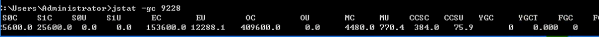
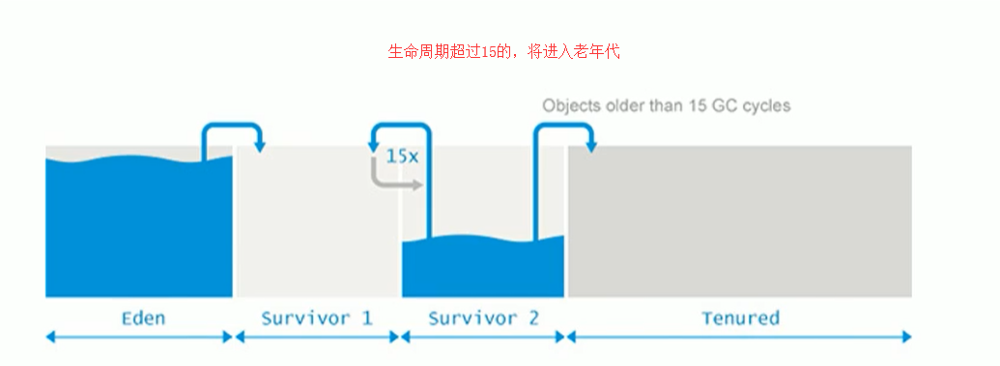
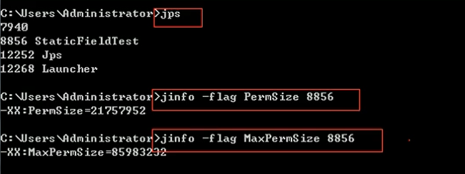

# JVM

## 三、运行时数据区


### 3.3、堆

- 一个JVM实例只存在一个堆内存，堆也是Java内存管理的核心区域。

- Java堆区在JVM启动的时候即被创建，其空间大小也就确定了，堆是JVM管理的最大一块内存空间，并且堆内存的大小是可以调节的。

- 堆可以处于物理上不连续的内存空间中，但在逻辑上它应该被视为连续的。

- 所有的线程共享Java堆，在这里还可以划分线程私有的缓冲区（Thread Local Allocation Buffer，TLAB）。

- “几乎”所有的对象实例都在堆分配内存，但并非全部。因为还有一些对象是在栈上分配的（逃逸分析，标量替换）。

- 数组和对象可能永远不会存储在栈上（不一定），因为栈帧中保存引用，这个引用指向对象或者数组在堆中的位置。

  

- 在方法结束后，堆中的对象不会马上被移除，仅仅在垃圾收集的时候才会被移除。也就是触发了GC的时候，才会进行回收，如果堆中对象马上被回收，那么用户线程就会收到影响。

- 堆，是GC（Garbage Collection，垃圾收集器）执行垃圾回收的重点区域。

#### 堆内存细分

Java 7及之前堆内存逻辑上分为三部分：新生代+老年代+永久代

- Young Generation Space 新生代  Young/New   又被划分为Eden区和Survivor区

- Tenure generation space 老年代 Old/Tenure

- Permanent Space永久代   Perm

  

Java 8及之后堆内存逻辑上分为三部分：新生代+老年代+元空间

- Young Generation Space新生代  Young/New  又被划分为Eden区和Survivor区

- Tenure generation space 老年代  Old/Tenure

- Meta Space  元空间   Meta

  

#### 堆空间大小设置

- Java堆区用于存储Java对象实例，那么堆的大小在JVM启动时就已经设定好了，可以通过选项"-Xmx"和"-Xms"来进行设置。

  ```
  “-Xms"用于表示堆区的起始内存，等价于-xx:InitialHeapSize
  “-Xmx"则用于表示堆区的最大内存，等价于-XX:MaxHeapSize
  ```

- 一旦堆区中的内存大小超过“-xmx"所指定的最大内存时，将会抛出outofMemoryError异常。

- 通常会将-Xms和-Xmx两个参数配置相同的值，其目的是为了能够在java垃圾回收机制清理完堆区后不需要重新分隔计算堆区的大小，从而提高性能。

- 默认情况下

  - 初始内存大小：物理电脑内存大小/64
  - 最大内存大小：物理电脑内存大小/4

- 查看堆内存的内存分配情况

  ```
  jps  ->  jstat -gc 进程id
  ```

  

  ```properties
  SOC: S0区总共容量
  S1C: S1区总共容量
  S0U: S0区使用的量
  S1U: S1区使用的量
  EC: 伊甸园区总共容量
  EU: 伊甸园区使用的量
  OC: 老年代总共容量
  OU: 老年代使用的量
  ```

- 查看gc情况日志

  ```
  -XX:+PrintGCDetails
  ```

  

#### 年轻代与老年代

- 存储在JVM中的Java对象可以被划分为两类：

  - 一类是生命周期较短的瞬时对象，这类对象的创建和消亡都非常迅速，生命周期短的，及时回收即可。
  - 另外一类对象的生命周期却非常长，在某些极端的情况下还能够与JVM的生命周期保持一致。

- Java堆区进一步细分的话，可以划分为年轻代（YoungGen）和老年代（oldGen），其中年轻代又可以划分为Eden空间、Survivor0空间和Survivor1空间（有时也叫做from区、to区）。

  

- 新生代与老年代在堆结构的占比

  

  - Eden：From：to -> 8:1:1
    新生代：老年代 - > 1 : 2
  - 默认-XX:NewRatio=2，表示新生代占1，老年代占2，新生代占整个堆的1/3
  - 可以修改-XX:NewRatio=4，表示新生代占1，老年代占4，新生代占整个堆的1/5
  - 一般不会做修改。

- 在HotSpot中，Eden空间和另外两个survivor空间缺省所占的比例是8：1：1，开发人员可以通过选项“-xx:SurvivorRatio”调整这个空间比例。比如-xx:SurvivorRatio=8

- 几乎所有的Java对象都是在Eden区被new出来的。绝大部分的Java对象的销毁都在新生代进行了。（有些大的对象在Eden区无法存储时候，将直接进入老年代）

- 可以使用选项"-Xmn"设置新生代最大内存大小。

#### 对象分配过程



##### 概念

- 为新对象分配内存是一件非常严谨和复杂的任务，JVM的设计者们不仅需要考虑内存如何分配、在哪里分配等问题，并且由于内存分配算法与内存回收算法密切相关，所以还需要考虑GC执行完内存回收后是否会在内存空间中产生内存碎片。
- 分配过程
  1. new的对象先放Eden区。此区有大小限制。
  2. 当Eden的空间填满时，程序又需要创建对象，JVM的垃圾回收器将对Eden区进行垃圾回收（MinorGC），将Eden区中的不再被其他对象所引用的对象进行销毁。再加载新的对象放到Eden区。
  3. 将Eden中的剩余对象移动到survivor0区。
  4. 如果再次触发垃圾回收，此时上次幸存下来的放到survivor0区的，如果没有回收，就会放到survivor1区。
  5. 如果再次经历垃圾回收，此时会重新放回survivor0区，接着再去survivor1区。
  6. 默认最高回收15次之后依然存活，就会放到old区。
  7. 当old区内存不足时，再次触发GC：Major GC，进行old区的内存清理。
  8. 若old区执行了Major GC之后，发现依然无法进行对象的保存，就会产生OOM异常。
- 设置参数：-Xx:MaxTenuringThreshold= N进行设置移动到老年代的分代年龄。

##### 图解过程

1. 我们创建的对象，一般都是存放在Eden区的，当我们Eden区满了后，就会触发GC操作，一般被称为 YGC / Minor GC操作。

   

2. 当我们进行一次垃圾收集后，红色的将会被回收，而绿色的还会被占用着，存放在S0(Survivor From)区。同时我们给每个对象设置了一个年龄计数器，一次回收后就是1。

3. 同时Eden区继续存放对象，当Eden区再次存满的时候，又会触发一个MinorGC操作，此时GC将会把 Eden和Survivor From中的对象 进行一次收集，把存活的对象放到 Survivor To区，同时让年龄 + 1

   

4. 我们继续不断的进行对象生成和垃圾回收，当Survivor中的对象的年龄达到15的时候，将会触发一次 Promotion晋升的操作，也就是将年轻代中的对象晋升到老年代中。

   

5. 特别注意，在Eden区满了的时候，才会触发MinorGC，而Survivor区满了后，不会触发MinorGC操作，如果Survivor区满了后，将会触发一些特殊的规则，也就是可能直接晋升老年代。

##### 对象分配的特殊情况


1. 如果来了一个新对象，先看看 Eden 是否放的下？
   - 如果 Eden 放得下，则直接放到 Eden 区
   - 如果 Eden 放不下，则触发 YGC ，执行垃圾回收，看看还能不能放下？
2. 将对象放到老年区又有两种情况：
   - 如果 Eden 执行了 YGC 还是无法放不下该对象，那没得办法，只能说明是超大对象，只能直接放到老年代。
   - 那万一老年代都放不下，则先触发FullGC ，再看看能不能放下，放得下最好，但如果还是放不下，那只能报OOM。
3. 如果 Eden 区满了，将对象往幸存区拷贝时，发现Survivor区放不下啦，那只能便宜了某些新对象，让他们直接晋升至老年区。

#### GC分类

- JVM调优的一个环节，也就是垃圾收集，我们需要尽量的避免垃圾回收，因为在垃圾回收的过程中，容易出现STW（Stop the World）的问题，而 Major GC 和 Full GC出现STW的时间，是Minor GC的10倍以上。

  - Minor GC：新生代的GC
  - Major GC：老年代的GC
  - Full GC：整堆收集，收集整个Java堆和方法区的垃圾收集。

- JVM在进行GC时，并非每次都对上面三个内存区域一起回收，大部分时候回收的都是指新生代。针对Hotspot VM的实现，它里面的GC按照回收区域又分为两大种类型：一种是部分收集（Partial GC），一种是整堆收集（FullGC）

  - 部分收集：不是完整收集整个Java堆的垃圾收集。其中又分为：

    1. 新生代收集（MinorGC/YoungGC）：只是新生代的垃圾收集

    2. 老年代收集（MajorGC/o1dGC）：只是老年代的圾收集。

       目前，只有CMS GC会有单独收集老年代的行为。

       注意，很多时候Major GC会和Full GC混淆使用，需要具体分辨是老年代回收还是整堆回收。

    3. 混合收集（MixedGC）：收集整个新生代以及部分老年代的垃圾收集。目前，只有G1 GC会有这种行为

  - 整堆收集（FullGC）：收集整个java堆和方法区的垃圾收集。

##### Minor GC

- 当年轻代空间不足时，就会触发MinorGC，这里的年轻代满指的是Eden代满，Survivor满不会引发GC。（每次Minor GC会清理年轻代的内存）
- 因为Java对象大多都具备朝生夕灭的特性，所以Minor GC非常频繁，一般回收速度也比较快。这一定义既清晰又易于理解。
- Minor GC会引发STW，暂停其它用户的线程，等垃圾回收结束，用户线程才恢复运行。

##### Major GC

- 指发生在老年代的GC，对象从老年代消失时，我们说 “Major Gc” 或 “Full GC” 发生了
- 出现了MajorGc，经常会伴随至少一次的Minor GC（但非绝对的，在Parallel Scavenge收集器的收集策略里就有直接进行MajorGC的策略选择过程）

- 在老年代空间不足时，会先尝试触发MinorGc。如果之后空间还不足，则触发Major GC。
- Major GC的速度一般会比MinorGc慢10倍以上，STW的时间更长，如果Major GC后，内存还不足，就报OOM了。

##### Full GC

- 触发Full GC执行的情况有如下五种：
  1. 调用System.gc（）时，系统建议执行Full GC，但是不必然执行。
  2. 老年代空间不足。
  3. 方法区空间不足。
  4. 通过Minor GC后进入老年代的平均大小大于老年代的可用内存。
  5. 由Eden区、survivor space0（From Space）区向survivor space1（To Space）区复制时，对象大小大于To Space可用内存，则把该对象转存到老年代，且老年代的可用内存小于该对象大小
- 说明：Full GC 是开发或调优中尽量要避免的。这样暂停时间会短一些。

#### 堆空间分代思想

- 为什么要把Java堆分代？不分代就不能正常工作了吗？经研究，不同对象的生命周期不同。70%-99%的对象是临时对象。

  新生代：有Eden、两块大小相同的survivor（又称为from/to或s0/s1）构成，to总为空。

  老年代：存放新生代中经历多次GC仍然存活的对象。

- 其实不分代完全可以，分代的唯一理由就是优化GC性能。

  如果没有分代，那所有的对象都在一块，就如同把一个学校的人都关在一个教室。GC的时候要找到哪些对象没用，这样就会对堆的所有区域进行扫描。（性能低）

  而很多对象都是朝生夕死的，如果分代的话，把新创建的对象放到某一地方，当GC的时候先把这块存储“朝生夕死”对象的区域进行回收，这样就会腾出很大的空间出来。（多回收新生代，少回收老年代，性能会提高很多）

- JDK7分代模型

  

- JDK8分代模型

  

#### 内存分配策略

1. 如果对象在Eden出生并经过第一次Minor GC后仍然存活，并且能被Survivor容纳的话，将被移动到Survivor空间中，并将对象年龄设为1。
2. 对象在Survivor区中每熬过一次MinorGC，年龄就增加1岁，当它的年龄增加到一定程度（默认为15岁，其实每个JVM、每个GC都有所不同）时，就会被晋升到老年代。
3. 对象晋升老年代的年龄阀值，可以通过选项-XX:MaxTenuringThreshold来设置

针对不同年龄段的对象分配原则如下所示：

1. 优先分配到Eden

   开发中比较长的字符串或者数组，会直接存在老年代，但是因为新创建的对象都是朝生夕死的，所以这个大对象可能也很快被回收，但是因为老年代触发Major GC的次数比 Minor GC要更少，因此可能回收起来就会比较慢。

2. 大对象直接分配到老年代

   尽量避免程序中出现过多的大对象。

3. 长期存活的对象分配到老年代。

4. 动态对象年龄判断

   如果Survivor区中相同年龄的所有对象大小的总和大于Survivor空间的一半，年龄大于或等于该年龄的对象可以直接进入老年代，无须等到MaxTenuringThreshold中要求的年龄。

5. 空间分配担保

   ```properties
    -XX:HandlePromotionFailure
   ```

#### TLAB：为对象分配内存

堆空间都是共享的么？

不一定，因为还有TLAB这个概念，在堆中划分出一块区域，为每个线程所独占。

##### 什么是TLAB

- 从内存模型而不是垃圾收集的角度，对Eden区域继续进行划分，JVM为每个线程分配了一个私有缓存区域，它包含在Eden空间内。

- 多线程同时分配内存时，使用TLAB可以避免一系列的非线程安全问题，同时还能够提升内存分配的吞吐量，因此我们可以将这种内存分配方式称之为快速分配策略。

  

##### 为什么有TLAB

- 堆区是线程共享区域，任何线程都可以访问到堆区中的共享数据。
- 由于对象实例的创建在JVM中非常频繁，因此在并发环境下从堆区中划分内存空间是线程不安全的。
- 为避免多个线程操作同一地址，需要使用加锁等机制，进而影响分配速度。

##### TLAB分配

- 尽管不是所有的对象实例都能够在TLAB中成功分配内存，但JVM确实是将TLAB作为内存分配的首选。

- 在程序中，开发人员可以通过选项“-XX:UseTLAB”设置是否开启TLAB空间。

- 默认情况下，TLAB空间的内存非常小，仅占有整个Eden空间的1%，我们可以通过选项“-XX:TLABWasteTargetPercent”设置TLAB空间所占用Eden空间的百分比大小。

- 一旦对象在TLAB空间分配内存失败时，JVM就会尝试着通过使用加锁机制确保数据操作的原子性，从而直接在Eden空间中分配内存。

  

#### 空间分配担保

1. 在发生Minor GC之前，虚拟机会检查老年代最大可用的连续空间是否大于新生代所有对象的总空间。
   - 如果大于，则此次Minor GC是安全的。
   - 如果小于，那么会继续检查老年代最大可用连续空间是否大于历次晋升到老年代的对象的平均大小。
     1. 如果大于，则尝试进行一次Minor GC，但这次Minor GC依然是有风险的。
     2. 如果小于，则进行一次Full GC。

#### 堆是分配对象的唯一选择么？

- 随着JIT编译期的发展与逃逸分析技术逐渐成熟，栈上分配、标量替换优化技术将会导致一些微妙的变化，所有的对象都分配到堆上也渐渐变得不那么“绝对”了。
- 在Java虚拟机中，对象是在Java堆中分配内存的，这是一个普遍的常识。但是，有一种特殊情况，那就是如果经过逃逸分析（Escape Analysis）后发现，一个对象并没有逃逸出方法的话，那么就可能被优化成栈上分配。这样就无需在堆上分配内存，也无须进行垃圾回收了。这也是最常见的堆外存储技术。

#### 逃逸分析

- 如何将堆上的对象分配到栈，需要使用逃逸分析手段。

- 这是一种可以有效减少Java程序中同步负载和内存堆分配压力的跨函数全局数据流分析算法。通过逃逸分析，Java Hotspot编译器能够分析出一个新的对象的引用的使用范围从而决定是否要将这个对象分配到堆上。逃逸分析的基本行为就是分析对象动态作用域：

- 当一个对象在方法中被定义后，对象只在方法内部使用，则认为没有发生逃逸。

- 当一个对象在方法中被定义后，它被外部方法所引用，则认为发生逃逸。例如作为调用参数传递到其他地方中。

- 没有发生逃逸的对象，则可以分配到栈上，随着方法执行的结束，栈空间就被移除，每个栈里面包含了很多栈帧。

  ```java
  public void my_method() {
      V v = new V();
      // use v
      // ....
      v = null;
  }
  ```

- 下面代码中的 StringBuffer sb 发生了逃逸，不能在栈上分配。

  ```java
  public static StringBuffer createStringBuffer(String s1, String s2) {
      StringBuffer sb = new StringBuffer();
      sb.append(s1);
      sb.append(s2);
      return sb;
  }
  ```

- 使用逃逸分析，编译器可以对代码做如下优化：

  1. 栈上分配：将堆分配转化为栈分配。如果一个对象在子程序中被分配，要使指向该对象的指针永远不会发生逃逸，对象可能是在栈上分配，而不是堆上分配。
  2. 同步省略：如果一个对象被发现只有一个线程被访问到，那么对于这个对象的操作可以不考虑同步。
  3. 分离对象或标量替换：有的对象可能不需要作为一个连续的内存结构存在也可以被访问到，那么对象的部分（或全部）可以不存储在内存，而是存储在CPU寄存器中。

- 栈上分配

  JIT编译器在编译期间根据逃逸分析的结果，发现如果一个对象并没有逃逸出方法的话，就可能被优化成栈上分配。分配完成后，继续在调用栈内执行，最后线程结束，栈空间被回收，局部变量对象也被回收。这样就无须进行垃圾回收了。

#### 同步省略

- 线程同步的代价是相当高的，同步的后果是降低并发性和性能。

- 在动态编译同步块的时候，JIT编译器可以借助逃逸分析来判断同步块所使用的锁对象是否只能够被一个线程访问而没有被发布到其他线程。如果没有，那么JIT编译器在编译这个同步块的时候就会取消对这部分代码的同步。这样就能大大提高并发性和性能。这个取消同步的过程就叫同步省略，也叫锁消除。

- 例如下面的代码

  ```java
  public void f() {
      Object hellis = new Object();
      synchronized(hellis) {
          System.out.println(hellis);
      }
  }
  ```

  代码中对hellis这个对象加锁，但是hellis对象的生命周期只在f()方法中，并不会被其他线程所访问到，所以在JIT编译阶段就会被优化掉，优化成：

  ```java
  public void f() {
      Object hellis = new Object();
  	System.out.println(hellis);
  }
  ```

#### 分离对象和标量替换

- 标量（scalar）是指一个无法再分解成更小的数据的数据。Java中的原始数据类型就是标量。

- 相对的，那些还可以分解的数据叫做聚合量（Aggregate），Java中的对象就是聚合量，因为他可以分解成其他聚合量和标量。

- 在JIT阶段，如果经过逃逸分析，发现一个对象不会被外界访问的话，那么经过JIT优化，就会把这个对象进行拆解，拆解成若干个成员变量来代替。这个过程就是标量替换。

- 拆解前

  ```java
  public static void main(String args[]) {
      alloc();
  }
  class Point {
      private int x;
      private int y;
  }
  private static void alloc() {
      Point point = new Point(1,2);
      System.out.println("point.x" + point.x + ";point.y" + point.y);
  }
  ```

- 拆解后

  ```java
  private static void alloc() {
      int x = 1;
      int y = 2;
      System.out.println("point.x = " + x + "; point.y=" + y);
  }
  ```

- 可以看到，Point这个聚合量经过逃逸分析后，发现他并没有逃逸，就被替换成两个标量了。那么标量替换有什么好处呢？就是可以大大减少堆内存的占用。因为一旦不需要创建对象了，那么就不再需要分配堆内存了。 标量替换为栈上分配提供了很好的基础。

### 3.4、方法区

从线程共享与否的角度来看


#### 栈、堆、方法区的交互关系


1. Person 类的 .class 信息存放在方法区中
2. person 变量存放在 Java 栈的局部变量表中
3. 真正的 person 对象存放在 Java 堆中
4. 在 person 对象中，有个指针指向方法区中的 person 类型数据，表明这个 person 对象是用方法区中的 Person 类 new 出来的。

#### 方法区在哪里？

- 《Java虚拟机规范》中明确说明：“尽管所有的方法区在逻辑上是属于堆的一部分，但一些简单的实现可能不会选择去进行垃圾收集或者进行压缩”。但对于HotSpotJVM而言，方法区还有一个别名叫做Non-Heap（非堆），目的就是要和堆分开。

- 所以，方法区看作是一块独立于Java堆的内存空间。

  

#### 方法区的基本理解

- 方法区主要存放的是 Class，而堆中主要存放的是实例化的对象。
- 方法区（Method Area）与Java堆一样，是各个线程共享的内存区域。

- 方法区在JVM启动的时候被创建，并且它的实际的物理内存空间和Java堆区一样都可以是不连续的。

- 方法区的大小，跟堆空间一样，可以选择固定大小或者可扩展。

- 方法区的大小决定了系统可以保存多少个类，如果系统定义了太多的类，导致方法区溢出，虚拟机同样会抛出内存溢出错误：

  java.lang.OutofMemoryError：PermGen space 

  或者java.lang.OutOfMemoryError:Metaspace

  - 加载大量的第三方的jar包
  - Tomcat部署的工程过多（30~50个）
  - 大量动态的生成反射类

- 关闭JVM就会释放这个区域的内存。

#### 方法区的演进

- 在 JDK7 及以前，习惯上把方法区，称为永久代。JDK8开始，使用元空间取代了永久代。我们可以将方法区类比为Java中的接口，将永久代或元空间类比为Java中具体的实现类。

- 本质上，方法区和永久代并不等价。仅是对Hotspot而言的可以看作等价。《Java虚拟机规范》对如何实现方法区，不做统一要求。

- JDK1.7

  

- JDK1.8改用元空间（Metaspace）来代替永久代。

  

- 元空间的本质和永久代类似，都是对JVM规范中方法区的实现。不过元空间与永久代最大的区别在于：元空间不在虚拟机设置的内存中，而是使用本地内存。

- 永久代、元空间二者并不只是名字变了，内部结构也调整了，根据《Java虚拟机规范》的规定，如果方法区无法满足新的内存分配需求时，将抛出OOM异常。

#### 设置方法区的大小

- JDK7

  - 通过-XX:Permsize来设置永久代初始分配空间。默认值是20.75M

  - -XX:MaxPermsize来设定永久代最大可分配空间。32位机器默认是64M，64位机器默认是82M

  - 当JVM加载的类信息容量超过了这个值，会报异常OutofMemoryError:PermGen space。

    

- JDK8以及以后

  1. 元数据区大小可以使用参数 -XX:MetaspaceSize 和 -XX:MaxMetaspaceSize 指定。
  2. 默认值依赖于平台，Windows下，-XX:MetaspaceSize 约为21M，-XX:MaxMetaspaceSize的值是-1，即没有限制。
  3. 与永久代不同，如果不指定大小，默认情况下，虚拟机会耗尽所有的可用系统内存。如果元数据区发生溢出，虚拟机一样会抛出异常OutOfMemoryError:Metaspace。
  4. -XX:MetaspaceSize：设置初始的元空间大小。对于一个 64位 的服务器端 JVM 来说，其默认的  -XX:MetaspaceSize值为21MB。这就是初始的高水位线，一旦触及这个水位线，Full  GC将会被触发并卸载没用的类（即这些类对应的类加载器不再存活），然后这个高水位线将会重置。新的高水位线的值取决于GC后释放了多少元空间。如果释放的空间不足，那么在不超过MaxMetaspaceSize时，适当提高该值。如果释放空间过多，则适当降低该值。
  5. 如果初始化的高水位线设置过低，上述高水位线调整情况会发生很多次。通过垃圾回收器的日志可以观察到Full GC多次调用。为了避免频繁地GC，建议将-XX:MetaspaceSize设置为一个相对较高的值。

#### 如何解决OOM

1.  要解决OOM异常或heap space的异常，一般的手段是首先通过内存映像分析工具（如Ec1ipse Memory  Analyzer）对dump出来的堆转储快照进行分析，重点是确认内存中的对象是否是必要的，也就是要先分清楚到底是出现了内存泄漏（Memory  Leak）还是内存溢出（Memory Overflow）。
2.  内存泄漏就是有大量的引用指向某些对象，但是这些对象以后不会使用了，但是因为它们还和GC ROOT有关联，所以导致以后这些对象也不会被回收，这就是内存泄漏的问题。
3.  如果是内存泄漏，可进一步通过工具查看泄漏对象到GC Roots的引用链。于是就能找到泄漏对象是通过怎样的路径与GC  Roots相关联并导致垃圾收集器无法自动回收它们的。掌握了泄漏对象的类型信息，以及GC  Roots引用链的信息，就可以比较准确地定位出泄漏代码的位置。
4.  如果不存在内存泄漏，换句话说就是内存中的对象确实都还必须存活着，那就应当检查虚拟机的堆参数（-Xmx与-Xms），与机器物理内存对比看是否还可以调大，从代码上检查是否存在某些对象生命周期过长、持有状态时间过长的情况，尝试减少程序运行期的内存消耗。

#### 方法区的内部结构

它用于存储已被虚拟机加载的类型信息、常量、静态变量、即时编译器编译后的代码缓存等。

##### 类型信息

对每个加载的类型（类class、接口interface、枚举enum、注解annotation），JVM必须在方法区中存储以下类型信息：

1. 这个类型的完整有效名称（全名=包名.类名）
2. 这个类型直接父类的完整有效名（对于interface或是java.lang.Object，都没有父类）
3. 这个类型的修饰符（public，abstract，final的某个子集）
4. 这个类型直接接口的一个有序列表

##### 成员变量域信息

1. JVM必须在方法区中保存类型的所有域的相关信息以及域的声明顺序。

2. 域的相关信息包括：域名称，域类型，域修饰符（public，private，protected，static，final，volatile，transient的某个子集）

3. 比如

   ```java
   private User user;
   ```

##### 方法信息

JVM必须保存所有方法的以下信息，同域信息一样包括声明顺序：

1. 方法名称
2. 方法的返回类型（包括 void 返回类型），void 在 Java 中对应的为 void.class
3. 方法参数的数量和类型（按顺序）
4. 方法的修饰符（public，private，protected，static，final，synchronized，native，abstract的一个子集）
5. 方法的字节码（bytecodes）、操作数栈、局部变量表及大小（abstract和native方法除外）
6. 异常表（abstract和native方法除外），异常表记录每个异常处理的开始位置、结束位置、代码处理在程序计数器中的偏移地址、被捕获的异常类的常量池索引。

##### non-final 类型的类变量

- 静态变量和类关联在一起，随着类的加载而加载，他们成为类数据在逻辑上的一部分。
- 类变量被类的所有实例共享，即使没有类实例时，你也可以访问它。

##### static final全局常量

- 全局常量就是使用 static final 进行修饰。

- 被声明为final的类变量的处理方法则不同，每个全局常量在编译的时候就会被分配了。

- 代码示例

  ```java
  public class Order {
      public static final int number = 22;
      public static int count = 11;
  }
  ```

  可以发现 staitc和final同时修饰的number 的值在编译上的时候已经写死在字节码文件中了。

  

##### 常量池

- 方法区，内部包含了运行时常量池。

- 字节码文件，内部包含了常量池。（之前的字节码文件中已经看到了很多Constant pool的东西，这个就是常量池）。

- 常量池包括各种字面量和对类型、域和方法的符号引用。

  

- 为什么需要常量池？

  1. 一个java源文件中的类、接口，编译后产生一个字节码文件。而Java中的字节码需要数据支持，通常这种数据会很大以至于不能直接存到字节码里，换另一种方式，可以存到常量池。这个字节码包含了指向常量池的引用。在动态链接的时候会用到运行时常量池。

  2. 示例

     ```java
     public class SimpleClass {
         public void sayHello() {
             System.out.println("hello");
         }
     }
     ```

     这里的代码量其实很少了，但是里面却使用了String、System、PrintStream及Object等结构，如果代码多的话，引用的结构将会更多，这里就需要用到常量池了。
     比如说我们这个文件中有6个地方用到了"hello"这个字符串，如果不用常量池，就需要在6个地方全写一遍，造成臃肿。我们可以将"hello"等所需用到的结构信息记录在常量池中，并通过引用的方式，来加载、调用所需的结构。

- 常量池中有什么？

  1. 数量值

  2. 字符串值

  3. 类引用

  4. 字段引用

  5. 方法引用

  6. 示例

     ```bash
     0: bipush        10
     2: istore_1
     3: getstatic     #7  // Field java/lang/System.out:Ljava/io/PrintStream;
     6: iload_1
     7: invokevirtual #13 // Method java/io/PrintStream.println:(I)V
     10: return
     ```

     其中的#7、#13代表指向常量池

     ```bash
     Constant pool:
     #1 = Methodref          #2.#3          // java/lang/Object."<init>":()V
     #2 = Class              #4             // java/lang/Object
     #3 = NameAndType        #5:#6          // "<init>":()V
     #4 = Utf8               java/lang/Object
     #5 = Utf8               <init>
     #6 = Utf8               ()V
     #7 = Fieldref           #8.#9          // java/lang/System.out:Ljava/io/PrintStream;
     #8 = Class              #10            // java/lang/System
     #9 = NameAndType        #11:#12        // out:Ljava/io/PrintStream;
     #10 = Utf8               java/lang/System
     #11 = Utf8               out
     #12 = Utf8               Ljava/io/PrintStream;
     #13 = Methodref          #14.#15        // java/io/PrintStream.println:(I)V
     ```

- 常量池、可以看做是一张表，虚拟机指令根据这张常量表找到要执行的类名、方法名、参数类型、字面量等类型。

##### 运行时常量池

1. 运行时常量池（Runtime Constant Pool）是方法区的一部分。
2. 常量池表（Constant Pool Table）是Class字节码文件的一部分，用于存放编译期生成的各种字面量与符号引用，这部分内容将在类加载后存放到方法区的运行时常量池中。（运行时常量池就是常量池在程序运行时的称呼）
3. 运行时常量池，在加载类和接口到虚拟机后，就会创建对应的运行时常量池。
4. JVM为每个已加载的类型（类或接口）都维护一个常量池。池中的数据项像数组项一样，是通过索引访问的。
5. 运行时常量池中包含多种不同的常量，包括编译期就已经明确的数值字面量，也包括到运行期解析后才能够获得的方法或者字段引用。此时不再是常量池中的符号地址了，这里换为真实地址。
6. 运行时常量池，相对于Class文件常量池的另一重要特征是：具备动态性。
7. 运行时常量池类似于传统编程语言中的符号表（symbol table），但是它所包含的数据却比符号表要更加丰富一些。
   当创建类或接口的运行时常量池时，如果构造运行时常量池所需的内存空间超过了方法区所能提供的最大值，则JVM会抛OutofMemoryError异常。

##### 方法区使用举例

- 如下代码

  ```java
  public class MethodAreaDemo {
      public static void main(String args[]) {
          int x = 500;
          int y = 100;
          int a = x / y;
          int b = 50;
          System.out.println(a+b);
      }
  }
  ```

- 字节码执行过程

  1. 程序入口

     

  2. 首先现将操作数500放入到操作数栈中

     

  3. 存储到局部变量表中

     

  4. 然后重复一次，把100放入局部变量表中，最后再将变量表中的500 和 100 取出，进行操作

     

  5. 将500 和 100 进行一个除法运算，在把结果入栈

     

  6. 在最后就是输出流，需要调用运行时常量池的常量

     

  7. 最后调用invokevirtual（虚方法调用），然后返回

     

  8. 返回时

     

- 程序计数器始终计算的都是当前代码运行的位置，目的是为了方便记录 方法调用后能够正常返回，或者是进行了CPU切换后，也能回来到原来的代码进行执行。

#####  为什么永久代要被元空间替代

- 随着Java8的到来，HotSpot VM中再也见不到永久代了。但是这并不意味着类的元数据信息也消失了。这些数据被移到了一个与堆不相连的本地内存区域，这个区域叫做元空间（Metaspace）。

- 由于类的元数据分配在本地内存中，元空间的最大可分配空间就是系统可用内存空间。

- 这项改动是很有必要的，原因有：

  1. 为永久代设置空间大小是很难确定的。

     在某些场景下，如果动态加载类过多，容易产生Perm区的OOM。比如某个实际Web工程中，因为功能点比较多，在运行过程中，要不断动态加载很多类，经常出现致命错误-Exception in thread 'dubbo client x.x connector' java.lang.OutOfMemoryError:PermGen space。而元空间和永久代之间最大的区别在于：元空间并不在虚拟机中，而是使用本地内存。 因此，默认情况下，元空间的大小仅受本地内存限制。

  2. 对永久代进行调优是很困难的。方法区的垃圾收集主要回收两部分内容：常量池中废弃的常量和不再用的类型，方法区的调优主要是为了降低Full GC。有些人认为方法区（如HotSpot虚拟机中的元空间或者永久代）是没有垃圾收集行为的，其实不然。《Java虚拟机规范》对方法区的约束是非常宽松的，提到过可以不要求虚拟机在方法区中实现垃圾收集。事实上也确实有未实现或未能完整实现方法区类型卸载的收集器存在（如JDK11时期的ZGC收集器就不支持类卸载）。

  3. 一般来说这个区域的回收效果比较难令人满意，尤其是类型的卸载，条件相当苛刻。但是这部分区域的回收有时又确实是必要的。以前Sun公司的Bug列表中，曾出现过的若干个严重的Bug就是由于低版本的HotSpot虚拟机对此区域未完全回收而导致内存泄漏。
