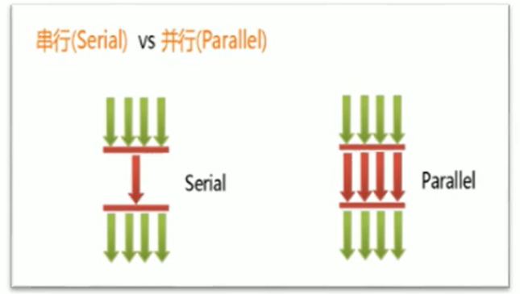
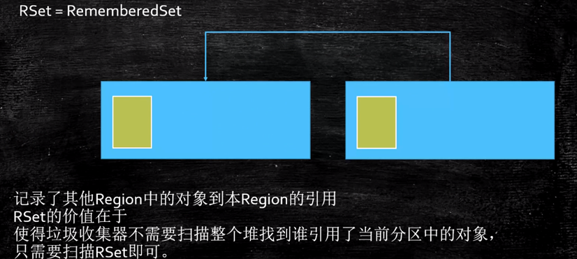

# 垃圾回收相关概念

## System.gc()的理解

在默认情况下，通过system.gc（）者Runtime.getRuntime().gc() 的调用，会显式触发FullGC，同时对老年代和新生代进行回收，尝试释放被丢弃对象占用的内存。

然而system.gc() )调用附带一个免责声明，无法保证对垃圾收集器的调用。(不能确保立即生效)。

JVM实现者可以通过system.gc() 调用来决定JVM的GC行为。而一般情况下，垃圾回收应该是自动进行的，无须手动触发，否则就太过于麻烦了。在一些特殊情况下，如我们正在编写一个性能基准，我们可以在运行之间调用System.gc()。

## 内存溢出

- 内存溢出相对于内存泄漏来说，尽管更容易被理解，但是同样的，内存溢出也是引发程序崩溃的罪魁祸首之一。
- 由于GC一直在发展，所以一般情况下，除非应用程序占用的内存增长速度非常快，造成垃圾回收已经跟不上内存消耗的速度，否则不太容易出现OOM的情况。
- 大多数情况下，GC会进行各种年龄段的垃圾回收，实在不行了就放大招，来一次独占式的Full GC操作，这时候会回收大量的内存，供应用程序继续使用。
- Javadoc中对OutofMemoryError的解释是，没有空闲内存，并且垃圾收集器也无法提供更多内存。

### 内存溢出（OOM）原因分析

1. Java虚拟机的堆内存设置不够。
   - 堆的大小不合理，比如我们要处理比较可观的数据量，但是没有显式指定JVM堆大小或者指定数值偏小。内存就是不够用。这时我们可以通过参数-Xms 、-Xmx来调整堆内存大小。
2. 代码中创建了大量大对象，并且长时间不能被垃圾收集器收集（存在被引用）
   - 对于老版本的Oracle  JDK，因为永久代的大小是有限的，并且JVM对永久代垃圾回收（如，常量池回收、卸载不再需要的类型）非常不积极，所以当我们不断添加新类型的时候，永久代出现OutOfMemoryError也非常多见。尤其是在运行时存在大量动态类型生成的场合；类似intern字符串缓存占用太多空间，也会导致OOM问题。对应的异常信息，会标记出来和永久代相关：“java.lang.OutOfMemoryError:PermGen space"。
   - 随着元数据区的引入，方法区内存已经不再那么窘迫，所以相应的OOM有所改观，出现OOM，异常信息则变成了：“java.lang.OutofMemoryError:Metaspace"。直接内存不足，也会导致OOM。

这里面隐含着一层意思是，在抛出OutofMemoryError之前，通常垃圾收集器会被触发，尽其所能去清理出空间。

- 例如：在引用机制分析中，涉及到JVM会去尝试回收软引用指向的对象等。
- 在java.nio.Bits.reserveMemory()方法中，我们能清楚的看到，System.gc()会被调用，以清理空间。

当然，也不是在任何情况下垃圾收集器都会被触发的，比如，我们去分配一个超大对象，类似一个超大数组超过堆的最大值，JVM可以判断出垃圾收集并不能解决这个问题，所以直接抛出OutofMemoryError。

## 内存泄漏

也称作“存储渗漏”。严格来说，只有对象不会再被程序用到了，但是GC又不能回收他们的情况，才叫内存泄漏。但实际情况很多时候一些不太好的实践（或疏忽）会导致对象的生命周期变得很长甚至导致00M，也可以叫做宽泛意义上的“内存泄漏”。

尽管内存泄漏并不会立刻引起程序崩溃，但是一旦发生内存泄漏，程序中的可用内存就会被逐步蚕食，直至耗尽所有内存，最终出现outofMemory异常，导致程序崩溃。

注意，这里的存储空间并不是指物理内存，而是指虚拟内存大小，这个虚拟内存大小取决于磁盘交换区设定的大小。

举例来说：

- 单例模式

  单例的生命周期和应用程序是一样长的，所以单例程序中，如果持有对外部对象的引用的话，那么这个外部对象是不能被回收的，则会导致内存泄漏的产生。

- 一些提供close的资源未关闭导致内存泄漏

  数据库连接（dataSourse.getConnection() ），网络连接（socket）和io连接必须手动close，否则是不能被回收的。

## Stop the World

- Stop-the-World，简称STW，指的是GC事件发生过程中，会产生应用程序的停顿。停顿产生时整个应用程序线程都会被暂停，没有任何响应，有点像卡死的感觉，这个停顿称为STW。
- 可达性分析算法中枚举根节点（GC Roots）会导致所有Java执行线程停顿，为什么需要停顿所有 Java 执行线程呢？
  1. 分析工作必须在一个能确保一致性的快照中进行
  2. 一致性指整个分析期间整个执行系统看起来像被冻结在某个时间点上
  3. 如果出现分析过程中对象引用关系还在不断变化，则分析结果的准确性无法保证
- 被STW中断的应用程序线程会在完成GC之后恢复，频繁中断会让用户感觉像是网速不快造成电影卡带一样，所以我们需要减少STW的发生。
- STW事件和采用哪款GC无关，所有的GC都有这个事件。哪怕是G1也不能完全避免Stop-the-world情况发生，只能说垃圾回收器越来越优秀，回收效率越来越高，尽可能地缩短了暂停时间。
- STW是JVM在后台自动发起和自动完成的。在用户不可见的情况下，把用户正常的工作线程全部停掉。
- 开发中不要用System.gc() ，这会导致Stop-the-World的发生。

## 垃圾回收的并行与并发

- 并发

  - 在操作系统中，是指一个时间段中有几个程序都处于已启动运行到运行完毕之间，且这几个程序都是在同一个处理器上运行。

  - 并发不是真正意义上的“同时进行”，只是CPU把一个时间段划分成几个时间片段（时间区间），然后在这几个时间区间之间来回切换，由于CPU处理的速度非常快，只要时间间隔处理得当，即可让用户感觉是多个应用程序同时在进行。

    

- 并行

  - 当系统有一个以上CPU时，当一个CPU执行一个进程时，另一个CPU可以执行另一个进程，两个进程互不抢占CPU资源，可以同时进行，我们称之为并行（Parallel）。

  - 其实决定并行的因素不是CPU的数量，而是CPU的核心数量，比如一个CPU多个核也可以并行。

  - 适合科学计算，后台处理等弱交互场景

    

- 并发与并行的对比

  - 并发，指的是多个事情，在同一时间段内同时发生了。
  - 并行，指的是多个事情，在同一时间点上（或者说同一时刻）同时发生了。
  - 并发的多个任务之间是互相抢占资源的。并行的多个任务之间是不互相抢占资源的。
  - 只有在多CPU或者一个CPU多核的情况中，才会发生并行。否则，看似同时发生的事情，其实都是并发执行的。

## 垃圾回收的并发与并行

并发和并行，在谈论垃圾收集器的上下文语境中，它们可以解释如下：

1. 并行（Parallel）：指多条垃圾收集线程并行工作，但此时用户线程仍处于等待状态。

   如ParNew、Parallel Scavenge、Parallel Old

2. 串行（Serial）

   - 相较于并行的概念，单线程执行。
   - 如果内存不够，则程序暂停，启动JVM垃圾回收器进行垃圾回收（单线程）

   

并发和并行，在谈论垃圾收集器的上下文语境中，它们可以解释如下：

并发（Concurrent）：指用户线程与垃圾收集线程同时执行（但不一定是并行的，可能会交替执行），垃圾回收线程在执行时不会停顿用户程序的运行。用户程序在继续运行，而垃圾收集程序线程运行于另一个CPU上，如：CMS、G1。

## 安全点与安全区域

### 安全点

程序执行时并非在所有地方都能停顿下来开始GC，只有在特定的位置才能停顿下来开始GC，这些位置称为“安全点（Safepoint）”。

Safe Point的选择很重要，如果太少可能导致GC等待的时间太长，如果太频繁可能导致运行时的性能问题。大部分指令的执行时间都非常短暂，通常会根据“是否具有让程序长时间执行的特征”为标准。比如：选择一些执行时间较长的指令作为Safe Point，如方法调用、循环跳转和异常跳转等。

如何在cc发生时，检查所有线程都跑到最近的安全点停顿下来呢？

- 主动式中断：设置一个中断标志，各个线程运行到Safe Point的时候主动轮询这个标志，如果中断标志为真，则将自己进行中断挂起。（有轮询的机制）

### 安全区域

Safepoint 机制保证了程序执行时，在不太长的时间内就会遇到可进入GC的Safepoint。但是，程序“不执行”的时候呢？例如线程处于sleep-状态或Blocked 状态，这时候线程无法响应JVM的中断请求，“走”到安全点去中断挂起，JVM也不太可能等待线程被唤醒。对于这种情况，就需要安全区域（Safe Region）来解决。

安全区域是指在一段代码片段中，对象的引用关系不会发生变化，在这个区域中的任何位置开始Gc都是安全的。我们也可以把Safe Region看做是被扩展了的Safepoint。

执行流程：

1. 当线程运行到Safe Region的代码时，首先标识已经进入了Safe Relgion，如果这段时间内发生GC，JVM会忽略标识为Safe Region状态的线程。
2. 当线程即将离开Safe Region时，会检查JVM是否已经完成GC，如果完成了，则继续运行，否则线程必须等待直到收到可以安全离开Safe Region的信号为止。

## 对象引用

1. 强引用（StrongReference）：最传统的“引用”的定义，是指在程序代码之中普遍存在的引用赋值，即类似“object obj=new Object()”这种引用关系。无论任何情况下，只要强引用关系还存在，垃圾收集器就永远不会回收掉被引用的对象。宁可报OOM，也不会GC强引用。
2. 软引用（SoftReference）：在系统将要发生内存溢出之前，将会把这些对象列入回收范围之中进行第二次回收。如果这次回收后还没有足够的内存，才会抛出内存溢出异常。
3. 弱引用（WeakReference）：被弱引用关联的对象只能生存到下一次垃圾收集之前。当垃圾收集器工作时，无论内存空间是否足够，都会回收掉被弱引用关联的对象。
4. 虚引用（PhantomReference）：一个对象是否有虚引用的存在，完全不会对其生存时间构成影响，也无法通过虚引用来获得一个对象的实例。为一个对象设置虚引用关联的唯一目的就是能在这个对象被收集器回收时收到一个系统通知。

### 强引用

1. 在Java程序中，最常见的引用类型是强引用（普通系统99%以上都是强引用），也就是我们最常见的普通对象引用，也是默认的引用类型。
2. 当在Java语言中使用new操作符创建一个新的对象，并将其赋值给一个变量的时候，这个变量就成为指向该对象的一个强引用。
3. 只要强引用的对象是可触及的，垃圾收集器就永远不会回收掉被引用的对象。只要强引用的对象是可达的，jvm宁可报OOM，也不会回收强引用。
4. 对于一个普通的对象，如果没有其他的引用关系，只要超过了引用的作用域或者显式地将相应（强）引用赋值为null，就是可以当做垃圾被收集了，当然具体回收时机还是要看垃圾收集策略。
5. 相对的，软引用、弱引用和虚引用的对象是软可触及、弱可触及和虚可触及的，在一定条件下，都是可以被回收的。所以，强引用是造成Java内存泄漏的主要原因之一。

### 软引用（Soft Reference）

1. 内存不足即回收。
2. 软引用是用来描述一些还有用，但非必需的对象。只被软引用关联着的对象，在系统将要发生内存溢出异常前，会把这些对象列进回收范围之中进行第二次回收，如果这次回收还没有足够的内存，才会抛出内存溢出异常。注意，这里的第一次回收是不可达的对象
3. 软引用通常用来实现内存敏感的缓存。比如：高速缓存就有用到软引用。如果还有空闲内存，就可以暂时保留缓存，当内存不足时清理掉，这样就保证了使用缓存的同时，不会耗尽内存。
4. 垃圾回收器在某个时刻决定回收软可达的对象的时候，会清理软引用，并可选地把引用存放到一个引用队列（Reference Queue）
5. 类似弱引用，只不过Java虚拟机会尽量让软引用的存活时间长一些，迫不得已才清理。
6. 一句话概括：当内存足够时，不会回收软引用可达的对象。内存不够时，会回收软引用的可达对象。

### 弱引用（Weak Reference）

1. 弱引用（Weak Reference）发现即回收
2. 弱引用也是用来描述那些非必需对象，只被弱引用关联的对象只能生存到下一次垃圾收集发生为止。在系统GC时，只要发现弱引用，不管系统堆空间使用是否充足，都会回收掉只被弱引用关联的对象。但是，由于垃圾回收器的线程通常优先级很低，因此，并不一定能很快地发现持有弱引用的对象。在这种情况下，弱引用对象可以存在较长的时间。
3. 弱引用和软引用一样，在构造弱引用时，也可以指定一个引用队列，当弱引用对象被回收时，就会加入指定的引用队列，通过这个队列可以跟踪对象的回收情况。
4. 软引用、弱引用都非常适合来保存那些可有可无的缓存数据。如果这么做，当系统内存不足时，这些缓存数据会被回收，不会导致内存溢出。而当内存资源充足时，这些缓存数据又可以存在相当长的时间，从而起到加速系统的作用。
5. 弱引用对象与软引用对象的最大不同就在于，当GC在进行回收时，需要通过算法检查是否回收软引用对象，而对于弱引用对象，GC总是进行回收。弱引用对象更容易、更快被GC回收。

### 虚引用（Phantom Reference）

1. 虚引用（Phantom Reference）：对象回收跟踪，也称为“幽灵引用”或者“幻影引用”，是所有引用类型中最弱的一个。
2. 一个对象是否有虚引用的存在，完全不会决定对象的生命周期。如果一个对象仅持有虚引用，那么它和没有引用几乎是一样的，随时都可能被垃圾回收器回收。
3. 它不能单独使用，也无法通过虚引用来获取被引用的对象。当试图通过虚引用的get()方法取得对象时，总是null 。即通过虚引用无法获取到我们的数据。
4. 为一个对象设置虚引用关联的唯一目的在于跟踪垃圾回收过程。比如：能在这个对象被收集器回收时收到一个系统通知。
5. 虚引用必须和引用队列一起使用。虚引用在创建时必须提供一个引用队列作为参数。当垃圾回收器准备回收一个对象时，如果发现它还有虚引用，就会在回收对象后，将这个虚引用加入引用队列，以通知应用程序对象的回收情况。
6. 由于虚引用可以跟踪对象的回收时间，因此，也可以将一些资源释放操作放置在虚引用中执行和记录。

# 垃圾回收器

## 垃圾回收器概述

1. 垃圾收集器没有在规范中进行过多的规定，可以由不同的厂商、不同版本的JVM来实现。
2. 由于JDK的版本处于高速迭代过程中，因此Java发展至今已经衍生了众多的GC版本。
3. 从不同角度分析垃圾收集器，可以将GC分为不同的类型。

## 垃圾收集器分类

- 按线程数分（垃圾回收线程数），可以分为串行垃圾回收器和并行垃圾回收器。

  1. 串行回收指的是在同一时间段内只允许有一个CPU用于执行垃圾回收操作，此时工作线程被暂停，直至垃圾收集工作结束。

     在诸如单CPU处理器或者较小的应用内存等硬件平台不是特别优越的场合，串行回收器的性能表现可以超过并行回收器和并发回收器。所以，串行回收默认被应用在客户端的Client模式下的JVM中。

     在并发能力比较强的CPU上，并行回收器产生的停顿时间要短于串行回收器。

  2. 和串行回收相反，并行收集可以运用多个CPU同时执行垃圾回收，因此提升了应用的吞吐量，不过并行回收仍然与串行回收一样，采用独占式，使用了“stop-the-world”机制。

  3. 简单理解，串行回收为单线程、并行回收为多线程。

- 按照工作模式分，可以分为并发式垃圾回收器和独占式垃圾回收器。

  

  1. 并发式垃圾回收器与应用程序线程交替工作，以尽可能减少应用程序的停顿时间。
  2. 独占式垃圾回收器（Stop the world）一旦运行，就停止应用程序中的所有用户线程，直到垃圾回收过程完全结束。

- 按碎片处理方式分，可分为压缩式垃圾回收器和非压缩式垃圾回收器。

  1. 压缩式垃圾回收器会在回收完成后，对存活对象进行压缩整理，消除回收后的碎片。
  2. 非压缩式的垃圾回收器不进行这步操作。

- 按工作的内存区间分，又可分为年轻代垃圾回收器和老年代垃圾回收器。

## 评估GC的性能指标

- 指标
  1. 吞吐量：运行用户代码的时间占总运行时间的比例（总运行时间 = 程序的运行时间 + 内存回收的时间）
  2. 垃圾收集开销：吞吐量的补数，垃圾收集所用时间与总运行时间的比例。
  3. 暂停时间：执行垃圾收集时，程序的工作线程被暂停的时间。
  4. 收集频率：相对于应用程序的执行，收集操作发生的频率。
  5. 内存占用：Java堆区所占的内存大小。
  6. 快速：一个对象从诞生到被回收所经历的时间。
  
  这三项里，暂停时间的重要性日益凸显。因为随着硬件发展，内存占用多些越来越能容忍，硬件性能的提升也有助于降低收集器运行时对应用程序的影响，即提高了吞吐量。而内存的扩大，对延迟反而带来负面效果。 简单来说，主要抓住两点：
  
  1. 吞吐量
  2. 暂停时间
  
- 吞吐量

  吞吐量就是CPU用于运行用户代码的时间与CPU总消耗时间的比值，即吞吐量=运行用户代码时间 /（运行用户代码时间+垃圾收集时间）

  - 比如：虚拟机总共运行了100分钟，其中垃圾收集花掉1分钟，那吞吐量就是99%。

  这种情况下，应用程序能容忍较高的暂停时间，因此，高吞吐量的应用程序有更长的时间基准，快速响应是不必考虑的

  吞吐量优先，意味着在单位时间内，STW的时间最短：06秒的时间内，停顿0.2+0.2=0.4秒。

  

- 暂停时间

  “暂停时间”是指一个时间段内应用程序线程暂停，让GC线程执行的状态。例如，GC期间100毫秒的暂停时间，意味着在这100毫秒期间内没有应用程序线程是活动的。
  暂停时间优先，意味着尽可能让单次STW的时间最短：0.1+0.1 + 0.1+ 0.1+ 0.1=0.5，但是总的GC时间可能会长。

  

- 吞吐量 vs 暂停时间

  1. 高吞吐量会让应用程序的最终用户感觉只有应用程序线程在做“生产性”工作。应用程序线程一直在工作，直觉上，吞吐量越高程序运行越快。
  2. 低暂停时间（低延迟）较好，是从最终用户的角度来看，不管是GC还是其他原因导致一个应用被挂起始终是不好的。这取决于应用程序的类型，有时候甚至短暂的200毫秒暂停都可能打断终端用户体验。因此，具有较低的暂停时间是非常重要的，特别是对于一个交互式应用程序（就是和用户交互比较多的场景）。
  3. 不幸的是”高吞吐量”和”低暂停时间”是一对相互竞争的目标（矛盾）。
     - 如果选择以吞吐量优先，那么必然需要降低内存回收的执行频率，但是这样会导致每次执行GC只会清理少量的垃圾，当垃圾积累到一定程度，那么GC就需要更长的暂停时间来执行内存回收。
     - 相反的，如果选择以低延迟优先为原则，那么为了降低每次执行内存回收时的暂停时间，也只能频繁地执行内存回收，使内存空间充裕，垃圾很少。但这又引起了年轻代内存的缩减和导致程序吞吐量的下降。
  4. 在设计（或使用）GC算法时，我们必须确定我们的目标：一个GC算法只可能针对两个目标之一（即只专注于较大吞吐量或最小暂停时间），或尝试找到一个二者的折衷。
  5. 现在标准：在最大吞吐量优先的情况下，降低停顿时间。

## 七种经典的垃圾回收器

- 串行回收器：Serial、Serial old
- 并行回收器：ParNew、Parallel Scavenge、Parallel old
- 并发回收器：CMS、G11

- 新生代收集器：Serial、ParNew、Parallel Scavenge
- 老年代收集器：Serial old、Parallel old、CMS
- 整堆收集器：G1
- 常见组合
  1. Serial/Serial old
  2. ParNew/CMS
  3. Parallel Scavenge/Parallel Old
  4. G1
- JDK14中：删除CMS垃圾回收器

### 查看默认垃圾收集器

- -XX:+PrintCommandLineFlags：查看命令行相关参数（包含使用的垃圾收集器）

- 使用命令行指令：jinfo -flag 相关垃圾回收器参数 进程ID

  

### Serial 回收器：串行回收

- Serial收集器是最基本、历史最悠久的垃圾收集器了。JDK1.3之前回收新生代唯一的选择。
- Serial收集器作为HotSpot中client模式下的默认新生代垃圾收集器。
- Serial收集器采用复制算法、串行回收和"stop-the-World"机制的方式执行内存回收。
- 除了年轻代之外，Serial收集器还提供用于执行老年代垃圾收集的Serial old收集器。Serial old收集器同样也采用了串行回收和"stop the World"机制，只不过内存回收算法使用的是标记-压缩算法。
  1. Serial old是运行在Client模式下默认的老年代的垃圾回收器
  2. Serial 0ld在Server模式下主要有两个用途：
     - 与新生代的Parallel scavenge配合使用
     - 作为老年代CMS收集器的后备垃圾收集方案
- 在HotSpot虚拟机中，使用-XX：+UseSerialGC参数可以指定年轻代和老年代都使用串行收集器。等价于新生代用Serial GC，且老年代用Serial old GC。

### ParNew回收器：并行回收

- 如果说serialGC是年轻代中的单线程垃圾收集器，那么ParNew收集器则是serial收集器的多线程版本。

  Par是Parallel的缩写，New：只能处理的是新生代

- ParNew 收集器除了采用并行回收的方式执行内存回收外，两款垃圾收集器之间几乎没有任何区别。ParNew收集器在年轻代中同样也是采用复制算法、"stop-the-World"机制。

- 对于新生代，回收次数频繁，使用并行方式高效。
- 对于老年代，回收次数少，使用串行方式节省资源。（CPU并行需要切换线程，串行可以省去切换线程的资源）
- 目前只有ParNew GC能与CMS收集器配合工作
- 在程序中，开发人员可以通过选项"-XX：+UseParNewGC"手动指定使用ParNew收集器执行内存回收任务。它表示年轻代使用并行收集器，不影响老年代。
- -XX:ParallelGCThreads限制线程数量，默认开启和CPU核数相同的线程数

### Parallel 回收器：吞吐量优先

1. Parallel Scavenge 回收器：吞吐量优先
   - HotSpot的年轻代中除了拥有ParNew收集器是基于并行回收的以外，Parallel Scavenge收集器同样也采用了复制算法、并行回收和"Stop the World"机制。
   - 和ParNew收集器不同，Parallel Scavenge收集器的目标则是达到一个可控制的吞吐量（Throughput），它也被称为吞吐量优先的垃圾收集器。
   - 自适应调节策略也是Parallel Scavenge与ParNew一个重要区别。（动态调整内存分配情况，以达到一个最优的吞吐量或低延迟）
   - 高吞吐量则可以高效率地利用CPU时间，尽快完成程序的运算任务，主要适合在后台运算而不需要太多交互的任务。因此，常见在服务器环境中使用。例如，那些执行批量处理、订单处理、工资支付、科学计算的应用程序。
   - Parallel收集器在JDK1.6时提供了用于执行老年代垃圾收集的Parallel Old收集器，用来代替老年代的Serial Old收集器。
2. Parallel Old收集器
   - Parallel Old收集器采用了标记-压缩算法，但同样也是基于并行回收和"Stop-the-World"机制。
3. 在Java8中，默认是PS-PO垃圾收集器。

### CMS 回收器：低延迟

- CMS收集器的关注点是尽可能缩短垃圾收集时用户线程的停顿时间。停顿时间越短（低延迟）就越适合与用户交互的程序，良好的响应速度能提升用户体验。
- CMS的垃圾收集算法采用标记-清除算法，并且也会"Stop-the-World"
- 使用CMS来收集老年代的时候，新生代只能选择ParNew或者Serial收集器中的一个。

#### 工作原理

整个过程分为4个主要阶段，即初始标记阶段、并发标记阶段、重新标记阶段和并发清除阶段。

涉及STW的阶段主要是：初始标记和重新标记

1. 初始标记（Initial-Mark）阶段

   在这个阶段中，程序中所有的工作线程都将会因为“Stop-the-World”机制而出现短暂的暂停，这个阶段的主要任务仅仅只是标记出GC Roots能直接关联到的对象。一旦标记完成之后就会恢复之前被暂停的所有应用线程。由于直接关联对象比较小，所以这里的速度非常快。

2. 并发标记（Concurrent-Mark）阶段

   从GC Roots的直接关联对象开始遍历整个对象图的过程，这个过程耗时较长但是不需要停顿用户线程，可以与垃圾收集线程一起并发运行。

3. 重新标记（Remark）阶段

   由于在并发标记阶段中，程序的工作线程会和垃圾收集线程同时运行或者交叉运行，因此为了修正并发标记期间，因用户程序继续运作而导致标记产生变动的那一部分对象的标记记录，这个阶段的停顿时间通常会比初始标记阶段稍长一些，并且也会导致“Stop-the-World”的发生，但也远比并发标记阶段的时间短。

4. 并发清除（Concurrent-Sweep）阶段

   此阶段清理删除掉标记阶段判断的已经死亡的对象，释放内存空间。由于不需要移动存活对象，所以这个阶段也是可以与用户线程同时并发的。

#### CMS分析

1. 尽管CMS收集器采用的是并发回收（非独占式），但是在其初始化标记和重新标记这两个阶段中仍然需要执行“Stop-the-World”机制暂停程序中的工作线程，不过暂停时间并不会太长，目前所有的垃圾收集器都做不到完全不需要“Stop-the-World”，只是尽可能地缩短暂停时间。
2. 由于最耗费时间的并发标记与并发清除阶段都不需要暂停工作，所以整体的回收是低停顿的。
3. 由于在垃圾收集阶段用户线程没有中断，所以在CMS回收过程中，还应该确保应用程序用户线程有足够的内存可用。因此，CMS收集器不能像其他收集器那样等到老年代几乎完全被填满了再进行收集，而是当堆内存使用率达到某一阈值时，便开始进行回收，以确保应用程序在CMS工作过程中依然有足够的空间支持应用程序运行。要是CMS运行期间预留的内存无法满足程序需要，就会出现一次“Concurrent Mode Failure” 失败，这时虚拟机将启动后备预案：临时启用Serial old收集器来重新进行老年代的垃圾收集，这样停顿时间就很长了。
4. CMS收集器的垃圾收集算法采用的是标记清除算法，这意味着每次执行完内存回收后，由于被执行内存回收的无用对象所占用的内存空间极有可能是不连续的一些内存块，不可避免地将会产生一些内存碎片。那么CMS在为新对象分配内存空间时，将无法使用指针碰撞（Bump the Pointer）技术，而只能够选择空闲列表（Free List）执行内存分配。

#### CMS为什么不使用标记整理算法？

因为当并发清除的时候，用Compact整理内存的话，原来的用户线程使用的内存还怎么用呢？要保证用户线程能继续执行，前提的它运行的资源不受影响嘛。Mark Compact更适合“stop the world” 这种场景下使用。

#### 优点

1. 并发收集
2. 低延迟

#### 缺点

1. 会产生内存碎片，导致并发清除后，用户线程可用的空间不足。在无法分配大对象的情况下，不得不提前触发FullGC。交给serial old进行清理。

2. CMS收集器对CPU资源非常敏感。在并发阶段，它虽然不会导致用户停顿，但是会因为占用了一部分线程而导致应用程序变慢，总吞吐量会降低。

3. 并发清理过程中会再次产生垃圾，成为浮动垃圾，交给下一轮的回收处理。

4. CMS收集器无法处理浮动垃圾。

   可能出现“Concurrent Mode Failure"失败而导致另一次Full GC的产生。在并发标记阶段由于程序的工作线程和垃圾收集线程是同时运行或者交叉运行的，那么在并发标记阶段如果产生新的垃圾对象，CMS将无法对这些垃圾对象进行标记，最终会导致这些新产生的垃圾对象没有被及时回收，从而只能在下一次执行GC时释放这些之前未被回收的内存空间。

CMS默认启动的线程数是（ParallelGCThreads +3）/4，ParallelGCThreads是年轻代并行收集器的线程数。当CPU资源比较紧张时，受到CMS收集器线程的影响，应用程序的性能在垃圾回收阶段可能会非常糟糕。

### G1 回收器：区域化分代式收集

为什么名字叫 Garbage First(G1)呢？

因为G1是一个并行回收器，它把堆内存分割为很多不相关的区域（Region）（物理上不连续的）。使用不同的Region来表示Eden、幸存者0区，幸存者1区，老年代等。

G1 GC有计划地避免在整个Java堆中进行全区域的垃圾收集。G1跟踪各个Region里面的垃圾堆积的价值大小（回收所获得的空间大小以及回收所需时间的经验值），在后台维护一个优先列表，每次根据允许的收集时间，优先回收价值最大的Region。

由于这种方式的侧重点在于回收垃圾最大量的区间（Region），所以我们给G1一个名字：垃圾优先（Garbage First）。

G1（Garbage-First）是一款面向服务端应用的垃圾收集器，主要针对配备多核CPU及大容量内存的机器，以极高概率满足GC停顿时间的同时，还兼具高吞吐量的性能特征。

#### G1垃圾收集器的优点

与其他GC收集器相比，G1使用了全新的分区算法，其特点如下所示：

- 并行与并发
  1. 并行性：G1在回收期间，可以有多个GC线程同时工作，有效利用多核计算能力。此时用户线程STW
  2. 并发性：G1拥有与应用程序交替执行的能力，部分工作可以和应用程序同时执行，因此，一般来说，不会在整个回收阶段发生完全阻塞应用程序的情况。
- 分代收集
  1. 从分代上看，G1依然属于分代型垃圾回收器，它会区分年轻代和老年代，年轻代依然有Eden区和Survivor区。但从堆的结构上看，它不要求整个Eden区、年轻代或者老年代都是连续的，也不再坚持固定大小和固定数量。
  2. 将堆空间分为若干个区域（Region），这些区域中包含了逻辑上的年轻代和老年代。
  3. 和之前的各类回收器不同，它同时兼顾年轻代和老年代。而不是像其他回收器一样，或者工作在年轻代，或者工作在老年代。
- 压缩空闲空间不会延长GC的暂停时间
- 更易预测的GC暂停时间
- 适用不需要实现很高的吞吐量的场景

#### 分区Region：化整为零

- 使用G1收集器时，它将整个Java堆划分成约2048个大小相同的独立Region块，每个Region块大小根据堆空间的实际大小而定，整体被控制在1MB到32MB之间，且为2的N次幂，即1MB，2MB，4MB，8MB，16MB，32MB。可以通过-XX:G1HeapRegionsize设定。所有的Region大小相同，且在JVM生命周期内不会被改变。

- 虽然还保留有新生代和老年代的概念，但新生代和老年代不再是物理隔离的了，它们都是一部分Region（不需要连续）的集合。通过Region的动态分配方式实现逻辑上的连续。

  

- 一个region有可能属于Eden，Survivor或者old/Tenured内存区域。但是在同一时刻一个region只可能属于一个角色。

- G1垃圾收集器还增加了一种新的内存区域，叫做Humongous内存区域，如图中的H块。主要用于存储大对象，如果超过1.5个region，就放到H。

  设置H的原因：对于堆中的大对象，默认直接会被分配到老年代，但是如果它是一个短期存在的大对象就会对垃圾收集器造成负面影响。为了解决这个问题，G1划分了一个Humongous区，它用来专门存放大对象。如果一个H区装不下一个大对象，那么G1会寻找连续的H区来存储。为了能找到连续的H区，有时候不得不启动Full Gc。G1的大多数行为都把H区作为老年代的一部分来看待。

- 每个Region内部都是通过指针碰撞来分配空间。

  

#### 空间整合

- CMS：“标记-清除”算法、内存碎片、若干次Gc后进行一次碎片整理
- G1将内存划分为一个个的region。内存的回收是以region作为基本单位的。Region之间是复制算法，但整体上实际可看作是标记-压缩（Mark-Compact）算法，两种算法都可以避免内存碎片。这种特性有利于程序长时间运行，分配大对象时不会因为无法找到连续内存空间而提前触发下一次GC。尤其是当Java堆非常大的时候，G1的优势更加明显。

#### 可预测的停顿时间模型（即：软实时soft real-time） 

这是G1相对于CMS的另一大优势，G1除了追求低停顿外，还能建立可预测的停顿时间模型，能让使用者明确指定在一个长度为M毫秒的时间片段内，消耗在垃圾收集上的时间不得超过N毫秒。

由于分区的原因，G1可以只选取部分区域进行内存回收，这样缩小了回收的范围，因此对于全局停顿情况的发生也能得到较好的控制。
G1跟踪各个Region里面的垃圾堆积的价值大小（回收所获得的空间大小以及回收所需时间的经验值），在后台维护一个优先列表，每次根据允许的收集时间，优先回收价值最大的Region。保证了G1收集器在有限的时间内可以获取尽可能高的收集效率。

相比于CMSGC，G1未必能做到CMS在最好情况下的延时停顿，但是最差情况要好很多。

#### G1垃圾收集器的缺点

相较于CMS，G1还不具备全方位、压倒性优势。比如在用户程序运行过程中，G1无论是为了垃圾收集产生的内存占用（Footprint）还是程序运行时的额外执行负载（overload）都要比CMS要高。

从经验上来说，在小内存应用上CMS的表现大概率会优于G1，而G1在大内存应用上则发挥其优势。平衡点在6-8GB之间。

#### G1垃圾回收流程

G1 GC的垃圾回收过程主要包括如下三个环节：

- 年轻代GC（Young GC）
- 老年代并发标记过程（Concurrent Marking）
- 混合回收（Mixed GC）
- （如果需要，单线程、独占式、高强度的Full GC还是继续存在的。它针对GC的评估失败提供了一种失败保护机制，即强力回收。）
- young gc->young gc+concurrent mark->Mixed GC顺序，进行垃圾回收。

1. 应用程序分配内存，当年轻代的Eden区用尽时开始年轻代回收过程；G1的年轻代收集阶段是一个并行的独占式收集器。在年轻代回收期，G1 GC暂停所有应用程序线程，启动多线程执行年轻代回收。然后从年轻代区间移动存活对象到Survivor区间或者老年区间，也有可能是两个区间都会涉及。
2. 当堆内存使用达到一定值（默认45%）时，开始老年代并发标记过程。
3. 标记完成马上开始混合回收过程。对于一个混合回收期，G1 GC从老年区间移动存活对象到空闲区间，这些空闲区间也就成为了老年代的一部分。和年轻代不同，老年代的G1回收器和其他GC不同，G1的老年代回收器不需要整个老年代被回收，一次只需要扫描/回收一小部分老年代的Region就可以了。同时，这个老年代Region是和年轻代一起被回收的。
4. 举个例子：一个Web服务器，Java进程最大堆内存为4G，每分钟响应1500个请求，每45秒钟会新分配大约2G的内存。G1会每45秒钟进行一次年轻代回收，每31个小时整个堆的使用率会达到45%，会开始老年代并发标记过程，标记完成后开始四到五次的混合回收。

#### Remembered Set（记忆集）

- 问题

  一个对象被不同区域引用的问题

  一个Region不可能是孤立的，一个Region中的对象可能被其他任意Region中对象引用，判断对象存活时，是否需要扫描整个Java堆才能保证准确

  在其他的分代收集器，也存在这样的问题（而G1更突出，因为G1主要针对大堆）

  回收新生代也不得不同时扫描老年代？这样的话会降低Minor GC的效率

- RSet

  - 在每个region中，会有一小块的空间，用来存储其他region中的对象到当前region中对象的引用，扫描的时候，没有引用关系的就是垃圾了，方便GC  这个空间实际是用哈希表来实现的。

  - 无论G1还是其他分代收集器，JVM都是使用Remembered Set来避免全堆扫描。

  - 每个Region都有一个对应的Remembered Set

  - 每次Reference类型数据写操作时，都会产生一个Write Barrier暂时中断操作，然后检查将要写入的引用指向的对象，是否和该引用类型数据在不同的Region（其他收集器：检查老年代对象是否引用了新生代对象）。

    如果不同，通过CardTable把相关引用信息记录到引用指向对象的所在Region对应的Remembered Set中。

  - 当进行垃圾收集时，在GC根节点的枚举范围加入Remembered Set，就可以保证不进行全局扫描，也不会有遗漏。

    

- 

- Region中哪些对象被外部引用指向，比如Old区中的对象会指向Eden区的对象，然后当我们要回收某个Region的时候，直接遍历当前Region中的所有对象就可以了，然后针对性的去找到那些指向当前对象的其他对象，最终发现当前对象是否是根可达的，如果不是，那就应该被删除，其实之前的垃圾回收器都涉及到这个问题，当进行Minor GC的时候，通过GC Roots查找的时候还需要遍历Old区的对象，毕竟Old区对象也可能会指向Eden区对象，但是G1通过Rset避免了全堆的扫描，当引用类型数据写操作时，先暂时中断，然后判断当前引用类型数据是否被其他对象所指向，如果不被指向，那就直接放在Region中就可以了；如果被其他对象指向，那么还要判断这个对象是在当前要插入的Region中，还是在其他Region中；如果在其他Region中，那就需要使用CardTable把当前引用类型数据的指向信息放在Rset中，也就是形成上面的虚线连线，如果在当前Region中，那就不需要指向了，毕竟到时候我们会进行遍历查找根可达对象，那肯定会找到的，所以这种情况也是直接放在Region中就可以了。

#### card table

扫描垃圾的时候，首先根据根root来扫描年轻代，如果发现一个对象引用了老年代的某个对象，然后老年代的对象又引用了年轻代的对象。这种情况下需要扫描整个old区才能找到真正的垃圾，会导致效率偏低，所以JVM引入card table的概念，几个region组成一个card，然后统一通过card table来进行管理，card table实际结构是bitMap实现 ，一位一位的，类似010001001001，比如标记为1的card，代表card中存在对象引用了年轻代的对象，就将此对象所在的card标记为dirty card，下次扫描的时候，只需要扫描dirty的就可以了。

#### 脏卡表队列作用：

Reset更新需要线程同步，所以开销会很大，因此不能实时更新，因此我们需要把引用对象被其他对象引用的关系放在一个脏卡表队列中，当年轻代回收的时候会进行STW，所以我们也正好把脏卡表队列中的值更新到Rset中，这样不仅没有涉及到开销问题，还可以保证Rset中的数据是准确的。

#### CollectionSet

- 记录了GC可被回收收集的Region集合
- 在CSet中存活的数据会在GC过程中被移动到另一个可用分区，CSet中的分区可以来自Eden空间、survivor空间、或者老年代。CSet会占用不到整个堆空间的1%大小。

#### 三⾊标记算法

在并发标记阶段，对象的状态可能发⽣改变，GC在进⾏可达性分析算法分析对象时，⽤三色来标识对象的状态

- 白色：未被标记过的对象，也就是还没有扫描过的对象。
- 灰色：被扫描过的对象，但是对象内对其他对象的引用还没有扫描，也就是没有扫描完全的情况下，灰色标记。
- 黑色：自身以及成员变量均已经标记完成的对象。

三色标记会产生漏标的情况，也就是说A标记完成，B也标记完成了。但是此时B对D的引用消失了，增加了A对D的引用。因为B此时已经是灰色的了，自身标记完成，应该找child了，但是引用消失了，D也就找不到了。虽然增加了A对D的引用，但是A是黑色的，也不会再扫描了，所以就产生了漏标的情况。

满足两个条件才会发生漏标

1. 灰色引用消失
2. 新增加了黑色引用。

从B找不到D了，并且A为黑色的，不会再找关联对象了，此时D会被当作垃圾回收掉，但是D实际不是垃圾，这就是漏标产生的后果。

只要打破上述两个调剂即可解决漏标

1. CMS中使用的算法，增量更新。

   当黑色新增引用到白色，会把黑色变为灰色，然后重新扫描。但是效率会有问题，每次都要重头开始重新扫描。

2. G1中使用的算法。关注引用的删除（SATB）。

   当灰色指向白色的引用消失的时候，不是直接删除，会把引用放到GC中单独开辟的一块独立的堆栈中，重新扫描的时候还会被GC扫描到。

为什么G1用SATB?

1. 灰色→白色引用消失时，如果没有黑色指向白色，引用会被push到堆栈
2. 下次扫描时拿到这个引用，由于有RSet的存在，不需要扫描整个堆去查找指向白色的引用，效率比较高
3. SATB配合RSet，浑然天成

#### G1回收过程

##### 年轻代 GC

- JVM启动时，G1先准备好Eden区，程序在运行过程中不断创建对象到Eden区，当Eden空间耗尽时，G1会启动一次年轻代垃圾回收过程。
- 年轻代回收只回收Eden区和Survivor区
- YGC时，首先G1停止应用程序的执行（Stop-The-World），G1创建回收集（Collection Set），回收集是指需要被回收的内存分段的集合，年轻代回收过程的回收集包含年轻代Eden区和Survivor区所有的内存分段。

细致过程

1. 第一阶段，扫描根：可以体现Rset作用：避免全堆扫描

   根是指static变量指向的对象、正在执行的方法调用链条上的局部变量等GC Roots。根引用连同RSet记录的外部引用作为扫描存活对象的入口。

2. 第二阶段，更新RSet，保证Rset中的数据准确性

   处理dirty card queue中的card，更新RSet。此阶段完成后，RSet可以准确的反映老年代对所在的内存分段中对象的引用。

3. 第三阶段，处理RSet：根可达性遍历的一部分

   识别被老年代对象指向的Eden中的对象，这些被指向的Eden中的对象被认为是存活的对象。

4. 第四阶段，复制对象。

   此阶段，对象树被遍历，Eden区内存段中存活的对象会被复制到Survivor区中空的内存分段，Survivor区内存段中存活的对象如果年龄未达阈值，年龄会加1，达到阀值会被复制到old区中空的内存分段。如果Survivor空间不够，Eden空间的部分数据会直接晋升到老年代空间。

5. 第五阶段，处理引用

   处理Soft，Weak，Phantom，Final，JNI Weak 等引用。最终Eden空间的数据为空，GC停止工作，而目标内存中的对象都是连续存储的，没有碎片，所以复制过程可以达到内存整理的效果，减少碎片。

##### 并发标记

1. 初始标记阶段：标记从根节点直接可达的对象。这个阶段是STW的，并且会触发一次年轻代GC。正是由于该阶段时STW的，所以我们只扫描根节点可达的对象，以节省时间。

2. 根区域扫描（Root Region Scanning）：G1 GC扫描Survivor区直接可达的老年代区域对象，并标记被引用的对象。这一过程必须在Young GC之前完成，因为Young GC会使用复制算法对Survivor区进行GC。

3. 并发标记（Concurrent Marking）：

   - 在整个堆中进行并发标记（和应用程序并发执行），此过程可能被Young GC中断。
   - 在并发标记阶段，若发现区域对象中的所有对象都是垃圾，那这个区域会被立即回收。
   - 并发标记过程中，会计算每个区域的对象活性（区域中存活对象的比例）。

4. 再次标记（Remark）：由于应用程序持续进行，需要修正上一次的标记结果。是STW的。G1中采用了比CMS更快的原始快照算法：Snapshot-At-The-Beginning（SATB）。

5. 独占清理（cleanup，STW）：计算各个区域的存活对象和GC回收比例，并进行排序，识别可以混合回收的区域。为下阶段做铺垫。是STW的。这个阶段并不会实际上去做垃圾的收集。

   其实是一个统计计算过程，不会涉及垃圾清理

6. 并发清理阶段：识别并清理完全空闲的区域。

##### 混合回收

当越来越多的对象晋升到老年代Old Region时，为了避免堆内存被耗尽，虚拟机会触发一个混合的垃圾收集器，即Mixed GC，该算法并不是一个Old GC，除了回收整个Young Region，还会回收一部分的Old Region。这里需要注意：是一部分老年代，而不是全部老年代。可以选择哪些Old Region进行收集，从而可以对垃圾回收的耗时时间进行控制。也要注意的是Mixed GC并不是Full GC。

1. 并发标记结束以后，老年代中百分百为垃圾的内存分段被回收了，部分为垃圾的内存分段被计算了出来。默认情况下，这些老年代的内存分段会分8次（可以通过-XX:G1MixedGCCountTarget设置）被回收。【意思就是一个Region会被分为8个内存段】
2. 混合回收的回收集（Collection Set）包括八分之一的老年代内存分段，Eden区内存分段，Survivor区内存分段。混合回收的算法和年轻代回收的算法完全一样，只是回收集多了老年代的内存分段。具体过程请参考上面的年轻代回收过程。
3. 由于老年代中的内存分段默认分8次回收，G1会优先回收垃圾多的内存分段。垃圾占内存分段比例越高的，越会被先回收。并且有一个阈值会决定内存分段是否被回收。XX:G1MixedGCLiveThresholdPercent，默认为65%，意思是垃圾占内存分段比例要达到65%才会被回收。如果垃圾占比太低，意味着存活的对象占比高，在复制的时候会花费更多的时间。
4. 混合回收并不一定要进行8次。有一个阈值-XX:G1HeapWastePercent，默认值为10%，意思是允许整个堆内存中有10%的空间被浪费，意味着如果发现可以回收的垃圾占堆内存的比例低于10%，则不再进行混合回收。因为GC会花费很多的时间但是回收到的内存却很少。

##### G1 回收可选的过程：Full GC

1. G1的初衷就是要避免Full GC的出现。但是如果上述方式不能正常工作，G1会停止应用程序的执行（Stop-The-World），使用单线程的内存回收算法进行垃圾回收，性能会非常差，应用程序停顿时间会很长。
2. 要避免Full GC的发生，一旦发生Full GC，需要对JVM参数进行调整。什么时候会发生Ful1GC呢？比如堆内存太小，当G1在复制存活对象的时候没有空的内存分段可用，则会回退到Full GC，这种情况可以通过增大内存解决。

#### G1 回收器的优化建议

1. 年轻代大小

   避免使用-Xmn或-XX:NewRatio等相关选项显式设置年轻代大小，因为固定年轻代的大小会覆盖可预测的暂停时间目标。我们让G1自己去调整

2. 暂停时间目标不要太过严苛

   - G1 GC的吞吐量目标是90%的应用程序时间和10%的垃圾回收时间
   - 评估G1 GC的吞吐量时，暂停时间目标不要太严苛。目标太过严苛表示你愿意承受更多的垃圾回收开销，而这些会直接影响到吞吐量。

# 垃圾回收器总结

## 怎么选择垃圾回收器

1. 优先调整堆的大小让JVM自适应完成。
2. 如果内存小于100M，使用串行收集器
3. 如果是单核、单机程序，并且没有停顿时间的要求，串行收集器
4. 如果是多CPU、需要高吞吐量、允许停顿时间超过1秒，选择并行或者JVM自己选择
5. 如果是多CPU、追求低停顿时间，需快速响应（比如延迟不能超过1秒，如互联网应用），使用并发收集器
6. 官方推荐G1，性能高。现在互联网的项目，基本都是使用G1。