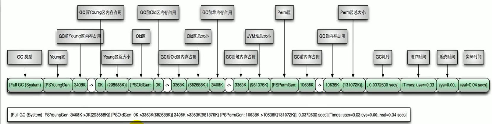

# GC 日志分析

内存分配与垃圾回收的参数列表

1.  -XX:+PrintGC ：输出GC日志。类似：-verbose:gc
2.  -XX:+PrintGCDetails ：输出GC的详细日志
3.  -XX:+PrintGCTimestamps ：输出GC的时间戳（以基准时间的形式）
4.  -XX:+PrintGCDatestamps ：输出GC的时间戳（以日期的形式，如2013-05-04T21: 53: 59.234 +0800）
5.  -XX:+PrintHeapAtGC ：在进行GC的前后打印出堆的信息
6.  -Xloggc:…/logs/gc.log ：日志文件的输出路径

## GC日志详情

-XX:+PrintGCDetails

1. “[GC"和”[Full GC"说明了这次垃圾收集的停顿类型，如果有"Full"则说明GC发生了"Stop The World"
2. 使用Serial收集器在新生代的名字是Default New Generation，因此显示的是"[DefNew"
3. 使用ParNew收集器在新生代的名字会变成"[ParNew"，意思是"Parallel New Generation"
4. 使用Parallel scavenge收集器在新生代的名字是”[PSYoungGen"
5. 老年代的收集和新生代道理一样，名字也是收集器决定的
6. 使用G1收集器的话，会显示为"garbage-first heap"
7. Allocation Failure表明本次引起GC的原因是因为在年轻代中没有足够的空间能够存储新的数据了。
8. [ PSYoungGen: 5986K->696K(8704K) ] 5986K->704K (9216K)
   -   中括号内：GC回收前年轻代大小，回收后大小，（年轻代总大小）
   -   括号外：GC回收前年轻代和老年代大小，回收后大小，（年轻代和老年代总大小）
9. user代表用户态回收耗时，sys内核态回收耗时，real实际耗时。由于多核线程切换的原因，时间总和可能会超过real时间

## YGC

## Full GC

