# JVM命令行

## jps

- 显示指定系统内所有的HotSpot虚拟机进程(查看虚拟机进程信息)，可用于查询正在运行的虚拟机进程。

- 说明:对于本地虚拟机进程来说，进程的本地虚拟机ID与操作系统的进程ID是一致的，是唯一的。

  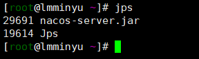

- -q

  仅仅显示LVMID (local virtual machine id)，即本地虚拟机唯一id。不显示主类的名称等

- -l

  输出应用程序主类的全类名

  如果进程执行的是jar包，则输出jar完整路径

  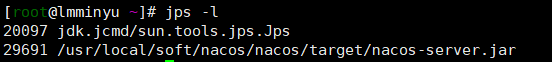

- -m

  输出虚拟机进程启动时传递给主类main()的参数

  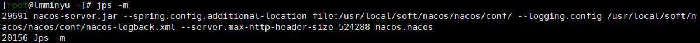

- -v

  列出虚拟机进程启动时的VM参数。比如:-Xms20m -Xmx50m是启动程序指定的jvm参数。

  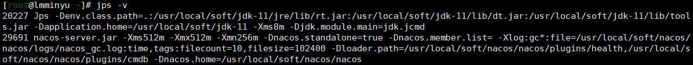

- -XX:-UsePerfData，那么jps命令（以及jstat）将无法探知该java进程。

- 综合使用：
  jps -l -m等价于jps -lm

- 如何将信息输出到同级文件中
  语法：命令 > 文件名称
  例如：jps -l > a.txt

## jstat

jstat(JVM Statistics Monitoring Tool)：用于监视虚拟机各种运行状态信息的命令行工具。它可以显示本地或者远程虚拟机进程中的类装载、内存、垃圾收集、IT编译等运行数据。

option参数

- -class

  显示ClassLoader的相关信息:类的装载、卸载数量、总空间、类装载所消耗的时间等

  ```properties
  jstat -class -t -h3 29691 1000 10
  #h3中的3代表每隔3个分隔一次，29691代表类的进程id，1000代表每隔1000毫秒打印一次，10代表一共打印10次
  ```

  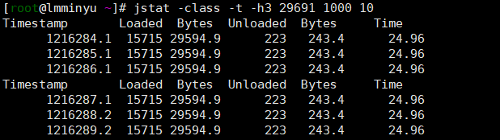

  | Timestamp代表程序至今的运行时间，单位为秒 | Loaded代表加载的类的数目    | Bytes代表加载的类的总字节数 |
  | ----------------------------------------- | --------------------------- | --------------------------- |
  | Unloaded代表卸载的类的数目                | Bytes代表卸载的类的总字节数 | Time代表类装载所消耗的时间  |

- -gc

  显示与GC相关的堆信息。包括Eden区、两个Survivor区、老年代、永久代等的容量、已用空间、GC时间合计等信息。

  ```properties
  jstat -gc 29691 1000 10
  ```

  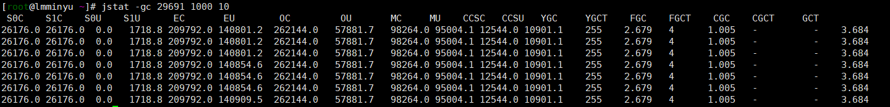

  | S0C代表幸存者0区的总容量    | S1C代表幸存者1区的总容量         | S0U代表幸存者0区使用的容量 |
  | --------------------------- | -------------------------------- | -------------------------- |
  | S1U代表幸存者1区使用的容量  | EC代表伊甸园区的总容量           | EU代表伊甸园区使用的总容量 |
  | OC代表老年代的总容量        | OU代表老年代已经使用的容量       | MC代表方法区的总容量       |
  | MU代表方法区的总容量        | CCSC代表压缩类的总容量           | CCSU代表压缩类使用的容量   |
  | YGC代表年轻代垃圾回收的次数 | YGCT年轻代进行垃圾回收需要的时间 | FGC代表代表Full GC的次数   |
  | FGCT代表Full GC的时间       | GCT代表垃圾回收的总时间          |                            |

- -gccapacity

  显示内容与-gc基本相同，但输出主要关注Java堆各个区域使用到的最大、最小空间。

  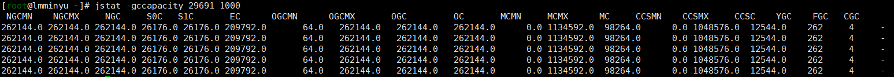

- -gcutil

  显示内容与-gc基本相同，但输出主要关注已使用空间占总空间的百分比。

  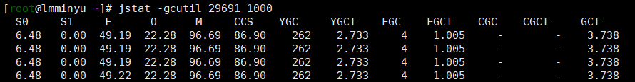

- -gccause

  与-gcutil功能一样，但是会额外输出导致最后一次或当前正在发生的GC产生的原因。

  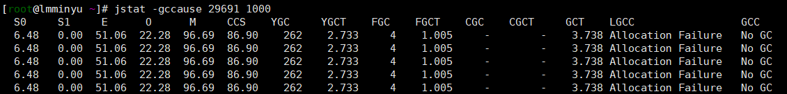

- -gcnew

  显示新生代Gc状况

  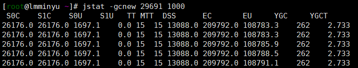

- -gcnewcapacity

  显示内容与-gcnew基本相同，输出主要关注使用到的最大、最小空间

- -geold

  显示老年代Gc状况

- -gcoldcapacity

  显示内容与-gcold基本相同，输出主要关注使用到的最大、最小空间

- -gcpermcapacity

  显示永久代使用到的最大、最小空间。

其他辅助参数

- interval参数

  用于指定输出统计数据的周期，单位为毫秒。即:查询间隔

- count参数

  用于指定查询的总次数

- -t参数

  可以在输出信息前加上一个Timestamp列，显示程序的运行时间。单位:秒

- -h参数

  可以在周期性数据输出时，输出多少行数据后输出一个表头信息

## jinfo

- 查看虚拟机配置参数信息，也可用于调整虚拟机的配置参数。

- 在很多情况卡，Java应用程序不会指定所有的Java虚拟机参数。而此时，开发人员可能不知道某一个具体的Java虚拟机参数的默认值。在这种情况下，可能需要通过查找文档获取某个参数的默认值。这个查找过程可能是非常艰难的。但有了jinfo工具，开发人员可以很方便地找到Java虚拟机参数的当前值。

- jinfo -sysprops pid

  可以查看由System.getProperties()取得的参数

  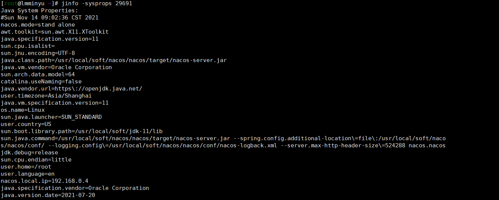

- jinfo -flags pid

  查看曾经赋过值的一些参数

  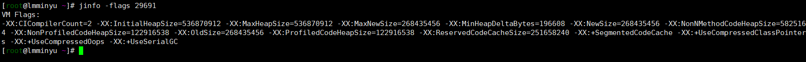

- jinfo -flag 参数名称 pid

  查看某个java进程的具体参数信息

- jinfo不仅可以查看运行时某一个Java虚拟机参数的实际取值，甚至可以在运行时修改部分参数，并使之立即生效。但是，并非所有参数都支持动态修改。参数只有被标记为manageable的flag可以被实时修改。其实，这个修改能力是极其有限的。

  ```java
  java -XX:+PrintFlagsFinal -version | grep manageable
  ```

  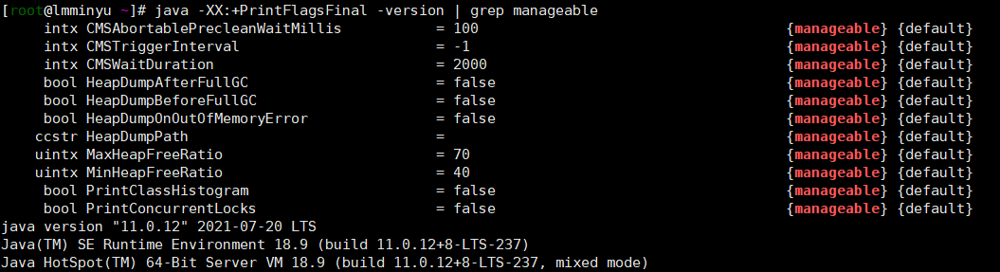

- java -XX:+PrintFlagsInitial

  查看所有JVM参数启动的初始值

- java -XX:+PrintFlagsFinal

  查看所有JVM参数的最终值

- java -参数名称:+PrintCommandLineFlags

  查看那些已经被用户或者JVM设置过的详细的XX参数的名称和值

## jmap

- jmap(JVM Memory Map)：作用一方面是获取dump文件（堆转储快照文件，二进制文件），它还可以获取目标Java进程的内存相关信息，包括Java堆各区域的使用情况、堆中对象的统计信息、类加载信息等。

- 由于jmap将访问堆中的所有对象，为了保证在此过程中不被应用线程干扰，jmap需要借助安全点机制，让所有线程停留在不改变堆中数据的状态。也就是说，由jmap导出的堆快照必定是安全点位置的。这可能导致基于该堆快照的分析结果存在偏差。举个例子，假设在编译生成的机器码中，某些对象的生命周期在两个安全点之间，那么: live选项将无法探知到这些对象。另外，如果某个线程长时间无法跑到安全点，jmap将一直等下去。

- jstat则不同，垃圾回收器会主动将jstat所需要的摘要数据保存至固定位置之中而jstat只需直接读取即可。

- -dump

  生成Java堆转储快照：dump文件，特别的：-dump:live只保存堆中的存活对象。

  ```java
  1.jmap -dump:format=b,file=<filename.hprof> <pid>
  2.jmap -dump:live,format=b,file=<filename.hprof> <pid>
  ```

  filename是文件名称，而.hprof是后缀名
  format=b表示生成的是标准的dump文件，用来进行格式限定

- -heap

  输出整个堆空间的详细信息，包括GC的使用、堆配置信息，以及内存的使用信息等

  ```java
  jmap -heap 29691 //如果报错，使用jhsdb
  jhsdb jmap --heap --pid 29691
  ```

  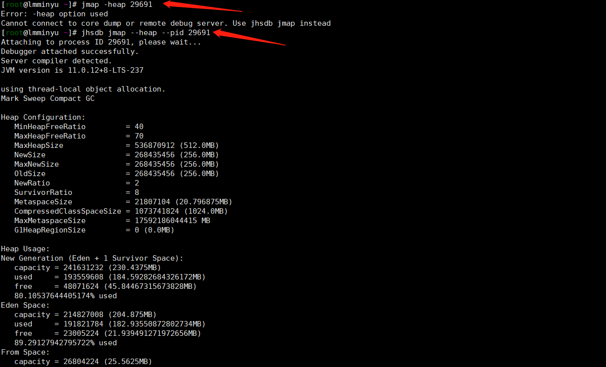

- -histo

  输出堆中对象的同级信息，包括类、实例数量和合计容量

  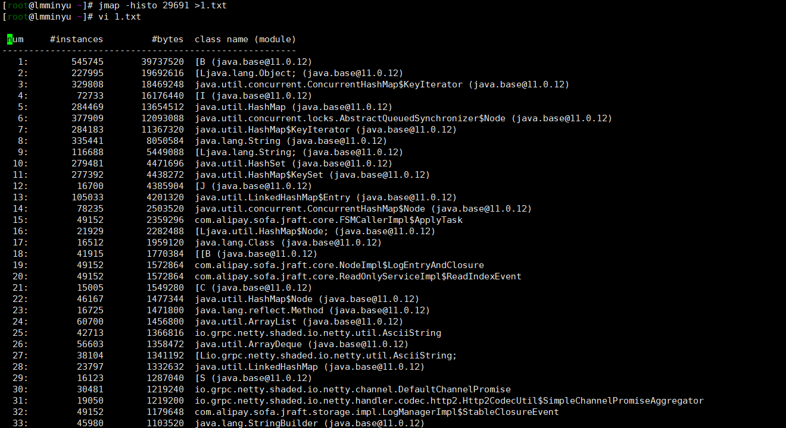

- -F

  当虚拟机进程对-dump选项没有任何响应时，可使用此选项强制执行生成dump文件

## jstack

- 用于生成虚拟机指定进程当前时刻的线程快照(虚拟机堆栈跟踪)。线程快照就是当前虚拟机内指定进程的每一条线程正在执行的方法堆栈的集合。

- 生成线程快照的作用:可用于定位线程出现长时间停顿的原因，如线程间死锁、死循环、请求外部资源导致的长时间等待等问题。这些都是导致线程长时间停顿的常见原因。当线程出现停顿时，就可以用jstack显示各个线程调用的堆栈情况。

- 在thread dump中，要留意下面几种状态

  1. 死锁，Deadlock（重点关注)
  2. 等待资源，waiting on condition（重点关注)
  3. 等待获取监视器，waiting on monitor entry(重点关注)·阻塞，Blocked（重点关注)
  4. 执行中，Runnable
  5. 暂停，Suspended
  6. 对象等待中，object.wait()或TIMED_WAITING·停止，Parked

- option参数

  | -F   | 当正常输出的请求不被响应时，强制输出线程堆栈 |
  | ---- | -------------------------------------------- |
  | -l   | 除堆栈外，显示关于锁的附加信息               |
  | -m   | 如果调用本地方法的话，可以显示C/C++的堆栈    |

  ```java
  jstack -l pid
  ```

  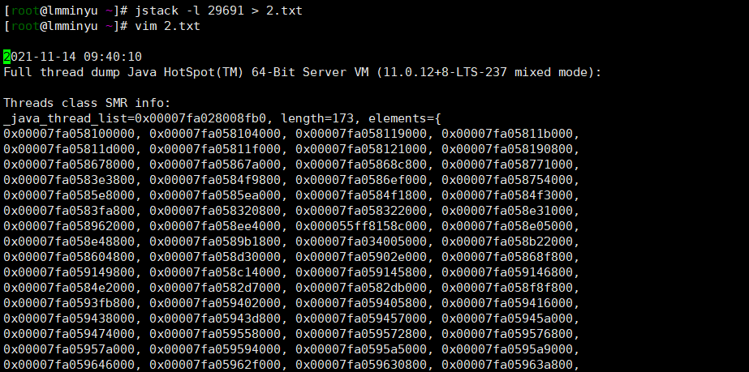

## jcmd

它是一个多功能的工具，可以用来实现除了jstat之外所有命令的功能。比如:用它来导出堆、内存使用、查看Java进程、导出线程信息、执行Gc、JVM运行时间等。

- jcmd -l

  列出所有的JVM进程

- jcmd 进程号 help

  针对指定的进程，列出支持的所有具体命令

  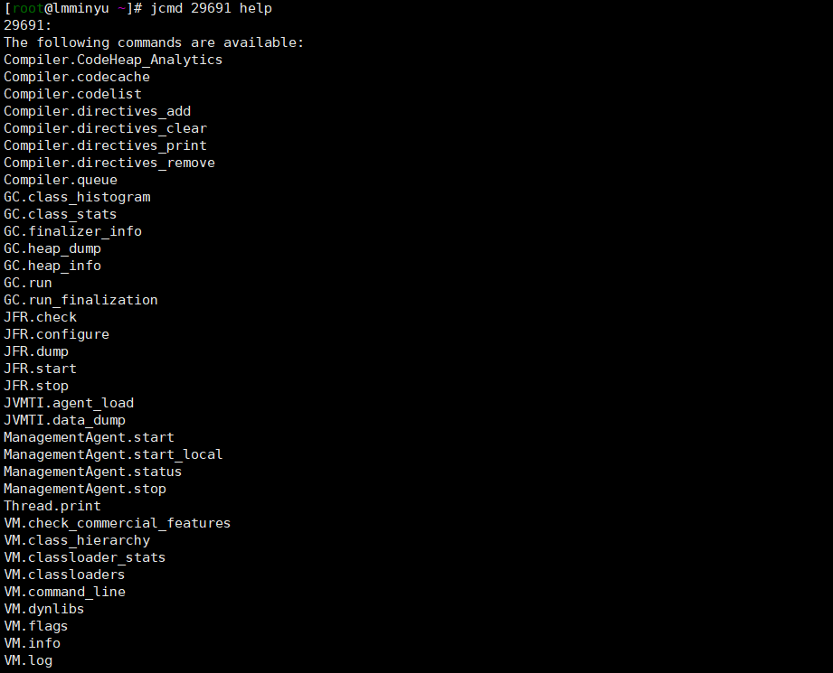

- jcmd 进程号 具体命令

  显示指定进程的指令命令的数据

  