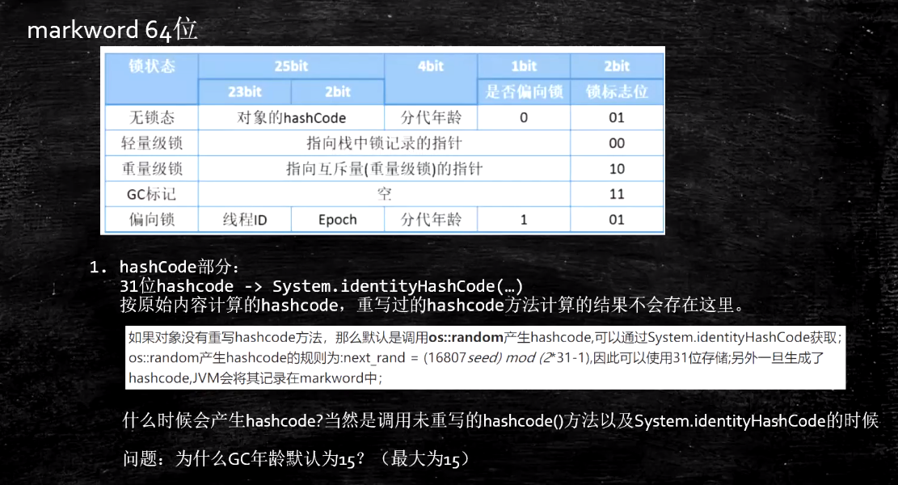
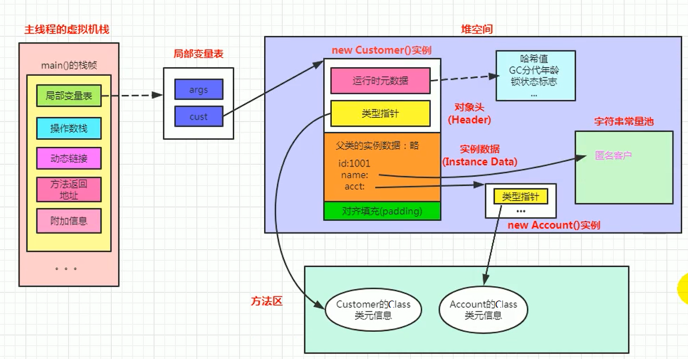
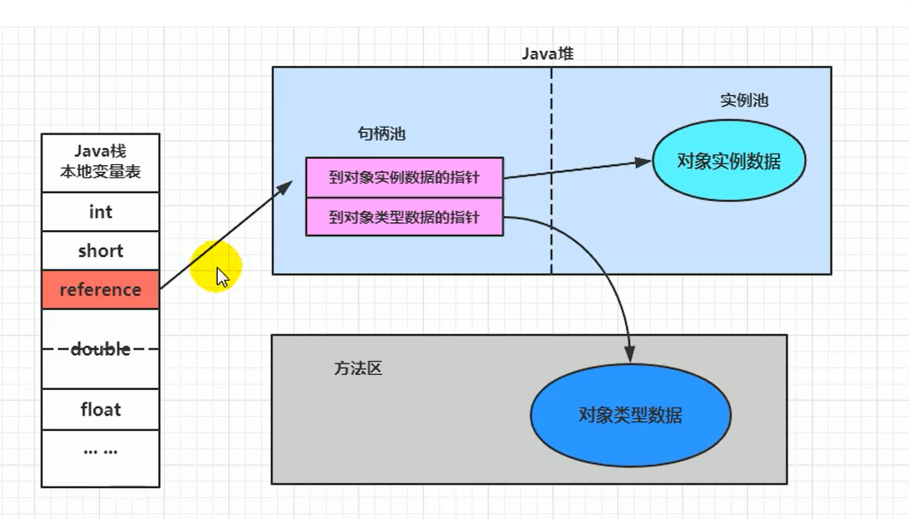

# 对象内存布局

## 一、对象实例化

- 创建对象的方式

  1. new：最常见的方式、单例类中调用getInstance的静态类方法，XXXFactory的静态方法。
  2. Class的newInstance方法：在JDK9里面被标记为过时的方法，因为只能调用空参构造器。
  3. Constructor的newInstance(XXX)：反射的方式，可以调用空参的，或者带参的构造器。
  4. 使用clone()：不调用任何的构造器，要求当前的类需要实现Cloneable接口中的clone接口。
  5. 使用序列化：序列化一般用于Socket的网络传输。
  6. 第三方库 Objenesis

- 创建对象的步骤

  1. 判断对象对应的类是否加载、链接、初始化

     虚拟机遇到一条new指令，首先去检查这个指令的参数能否在Metaspace的常量池中定位到一个类的符号引用，并且检查这个符号引用代表的类是否已经被加载，解析和初始化。（即判断类元信息是否存在）。

     如果没有，那么在双亲委派模式下，使用当前类加载器以ClassLoader + 包名 + 类名为key进行查找对应的 .class文件，如果没有找到文件，则抛出ClassNotFoundException异常，如果找到，则进行类加载，并生成对应的Class对象。

  2. 为对象分配内存

     1. 首先计算对象占用空间的大小，接着在堆中划分一块内存给新对象。如果实例成员变量是引用变量，仅分配引用变量空间即可，即4个字节大小。

     2. 如果内存规整：采用指针碰撞分配内存

        - 所有用过的内存在一边，空闲的内存放另外一边，中间放着一个指针作为分界点的指示器，分配内存就仅仅是把指针往空闲内存那边挪动一段与对象大小相等的距离罢了。

        - 如果垃圾收集器选择的是Serial、ParNew这种基于压缩算法的，虚拟机采用这种分配方式。一般使用带Compact（整理）过程的收集器时，使用指针碰撞。
        - 标记压缩（整理）算法会整理内存碎片，堆内存一边存对象，另一边为空闲区域。

     3. 如果内存不规整

        - 已使用的内存和未使用的内存相互交错，那么虚拟机将采用的是空闲列表来为对象分配内存。
        - 虚拟机维护了一个列表，记录上哪些内存块是可用的，在分配的时候从列表中找到一块足够大的空间划分给对象实例，并更新列表上的内容。这种分配方式成为了 “空闲列表(Free List)”。
        - 选择哪种分配方式由Java堆是否规整所决定，而Java堆是否规整又由采用的垃圾收集器是否带有压缩整理功能决定。
        - 标记清除算法清理过后的堆内存，就会存在很多内存碎片。

  3. 处理并发问题

     - 采用CAS+失败重试保证更新的原子性
     - 在Eden区给每个线程分配一块区域TLAB， - 通过设置 -XX:+UseTLAB参数来设置（区域加锁机制）

  4. 初始化分配到的空间

     所有属性设置默认值，保证对象实例字段在不赋值时可以直接使用

     给对象属性赋值的顺序：
     
     1.  属性的默认值初始化
     2.  显示初始化/代码块初始化（并列关系，谁先谁后看代码编写的顺序）
     3.  构造器初始化
     
  5. 设置对象的对象头
  
     将对象的所属类（即类的元数据信息）、对象的HashCode和对象的GC信息、锁信息等数据存储在对象的对象头中。
  
  6. 执行init方法进行初始化
  
     - 初始化成员变量
     - 执行实例化代码块
     - 调用类的构造方法，并把堆内对象的首地址赋值给引用变量

## 二、对象的内存布局

### 概述


1. 对象头运行时元数据(Mark Word)

   - 运行时元数据(markword)8个字节，64位

     

     1. 对象的hashcode。

        hashcode值在无锁状态下会存在markword中，所以计算过hashcode之后，就无法进入偏向锁了，因为位置被hashcode占用了。

     2. 分代年龄

        4位代表分代年龄，GC次数因为是4位，所以最大时GC15次。

     3. 锁状态

        无锁、轻量级锁、重量级锁、偏向锁。

     4. 是否偏向锁

        1位表示是否为偏向锁，偏向锁时，会记录当前偏向的线程id。

     5. 锁标志位

        2位锁标志位，01无锁、00 轻量级锁、10重量级锁、01偏向锁 。最普通的情况下，第一次的synchronized，只会改变偏向位，0变为1 ，是偏向锁。锁的标志位不会变。

     6. 偏向线程id

     7. 偏向时间戳epoch

2. 类型指针

   指向类元数据InstanceClass，确定该对象所属的类型。指向的其实是方法区中存放的类元信息。

   -XX:+UseCompressedClassPointers不压缩为8字节，开启压缩后为4字节。

3. 实例数据

   比如有个属性n=8啦 诸如此类。

4. 如果是数组，还需要记录数组的长度。

5. 对齐填充

   padding对齐，需要是8的倍数。

### 内存布局图解

```java
public class Customer{
    int id = 1001;
    String name;
    Account acct;
    {
        name = "匿名客户";
    }
    public Customer(){
        acct = new Account();
    }
    public static void main(String[] args) {
        Customer cust = new Customer();
    }
}
class Account{
}
```



1. main()方法new对象之后，将局部变量表中cust指向堆空间中的对象。
2. 对象在内存中存在运行时元数据、类型指针、实例数据、对齐填充。
3. 类型指针指向了方法区的类元信息。
4. 实例数据的类型指针指向方法区中的Account的Class类元信息。

## 三、对象的访问定位

1. 句柄池

   Object t = new Object()  t 的引用句柄放在句柄池里  t --->池---->真正对象 +内存中的T.class

   

2. 直接指针

   通过指针，直接指向内存中的对象。(默认的实现)

   

## 四、Object o = new Object() 占用多少个字节

- jvm默认是指针压缩的，也可以设置启动参数，不压缩
- 对象头markword占8个字节
- classpoint指针 不压缩是8个字节，压缩之后是4个字节  8+4=12 + 4，再加上padding对齐=16字节
- Object[] 数组的话，也是16  对象头8+指针4+数组长度4=16