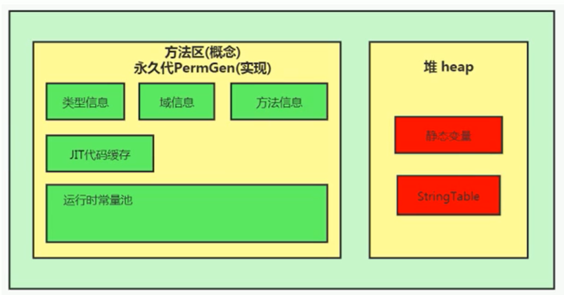
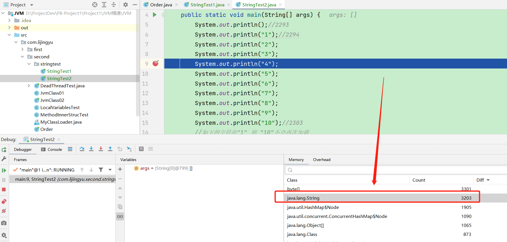
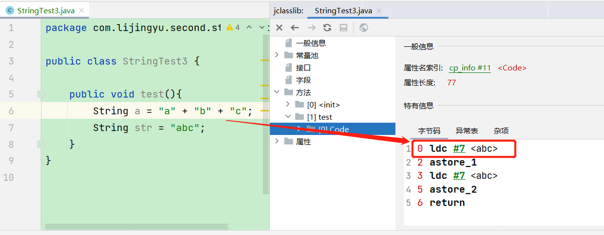
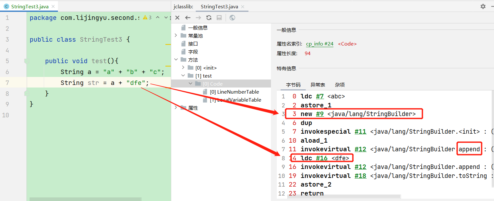
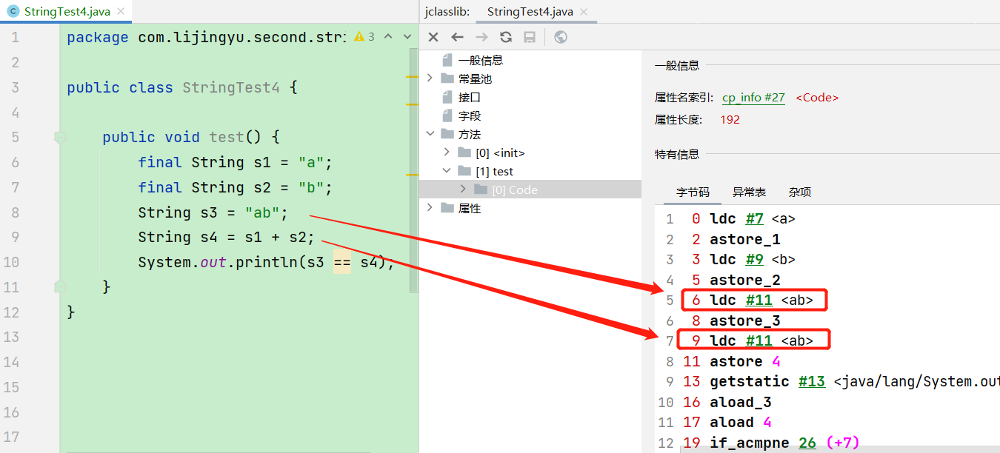
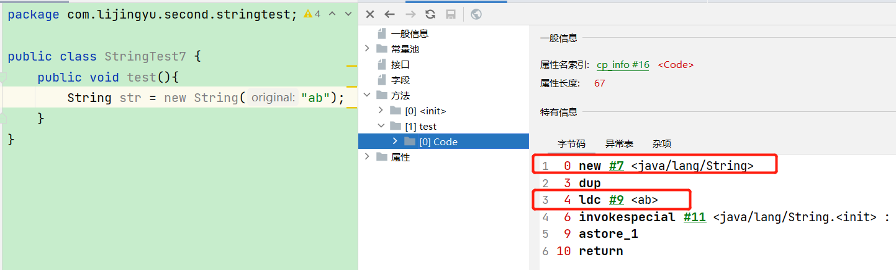
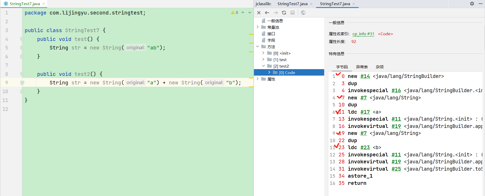
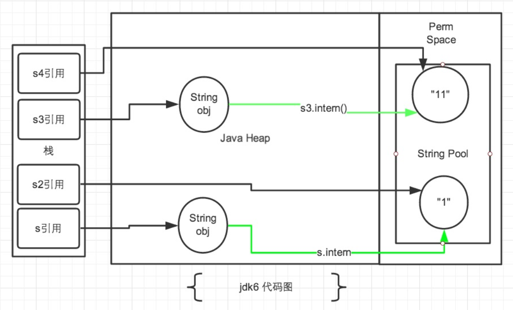
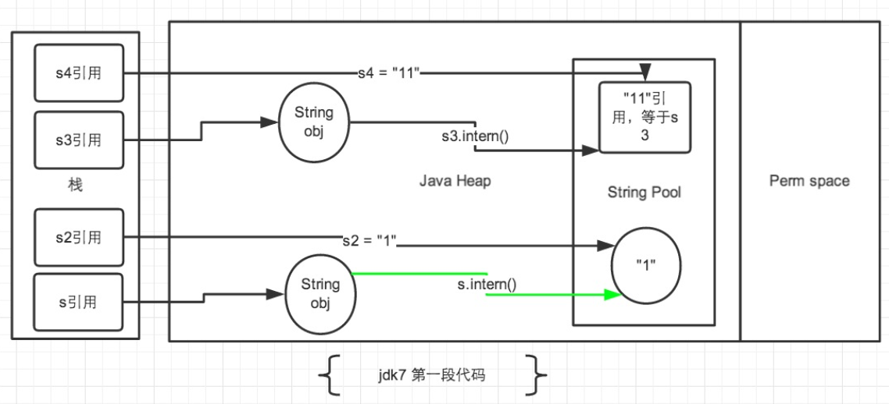

# StringTable

## 一、String的基本特性

- String：字符串，使用一对 ”” 引起来表示
  - String s1 = "mogublog" ; // 字面量的定义方式
  - String s2 = new String("moxi");
- String声明为final的，不可被继承
- String实现了Serializable接口：表示字符串是支持序列化的。
- 实现了Comparable接口：表示string可以比较大小
- String 在jdk8及以前内部定义了final char[] value用于存储字符串数据。JDK9时改为byte[]

### String的不可变性

String：代表不可变的字符序列。简称：不可变性。

- 当对字符串重新赋值时，需要重写指定内存区域赋值，不能使用原有的value进行赋值。 

- 当对现有的字符串进行连接操作时，也需要重新指定内存区域赋值，不能使用原有的value进行赋值。

- 当调用string的replace()方法修改指定字符或字符串时，也需要重新指定内存区域赋值，不能使用原有的value进行赋值。

- 通过字面量的方式（区别于new）给一个字符串赋值，此时的字符串值声明在字符串常量池中。

  ```java
  public class StringTest1 {
  
      public static void test1() {
          // 字面量定义的方式，“abc”存储在字符串常量池中
          String s1 = "abc";
          String s2 = "abc";
          System.out.println(s1 == s2);
          s1 = "hello";
          System.out.println(s1 == s2);
          System.out.println(s1);
          System.out.println(s2);
          System.out.println("----------------");
      }
  
      public static void test2() {
          String s1 = "abc";
          String s2 = "abc";
          // 只要进行了修改，就会重新创建一个对象，这就是不可变性
          s2 += "def";
          System.out.println(s1);
          System.out.println(s2);
          System.out.println("----------------");
      }
  
      public static void test3() {
          String s1 = "abc";
          String s2 = s1.replace('a', 'm');
          System.out.println(s1);
          System.out.println(s2);
      }
  
      public static void main(String[] args) {
          test1();
          test2();
          test3();
      }
  }
  ```

  ```bash
  true
  false
  hello
  abc
  ----------------
  abc
  abcdef
  ----------------
  abc
  mbc
  ```

### 字符串常量池

- 字符串常量池是不会存储相同内容的字符串的。
- String的string Pool是一个固定大小的Hashtable。如果放进string Pool的string非常多，就会造成Hash冲突严重，从而导致链表会很长，而链表长了后直接会造成的影响就是当调用string.intern时性能会大幅下降。
- 使用-XX:StringTablesize可设置stringTab1e的长度
- 在jdk6中stringTable是固定的，就是1009的长度，所以如果常量池中的字符串过多就会导致效率下降很快。stringTablesize设置没有要求。
- 在jdk7中，stringTable的长度默认值是60013
- 在JDK8中，StringTable可以设置的最小值为1009

## 二、String的内存分配

- 在Java语言中有8种基本数据类型和一种比较特殊的类型string。这些类型为了使它们在运行过程中速度更快、更节省内存，都提供了一种常量池的概念。

- 常量池就类似一个Java系统级别提供的缓存。8种基本数据类型的常量池都是系统协调的，string类型的常量池比较特殊。它的主要使用方法有两种。

  1. 直接使用双引号声明出来的String对象会直接存储在常量池中。

     比如：string info="hahaha"；

  2. 如果不是用双引号声明的string对象，可以使用string提供的intern()方法。

- Java 6及以前，字符串常量池存放在永久代。

- Java 7以后，所有的字符串都保存在堆（Heap）中，和其他普通对象一样，这样可以在进行调优应用时仅需要调整堆大小就可以了。

  

### 为什么StringTable从永久代调整到堆中

- 永久代的默认空间大小比较小
- 永久代垃圾回收频率低，大量的字符串无法及时回收，容易进行Full GC产生STW或者容易产生OOM：PermGen Space
- 堆中空间足够大，字符串可被及时回收

## 三、String基本操作

- Java语言规范里要求完全相同的字符串字面量，应该包含同样的Unicode字符序列（包含同一份码点序列的常量），并且必须是指向同一个String类实例。

  ```java
  public class StringTest2 {
      public static void main(String[] args) {
          System.out.println();
          System.out.println("1");
          System.out.println("2");
          System.out.println("3");
          System.out.println("4");
          System.out.println("5");
          System.out.println("6");
          System.out.println("7");
          System.out.println("8");
          System.out.println("9");
          System.out.println("10");
          //如下的字符串"1" 到 "10"不会再次加载
          System.out.println("1");
          System.out.println("2");
          System.out.println("3");
          System.out.println("4");
          System.out.println("5");
          System.out.println("6");
          System.out.println("7");
          System.out.println("8");
          System.out.println("9");
          System.out.println("10");
      }
  }
  ```

  

### 字符串拼接操作

- 常量与常量的拼接结果在常量池，原理是编译期优化

  

- 常量池中不会存在相同内容的变量

- 只要其中有一个是变量，结果就在堆中。变量拼接的原理是StringBuilder，使用append进行字符串拼接。

  ```java
  StringBuilder s = new StringBuilder();
  s.append(s1);
  s.append(s2);
  s.toString(); -> 类似于new String("ab");
  ```

  

  如果拼接的是final修饰的字面量，则直接会被编译优化为常量。

  ```java
  public static void test4() {
      final String s1 = "a";
      final String s2 = "b";
      String s3 = "ab";
      String s4 = s1 + s2;
      System.out.println(s3 == s4);
  }
  true
  ```

  

- 如果拼接的结果调用intern()方法，根据该字符串是否在常量池中存在，分为：

  - 如果存在，则返回字符串在常量池中的地址
  - 如果字符串常量池中不存在该字符串，则在常量池中创建一份，并返回此对象的地址

### 拼接操作和append性能对比

```java
public class StringTest5 {

    public static void method1(int highLevel) {
        String src = "";
        for (int i = 0; i < highLevel; i++) {
            src += "a"; // 每次循环都会创建一个StringBuilder对象
        }
    }

    public static void method2(int highLevel) {
        StringBuilder sb = new StringBuilder();
        for (int i = 0; i < highLevel; i++) {
            sb.append("a");
        }
    }
}
```

- 方法1耗费的时间：4096ms，方法2消耗时间：7ms

- 结论：

  通过StringBuilder的append()方式添加字符串的效率，要远远高于String的字符串拼接方法

- 好处

  StringBuilder的append的方式，自始至终只创建一个StringBuilder的对象

  对于字符串拼接的方式，还需要创建很多StringBuilder对象和调用toString时候创建的String对象

  内存中由于创建了较多的StringBuilder和String对象，内存占用过大，如果进行GC那么将会耗费更多的时间

- 改进的空间

  我们使用的是StringBuilder的空参构造器，默认的字符串容量是16，然后将原来的字符串拷贝到新的字符串中， 我们也可以默认初始化更大的长度，减少扩容的次数

  因此在实际开发中，我们能够确定，前前后后需要添加的字符串不高于某个限定值，那么建议使用构造器创建一个阈值的长度

## 四、intern()的使用

- intern是一个native方法，调用的是底层C的方法

- 字符串池最初是空的，由String类私有地维护。在调用intern方法时，如果池中已经包含了由equals(object)方法确定的与该字符串对象相等的字符串，则返回池中的字符串。否则，该字符串对象将被添加到池中，并返回对该字符串对象的引用。

- 如果不是用双引号声明的string对象，可以使用string提供的intern方法，intern方法会从字符串常量池中查询当前字符串是否存在，若不存在就会将当前字符串放入常量池中。

  ```java
  String myInfo = new string("abc").intern();
  ```

- 如果在任意字符串上调用String.intern方法，那么其返回结果所指向的那个类实例，必须和直接以常量形式出现的字符串实例完全相同。因此，下列表达式的值必定是true。

  ```java
  ("a"+"b"+"c").intern()=="abc"
  ```

- Interned string就是确保字符串在内存里只有一份拷贝，这样可以节约内存空间，加快字符串操作任务的执行速度。注意，这个值会被存放在字符串内部池（String Intern Pool）。

### intern空间效率问题

```java
public class StringIntern6 {
    static final int MAX_COUNT = 1000 * 10000;
    static final String[] arr = new String[MAX_COUNT];

    public static void main(String[] args) {
        Integer[] data = new Integer[]{1, 2, 3, 4, 5, 6, 7, 8, 9, 10};
        long start = System.currentTimeMillis();
        for (int i = 0; i < MAX_COUNT; i++) {
//            arr[i] = new String(String.valueOf(data[i % data.length]));
            arr[i] = new String(String.valueOf(data[i % data.length])).intern();
        }
        long end = System.currentTimeMillis();
        System.out.println("花费的时间为：" + (end - start));

        try {
            Thread.sleep(1000000);
        } catch (Exception e) {
            e.getStackTrace();
        }
    }
}
```

- 对于程序中大量使用存在的字符串时，尤其存在很多已经重复的字符串时，使用intern()方法能够节省内存空间。
- 大的网站平台，需要内存中存储大量的字符串。比如社交网站，很多人都存储：北京市、海淀区等信息。这时候如果字符串都调用intern() 方法，就会很明显降低内存的大小。

## 五、面试题

### new String("ab")会创建几个对象

```java
public class StringTest7 {
    public void test(){
        String str = new String("ab");
    }
}
```



这里面就是两个对象

- 一个对象是：new关键字在堆空间中创建
- 另一个对象：字符串常量池中的对象

### new String("a") + new String("b") 会创建几个对象

```java
String str = new String("a") + new String("b");
```



我们创建了6个对象

- 对象1：new StringBuilder()
- 对象2：new String("a")
- 对象3：常量池的 a
- 对象4：new String("b")
- 对象5：常量池的 b
- 对象6：toString中会创建一个 new String("ab")
  - 调用toString方法，不会在常量池中生成ab

### intern()面试题

```java
public class StringTest7 {
    public static void main(String[] args) {
        String s = new String("1");  // 在常量池中已经有了
        s.intern(); // 将该对象放入到常量池。但是调用此方法没有太多的区别，因为已经存在了1
        String s2 = "1";
        System.out.println(s == s2);

        String s3 = new String("1") + new String("1");
        s3.intern();
        String s4 = "11";
        System.out.println(s3 == s4);
    }
}
JDK6
false
false
JDK7以后
false
true
```

1. s3变量记录的地址为：new String("11")
2. 在堆中有了一个new String("11")这样的String对象。但是在字符串常量池中没有"11"
3. 接着执行s3.intern()，在字符串常量池中生成"11"
   - 在JDK6的版本中，字符串常量池还在永久代，所以直接在永久代生成"11",也就有了新的地址
   
     
   
   - 而在JDK7的后续版本中，字符串常量池被移动到了堆中，此时堆里已经有new String（"11"）了，出于节省空间的目的，直接将堆中的那个字符串的引用地址储存在字符串常量池中。没错，字符串常量池中存的是new String（"11"）在堆中的地址。
   
     
   
   - https://tech.meituan.com/2014/03/06/in-depth-understanding-string-intern.html美团技术网
4. 所以在JDK7后续版本中，s3和s4指向的完全是同一个地址。

```java
String s3 = new String("1") + new String("1");
String s4 = "11";  // 在常量池中生成的字符串
s3.intern();  // 然后s3就会从常量池中找，发现有了，就什么事情都不做
System.out.println(s3 == s4);
```

我们将 s4的位置向上移动一行，发现变化就会很大，最后得到的是 false。

总结string的intern（）的使用：

- JDK1.6中，将这个字符串对象尝试放入串池。
  1. 如果串池中有，则并不会放入。返回已有的串池中的对象的地址
  2. 如果没有，会把此对象复制一份，放入串池，并返回串池中的对象地址
- JDK1.7起，将这个字符串对象尝试放入串池。
  1. 如果串池中有，则并不会放入。返回已有的串池中的对象的地址。
  2. 如果没有，则会把对象的引用地址复制一份，放入串池，并返回串池中的引用地址。

### G1中的String去重操作

注意这里说的重复，指的是在堆中的数据，而不是常量池中的，因为常量池中的本身就不会重复

#### 描述

背景：对许多Java应用（有大的也有小的）做的测试得出以下结果：

- 堆存活数据集合里面string对象占了25%
- 堆存活数据集合里面重复的string对象有13.5%
- string对象的平均长度是45

许多大规模的Java应用的瓶颈在于内存，测试表明，在这些类型的应用里面，Java堆中存活的数据集合差不多25%是string对象。更进一步，这里面差不多一半string对象是重复的，重复的意思是说： stringl.equals（string2）= true。堆上存在重复的string对象必然是一种内存的浪费。这个项目将在G1垃圾收集器中实现自动持续对重复的string对象进行去重，这样就能避免浪费内存。

#### 实现

- 当垃圾收集器工作的时候，会访问堆上存活的对象。对每一个访问的对象都会检查是否是候选的要去重的string对象。
- 如果是，把这个对象的一个引用插入到队列中等待后续的处理。一个去重的线程在后台运行，处理这个队列。处理队列的一个元素意味着从队列删除这个元素，然后尝试去重它引用的string对象。
- 使用一个hashtab1e来记录所有的被string对象使用的不重复的char数组。当去重的时候，会查这个hashtable，来看堆上是否已经存在一个一模一样的char数组。
- 如果存在，string对象会被调整引用那个数组，释放对原来的数组的引用，最终会被垃圾收集器回收掉。
- 如果查找失败，char数组会被插入到hashtable，这样以后的时候就可以共享这个数组了。

#### 开启

命令行选项

```bash
UsestringDeduplication（bool）：开启string去重，默认是不开启的，需要手动开启。 
Printstringbeduplicationstatistics（bool）：打印详细的去重统计信息
stringpeduplicationAgeThreshold（uintx）：达到这个年龄的string对象被认为是去重的候选对象
```

