# Kafka

## 一、基础入门

- Kafka 是一个分布式的基于发布/订阅模式的消息队列（Message Queue） ， 主要应用于大数据实时处理领域。

- 使用消息队列的好处

  1. 解耦

     允许独立的扩展或修改两边的处理过程，只要确保它们遵守同样的接口约束。

  2. 可恢复性

     系统的一部分组件失效时，不会影响到整个系统。消息队列降低了进程间的耦合度，所以即使一个处理消息的进程挂掉，加入队列中的消息仍然可以在系统恢复后被处理。

  3. 缓冲

     Kafka有助于控制和优化数据流经过系统的速度， 解决生产消息和消费消息的处理速度不一致的问题。

  4. 灵活性 & 峰值处理能力

     在访问量剧增的情况下，应用仍然需要继续发挥作用，但是这样的突发流量并不常见。如果为以能处理这类峰值访问为标准来投入资源随时待命无疑是巨大的浪费。使用消息队列能够使关键组件顶住突发的访问压力，而不会因为突发的超负荷的请求而完全崩溃。

  5.  异步通信

     很多时候，用户不想也不需要立即处理消息。消息队列提供了异步处理机制，允许用户把一个消息放入队列，但并不立即处理它。想向队列中放入多少消息就放多少，然后在需要的时候再去处理它们。


### 1.1、Kafka基础架构

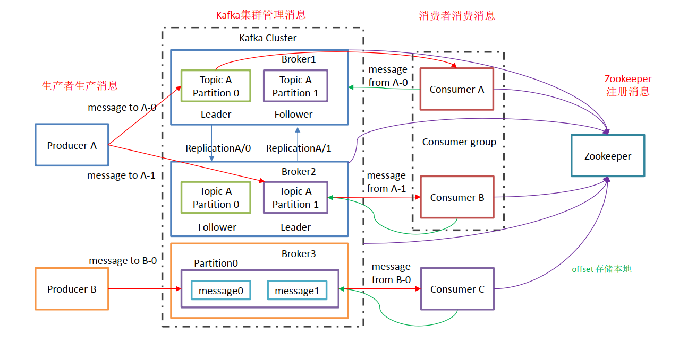

- Producer ： 消息生产者，就是向 kafka broker 发消息的客户端。
- Consumer ： 消息消费者，从kafka broker 取消息的客户端。
- Consumer Group （CG）： 消费者组，由多个 consumer 组成。 消费者组内每个消费者负责消费不同分区的数据，一个分区只能由一个组内消费者消费。消费者组之间互不影响。 所有的消费者都属于某个消费者组，即消费者组是逻辑上的一个订阅者。
- Broker ： 一台 kafka 服务器就是一个 broker。一个集群由多个 broker 组成。一个 broker可以容纳多个topic。broker是无状态（Sateless）的，它们是通过ZooKeeper来维护集群状态。
- Topic ： 可以理解为一个主题， 生产者和消费者面向的都是一个 topic；
- Partition： 分区。为了实现扩展性，一个非常大的 topic 可以分布到多个 broker（即服务器）上，一个 topic 可以分为多个 partition，每个 partition 是一个有序的队列。
- Replica： 副本，为保证当集群中的某个节点发生故障时， 该节点上的 partition 数据不丢失，且 kafka 仍然能够继续工作， kafka 提供了副本机制，一个 topic 的每个分区都有若干个副本，一个 leader 和若干个 follower。
- leader： 每个分区多个副本的“主”，生产者发送数据的对象，以及消费者消费数据的对象都是 leader。
- follower： 每个分区多个副本中的“从”，实时从 leader 中同步数据，保持和 leader 数据的同步。 leader 发生故障时，某个 follower 会成为新的 follower。

### 1.2、zookeeper作用

1. ZK用来管理和协调broker，并且存储了Kafka的元数据（例如：有多少topic、partition、consumer）
2. ZK服务用于通知生产者和消费者Kafka集群中有新的broker加入、或者Kafka集群中出现故障的broker。

### 1.3、Topic

- Kafka 中消息是以 topic 进行分类的， 生产者生产消息，消费者消费消息，都是面向 topic的。topic 是逻辑上的概念，而partition是物理上的概念.

- 每个partition对应于一个log文件，该 log 文件中存储的就是 producer 生产的数据。 Producer 生产的数据会被不断追加到该log 文件末端，且每条数据都有自己的offset。 

- kafka broker在集群消费模式下，会记录消费者组的消费偏移量offset。

  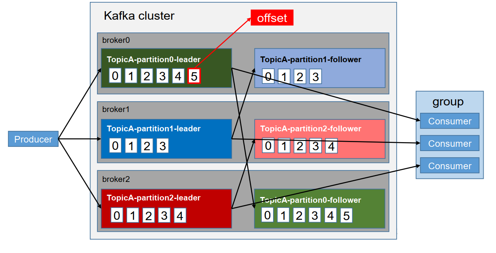

### 1.4、文件存储机制

- 由于生产者生产的消息会不断追加到log文件末尾，为防止log文件过大导致数据定位效率低下， Kafka 采取了分片和索引机制，将每个 partition 分为多个 segment。 每个 segment对应三个文件——“.index”文件、“.log”文件、“.timeindex”文件。 这些文件位于一个文件夹下， 该文件夹的命名规则为：topic 名称+分区序号。例如， first 这个 topic 有三个分区，则其对应的文件夹为 first-0，first-1，first-2。

  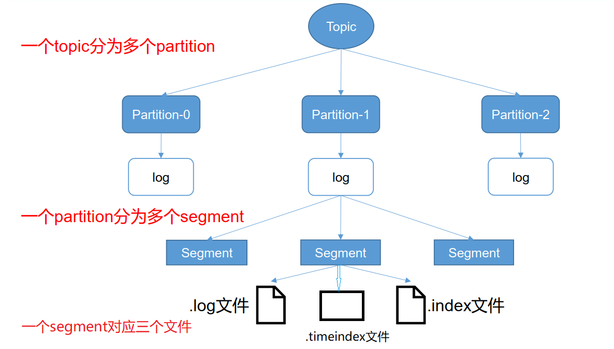

- 创建topic时，--replication-factor指定文件副本数。--replication-factor  3 代表为每个partition分区创建3个副本。如果是3台机器组成的集群，那么对于同一个partition，每台机器上都会存在一个副本。每个partition文件夹内部有index、log、timeindex

  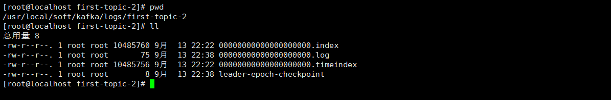

- index 和 log 文件以当前 segment 的第一条消息的offset命名。

  .index文件存储大量的索引信息，.log文件存储大量的数据，索引文件中的元数据指向对应数据文件中 message 的物理偏移地址。

  index文件中并不会记录每条消息的地址索引，只会记录一个区间的某条消息的地址索引。搜索指定消息时，会根据指定的偏移量，去匹配离的最近的索引记录。

  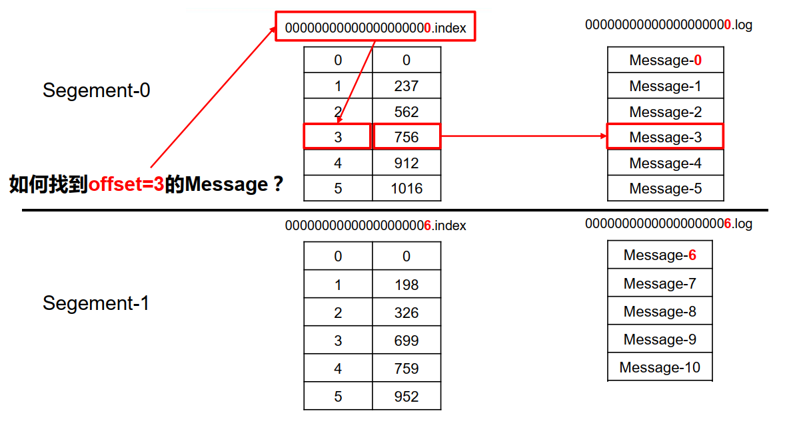

  

## 二、分区策略

### 2.1、分区的好处

1. 方便在集群中扩展，每个 Partition 可以通过调整以适应它所在的机器，而一个 topic又可以有多个 Partition 组成，因此整个集群就可以适应任意大小的数据了。
2. 可以提高并发，因为可以以 Partition 为单位读写了。

### 2.2、分区的原则

1. 指明 partition 的情况下，直接将指明的值直接作为 partiton 值。
2. 没有指明 partition 值但有 key 的情况下，将 key 的 hash 值与 topic 的 partition数进行取余得到 partition 值。
3. 既没有 partition 值又没有 key 值的情况下，第一次调用时随机生成一个整数（后面每次调用在这个整数上自增），将这个值与 topic 可用的 partition 总数取余得到 partition值，也就是常说的 round-robin 算法。

### 2.3、Kafka ACK消息可靠性保证

为保证 producer 发送的数据，能可靠的发送到指定的 topic， topic 的每个partition收到producer发送的数据后， 都需要向 producer 发送 ack（acknowledgement 确认收到） ，如果producer 收到 ack， 就会进行下一轮的发送，否则重新发送数据。producer在发送数据的时候，可以设置acks应答模式。

Kafka应答机制有三种模式：

1. acks=0：producer 不等待 broker 的 ack，这一操作提供了一个最低的延迟， broker 一接收到将消息写入pagecache中，但是还没有写入磁盘就已经返回，当 broker 故障时有可能丢失数据。
2. acks=1：producer 等待 broker 的 ack， partition 的 leader 落盘成功后返回 ack，如果在 follower同步成功之前 leader 故障，那么将会丢失数据。
3. acks=-1或者acks=all：producer 等待 broker 的 ack， partition 的 leader 和 follower 全部落盘成功后才返回 ack。但是如果在 follower 同步完成后， broker 发送 ack 之前， leader 发生故障，那么会造成数据重复。

Kafka过半同步成功，即代表数据落盘持久化成功，leader就会返回给producer ACK。一般集群的过半通过，这个半数，是固定的数量，当集群中某台机器宕机，这个数量是应该动态变化的，并且运维有可能会使用自动部署脚本对服务进行重启，当服务重启之后，就会进行数据同步。这段期间是会影响Kafka整体的效率的，并且机器宕机，并不是简单重启就能解决，使用自动化脚本重启，会导致服务频繁宕机、重启，会逐渐影响到整个服务不可用。所以Kafka为了解决这个问题引入ISR处理逻辑。

- ISR：Leader 维护了一个动态的 in-sync replica set (ISR)，意为和 leader 保持同步的 follower 集合。当 ISR 中的 follower 完成数据的同步之后， leader 就会给 follower 发送 ack。如果 follower长 时 间 未 向 leader 同 步 数 据 ， 则 该 follower 将 被 踢 出 ISR ， 该 时 间 阈 值 由replica.lag.time.max.ms 参数设定。 Leader 发生故障之后，就会从 ISR 中选举新的 leader。
- AR：分区的所有副本称为 「AR」（Assigned Replicas——已分配的副本）。
- OSR：由于follower副本同步滞后过多的副本（不包括 leader 副本）组成 「OSR」（Out-of-Sync Replias）。
- AR = ISR + OSR：正常情况下，所有的follower副本都应该与leader副本保持同步，即AR = ISR，OSR集合为空。

### 2.4、副本的概念

- 副本是为了为主题中的分区创建多个备份，多个副本在kafka集群的多个broker中，会有⼀个副本作为leader，其他是follower。

  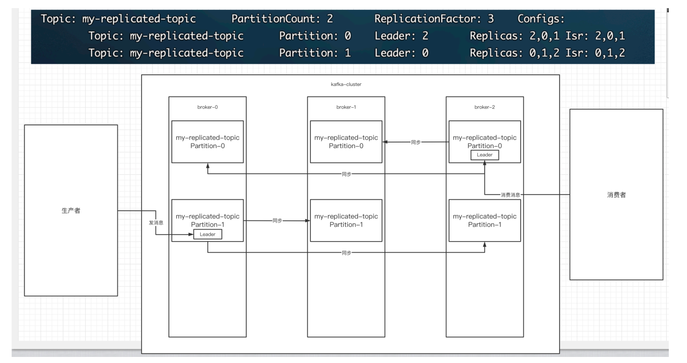

- kafka的写和读的操作，都发⽣在leader上。 leader负责把数据同步给follower。当leader挂了，经过主从选举，从多个follower中选举产⽣⼀个新的leader。

- follower只负责数据同步备份以及选举。

## 三、消费者

### 3.1、消费数据方式

- consumer 采用 pull（拉） 模式从 broker 中读取数据。
- push（推）模式很难适应消费速率不同的消费者，因为消息发送速率是由 broker 决定的。它的目标是尽可能以最快速度传递消息，但是这样很容易造成 consumer 来不及处理消息，典型的表现就是拒绝服务以及网络拥塞。而 pull 模式则可以根据 consumer 的消费能力以适当的速率消费消息。
- pull 模式不足之处是，如果 kafka 没有数据，消费者可能会陷入循环中， 一直返回空数据。 针对这一点， Kafka 的消费者在消费数据时会传入一个时长参数 timeout，如果当前没有数据可供消费， consumer 会等待一段时间之后再返回，这段时长即为 timeout。

### 3.2、分区分配策略

一个 consumer group 中有多个 consumer，一个 topic 有多个 partition，所以必然会涉及到 partition 的分配问题，即确定那个partition 由哪个 consumer 来消费。

1. Range范围分配策略

   Range范围分配策略是Kafka默认的分配策略，它可以确保每个消费者消费的分区数量是均衡的。
   注意：Rangle范围分配策略是针对每个Topic的。

   ```properties
   配置消费者的partition.assignment.strategy为org.apache.kafka.clients.consumer.RangeAssignor。
   ```

   算法公式：n = 分区数量 / 消费者数量，m = 分区数量 % 消费者数量
                      前m个消费者消费n+1个，剩余消费者消费n个

   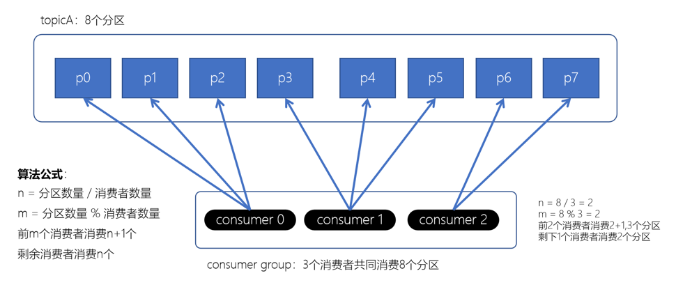

   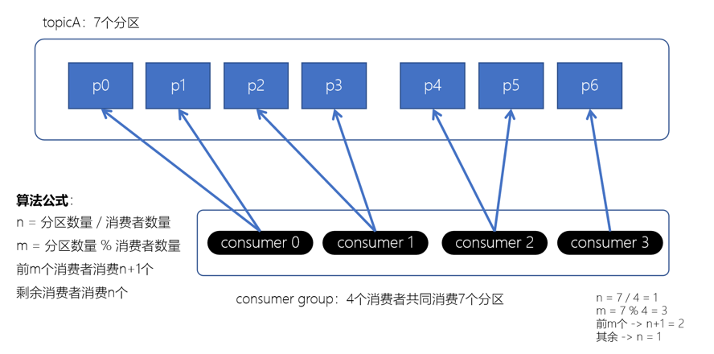

2. RoundRobin轮询策略

   RoundRobinAssignor轮询策略是将消费组内所有消费者以及消费者所订阅的所有topic的partition按照字典序排序（topic和分区的hashcode进行排序），然后通过轮询方式逐个将分区以此分配给每个消费者。

   ```properties
   配置消费者的partition.assignment.strategy为org.apache.kafka.clients.consumer.RoundRobinAssignor。
   ```

   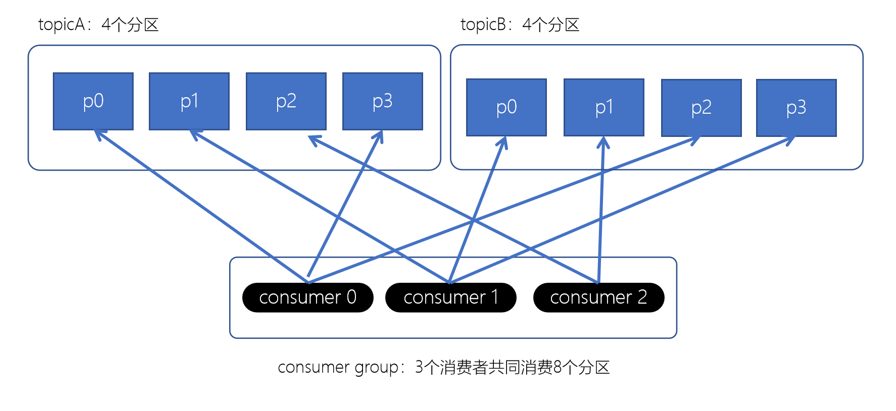

3. Stricky粘性分配策略

   分配策略尽可能保证：

   1. 分区分配尽可能均匀。
   2. 在发生rebalance的时候，分区的分配尽可能与上一次分配保持相同。
   3. 没有发生rebalance时，Striky粘性分配策略和RoundRobin分配策略类似。

   初始分配，不发生rebalance的默认情况下和RoundRobin分配策略类似：

   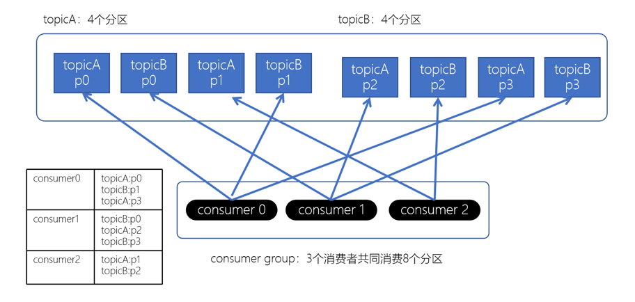

   发生rebalance时，RoundRobin分配策略会进行重新分配，涉及到较大的变动。

   

   Striky粘性分配策略，保留rebalance之前的分配结果。这样，只是将原先consumer2负责的两个分区再均匀分配给consumer0、consumer1。这样可以明显减少系统资源的浪费。

   例如：之前consumer0、consumer1之前正在消费某几个分区，但由于rebalance发生，导致consumer0、consumer1需要重新消费之前正在处理的分区，导致不必要的系统开销。（例如：某个事务正在进行就必须要取消了）

   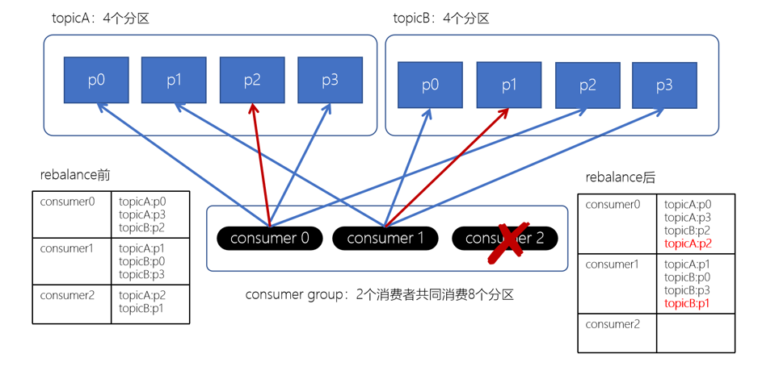

### 3.3、offset的维护

- kafka内部⾃⼰创建了__consumer_offsets主题包含了50个分区。这个主题⽤来存放消费者消费某个主题的偏移量。因为每个消费者都会⾃⼰维护着消费的主题的偏移量，也就是说每个消费者会把消费的主题的偏移量自主上报给kafka中的默认主题：consumer_offsets。

- kafka为了提升这个主题的并发性，默认设置了50个分区，可以通过参数offsets.topic.num.partitions控制。

  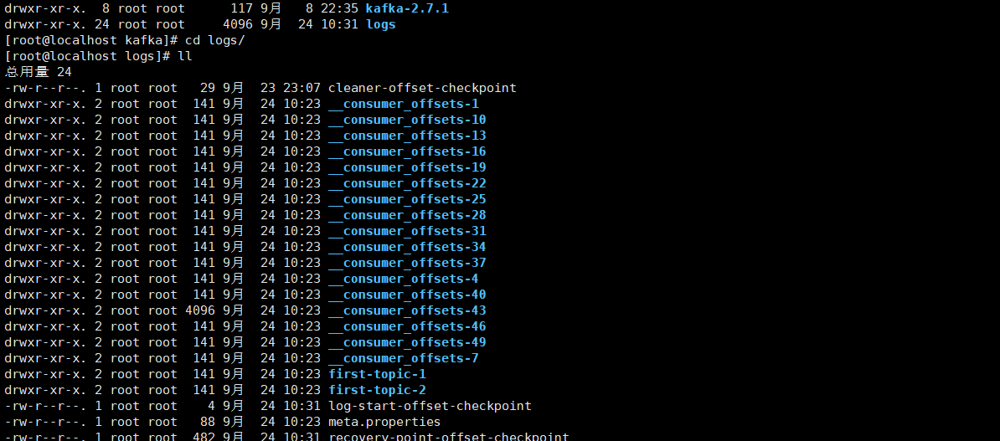

- 定期将⾃⼰消费分区的offset提交给kafka内部topic： __consumer_offsets，提交过去的时候， key是consumerGroupId+topic+分区号， value就是当前offset的值， kafka会定期清理topic⾥的消息，最后就保留最新的那条数据。

  - 提交到哪个分区：通过hash函数： hash(consumerGroupId) % __consumer_offsets主题的分区数
  - 提交到该主题中的内容是： key是consumerGroupId+topic+分区号， value就是当前offset的值

- ⽂件中保存的消息，默认保存7天。七天到后消息会被删除。

## 四、如何实现高效读写数据

### 4.1、顺序写磁盘

Kafka 的 producer 生产数据，要写入到 log 文件中，写的过程是一直追加到文件末端，为顺序写。 官网有数据表明，同样的磁盘，顺序写能到 600M/s，而随机写只有 100K/s。这与磁盘的机械机构有关，顺序写之所以快，是因为其省去了大量磁头寻址的时间。

### 4.2、数据零拷贝技术

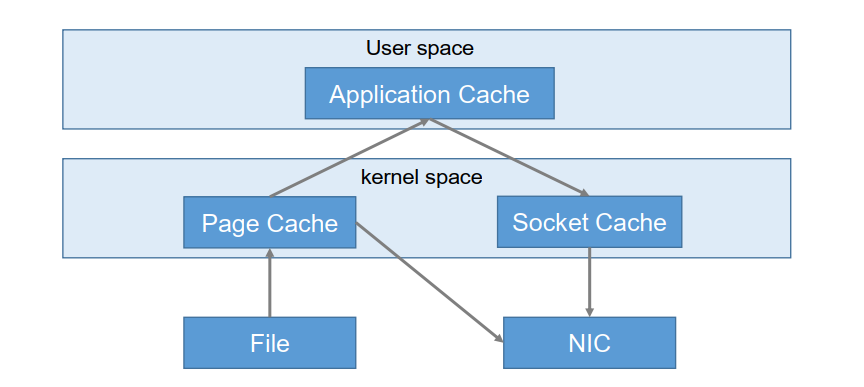

## 五、Zookeeper 在 Kafka 中的作用

Kafka 集群中有一个 broker 会被选举为 Controller，负责管理集群 broker 的上下线，所有 topic 的分区副本分配和 leader 选举等工作。
Controller 的管理工作都是依赖于 Zookeeper 的。

## 六、发送数据

- 发送会默认会重试3次，每次间隔100ms
- 发送的消息会先进⼊到本地缓冲区（32mb）， kakfa会跑⼀个线程，该线程去缓冲区中取16k的数据，发送到kafka，如果到10毫秒数据没取满16k，也会发送⼀次。

### 6.1、发送缓冲区

- kafka默认会创建⼀个消息缓冲区，⽤来存放要发送的消息，缓冲区是32m 

  ```java
  props.put(ProducerConfig.BUFFER_MEMORY_CONFIG, 33554432);
  ```

- kafka本地线程会去缓冲区中⼀次拉16k的数据，发送到broker

  ```java
  props.put(ProducerConfig.BATCH_SIZE_CONFIG, 16384);
  ```

- 如果线程拉不到16k的数据，间隔10ms也会将已拉到的数据发到broker

  ```java
  props.put(ProducerConfig.LINGER_MS_CONFIG, 10);
  ```

## 七、消费消息

消费者⽆论是⾃动提交还是⼿动提交，都需要把所属的消费组+消费的某个主题+消费的某个分区及消费的偏移量，这样的信息提交到集群的_consumer_offsets主题⾥⾯。

### 7.1、自动提交offset

- 消费者poll到消息后默认情况下，会⾃动向broker的_consumer_offsets主题提交当前主题-分区消费的偏移量。

- ⾃动提交会丢消息： 因为如果消费者还没消费完poll下来的消息就⾃动提交了偏移量，那么此时消费者挂了，于是下⼀个消费者会从已提交的offset的下⼀个位置开始消费消息。之前未被消费的消息就丢失掉了。

  ```java
  // 是否⾃动提交offset，默认就是true
  props.put(ConsumerConfig.ENABLE_AUTO_COMMIT_CONFIG, "true");
  // ⾃动提交offset的间隔时间
  props.put(ConsumerConfig.AUTO_COMMIT_INTERVAL_MS_CONFIG, "1000");
  ```

### 7.2、手动提交offset

- 设置手动提交的参数

  ```java
  props.put(ConsumerConfig.ENABLE_AUTO_COMMIT_CONFIG, "false");
  ```

- 同步提交

  在消费完消息后调⽤同步提交的⽅法，当集群返回ack前⼀直阻塞，返回ack后表示提交成功，执⾏之后的逻辑。

- 异步提交

  在消息消费完后提交，不需要等到集群ack，直接执⾏之后的逻辑，可以设置⼀个回调⽅法，供集群调⽤。

### 7.3、长轮询poll消息

- 默认情况下，消费者⼀次会poll500条消息。

  ```java
  //⼀次poll最⼤拉取消息的条数，可以根据消费速度的快慢来设置
  props.put(ConsumerConfig.MAX_POLL_RECORDS_CONFIG, 500);
  //如果两次poll的时间如果超出了30s的时间间隔， kafka会认为其消费能⼒过弱，将其踢出消费组。
  //将分区分配给其他消费者。 -rebalance
  props.put(ConsumerConfig.MAX_POLL_INTERVAL_MS_CONFIG, 30 * 1000);
  ```

- 如果设置poll时间间隔为1秒

  - 如果⼀次poll到500条，就直接执⾏for循环。
  - 如果这⼀次没有poll到500条。且时间在1秒内，那么⻓轮询继续poll，要么到500条，要么到1s。
  - 如果多次poll都没达到500条，且1秒时间到了，那么直接执⾏for循环。

- 如果两次poll的间隔超过30s，集群会认为该消费者的消费能⼒过弱，该消费者被踢出消费组，触发rebalance机制， rebalance机制会造成性能开销。

### 7.4、消费者的健康检查

消费者每隔1s向kafka集群发送心跳，集群发现如果有超过10s没有续约的消费者，将被踢出消费组，触发该消费组的rebalance机制，将该分区交给消费组里的其他消费者进⾏消费。

```java
//consumer给broker发送⼼跳的间隔时间
props.put(ConsumerConfig.HEARTBEAT_INTERVAL_MS_CONFIG, 1000);
//kafka如果超过10秒没有收到消费者的⼼跳，则会把消费者踢出消费组，进⾏rebalance，把分区分配给其他消费者。
props.put(ConsumerConfig.SESSION_TIMEOUT_MS_CONFIG, 10 * 1000);
```

### 7.5、指定消费者的消费偏移量

```java
//指定分区消费
consumer.assign(Arrays.asList(new TopicPartition(TOPIC_NAME, 0)));
//指定从头消费
consumer.seekToBeginning(Arrays.asList(new TopicPartition(TOPIC_NAME,0)));
//指定offset消费
consumer.seek(new TopicPartition(TOPIC_NAME, 0), 10);
```

### 7.6、新消费组的消费offset规则

新消费组中的消费者在启动以后，默认会从当前分区的最后⼀条消息的offset+1开始消费（消费新消息）。可以通过以下的设置，让新的消费者第⼀次从头开始消费。之后开始消费新消息（最后消费的位置的偏移量+1）。

- Latest:默认的，消费新消息。
- earliest：第⼀次从头开始消费。之后开始消费新消息（最后消费的位置的偏移量+1）。

```java
props.put(ConsumerConfig.AUTO_OFFSET_RESET_CONFIG, "earliest");
```

## 八、生产者幂等性与事务

Kafka引入了一项重大特性：幂等性。

所谓的幂等性就是指 Producer 不论向 Server 发送多少次重复数据， Server 端都只会持久化一条。

### 8.1、配置生产者的幂等性

```java
props.put("enable.idempotence",true);
```

### 8.2、幂等性原理

- 为了实现生产者的幂等性，Kafka引入了 Producer ID（PID）和 Sequence Number的概念。

  - PID：每个Producer在初始化时，都会分配一个唯一的PID，这个PID对用户来说，是透明的。

  - Sequence Number：针对每个生产者（对应PID）发送到指定主题分区的消息都对应一个从0开始递增的Sequence Number。

  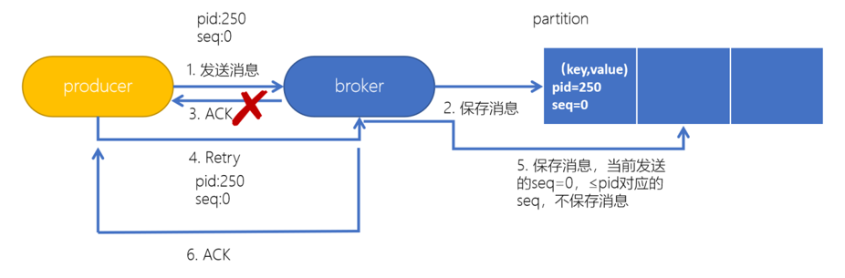

- 开启幂等性的 Producer 在初始化的时候会被分配一个 PID，发往同一Partition的消息会附带 Sequence Number。而Broker端会对<PID, Partition, SeqNumber>做缓存，当具有相同主键的消息提交时， Broker 只会持久化一条。

## 九、Controller

Kafka集群中的broker在zk中创建临时序号节点，序号最⼩的节点（最先创建的节点）将作为集群的controller，负责管理整个集群中的所有分区和副本的状态。

- 当某个分区的leader副本出现故障时，由控制器负责为该分区选举新的leader副本。选举的规则是从isr集合中最左边获得。
- 当检测到某个分区的ISR集合发⽣变化时，由控制器负责通知所有broker更新其元数据信息。
- 当使⽤kafka-topics.sh脚本为某个topic增加分区数量时，同样还是由控制器负责让新分区被其他节点感知到。

## 十、故障恢复

### 10.1、LEO

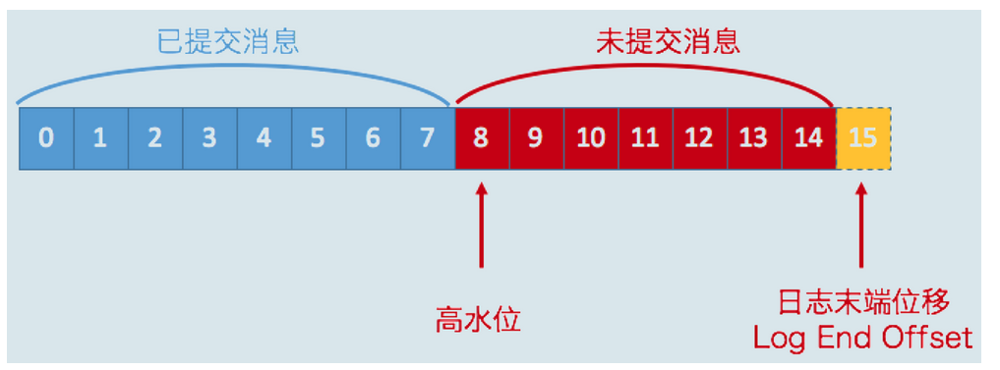

- LEO(log-end-offset)：每个副本中最大的位移偏移量offset。也代表当前broker中partition内存储的消息最大的偏移量。因为多个分区副本之间消息同步存在延迟，所以同一partition的不同分区的LEO也不相同。

### 10.2、高水位HW

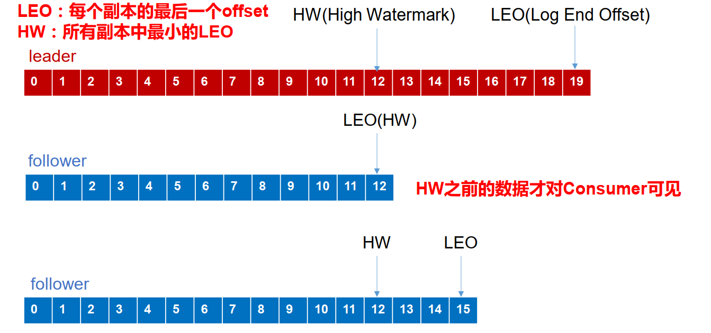

- HW(高水位)：指的是消费者能见到的最大的 offset，ISR 队列中最小的LEO。因为副本之间进行数据同步的时候，存在延迟，所以所有副本中最小的LEO即为完全同步完成的消息偏移量，即高水位，消费者能见到的最大的offset。

### 10.3、故障恢复

- follower 故障

  follower 发生故障后会被临时踢出 ISR，待该 follower 恢复后， follower 会读取本地磁盘记录的上次的 HW，因为高水位下的数据，才被认为是已提交的数据，所以将 log 文件高于 HW 的部分截取掉，从 HW 开始向 leader 进行同步。等该 follower 的 LEO 大于等于该 Partition 的 HW，即 follower 追上 leader 之后，就可以重新加入 ISR 了。

- leader 故障
  leader 发生故障之后，会从 ISR 中选出一个新的 leader，之后，为保证多个副本之间的数据一致性，其余的 follower 会先将各自的 log 文件高于 HW 的部分截掉，然后从新的 leader同步数据。
  注意： 这只能保证副本之间的数据一致性，并不能保证数据不丢失或者不重复。

## 十一、幂等性、Exactly Once 语义

- At Least Once 语义：将服务器的 ACK 级别设置为-1，可以保证 Producer 到 Server 之间不会丢失数据 。
- At Most Once 语义：将服务器 ACK 级别设置为 0，可以保证生产者每条消息只会被发送一次。

At Least Once 可以保证数据不丢失，但是不能保证数据不重复；相对的， At Most Once 可以保证数据不重复，但是不能保证数据不丢失。 但是，对于一些非常重要的信息，比如说交易数据，下游数据消费者要求数据既不重复也不丢失，即 Exactly Once 语义。

Kafka引入了一项重大特性：幂等性。所谓的幂等性就是指 Producer 不论向 Server 发送多少次重复数据， Server 端都只会持久化一条。幂等性结合 At Least Once 语义，就构成了 Kafka 的 Exactly Once 语义。即：                       

```bash
 At Least Once + 幂等性 = Exactly Once
```

要启用幂等性，只需要将 Producer 的参数中 enable.idompotence 设置为 true 即可。 Kafka的幂等性实现其实就是将原来下游需要做的去重放在了数据上游。

- 幂等性实现原理

  开启幂等性的 Producer 在初始化的时候会被分配一个 PID，发往同一Partition的消息会附带 Sequence Number。而Broker 端会对<PID, Partition, SeqNumber>做缓存，当具有相同主键的消息提交时， Broker 只会持久化一条。但是 PID 重启就会变化，同时不同的Partition也具有不同主键，所以幂等性无法保证跨分区跨会话的 Exactly Once。
