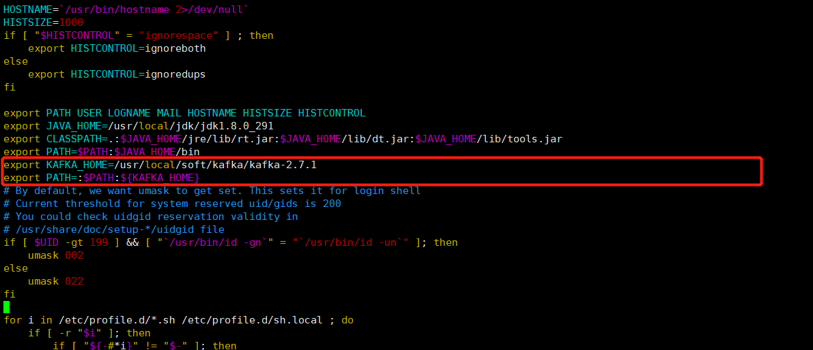
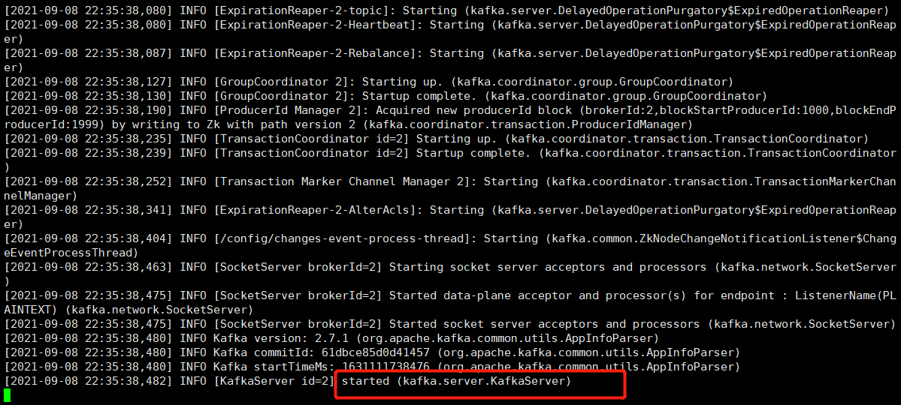
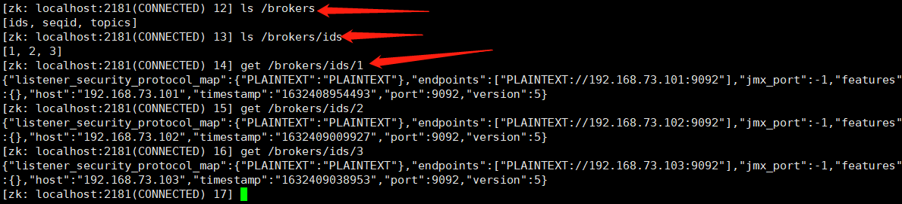
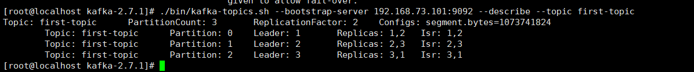

# Kafka安装&集群搭建

```bash
#1.创建目录
mkdir /usr/local/soft/kafka
#2.下载Kafka
wget https://dlcdn.apache.org/kafka/2.7.1/kafka_2.12-2.7.1.tgz
#3.解压
tar -xvf kafka_2.12-2.7.1.tgz
#4.重命名
mv kafka_2.12-2.7.1 kafka-2.7.1
#5./usr/local/soft/kafka目录下，创建日志目录
mkdir logs  
#6.进入目录
cd /usr/local/soft/kafka/kafka-2.7.1/config
#7.编辑配置文件
vim server.properties
#broker 的全局唯一编号，不能重复
broker.id=0
#kafka 运行日志存放的路径
log.dirs=/usr/local/soft/kafka/logs
#配置连接 Zookeeper 集群地址
zookeeper.connect=192.168.73.101:2181,192.168.73.102:2181,192.168.73.103:2181
host.name=192.168.73.101
listeners=PLAINTEXT://192.168.73.101:9092
advertised.listeners=PLAINTEXT://192.168.73.101:9092

#8.配置环境变量
vim /etc/profile
#增加配置
export KAFKA_HOME=/usr/local/soft/kafka/kafka-2.7.1
export PATH=:$PATH:${KAFKA_HOME}
#9.启动集群
./bin/kafka-server-start.sh -daemon ./config/server.properties
#10.检验启动是否成功
zkCli.sh连接上zookeeper客户端，查看节点信息
ls /brokers/ids
```

- etc-profile

  

- 启动成功

  
  
- zookeeper节点信息

  

# 常用命令行

```bash
#创建topic
./bin/kafka-topics.sh --zookeeper 192.168.73.102:2181 --create --replication-factor 2 --partitions 3 --topic first-topic
#选项说明：
--topic 定义 topic 名
--replication-factor 定义副本数
--partitions 定义分区数
#删除topic，需要server.properties中设置 delete.topic.enable=true 否则只是标记删除
./bin/kafka-topics.sh --zookeeper 192.168.73.102:2181 --delete --topic first_topic
#消费消息
./bin/kafka-console-consumer.sh --bootstrap-server 192.168.73.102:9092 --topic first-topic --group g1
#生产消息
./bin/kafka-console-producer.sh --broker-list 192.168.73.102:9092 --topic first-topic
#查看topic详细信息
./bin/kafka-topics.sh --bootstrap-server 192.168.73.101:9092 --describe --topic first-topic
#修改分区数
./bin/kafka-topics.sh --bootstrap-server 192.168.73.101:9092 --alter --topic first-topic --partitions 6
#查看topics列表
./bin/kafka-topics.sh --zookeeper 192.168.73.102:2181 --list #查看topics
./bin/kafka-topics.sh --bootstrap-server 192.168.73.102:9092,192.168.73.101:9092,192.168.73.103:9092 --list
```

- topic详情

  first-topic三个分区partition

  partition分区0的leader是1号节点，1、2号节点是副本，isr是1、2。

  partition分区1的leader是2号节点，2、3号节点是副本，isr是2、3。

  partition分区2的leader是2号节点，3、1号节点是副本，isr是3、1。

  
  
- 查看消费组的详细信息

  ```bash
  # 查看当前主题下有哪些消费组
  ./kafka-consumer-groups.sh --bootstrap-server 192.168.73.103:9092 --list
  # 查看消费组中的具体信息：⽐如当前偏移量、最后⼀条消息的偏移量、堆积的消息数量
  ./kafka-consumer-groups.sh --bootstrap-server 192.168.73.103:9092 --describe --group testGroup
  ```

  

  - current-offset: 最后被消费的消息的偏移量
  - Log-end-offset: 消息总量（最后⼀条消息的偏移量）
  - Lag：积压了多少条消息

- 

# 相关详细配置

```properties
#broker的全局唯一编号，不能重复
broker.id=0
#删除topic功能。为false则仅标记清除
delete.topic.enable=true
#处理网络请求的线程数量
num.network.threads=3
#用来处理磁盘 IO 的现成数量
num.io.threads=8
#发送套接字的缓冲区大小
socket.send.buffer.bytes=102400
#接收套接字的缓冲区大小
socket.receive.buffer.bytes=102400
#请求套接字的缓冲区大小
socket.request.max.bytes=104857600
#kafka 运行日志存放的路径
log.dirs=/opt/module/kafka/logs
#创建topic的默认分区数
num.partitions=1
#⾃动创建topic的默认副本数量，默认为1，建议设置为⼤于等于2
default.replication.factor=1
#当producer设置acks为-1时，min.insync.replicas指定replicas的最⼩数⽬（必须确认每⼀个repica的写数据都是成功的），如果这个数⽬没有达到，producer发送消息会产⽣异常
min.insync.replicas=1
#用来恢复和清理 data 下数据的线程数量
num.recovery.threads.per.data.dir=1
#segment 文件保留的最长时间，超时将被删除
log.retention.hours=168
#配置连接 Zookeeper 集群地址
zookeeper.connect=ip:2181,ip:2181,ip:2181
host.name=192.168.73.101
#server接受客户端连接的端⼝， ip配置kafka本机ip即可
listeners=PLAINTEXT://192.168.73.101:9092
advertised.listeners=PLAINTEXT://192.168.73.101:9092
```

