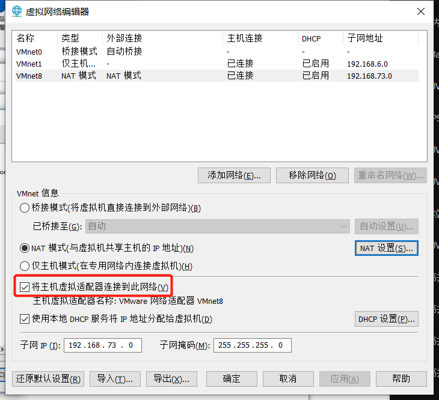

# Linux使用帮助

## 一、安装centos7

### 1、配置虚拟机网络

- 点击虚拟机的编辑按钮，虚拟机网络编辑器：查看子网ip：192.168.73.0  网络号是0，地址可以是1-254

  

- 查看net设置（网关）：2的网络号被占用了，所以可用地址最好是从3-254

  此处对应的是虚拟网卡

  

- 查看计算机上的详细配置：1网络号也被占用了

  

- 将主机虚拟适配器连接到此网络

  

### 2、安装

```bash
vi /etc/sysconfig/network-scripts/ifcfg-ens33    (最后一个为网卡名称)
BOOTPROTO=static      --------IP地址是静态的
IPADDR=192.168.1.160
NETMASK=255.255.255.0
GATEWAY=192.168.73.2
DNS1=114.114.114.114
#重启
systemctl restart network
```

### 3、关闭防火墙

```bash
>>>关闭防火墙
systemctl stop firewalld.service            #停止firewall
systemctl disable firewalld.service        #禁止firewall开机启动
```

## 二、安装JDK

```bash
tar -xvf jdk-8u291-linux-x64.tar.gz -C /usr/local/jdk
vim /etc/profile
#环境变量
export JAVA_HOME=/usr/local/jdk/jdk1.8.0_291
export CLASSPATH=.:$JAVA_HOME/jre/lib/rt.jar:$JAVA_HOME/lib/dt.jar:$JAVA_HOME/lib/tools.jar
export PATH=$PATH:$JAVA_HOME/bin
#环境配置生效
source /etc/profile
```

## 三、安装MySQL

```bash
wget -i -c http://dev.mysql.com/get/mysql57-community-release-el7-10.noarch.rpm
rpm -ivh mysql57-community-release-el7-10.noarch.rpm
yum install mysql-server
#检查MySQL是否开机启动
systemctl list-unit-files|grep mysqld
#设置开机启动
systemctl enable mysqld.service
#启动
systemctl start mysqld.service
#查找初始密码
grep "password" /var/log/mysqld.log
mysql -uroot -p
#输入密码进入
#进入后第一步就要设置密码
ALTER USER 'root'@'localhost' IDENTIFIED BY 'System1.';
#执行以下命令开启远程访问限制（注意：下面命令开启的IP是 192.168.0.1，如要开启所有的，用%代替IP）：
grant all privileges on *.* to 'root'@'%' identified by 'System1.' with grant option;
mysql> flush privileges; 
mysql> exit

#/*****************/
firewall-cmd --zone=public --add-port=3306/tcp --permanent
firewall-cmd --reload
#/*******************/
#修改编码
vi /etc/my.cnf;
service mysqld restart
```


