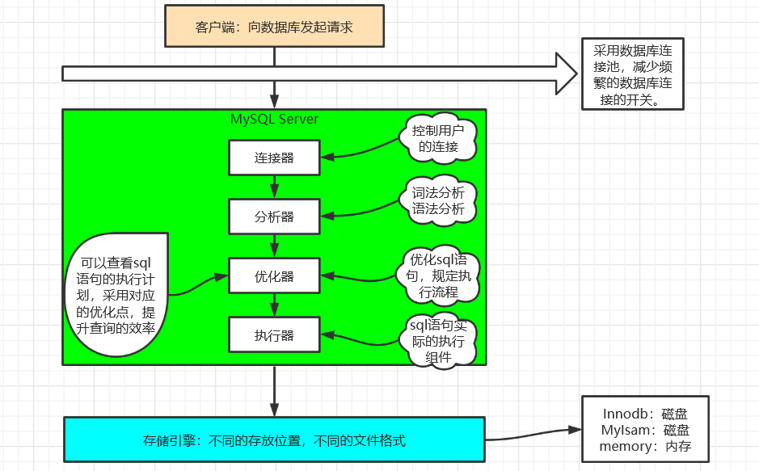
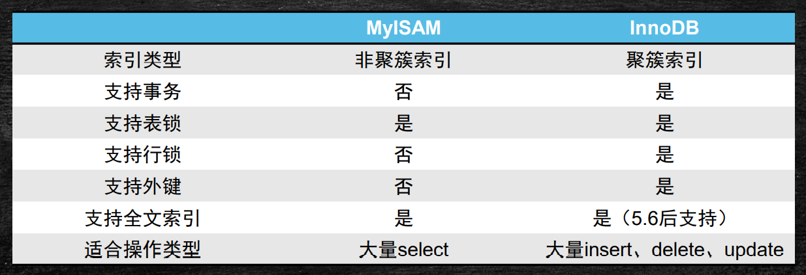
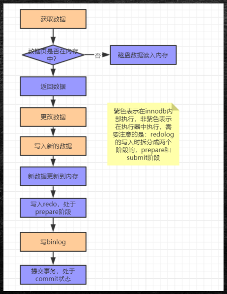
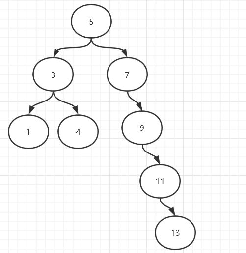
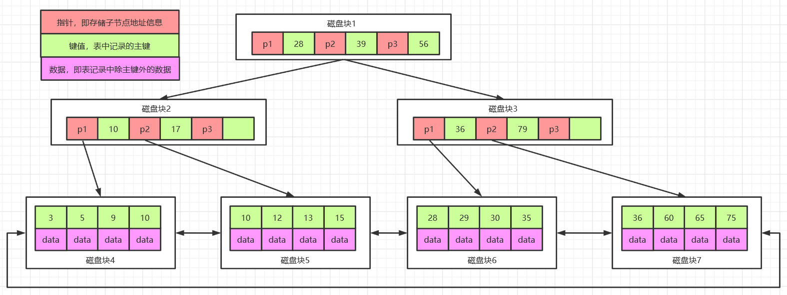
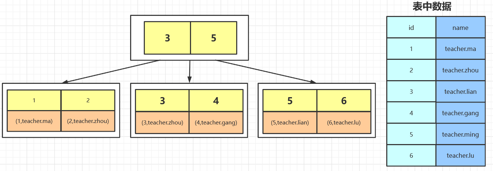
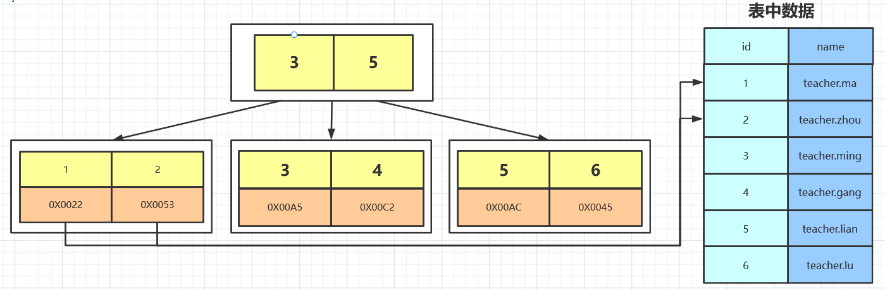

### 局部性原理

- 空间局部性

  程序和数据的访问都有聚集成群的倾向，在一个时间段内，仅使用其中一小部分。

- 时间局部性

  最近访问过的程序代码和数据，很快又被访问的可能性很大。

- 磁盘预读

  页是存储器的逻辑块，操作系统往往将主存和磁盘存储区分割为连续的大小相等的块，每个存储块称为一页（在许多操作系统中，页大小通常为4k），主存和磁盘以页为单位交换数据。

  预读的长度一般为页（page）的整数倍。

### MySQL架构

客户端向数据库发起请求之后，经由MySQL server的连接器，并通过分析器、优化器最终到达执行器，经过执行器执行之后，将执行结果持久化到存储引擎中。



#### 连接器

连接器负责跟客户端建立连接，获取权限、维持和管理连接。同时连接器会进行用户名密码验证、查询权限信息，分配对应的权限。

通过wait_timeout控制连接，如果数据库连接太长时间（默认8小时）没有动静，就会自动断开。

可以使用show processlist查看现在的连接，连接可以分为两类：

- 长连接：推荐使用，但是要周期性的断开长连接
- 短链接

#### 分析器

- 词法分析：MySQL需要把输入的字符串进行解析，识别出每个部分代表什么意思，比如把字符串T识别成表名T、把字符串ID识别成 列ID。
- 语法分析：根据语法规则判断这个sql语句是否满足MySQL的语法，如果不符合就会报错“You have an error in your SQL synta"

#### 优化器

- 在具体执行SQL语句之前，要先经过优化器的处理

  - 当表中有多个索引的时候，决定用哪个索引
  - 当sql语句需要做多表关联的时候，决定表的连接顺序
  - 等等

- 不同的执行方式对SQL语句的执行效率影响很大

  RBO:基于规则的优化

  CBO:基于成本的优化，目前大多数是这种方式

#### 查询缓存

当执行查询语句的时候，会先去查询缓存中查看结果，之前执行过的sql语句及其结果可能以key-value的形式存储在缓存中，如
果能找到则直接返回，如果找不到，就继续执行后续的阶段。但是，不推荐使用查询缓存：

- 查询缓存的失效比较频繁，只要表更新，缓存就会清空
- 缓存对应新更新的数据命中率比较低

#### 聚簇索引、非聚簇索引



不同的存储引擎，数据文件和索引文件存放的位置是不同的，因此有了分类

- 聚簇索引

  数据和文件放在一起，典型的存储引擎为innodb。

  innodb的文件结构包括：

  - .frm文件：存放的是表结构
  - .ibd文件：存放数据文件和索引文件

  注意：mysql的innodb存储引擎默认情况下会把所有的数据文件放到表空间中，不会为每一个单独的表保存一份数据文件，如果需要将每一个表单独使用文件保存，需要设置如下属性：set global innodb_file_per_table=on。

- 非聚簇索引

  数据和索引单独一个文件，典型的存储引擎为MylSAM

  MylSAM的文件结构包括：

  - .frm文件：存放表结构
  - .MYI文件：存放索引数据
  - .MYD文件：存放实际数据

#### MySQL的日志

- RedoLog

  RedoLog是innodb存储引擎的日志文件，当发生数据修改的时候，innodb引擎会先将记录写到redo log中，并更新内存，此时更新就算是完成了，同时innodb引擎会在合适的时机将记录操作到磁盘中。

  Redolog是固定大小的，是循环写的过程，有了redolog之后，innodb就可以保证即使数据库发生异常重启，之前的记录也不会丢失，叫做crash-safe。

- UndoLog

  UndoLog是为了实现事务的原子性而设计的，在MySQL数据库InnoDB存储引擎中，还用Undo Log来实现多版本并发控制(简称：MVCC)。

  在操作任何数据之前，首先将数据备份到一个地方（这个存储数据备份的地方称为Undo Log），然后进行数据的修改。如果出现了错误或者用户执行了ROLLBACK语句，系统可以利用Undo Log中的备份将数据恢复到事务开始之前的状态

  注意：undo log是逻辑日志，可以理解为：

  ```properties
  当delete一条记录时，undo log中会记录一条对应的insert记录
  当insert一条记录时，undo log中会记录一条对应的delete记录
  当update一条记录时，它记录一条对应相反的update记录
  ```

- BinLog

  BinLog是server层的日志文件，主要做mysql功能层面的事情

  与RedoLog的区别：

  - RedoLog是innodb独有的，binlog是所有引擎都可以使用的
  - RedoLog是物理日志，记录的是在某个数据页上做了什么修改，binlog是逻辑日志，记录的是这个语句的原始逻辑
  - RedoLog是循环写的，空间会用完，binlog是可以追加写的，不会覆盖之前的日志信息

#### 为什么写redo log的时候不会造成io的问题

#### MySQL数据更新过程



1. 数据更新时，首先从innodb引擎中获取数据
2. innodb引擎判断，如果数据页在内存中，直接返回数据，否则到磁盘中读取数据进行返回。
3. 执行器中进行数据的更改，并将数据写入到innodb引擎中。
4. innodb将数据首先写入redoLog中，当前redoLog处于prepare阶段。
5. 执行器将数据写入binLog
6. 提交事务，redoLog、binLog生效。

Redo log在数据更新过程中使用的是两阶段提交，如果不适用两阶段提交：

- 先写redo log后写binlog

  假设在redo log写完，binlog还没有写完的时候，MySQL进程异常重启。由于我们前面说过的，redo log写完之后，系统即使崩溃，仍然能够把数据恢复回来，所以恢复后这一行c的值是1。但是由于binlog没写完就crash了，这时候binlog里面就没有记录这个语句。因此，之后备份日志的时候，存起来的binlog里面就没有这条语句。然后你会发现，如果需要用这个binlog来恢复临时库的话，由于这个语句的binlog丢失，这个临时库就会少了这一次更新，恢复出来的这一行c的值就是0，与原库的值不同。

- 先写binlog后写redo log

  如果在binlog写完之后crash，由于redo log还没写，崩溃恢复以后这个事务无效，所以这一行c的值是0。但是binlog里面已经记录了“把c从0改成1”这个日志。所以，在之后用binlog来恢复的时候就多了一个事务出来，恢复出来的这一行c的值就是1，与原库的值不同。

### MySQL索引数据结构的选择

1. 哈希表

   

   哈希表可以完成索引的存储，每次在添加索引的时候需要计算指定列的hash值，取模运算后计算出下标，将元素插入下标位置即可，适合等值查询的场景，并且表中的数据是无序数据。

   缺点：

   1. 因为表中的数据是无序的，所以范围查找的时候比较浪费时间，需要挨个进行遍历操作。并且在企业中，多数的查询也都是范围查找。
   2. 利用hash存储的话需要将所有的数据文件添加到内存，比较耗费内存空间。

2. 二叉树

   

   二叉树的排列规则是：比根节点小的数据放在左子树，比根节点大的数据放在右子树，根节点只有两个分支。

   基于二叉树构造特点，很容易出现单侧子树特别长的情况，从而失去平衡，单侧子树的查找演变为链表查找，效率变低。

   因为二叉树只有两个分支，所以当数据较多时，很容易导致树的深度过深，从而造成io次数变多，影响数据读取的效率。

3. AVL平衡树

   AVL树是一颗严格意义上的平衡树，最高子树跟最低子树高度之差不能超过1，因此在进行元素插入的时候，会进行1到N次的旋转，严重影响插入的性能。

4. 红黑树

   红黑树是基于AVL树的一个升级，损失了部分查询的性能，来提升插入的性能。

   在红黑树中最低子树跟最高子树之差小于2倍即可，在插入的时候，不需要进行N多次的旋转操作，而且还加入了变色的特性，来满足插入和查询性能的平衡。但是无论是二叉树还是红黑树，都会因为树的深度过深而造成io次数变多，影响数据读取的效率。

5. B树

   B树特点：

   - 所有键值分布在整颗树中
   - 搜索有可能在非叶子结点结束，在关键字全集内做一次查找，性能逼近二分查找
   - 每个节点最多拥有m个子树
   - 根节点至少有2个子树
   - 分支节点至少拥有m/2颗子树（除根节点和叶子节点外都是分支节点）
   - 所有叶子节点都在同一层、每个节点最多可以有m-1个key，并且以升序排列

   

   实例图说明：

   ​        每个节点占用一个磁盘块，一个节点上有两个升序排序的关键字和三个指向子树根节点的指针，指针存储的是子节点所在磁盘块的地址。

   ​        两个关键词划分成的三个范围域对应三个指针指向的子树的数据的范围域。以根节点为例，关键字为 16 和 34，P1 指针指向的子树的数据范围为小于 16，P2 指针指向的子树的数据范围为 16~34，P3 指针指向的子树的数据范围为大于 34。 

   查找关键字过程：

   1. 根据根节点找到磁盘块 1，读入内存。【磁盘 I/O 操作第 1 次】
   2. 比较关键字 28 在区间（16,34），找到磁盘块 1 的指针 P2。
   3. 根据 P2 指针找到磁盘块 3，读入内存。【磁盘 I/O 操作第 2 次】
   4. 比较关键字 28 在区间（25,31），找到磁盘块 3 的指针 P2。
   5. 根据 P2 指针找到磁盘块 8，读入内存。【磁盘 I/O 操作第 3 次】
   6. 在磁盘块 8 中的关键字列表中找到关键字 28。 

   缺点：

   - 每个节点都有key，同时也包含data，而每个页存储空间是有限的（4k），如果data比较大的话会导致每个节点存储的key数量变小。
   - 当存储的数据量很大的时候会导致深度较大，增大查询时磁盘io次数，进而影响查询性能。

6. B+树

   B+Tree是在BTree的基础之上做的一种优化，变化如下：

   - B+Tree每个节点可以包含更多的节点，这个做的原因有两个，第一个原因是为了降低树的高度，第二个原因是将数据范围变为多个区间，区间越多，数据检索越快。
   - 非叶子节点存储key，叶子节点存储key和数据
   - 叶子节点两两指针相互连接（符合磁盘的预读特性），顺序查询性能更高。

### MySQL索引数据结构--B+Tree



在B+Tree上有两个头指针，一个指向根节点，另一个指向关键字最小的叶子节点，而且所有叶子节点（即数据节点）之间是一种链式环结构。因此可以对 B+Tree 进行两种查找运算：一种是对于主键的范围查找和分页查找，另一种是从根节点开始，进行随机查找。

- InnoDB--B+Tree，叶子节点直接放置数据。

  

  - InnoDB是通过B+Tree结构对主键创建索引，然后叶子节点中存储记录，如果没有主键，那么会选择唯一键，如果没有唯一键，那么会生成一个6位的row_id来作为主键。
  - 如果创建索引的键是其他字段，那么在叶子节点中存储的是该记录的主键，然后再通过主键索引找到对应的记录,叫做回表。

- MyISAM--B+Tree，叶子节点放的是数据的指针地址

  

### 索引的分类

mysql索引的五种类型：主键索引、唯一索引、普通索引、全文索引、组合索引。通过给字段添加索引可以提高数据的读取速度，提高项目的并发能力和抗压能力。

- 主键索引

  主键是一种唯一性索引，但它必须指定为PRIMARY KEY，每个表只能有一个主键。

- 唯一索引

  索引列的所有值都只能出现一次，即必须唯一，值可以为空。

- 普通索引

  基本的索引类型，值可以为空，没有唯一性的限制。（覆盖索引）

- 全文索引（MyISAM支持，Innodb在5.6之后支持）

  全文索引的索引类型为FULLTEXT。全文索引可以在varchar、char、text类型的列上创建

- 组合索引

  多列值组成一个索引，专门用于组合搜索（最左匹配原则）

#### 回表

当根据非主键索引查找数据时，首先会在索引所在的B+树上进行匹配查找，当查找到匹配数据时，由于非主键B+树的叶子节点存的data都是主键，所以当匹配到数据时，还要根据找到的主键，去主键的B+树上再查找具体的数据。这个检索两颗B+树的过程叫做回表。

#### 覆盖索引

当select数据时，仅仅select 主键id，那么只需要检索第一颗B+树即可，直接将匹配到的主键数据进行返回。

#### 最左前缀

当有多个字段组成联合索引时，进行where条件查询使用的判断条件，遵循索引字段从左到右的匹配原则。

比如索引字段A、B、C，条件匹配从左到右依次优先匹配A、B、C，当只存在C='ID'这种查询时，不会使用索引。

#### 索引下推

当多个字段组成联合索引进行数据查找时，会在匹配到A时，再过滤字段B，最终再进行回表，不执行索引下推时，将在找到A时进行回表，再对回表后的结果进行B的过滤。

### 索引的维护

索引在插入新的值的时候，为了维护索引的有序性，必须要维护，在维护索引的时候需要分以下几种情况：

1. 如果插入一个比较大的值，直接插入即可，几乎没有成本
2. 如果插入的是中间的某一个值，需要逻辑上移动后续的元素，空出位置
3. 如果需要插入的数据页满了，就需要单独申请一个新的数据页，然后移动部分数据过去，叫做页分裂，此时性能会受影响同时空间的使用率也会降低，除了页分裂之外还包含页合并。
4. 尽量使用自增主键作为索引

