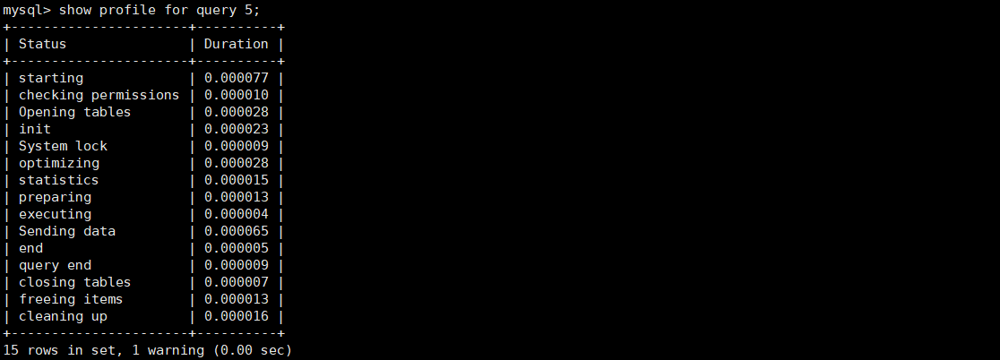

# show profile

使用show profile查询剖析工具，可以查询sql语句的执行情况。此工具默认是禁用的，可以通过服务器变量在会话级别动态的修改。

```mysql
set profiling=1;
```

当设置完成之后，在服务器上执行的所有语句，都会测量其耗费的时间和其他一些查询执行状态变更相关的数据。


在mysql的命令行模式下只能显示两位小数的时间，可以使用如下命令查看具体的执行时间。

```mysql
show profiles;
```


执行如下命令可以查看详细的每个步骤的时间。直接执行show profile，则会显示最近一条sql的执行情况，以及每一步耗费的时间。

```mysql
show profile for query 5;
```



show profile也可以指定具体的type。

- all：显示所有性能信息


- block io：显示块io操作的次数
- context switches：显示上下文切换次数，被动和主动。
- cpu：显示用户cpu时间、系统cpu时间
- IPC：显示发送和接受的消息数量
- page faults：显示页错误数量
- source：显示源码中的函数名称与位置
- swaps：显示swap的次数

# show processlist

使用show processlist查看连接的线程个数，来观察是否有大量线程处于不正常的状态或者其他不正常的特征。


- id表示session id
- user表示操作的用户
- host表示操作的主机
- db表示操作的数据库
- command表示当前状态
  1. sleep：线程正在等待客户端发送新的请求
  2. query：线程正在执行查询或正在将结果发送给客户端
  3. locked：在mysql的服务层，该线程正在等待表锁
  4. analyzing and statistics：线程正在收集存储引擎的统计信息，并生成查询的执行计划
  5. Copying to tmp table：线程正在执行查询，并且将其结果集都复制到一个临时表中
  6. sending data：线程可能在多个状态之间传送数据，或者在生成结果集、或者向客户端返回数据
  7. sorting result：线程正在对结果集进行排序
- info表示详细的sql语句
- time表示相应命令执行时间
- state表示命令执行状态