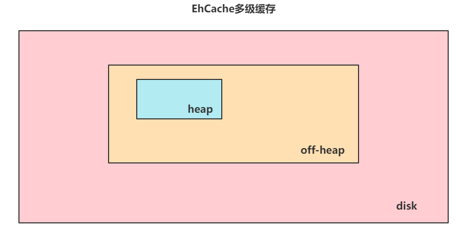

## EhCache

## 一、本地缓存

在查询数据的时候，数据大多来自数据库，咱们会基于SQL语句的方式与数据库交互，数据库一般会基于本地磁盘IO的形式将数据读取到内存，返回给Java服务端，Java服务端再将数据响应给客户端，做数据展示。

但是MySQL这种关系型数据库在查询数据时，相对比较慢，因为有磁盘IO，有时没命中索引还需要全盘扫描。在针对一些热点数据时，如果完全采用MySQL，会存在俩问题。第一个MySQL相对很脆弱，可能会崩，第二个MySQL查询效率慢。所以会使用缓存。

而缓存分为很多种，相对服务端的角度来说大致分为两种，一种JVM缓存（堆内缓存），另一种是堆外缓存（操作系统的内存中、Redis跨服务的缓存）

Redis基于内存读写，效率很高，而且Redis服务的并发能力很强。但是Redis毕竟是另一个服务，需要通过网络IO的形式去查询数据。不过一般分布式微服务的缓存首选还是Redis。但是单体项目，想把缓存的性能提升的比Redis还要快，就需要选择JVM缓存了，一般框架自带的缓存机制，比如Hibernate缓存，MyBatis也有一级缓存和二级缓存。

为什么DAO层框架已经提供了缓存的概念，还要搞EhCache？

因为DAO层框架的缓存是在Mapper层触发的，EhCache可以将缓存提到Service层触发。效率肯定会有提升，并且EhCache提供了非常丰富的功能，不但可以将数据存储在JVM内部，还可以放到堆外，甚至还可以存储到本地磁盘。

## 二、EhCache基本使用

### 2.1、导入依赖

```xml
<dependency>
    <groupId>org.ehcache</groupId>
    <artifactId>ehcache</artifactId>
    <version>3.10.6</version>
</dependency>
```

### 2.2、入门操作

```java
public class EhCacheTest {
    public static void main(String[] args) {
        iniCache();
        iniCache2();
    }

    private static void iniCache2() {
        CacheManager cacheManager = CacheManagerBuilder.newCacheManagerBuilder()
                .withCache("preConfigured",
                        CacheConfigurationBuilder.newCacheConfigurationBuilder(Long.class, String.class, ResourcePoolsBuilder.heap(10)))
                .build();
        cacheManager.init();

        Cache<Long, String> preConfigured =
                cacheManager.getCache("preConfigured", Long.class, String.class);

        Cache<Long, String> myCache = cacheManager.createCache("myCache",
                CacheConfigurationBuilder.newCacheConfigurationBuilder(Long.class, String.class, ResourcePoolsBuilder.heap(10)));

        myCache.put(1L, "da one!");
        String value = myCache.get(1L);

        cacheManager.removeCache("preConfigured");

        cacheManager.close();
    }

    private static void iniCache() {
        ResourcePoolsBuilder resourcePoolsBuilder = ResourcePoolsBuilder.newResourcePoolsBuilder()
                //数量
                .heap(10, EntryUnit.ENTRIES);
        //占用大小
//                .heap(10, MemoryUnit.MB)
        //磁盘文件大小
        // 磁盘存储,记得buld添加true，才能正常的持久化，并且序列化以及反序列化
//                .disk(100, MemoryUnit.MB);
        CacheConfigurationBuilder<String, Data> stringDataCacheConfigurationBuilder = CacheConfigurationBuilder.newCacheConfigurationBuilder(String.class, Data.class, resourcePoolsBuilder.build())
                //空闲回收时间，无访问之后，多久删除缓存，一直有访问则会自动进行续期
                .withExpiry(ExpiryPolicyBuilder.timeToIdleExpiration(Duration.of(10, ChronoUnit.SECONDS)));
        //存活时间，设置固定失效时间，即使一直有访问，也不会自动续期
        //.withExpiry(ExpiryPolicyBuilder.timeToLiveExpiration(Duration.of(10, ChronoUnit.SECONDS)))
        //不设置过期时间
        //.withExpiry(ExpiryPolicy.NO_EXPIRY);
        CacheManager cacheManager = CacheManagerBuilder.newCacheManagerBuilder()
                .withCache("cache01", stringDataCacheConfigurationBuilder)
                .with(CacheManagerBuilder.persistence("D://1.txt"))
                .build(true);
        Cache<String, Data> cache = cacheManager.getCache("cache01", String.class, Data.class);
        cache.put("01", new Data());
        Data data = cache.get("01");
        System.out.println(data);
        cacheManager.close();
    }
}
```

## 三、EhCache配置

### 3.1、数据存储位置

EhCache3.x版本中不但提供了堆内缓存heap，还提供了堆外缓存off-heap，并且还提供了数据的持久化操作，可以将数据落到磁盘中disk。

- heap表示使用堆内内存：

  heap(10)代表当前Cache最多只能存储10个数据，当你put第11个数据时，第一个数据就会被移除。

  heap(10,大小单位MB)代表当前Cache最多只能存储10MB数据。

- off-heap堆外内存

  off-heap是将存储的数据放到操作系统的一块内存区域存储，不是JVM内部，这块空间属于RAM。这种对象是不能直接拿到JVM中使用的，在存储时，需要对数据进行序列化操作，同时获取出来的时候也要做反序列化操作。

- disk落到磁盘

  disk表示将数据落到本地磁盘，这样的话，当服务重启后，依然会从磁盘反序列化数据到内存中。

EhCache提供了三种组合方式：

* heap + off-heap
* heap + disk
* heap + off-heap + disk



在组合情况下存储，存储数据时，数据先落到堆内内存，同时同步到堆外内存以及本地磁盘。本地底盘因为空间充裕，所以本地磁盘数据是最全的。而且EhCache要求空间大小必须disk > off-heap > heap。在组合情况下读取，因为性能原型，肯定是先找heap查询数据，没有数据去off-heap查询数据，off-heap没有数据再去disk中读取数据，同时读取数据之后，可以将数据一次同步到off-heap、heap。

### 3.2、数据生存时间

因为数据如果一致存放在内存当中，可能会出现内存泄漏等问题，数据在内存，一致不用，还占着空间

EhCache提供了对数据设置生存时间的机制

提供了三种机制：

* noExpiration：不设置生存时间
* timeToLiveExpiration：从数据落到缓存计算生存时间
* timeToIdleExpiration：从最后一个get计算生存时间

```java
@Test
public void test() throws InterruptedException {
    //1. 初始化好CacheManager
    CacheManager cacheManager = CacheManagerBuilder.newCacheManagerBuilder()
            .withCache(
                    "singleDog",
                    CacheConfigurationBuilder.newCacheConfigurationBuilder(
                            String.class,
                            Object.class,
                            ResourcePoolsBuilder.newResourcePoolsBuilder().heap(10).build())
                            // 三选一。
                            // 不设置生存时间
//                                .withExpiry(ExpiryPolicy.NO_EXPIRY)
                            // 设置生存时间，从存储开始计算
//                                .withExpiry(ExpiryPolicyBuilder.timeToLiveExpiration(Duration.ofMillis(1000)))
                            // 设置生存时间，每次获取数据后，重置生存时间
                            .withExpiry(ExpiryPolicyBuilder.timeToIdleExpiration(Duration.ofMillis(1000)))
                            .build()
            ).build(true);

    Cache<String, Object> cache = cacheManager.getCache("singleDog", String.class, Object.class);

    cache.put("ehcache","1111111");
    System.out.println(cache.get("ehcache"));
    Thread.sleep(500);
    cache.get("ehcache");
    Thread.sleep(500);
    System.out.println(cache.get("ehcache"));
}
```

