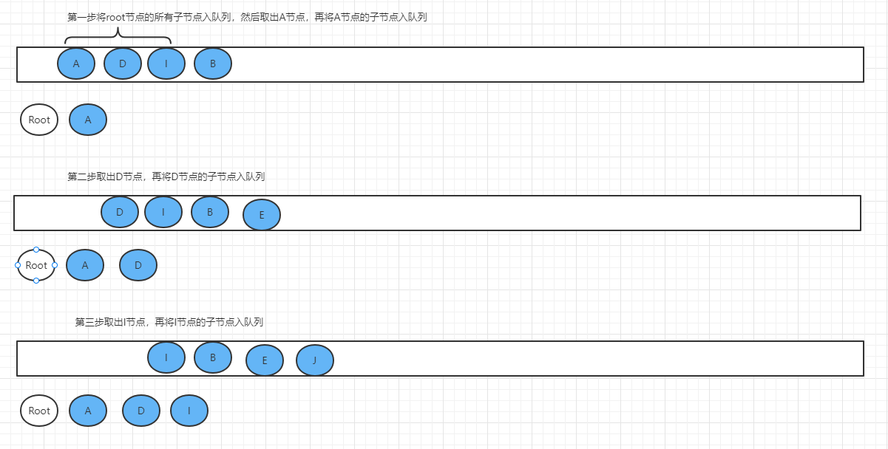

# Aho-Corasick automaton（AC自动机）

在以下使用场景中可大幅度提高效率：

- 敏感词过滤等场景，输入是大文本，需要快速判断是否存在匹配的模式串(敏感词)，或者在其中找出所有匹配的模式串。
- 从大文本中提取关键词，用于数据分析
- 用于大量集合中exist判断

AC自动机是一种多模式匹配算法，在tire树的基础上，增加一个fail指针，如果当前点匹配失败，则将指针转移到fail指针指向的地方，这样就不用回溯,而可以一路匹配下去了。之所以叫多模式匹配，是因为可以只需要扫描一遍输入串，就可以匹配出多个关键词。

## 一、首先建立tire字典树

如果有大量的单词需要进行匹配操作，把这些单词存储在数组、集合、或者链表中，会占用大量的空间，并且查找起来的时间耗时也会比较久，或许单次查询耗时还可以接受，但是当大规模应用之后，特别是匹配的文本非常大、匹配次数大量增加时，耗费的时间是不能被接受的。此时就需要有一种树形结构，将单词按照字典的形式组合起来。

从root节点出发，当不是单词的时候，节点标记为蓝色，代表当前节点不是完整的单词，标记为绿色的节点，代表匹配到了一个完整的单词。

当使用链表形式进行存储时，查找匹配项时需要从头遍历链表，时间复杂度为0(n)，但是如果转为字典树，将取决于单词的长度，如果单词长度为4，那么只需要匹配4次就可以找到。


## 二、BFS遍历

BFS广度遍历，又叫层次遍历，按照树的层次，按照顺序一层一层遍历节点。


如果想要一层一层的遍历树节点，那么就需要使用到队列了，因为队列是先进先出的。

1. 将root节点的所有子节点插入队列
2. 将队列中第一个节点出队列，再将这个节点的所有子节点插入队列
3. 将队列中第二个节点出队列，再将这个节点的所有子节点插入队列
4. 循环下去，直到队列为空




## 三、构建AC自动机树

普通的tire树，如果一个分支匹配失败了，需要重新回到root，重新进行匹配，那么这一步其实也是不必要的。在tire树的基础上，增加一个fail指针，如果当前点匹配失败，则将指针转移到fail指针指向的地方，这样就不用回溯。构建fail指针，靠的就是BFS遍历。

为什么转移到fail指针指向的地方，就可以不用回溯了呢？因为fail指针指向的是当前节点的最长后缀，当前模式串后缀和fail指针指向的模式串部分前缀相同，如abce和bcd，我们找到c发现下一个要找的不是e，就跳到bcd中的c处，看看此处的下一个字符(d)是不是应该找的那一个。（最长后缀：在abc的c节点匹配失败，c节点的最长后缀为bc，fail指针就指向了bcd路径中的c处。）

### 构建fail指针

首先遍历第一层，第一层都是一个单词，一个单词就没有什么最长后缀的说法了，直接指向根节点。

需要注意的是，仅仅root根节点的fail指针为NULL哦。他自己就是根了，根还要指向谁呢？？？？？当然是NULL了。


第二层遍历的时候，找到当前节点的父节点fail指针指向的节点，看看父节点指向的那个节点的下一个节点，和当前节点是否匹配，如果匹配，fail指针就指向他，如果不匹配，就需要找父节点指向的fail节点指向的fail节点，是否包含当前节点的值，直到找到最后为止，最后的节点就是指向root的节点了。

比如第二层遍历的时候，首先找s节点，s节点的父节点是a，a的fail指针指向的是root，那么找root的所有子节点中有没有s，找到了，那么就指向了第一层的s节点。

为什么首先要找父节点的fail指针呢？因为这样可以缩短查找路径。比如当前是abcd，d的父节点c，如果c指向了路径abc中的c，那么指向的c也一定是当前d节点的后缀的一部分，只需要判断c之后是不是d，就可以了。因为父节点的最长后缀，一定是子节点最长后缀的一部分（要扣除最后一个节点，bce 只是abcd中c节点的最长后缀bc，d节点的最长后缀为bcd，而之前的节点是bce，所以要扣除最后一个节点）


第三层进行匹配时，规则和上一层一致，比如h找他的父级s时，s指向的时sh中间那条路中的s，并且s的下级有h，则h指向中间那条路的h节点，但是如果不包括h，那就要找中间s的fail指针指向的节点（逐层及向上找，最终找到root为止），直到一直找不到，那就将f的fail指针指向root。


余下的每一层都按照BFS遍历进行查找fail指针


### 节点上的附加信息

在每个为单词的节点上，要存储一个exist[]数组字段，用来存储当前匹配的长度，以及fail指针指向的节点的exist[]。

为什么要存储exist呢？

- 如果存储当前匹配到的字符串，比如ash，那么存储的信息就会占用大量的空间。
- 存储fail指针的exist，是因为如果匹配到了，并且fail指针指向的节点是一个单词，那么可以直接通过长度获取到多个单词
- 只存储长度，在匹配的时候可以依据长度直接获取到字符串，比如 abcd ,在d匹配到了，长度为2，那么匹配到的字符串就是cd，不需要存储完整字符串。

为什么要存储fail指针指向的node的exist呢？

- 因为转到fail指针之后，fail指针会被当做root节点来处理，不会再处理node上的额外信息。可以省掉一些处理逻辑。


## 四、匹配查找

匹配ashe，首先根据字典树，匹配到了ash、exist记录为3，那么匹配到的字符串为ash，h没有子节点了，找h的fail指针指向的节点。

指向h，但是h的子节点没有e，匹配到此结束。


## 五、代码实现

```java
import lombok.Data;

import java.util.*;

/**
 * @author lijingyu
 */
public class MyAcTrie {

    @Data
    private static class Node {
        /**
         * 当前节点name
         */
        private Character character;
        /**
         * 存在结尾
         */
        private List<Integer> exist;
        /**
         * 可以用于当匹配到的时候，获取一些额外信息
         * 比如匹配到了apple，需要返回中文苹果关键字。
         */
        private Object otherData;
        /**
         * fail指针
         */
        private Node fail;
        /**
         * 子节点集合
         */
        private Map<Character, Node> childNodeMap;

        public Node() {
            childNodeMap = new HashMap<>();
            exist = new ArrayList<>();
        }

        @Override
        public String toString() {
            return character == null ? "root" : character.toString();
        }
    }

    public Node buildTrie(String[] keyWords) {
        Node root = new Node();
        if (keyWords == null || keyWords.length == 0) {
            return root;
        }
        //构建字典树
        for (int i = 0; i < keyWords.length; i++) {
            trieInsert(root, keyWords[i]);
        }
        //BFS遍历
        bfsTrie(root);
        return root;
    }

    public void match(Node root, String str) {
        Node temp = root;
        char[] chars = str.toCharArray();
        for (int i = 0; i < chars.length; i++) {
            char curChar = chars[i];
            while (temp.getChildNodeMap().get(curChar) == null && temp.getFail() != null) {
                temp = temp.getFail();
            }
            Node nextNode = temp.getChildNodeMap().get(curChar);
            if (nextNode != null) {
                temp = nextNode;
            } else {
                continue;
            }
            if (!temp.getExist().isEmpty()) {
                int finalI = i;
                temp.getExist().stream().forEach(length -> {
                    printMatchStr(str, finalI - length + 1, length);
                });
            }
        }
    }

    private void printMatchStr(String str, int start, Integer end) {
        System.out.println(str.substring(start, start + end));
    }

    private void bfsTrie(Node root) {
        Queue<Node> queue = new LinkedList<>();
        //将第一层的节点设置fail指针，第一层的指针指向全部为root
        root.getChildNodeMap().values().stream()
                .forEach(node -> {
                    node.setFail(root);
                    queue.add(node);
                });
        //遍历下面层级
        while (!queue.isEmpty()) {
            //出队列
            Node parentnNode = queue.poll();
            Map<Character, Node> childNodeMap = parentnNode.getChildNodeMap();
            //因为队列中的节点，肯定设置过fail指针，所以只需要考虑子节点的fail指针
            childNodeMap.values().stream().forEach(node -> {
                Node parentnFailNode = parentnNode.getFail();
                /**
                 * 父节点指向的fail节点不为null 并且 fail节点的子节点没有包含当前node值的，需要一直
                 * 向上查找
                 */
                while (parentnFailNode != null && parentnFailNode.childNodeMap.get(node.getCharacter()) == null) {
                    parentnFailNode = parentnFailNode.getFail();
                }
                //只有root节点的fail指向为null
                if (parentnFailNode == null) {
                    //没有后缀
                    node.setFail(root);
                } else {
                    //找到了后缀节点
                    node.setFail(parentnFailNode.childNodeMap.get(node.getCharacter()));
                }
                //将fail指针指向的节点的exist存到当前节点中
                if (!node.getFail().getExist().isEmpty()) {
                    node.getExist().addAll(node.getFail().getExist());
                }
                //将子节点放进队列中
                queue.add(node);
            });
        }
    }

    private void trieInsert(Node root, String keyWord) {
        Node temp = root;
        char[] chars = keyWord.toCharArray();
        boolean hasNewNode = false;
        for (int i = 0; i < chars.length; i++) {
            char curChar = chars[i];
            if (temp.childNodeMap.containsKey(curChar)) {
                temp = temp.childNodeMap.get(curChar);
            } else {
                Node node = new Node();
                node.setCharacter(curChar);
                temp.getChildNodeMap().put(curChar, node);
                temp = node;
                hasNewNode = true;
            }
        }
        //避免同样的单词重复添加
        if (hasNewNode){
            temp.getExist().add(chars.length);
        }
    }

    public static void main(String[] args) {
        String[] keyWords = {"he", "she", "his", "hers","his" ,"你好", "你"};
        MyAcTrie myAcTrie = new MyAcTrie();
        Node root = myAcTrie.buildTrie(keyWords);
        myAcTrie.match(root, "你真she帅his你好");
    }
}
```

