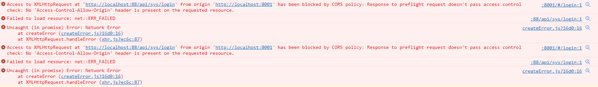
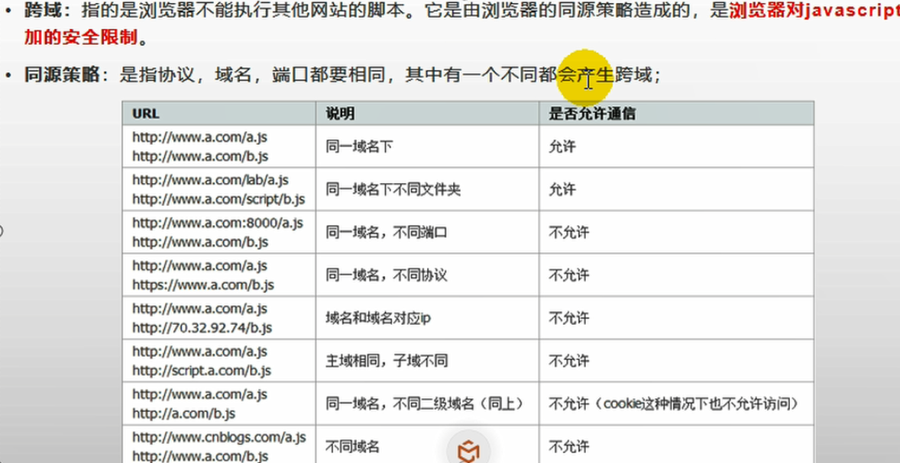
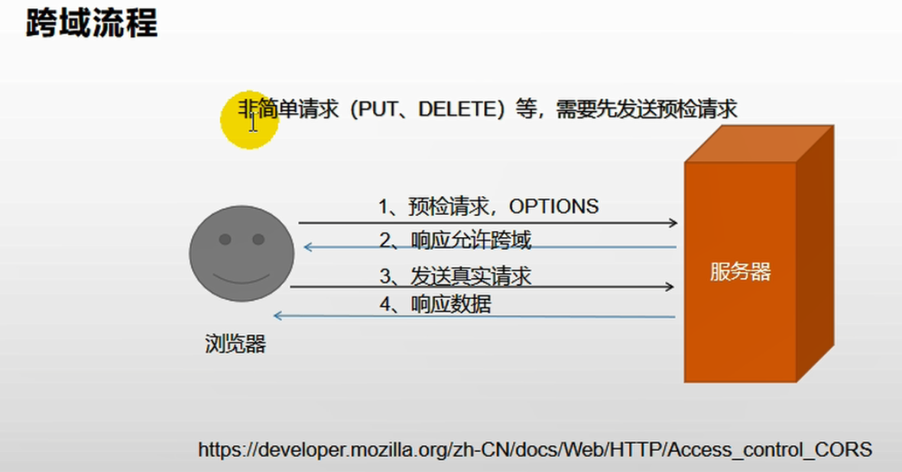
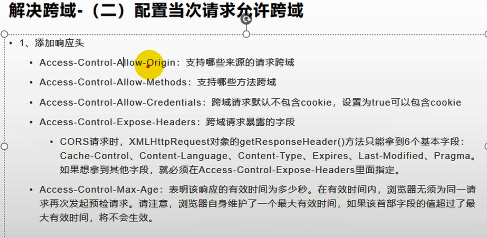

# 前后端跨域问题









网关处配置允许跨域

```java
@Configuration
public class GuliShopCorsConfiguration {

    @Bean
    public CorsWebFilter corsWebFilter() {
        UrlBasedCorsConfigurationSource source = new UrlBasedCorsConfigurationSource();

        CorsConfiguration corsConfiguration = new CorsConfiguration();

        //1、配置跨域
        corsConfiguration.addAllowedHeader("*");
        corsConfiguration.addAllowedMethod("*");
        corsConfiguration.addAllowedOrigin("*");
        corsConfiguration.setAllowCredentials(true);

        source.registerCorsConfiguration("/**", corsConfiguration);
        return new CorsWebFilter(source);
    }
}
```

