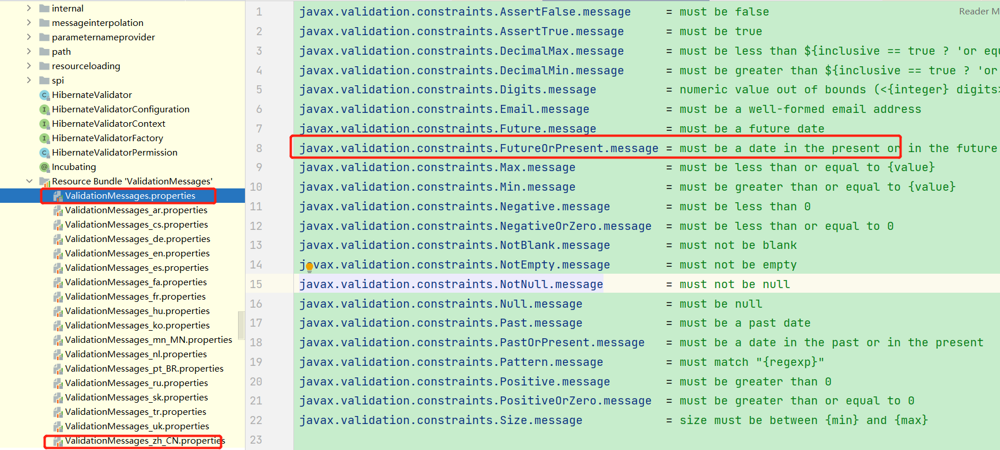
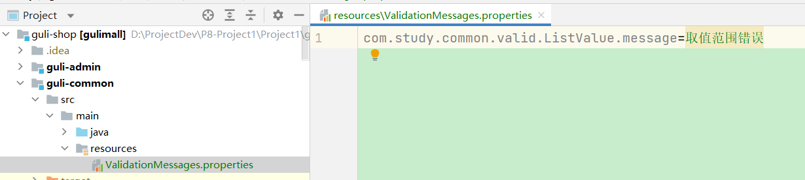

# JSR303校验

## 一、基本校验

- 使用注解对参数进行校验。

- 在Java中提供了一系列的校验方式，它这些校验方式在“javax.validation.constraints”包中，提供了如@Email，@NotNull等注解。

- 在参数实体的字段上，标注@Email，@NotNull等注解，在controller层就可以使用@Valid自动进行校验

  ```java
  @RequestMapping("/save")
  public R save(@Valid @RequestBody BrandEntity brand){
  	brandService.save(brand);
      return R.ok();
  }
  ```

- 获取校验的结果

  给校验的Bean后，紧跟一个BindResult，就可以获取到校验的结果。拿到校验的结果，就可以自定义的封装。

  ```java
   @RequestMapping("/save")
      public R save(@Valid @RequestBody BrandEntity brand, BindingResult result){
          if( result.hasErrors()){
              Map<String,String> map=new HashMap<>();
              //1.获取错误的校验结果
              result.getFieldErrors().forEach((item)->{
                  //获取发生错误时的message
                  String message = item.getDefaultMessage();
                  //获取发生错误的字段
                  String field = item.getField();
                  map.put(field,message);
              });
              return R.error(400,"提交的数据不合法").put("data",map);
          }else {
  
          }
          brandService.save(brand);
  
          return R.ok();
      }
  ```

- 统一校验异常结果处理

  ```java
  /**
   * 集中处理所有异常
   */
  @Slf4j
  @RestControllerAdvice(basePackages = "com.bigdata.gulimall.product.controller")
  public class GulimallExceptionAdvice {
  
      @ExceptionHandler(value = Exception.class)
      public R handleValidException(MethodArgumentNotValidException exception){
          Map<String,String> map=new HashMap<>();
          BindingResult bindingResult = exception.getBindingResult();
          bindingResult.getFieldErrors().forEach(fieldError -> {
              String message = fieldError.getDefaultMessage();
              String field = fieldError.getField();
              map.put(field,message);
          });
  
          log.error("数据校验出现问题{},异常类型{}",exception.getMessage(),exception.getClass());
          return R.error(400,"数据校验出现问题").put("data",map);
      }
  
  }
  ```

## 二、校验分组

- 给校验注解，标注上groups，指定什么情况下才需要进行校验。

  ```java
  @NotEmpty
  @NotBlank(message = "品牌名必须非空",groups = {UpdateGroup.class,AddGroup.class})
  private String name;
  ```

  在默认情况下，没有指定分组的校验注解，默认是不起作用的。想要起作用就必须要加groups。

- @Validated分组校验

  ```java
  @RequestMapping("/save")
  public R save(@Validated(AddGroup.class) @RequestBody AttrEntity attr){
      attrService.save(attr);
      return R.ok();
  }
  ```

  在分组校验情况下，没有指定分组的校验注解，将不会生效，它只会在不分组的情况下生效

## 三、自定义校验规则

### 1、编写一个自定义的校验注解

```java
@Documented
@Constraint(validatedBy = {})
@Target({METHOD, FIELD, ANNOTATION_TYPE, CONSTRUCTOR, PARAMETER, TYPE_USE})
@Retention(RUNTIME)
public @interface ListValue {
    String message() default "{com.study.common.valid.ListValue.message}";//默认的提示信息

    Class<?>[] groups() default {};//所属分组

    Class<? extends Payload>[] payload() default {};

    int[] value() default {};
}
```

注解的默认消息是会读取这个文件

```properties
ValidationMessages.properties
```



自定义消息



### 2、编写校验器

```java
public class ListValueConstraintValidator implements ConstraintValidator<ListValue, Integer> {
    
    private Set<Integer> set = new HashSet<>();

    @Override
    public void initialize(ListValue constraintAnnotation) {
        int[] value = constraintAnnotation.value();
        for (int i : value) {
            set.add(i);
        }
    }

    @Override
    public boolean isValid(Integer value, ConstraintValidatorContext context) {
        return set.contains(value);
    }
}
```

### 3、关联自定义的校验器和自定义的校验注解

```java
@Constraint(validatedBy = { ListValueConstraintValidator.class})
```

完整版：

```java
@Documented
@Constraint(validatedBy = {ListValueConstraintValidator.class})
@Target({METHOD, FIELD, ANNOTATION_TYPE, CONSTRUCTOR, PARAMETER, TYPE_USE})
@Retention(RUNTIME)
public @interface ListValue {
    String message() default "{com.study.common.valid.ListValue.message}";

    Class<?>[] groups() default {};

    Class<? extends Payload>[] payload() default {};

    int[] value() default {};
}
```

### 4、使用

```java
/**
 * 显示状态[0-不显示；1-显示]
 */
@ListValue(value = {0,1},groups ={AddGroup.class})
private Integer showStatus;
```

