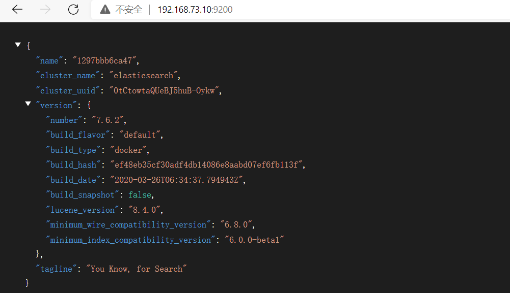
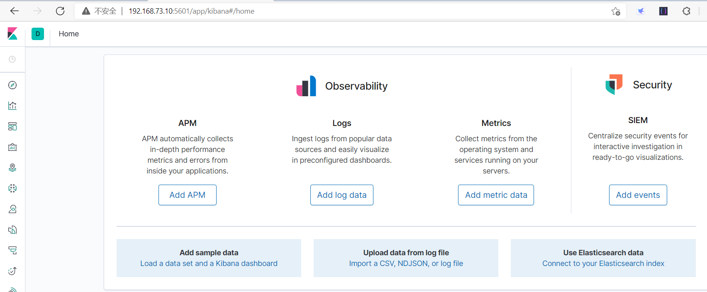

# 一、docker安装ES

```bash
#1.下载es
docker pull elasticsearch:7.6.2
#2.创建目录挂载在本地
mkdir -p /mydata/elasticsearch/config
mkdir -p /mydata/elasticsearch/data
#3.设置任意主机均可连接es
echo "http.host: 0.0.0.0" >/mydata/elasticsearch/config/elasticsearch.yml
#4.设置目录具有读写权限
chmod -R 777 /mydata/elasticsearch/
#5.启动ES
docker run --name elasticsearch -p 9200:9200 -p 9300:9300 \
-e  "discovery.type=single-node" \
-e ES_JAVA_OPTS="-Xms512m -Xmx512m" \
-v /mydata/elasticsearch/config/elasticsearch.yml:/usr/share/elasticsearch/config/elasticsearch.yml \
-v /mydata/elasticsearch/data:/usr/share/elasticsearch/data \
-v  /mydata/elasticsearch/plugins:/usr/share/elasticsearch/plugins \
-d elasticsearch:7.6.2
#6.设置开机启动es
docker update elasticsearch --restart=always
```

```bash
#查看所有进程，包括停止的和正在运行的
docker ps -a
#启动
docker start XXX（id的前几位就行）
```



# 二、docker安装Kibana

```bash
#1.下载kibana
docker pull kibana:7.6.2
#2.启动
docker run --name kibana -e ELASTICSEARCH_HOSTS=http://192.168.73.10:9200 -p 5601:5601 -d kibana:7.6.2
#3.设置自动启动
docker update kibana  --restart=always
```

