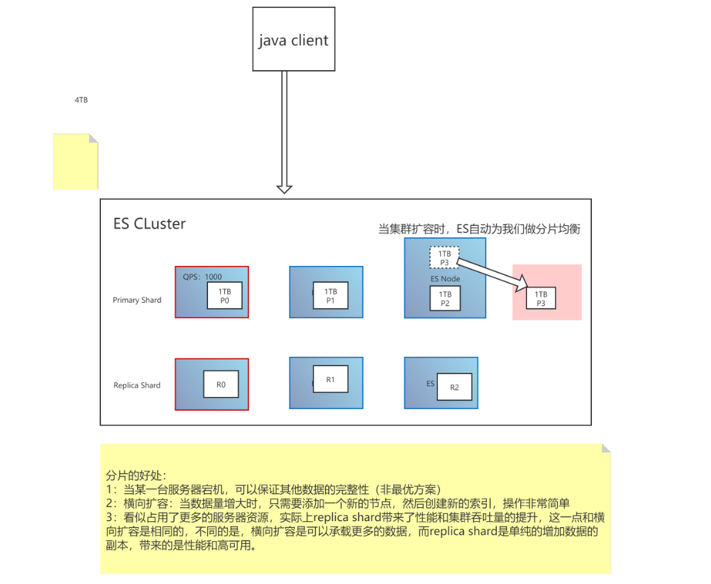
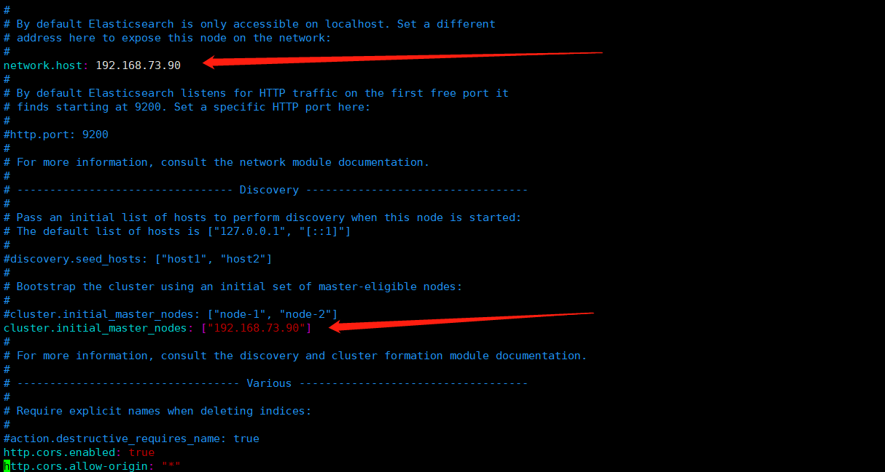

# **Elasticsearch**

## 一、核心概念

### 1.1、倒排索引


关系型数据库的正向索引，根据id可以定位到具体的某一条数据，是key-value模型。

倒排索引是反过来，将数据进行分词拆分，查找的时候根据某个词汇，按照相关度最终定位到id。类似value-key模型。

比如对brandName字段建立倒排索引，会对每条记录进行分词，并记录这个词汇出现在哪条记录中，“小米”出现在1、2、3中，"NFC"出现在2、3中。

倒排索引的结构：

- 包含这个关键词的document list
- TF term frequency:词频，搜索的关键词在每个doc中出现的次数，次数越多，代表相关性越高
- IDF inverse doc frequency：搜索的关键词在整体倒排索引中出现的次数，出现的次数越多，代表相关性越低，关键词越不重要，比如“是”、“了”这类词汇，就是非常不重要的数据。
- 每个doc的长度：越长相关度越低。
- 包含这个关键词的所有doc的平均长度。

### 1.2、优势

- 面向开发者友好，屏蔽了Lucene的复杂特性，集群自动发现（cluster discovery）
- 自动维护数据在多个节点上的建立
- 会帮我们做搜索请求的负载均衡
- 自动维护冗余副本，保证了部分节点宕机的情况下仍然不会有任何数据丢失
- ES基于Lucene提供了很多高级功能：复合查询、聚合分析、基于地理位置等。
- 对于大公司，可以构建几百台服务器的大型分布式集群，处理PB级别数据；对于小公司，开箱即用，门槛低上手简单。
- 相比较传统数据库，提供了全文检索，同义词处理（美丽的cls>漂亮的cls），相关度排名。聚合分析以及海量数据的近实时（NTR）处理，这些传统数据库完全做不到。

### 1.3、核心关键词


#### elasticsearch

elasticsearch相当于关系型数据库MySQL，是一个存储数据、提供搜索查询功能的整体应用程序。

#### index

索引。类似于数据库——它是我们存储和索引关联数据的地方。其实也可以按照一张数据库表的概念来理解。一个index会存储一类事务的数据，比如dog_index，会存储所有dog的数据。

```
提示：事实上，我们的数据被存储和索引在分片(shards)中，索引只是一个把一个或多个分片分组在一起的逻辑空间。然而，这只是一些内部细节——我们的程序完全不用关心分片。对于我们的程序而言，文档存储在索引(index)中。剩下的细节由Elasticsearch关心既可。
```

#### type

类型。可参照数据库中的table表的概念来理解，拥有自己的mapping结构。拥有field字段、属性等信息，但是在es7中逐渐被废弃，在es8中将被彻底废弃。一般es会默认设置type值为_doc。

#### document

- 存储在Elasticsearch中的主要实体叫文档（document）。用关系型数据库来类比的话，一个文档相当于数据库表中的一行记录，是json格式。
- Elasticsearch中的文档，可以有不同的mapping结构，但Elasticsearch的文档中，相同字段必须有相同类型。比如存储两条数据的时候，name字段的类型必须相同，不能一个是string，另一个integer。
- 文档由多个字段组成，每个字段可能多次出现在一个文档里，这样的字段叫多值字段（multivalued）。 每个字段的类型，可以是文本、数值、日期等。字段类型也可以是复杂类型，一个字段包含其他子文档或者数组。

#### field

字段。和MySQL中的字段类似，也有自己的类型，数据结构。

#### node

节点，一个ES实例就是一个node。不同的node可以建立在同一台物理机上，但是为了更好的性能，一般一台物理机上只会配置一个es实例，不会安装其他服务。

### 1.4shard分片和副本

为了将数据添加到Elasticsearch，我们需要索引(index)——一个存储关联数据的地方。实际上，索引只是一个用来指向一个或多个分片(shards)的“逻辑命名空间(logical namespace)”.

- 一个分片(shard)是一个最小级别“工作单元(worker unit)”,它只是保存了索引中所有数据的一部分。

- 我们需要知道是分片就是一个Lucene实例，并且它本身就是一个完整的搜索引擎。应用程序不会和它直接通信。

- 分片可以是主分片(primary shard)或者是复制分片(replica shard)。

- 索引中的每个文档属于一个单独的主分片，所以主分片的数量决定了索引最多能存储多少数据。

- 复制分片只是主分片的一个副本，它可以防止硬件故障导致的数据丢失，同时可以提供读请求，比如搜索或者从别的shard取回文档。

- 当索引创建完成的时候，主分片的数量(number_of_shards)就固定了，但是复制分片(number_of_replicas)的数量可以随时调整。

- 副本分片可以提供硬件故障时的容灾以及防止数据丢失，所以主分片和副本分片是不能在同一个es 实例node中的。

- 副本分片可以提供容灾、提高查询性能。但是副本分片不能提供写入功能。

  

## 二、安装和配置

### 2.1、windows安装

```
bin目录下
/bin elasticsearch.bat
启动成功验证：http://localhost:9200/
```


### 2.2、Linux安装

#### 1、安装

```
创建目录
/usr/local/soft/es
下载
wget https://artifacts.elastic.co/downloads/elasticsearch/elasticsearch-7.13.2-linux-x86_64.tar.gz
解压缩
tar -xzf es.zip
```


```
创建非root账户，es只能在非root账户下
adduser esuser：创建es账号
passwd esuser：设置es账号的密码
chown -R esuser /usr/local/soft 给账户赋予目录权限
```

修改es配置。如果不修改，将只能通过127.0.0.1:9200访问

```
进入conf目录，修改
vi /usr/local/soft/es/elasticsearch-7.13.2/config/elasticsearch.yml
修改配置：
network.host: 192.168.73.90 //配置向外暴露的ip。0.0.0.0代表允许所有ip访问
cluster.initial_master_nodes:["192.168.73.90"]//配置master节点。es集群必须有master节点
```



使用创建的es用户登陆

```
进入bin目录
./elasticsearch
```


#### 2、访问测试

1. 浏览器访问

   

2. Linux访问

   
   
3. 如果访问不了，关闭防火墙

   ```
   >>>关闭防火墙
   systemctl stop firewalld.service            #停止firewall
   systemctl disable firewalld.service        #禁止firewall开机启动
   ```

#### 3、普遍遇到的问题

1. max file descriptors [4096] for elasticsearch process is too low, increase to at least [65535]

   ```
   vi  /etc/security/limits.conf
   在最后增加配置
   * soft nofile 65536
   * hard nofile 65536
   ```

   此文件修改后需要重新登录用户，才会生效

   

2. max number of threads [3795] for user [esuser] is too low, increase to at least [4096]

   最大线程数不够

   ```
   vi  /etc/security/limits.conf
   在最后增加配置
   * soft nproc 4096
   * hard nproc 4096
   ```

   

3. max virtual memory areas vm.max_map_count [65530] is too low, increase to at least [262144]

   ```
   vi /etc/sysctl.conf
   在最后增加配置
   vm.max_map_count=262144
   然后执行命令/sbin/sysctl -p 立即生效
   ```

   

### 2.3、head插件安装

```
git clone git://github.com/mobz/elasticsearch-head.git
cd elasticsearch-head
npm install
npm run start
open http://localhost:9100/
```

如果无法发现ES节点，尝试在ES配置文件中设置允许跨域

```
http.cors.enabled: true
http.cors.allow-origin: "*"
```

安装成功效果图：


### 2.4、常用配置

- Cluster&Node

  ```yaml
  cluster.name:
  	配置elasticsearch的集群名称，默认是elasticsearch。建议修改成一个有意义的名称。
  node.name:
  	节点名，通常一台物理服务器就是一个节点，es会默认随机指定一个名字，建议指定一个有意义的名称，方便管理。
  	一个或多个节点组成一个cluster集群，集群是一个逻辑的概念，节点是物理概念。
  node.master: 
  	指定该节点是否有资格被选举成为master结点，默认是true，如果原来的master宕机会重新选举新的master。
  node.data: 
  	指定该节点是否存储索引数据，默认为true。
  ```
  
- Paths

  ```yaml
  path.conf:
  	设置配置文件的存储路径，tar或zip包安装默认在es根目录下的config文件夹，rpm安装默认在/etc/ elasticsearch
  path.data:
  	设置索引数据的存储路径，默认是es根目录下的data文件夹，可以设置多个存储路径，用逗号隔开。
  path.logs:
  	设置日志文件的存储路径，默认是es根目录下的logs文件夹
  path.plugins: 
  	设置插件的存放路径，默认是es根目录下的plugins文件夹
  ```
  
- Memory

  ```yaml
  bootstrap.memory_lock: true
  	设置为true可以锁住ES使用的内存，避免内存与swap分区交换数据。swap分区速度会非常慢。
  ```
  
- Network

  ```yaml
  network.host: 
  	设置绑定主机的ip地址，设置为0.0.0.0表示绑定任何ip，允许外网访问，生产环境建议设置为具体的ip。
  http.port: 9200
  	设置对外服务的http端口，默认为9200。
  transport.tcp.port: 9300  集群结点之间通信端口
  http.cors.enabled: 
      是否允许跨域
  http.cors.allow-origin: 
      "*"
  ```
  
- Discovery

  ```yaml
  discovery.seed_hosts:
      配置所有node.master为true的节点。
  cluster.initial_master_nodes: 
      设置初始master是哪个节点，启动服务后可以自动生效，省略选举过程，推荐配置集群中的仅master节点
  discovery.zen.ping.unicast.hosts: ["host1:port", "host2:port", "..."]
  	设置集群中master节点的初始列表。
  discovery.zen.ping.timeout: 3s
  	设置ES自动发现节点连接超时的时间，默认为3秒，如果网络延迟高可设置大些。
  discovery.zen.minimum_master_nodes:
  	主结点数量的最少值 ,此值的公式为：(master_eligible_nodes / 2) + 1 ，比如：有3个符合要求的主结点，那么这里要设置为2。
  node.max_local_storage_nodes: 
  	单机允许的最大存储结点数，通常单机启动一个结点建议设置为1，开发环境如果单机启动多个节点可设置大于1。
  ```
  
  
