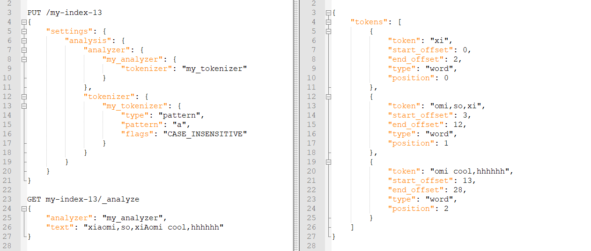

# Elasticsearch

## 一、索引创建

7.0之后，索引的默认分片数为1，7.0之前默认为5。

```
PUT product(索引name)
{
  "settings": {
    
  },
  "mappings": {
    
  },
  "aliases": {
    "NAME": {}
  }
}
```

### setting

#### 分析器

- 分析器四大组成部分

  ```
  PUT product2
  {
    "settings": {
      "analysis": {
        "analyzer": {},
        "char_filter": {},
        "filter": {},
        "tokenizer": {}
      }
    }
  }
  ```

1. char_filter

   - 字符过滤器：分词之前的预处理，包括过滤无用字符、标签，转换字符，比如A替换为B、&=>and 

   - 三种类型：HTML strip、Mapping、Pattern replace

   - HTML strip

     去掉类似b、a标签这样的HTML标签，并且可以通过escaped_tags参数，配置指定哪些标签不过滤。

     ```
     PUT /my-index
     {
       "settings": {
         "analysis": {
           "analyzer": {
             "my_analyzer": {
               "tokenizer": "keyword",
               "char_filter": [
                 "my_char_filter"
               ]
             }
           },
           "char_filter": {//自定义char_filter
             "my_char_filter":{
               "type":"html_strip",
               "escaped_tags":["p"]//去掉html标签的时候，忽略p
             }
           }
         }
       }
     }
     GET my-index/_analyze
     {
       "analyzer": "my_analyzer",
       "text": "<p>I&apos;m so <b>happy</b>!</p>"
     }
     ```

     

   - Mapping

     配置指定字符串的替换规则。

     ```json
     {
     	"char_filter": {
     		"my_char_filter": {
     			"type": "mapping",
     			"mappings": [
     				"p => AAAA",//p替换为AAAA
     				"h => BBBB" //h替换为BBBB
     			]
     		}
     	}
     }
     ```

   - Pattern replace

     正则表达式匹配，pattern参数配置正则，replacement参数配置正则替换的字符。

     ```json
     {
     	"char_filter": {
     		"my_char_filter": {
     			"type": "pattern_replace",
     			"pattern": "\\d",
     			"replacement": "-Q-"//将匹配的任意数字，替换为-Q-
     		}
     	}
     }
     ```

2. filter

   可以对数据做一定的修改，比如停用词、时态转换、大小写转换、同义词转换、语气词处理等。比如：has=>have、him=>he apples=>apple、the/oh/a=>干掉。

   lowercase：把英文字符全部转为小写。

   ```json
   GET _analyze
   {
     "tokenizer" : "standard",
     "filter" : ["lowercase"],
     "text" : "THE Quick FoX JUMPs" //结果全为小写。
   }
   ```

3. tokenizer

   分词器，默认的是standard。

   ```json
   PUT /my-index-10
   {
     "settings": {
       "analysis": {
         "analyzer": {
           "my_analyzer": {
             "tokenizer": "my_tokenizer"
           }
         },
         "tokenizer": {
           "my_tokenizer": {
             "type": "standard",//默认地英文分词器
             "max_token_length": 4//最大分词的长度，默认255
           }
         }
       }
     }
   }
   ```

   正则匹配分隔符：pattern，将文本分成若干词项。

   "flags":"CASE_INSENSITIVE" 匹配的时候忽略大小写。（可选项）

   ```json
   PUT /my-index-13
   {
   	"settings": {
   		"analysis": {
   			"analyzer": {
   				"my_analyzer": {
   					"tokenizer": "my_tokenizer"
   				}
   			},
   			"tokenizer": {
   				"my_tokenizer": {
   					"type": "pattern",
   					"pattern": "a",//正则匹配，按照a进行分词
   					"flags": "CASE_INSENSITIVE"
   				}
   			}
   		}
   	}
   }
   
   GET my-index-13/_analyze
   {
   	"analyzer": "my_analyzer",
   	"text": "xiaomi,so,xiAomi cool,hhhhhh"
   }
   ```

   

   正则匹配词项：simple_pattern

   ```json
   PUT my-index-14
   {
     "settings": {
       "analysis": {
         "analyzer": {
           "my_analyzer": {
             "tokenizer": "my_tokenizer"
           }
         },
         "tokenizer": {
           "my_tokenizer": {
             "type": "simple_pattern",
             "pattern": "[0123456789]{3}"//匹配三位的数字
           }
         }
       }
     }
   }
   POST my-index-14/_analyze
   {
     "analyzer": "my_analyzer",
     "text": "fd-786-335-514-x"
   }
   匹配结果：786  335  514
   ```

4. analyzer

   ```json
   PUT /my_index
   {
   	"settings": {
   		"analysis": {
   			"char_filter": {
   				"&_to_and": {
   					"type": "mapping",
   					"mappings": ["&=> and "]
   				}
   			},
   			"filter": {
   				"my_stopwords": {
   					"type": "stop",
   					"stopwords": ["the","a"]
   				}
   			},
   			"tokenizer": {
   				"my_tokenizer": {
   					"type": "standard",
   					"max_token_length": 4
   				}
   			},
   			"analyzer": {
   				"my_analyzer": {
   					"type": "custom",
   					"char_filter": ["html_strip","&_to_and"],
   					"tokenizer": ["standard","my_tokenizer"],
   					"filter": ["lowercase","my_stopwords"]
   				}
   			}
   		}
   	}
   }
   ```

### mapping

​        映射是定义文档及其包含的字段如何存储和索引的过程。每个文档都是一批字段的集合，每个字段都有自己的数据类型、默认值、分析器、是否被索引等等配置信息。这些都是映射里面可以设置的，按照最优规则处理数据对ES性能提高很大，因此才需要建立映射，并且需要思考如何建立映射才能对性能更好。

​        映射分为动态映射和显示映射。在dynamic mapping动态创建的时候，ES会根据put的数据，自动为相应的字段创建类型、搜索方式（exact value或者full text）、分词器等。

- exact value：精确匹配，在倒排索引过程中，分词器会将field作为一个整体创建到索引中。
- full text：全文检索。分词、近义词、同义词、混淆词、大小写、词性、过滤、时态转换等。

- 动态映射

  | 123456      | =>   | long    |
  | ----------- | ---- | ------- |
  | 123.123     | =>   | double  |
  | true\|false | =>   | boolean |
  | 2020-05-20  | =>   | date    |

  ES是使用JSON分析器进行字段类型检测的，JSON没有隐式转换，所以会对字段设置一个比较宽的字段类型，integer的会设置为long

- type核心类型

  1. 数字类型

     ```
     long, integer, short, byte, double, float, half_float, scaled_float
     在满足需求的情况下，尽可能选择范围小的数据类型。
     ```

  2. text类型

     ```
     keyword：
       适用于索引结构化的字段，可以用于过滤、排序、聚合。keyword类型的字段只能通过精确值（exact value）搜索到。Id应该用keyword。
     text：
       当一个字段是要被全文搜索的，比如Email内容、产品描述，这些字段应该使用text类型。设置text类型以后，字段内容会被分析，在生成倒排索引以前，字符串会被分析器分成一个一个词项。text类型的字段不用于排序，很少用于聚合。
       为啥不会为text创建索引：字段数据会占用大量堆空间，尤其是在加载高基数text字段时。字段数据一旦加载到堆中，就在该字段的生命周期内保持在那里。同样，加载字段数据是一个昂贵的过程，可能导致用户遇到延迟问题。这就是默认情况下禁用字段数据的原因。有时，在同一字段中同时具有全文本（text）和关键字（keyword）会很有用：一个用于全文本搜索，另一个用于聚合和排序。
       ES默认会为text字符类型字段创建keyword,并且ignore_above属性设置为256。默认只取前256个字符。
     ```

     ```json
     "name" : {
       "type" : "text",
       "fields" : {
           "keyword" : {
              "type" : "keyword",
              "ignore_above" : 256
             }
         }
     }
     ```

  3. date类型

     date类型属于exact value。不会被分词。

  4. 布尔类型

  5. binary（二进制）

  6. range（区间类型）

     ```
     integer_range、float_range、long_range、double_range、date_range
     ```

  7. 复杂类型Object

     用于单个json对象。

  8. 复杂类型Nested

     用于多个json数组。

- properties属性配置

  1. index

     是否对当前字段创建索引，默认true，如果不创建索引，该字段不会通过索引被搜索到,但是仍然会在source元数据中展示。

  2. analyzer

     指定分词器，比如standard、english、ik_max_word等。默认为standard。

  3. boost

     对当前字段相关度的评分权重，默认1，权重越高，在多字段多条件搜索时，相关度所占权重比例就会越高。

  4. coerce

     是否允许强制类型转换，true “1”=> 1   false “1”=< 1，默认为true。

  5. copy_to

     该字段是把其他字段中的值，以空格为分隔符组成一个大字符串，然后被分析和索引但是不存储，也就是说它能被查询，但是不能被取回显示。注意copy_to指向的字段，字段类型要为text。如果想要查询显示，可以设置store=true。

     ```json
     PUT my-index-000001
     {
       "mappings": {
         "properties": {
           "first_name": {
             "type": "text",
             "copy_to": "full_name" 
           },
           "last_name": {
             "type": "text",
             "copy_to": "full_name" 
           },
           "full_name": {
             "type": "text"
           }
         }
       }
     }
     
     PUT my-index-000001/_doc/1
     {
       "first_name": "John",
       "last_name": "Smith"
     }
     
     GET my-index-000001/_search
     {
       "query": {
         "match": {
           "full_name": { 
             "query": "John Smith",
             "operator": "and"
           }
         }
       }
     }
     ```

  6. doc_values

     为了提升排序和聚合效率，默认true，为字段创建正排索引。如果确定不需要对字段进行排序或聚合，也不需要从脚本访问字段值，则可以禁用doc值以节省磁盘空间（不支持text和annotated_text）。

  7. enable

     是否创建倒排索引，可以对字段操作，也可以对索引操作，如果不创建索引，仍然可以检索并在_source元数据中展示，谨慎使用，该状态无法修改。type为object时可以使用。

  8. fielddata

     查询时内存数据结构，在首次用当前字段聚合、排序或者在脚本中使用时，需要字段为fielddata数据结构，并且创建正排索引保存到堆中。

  9. format

     格式化"format": "yyyy-MM-dd"

  10. eager_global_ordinals

      用于聚合的字段上，优化聚合性能,

  11. Frozen indices（冻结索引）

      有些索引使用率很高，会被保存在内存中，有些使用率特别低，宁愿在使用的时候重新创建，在使用完毕后丢弃数据，Frozen indices的数据命中频率小，不适用于高搜索负载，数据不会被保存在内存中，堆空间占用比普通索引少得多，Frozen indices是只读的，请求可能是秒级或者分钟级。eager_global_ordinals不适用于Frozen indices。

  12. fields

      给field创建多字段，用于不同目的（全文检索或者聚合分析排序）。

  13. ignore_above

      超过长度将被忽略

  14. search_analyzer

      设置单独的查询时分析器

  15. ignore_malforme

      忽略类型错误

  16. index_options

      控制将哪些信息添加到反向索引中以进行搜索和突出显示。仅用于text字段

  17. Index_phrases

      提升exact_value查询速度，但是要消耗更多磁盘空间

  18. Index_prefixes

      前缀搜索

  19. min_chars

      前缀最小长度，>0，默认2（包含）

  20. max_chars

      前缀最大长度，<20，默认5（包含）

      ```json
      "index_prefixes": {
      	"min_chars": 1,
      	"max_chars": 10
      }
      ```

  21. norms

      是否禁用评分（在filter和聚合字段上应该禁用）。

  22. null_value

      为null值设置默认值，"null_value": "NULL"

  23. store

      设置字段是否仅查询,数据会设置在fields标签下，和source平级，但是会存储两份 

### aliases

### dynamic

- properties同级别，用于设置是否可以动态添加字段。

- true 新检测到的字段将添加到映射中。（默认）

- false 新检测到的字段将被忽略。这些字段将不会被索引，因此将无法搜索，但仍会出现在_source返回的匹配项中。这些字段不会添加到映射中，必须显式添加新字段。

- strict 如果检测到新字段，则会引发异常并拒绝文档。必须将新字段显式添加到映射中。

  ```json
  {
  	"mappings": {
  		"properties": {
  			"field_1": {
  				"type": "text",
  				"analyzer": "standard",
  				"boost": 2
  			}
  		},
  		"dynamic": true
  	}
  }
  ```

### doc_values和fielddata

- doc_values和fielddata均是为创建正排索引服务的。

- 倒排索引：查询某个关键词在哪些文档中存在。

- 正排索引：查询某个文档中包含哪些项。

- doc_values的优势是他不会随着文档的增多引起OOM问题。doc_values在磁盘创建排序和聚合所需的正排索引。这样就避免了在生产环境给ES设置一个很大的HEAP_SIZE，也使得JVM的GC更加高效，这个又为其它的操作带来了间接的好处。而且，随着ES版本的升级，对于doc_values的优化越来越好，索引的速度已经很接近fielddata了，而且硬盘的访问速度也是越来越快（比如SSD）。所以doc_values 现在可以满足大部分场景，也是ES官方重点维护的对象。

- fileddata是在使用时创建、基于内存的正排索引。

  | 维度     | doc_values     | fielddata      |
  | -------- | -------------- | -------------- |
  | 创建时间 | index时创建    | 使用时动态创建 |
  | 创建位置 | 磁盘           | 内存(jvm heap) |
  | 优点     | 不占用内存空间 | 不占用磁盘空间 |

## 二、索引查询

- 查询所有

  查询ES中存在的所有的索引，类似于MySQL中的show table。

  ```
  GET _cat/indices?v  _cat表示查看的含义，indices表示索引的集合
  ```

  

  

- 查询单条

  ```
  GET product(product为索引name)
  ```

  

  

## 三、索引修改

## 四、索引删除

```
DELETE product(索引name)
```

## 五、cat命令

```
/_cat/allocation      	#查看单节点的shard分配整体情况
/_cat/shards          #查看各shard的详细情况
/_cat/shards/{index}  	#查看指定分片的详细情况
/_cat/master          #查看master节点信息
/_cat/nodes           #查看所有节点信息
/_cat/indices         #查看集群中所有index的详细信息
/_cat/indices/{index} 	#查看集群中指定index的详细信息
/_cat/segments        #查看各index的segment详细信息,包括segment名, 所属shard, 内存(磁盘)占用大小, 是否刷盘
/_cat/segments/{index}#查看指定index的segment详细信息
/_cat/count           #查看当前集群的doc数量
/_cat/count/{index}   #查看指定索引的doc数量
/_cat/recovery        #查看集群内每个shard的recovery过程.调整replica。
/_cat/recovery/{index}#查看指定索引shard的recovery过程
/_cat/health          #查看集群当前状态：红、黄、绿
/_cat/pending_tasks   #查看当前集群的pending task
/_cat/aliases         #查看集群中所有alias信息,路由配置等
/_cat/aliases/{alias} #查看指定索引的alias信息
/_cat/thread_pool     #查看集群各节点内部不同类型的threadpool的统计信息,
/_cat/plugins         #查看集群各个节点上的plugin信息
/_cat/fielddata       #查看当前集群各个节点的fielddata内存使用情况
/_cat/fielddata/{fields}     #查看指定field的内存使用情况,里面传field属性对应的值
/_cat/nodeattrs              #查看单节点的自定义属性
/_cat/repositories           #输出集群中注册快照存储库
/_cat/templates              #输出当前正在存在的模板信息
```

