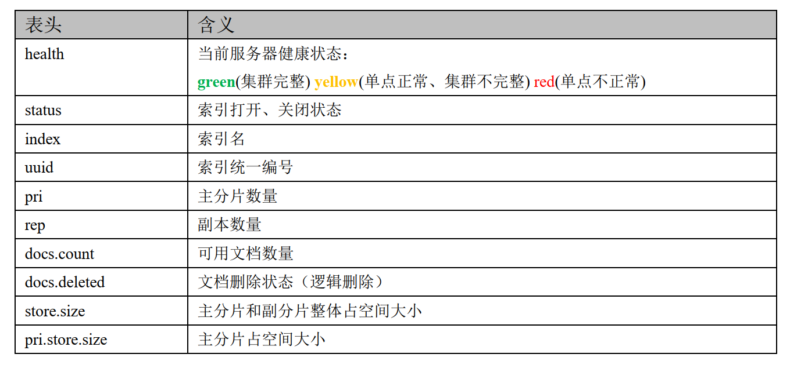

# Elasticsearch

## 一、索引创建

7.0之后，索引的默认分片数为1，7.0之前默认为5。

```
PUT product(索引name)
{
  "settings": {
    
  },
  "mappings": {
    
  },
  "aliases": {
    "NAME": {}
  }
}
```

- setting

- mapping

  ```
  index
    是否对当前字段创建索引，默认true，如果不创建索引，该字段不会通过索引被搜索到,但是仍然会在source元数据中展示
  analyzer
    指定分析器（standard、english）。
  boost
    对当前字段相关度的评分权重，默认1
  coerce
    是否允许强制类型转换，true “1”=> 1   false “1”=< 1
  copy_to
    "copy_to": "other_field_name"
  doc_values
    为了提升排序和聚合效率，默认true，如果确定不需要对字段进行排序或聚合，也不需要通过脚本访问字段值，则可以禁
    用doc值以节省磁盘空间（不支持text和annotated_text）。
  eager_global_ordinals
    用于聚合的字段上，优化聚合性能,
    Frozen indices（冻结索引）：有些索引使用率很高，会被保存在内存中，有些使用率特别低，宁愿在使用的时候重新创建，
    在使用完毕后丢弃数据，Frozen indices的数据命中频率小，不适用于高搜索负载，数据不会被保存在内存中，堆空间占用
    比普通索引少得多，Frozen indices是只读的，请求可能是秒级或者分钟级。
    eager_global_ordinals不适用于Frozen indices
  enable
    是否创建倒排索引，可以对字段操作，也可以对索引操作，如果不创建索引，仍然可以检索并在_source元数据中展示，
    谨慎使用，该状态无法修改。type为object时可以使用
  fielddata
    查询时内存数据结构，在首次用当前字段聚合、排序或者在脚本中使用时，需要字段为fielddata数据结构，并且创建
    正排索引保存到堆中。
  fields
    给field创建多字段，用于不同目的（全文检索或者聚合分析排序）.
  format
    格式化
    "date": {
        "type":   "date",
        "format": "yyyy-MM-dd"
     }
  ignore_above
    超过长度将被忽略
  search_analyzer
    设置单独的查询时分析器
  ignore_malforme
    忽略类型错误
  index_options
    控制将哪些信息添加到反向索引中以进行搜索和突出显示。仅用于text字段
  Index_phrases
    提升exact_value查询速度，但是要消耗更多磁盘空间
  Index_prefixes
    前缀搜索
  min_chars
    前缀最小长度，>0，默认2（包含）
  max_chars
    前缀最大长度，<20，默认5（包含）
  "index_prefixes": {
            "min_chars" : 1,
            "max_chars" : 10
          }
  meta
    附加元数据
  normalizer
  norms
    是否禁用评分（在filter和聚合字段上应该禁用）。
  null_value
    为null值设置默认值
    "null_value": "NULL"
  position_increment_gap
  proterties
    除了mapping还可用于object的属性设置
  similarity
    为字段设置相关度算法，支持BM25、claassic（TF-IDF）、boolean
  store
    设置字段是否仅查询,数据会设置在fields标签下，和source平级，但是会存储两份
  term_vector 
  ```

  

- aliases

cat命令：

```
/_cat/allocation      	#查看单节点的shard分配整体情况
/_cat/shards          #查看各shard的详细情况
/_cat/shards/{index}  	#查看指定分片的详细情况
/_cat/master          #查看master节点信息
/_cat/nodes           #查看所有节点信息
/_cat/indices         #查看集群中所有index的详细信息
/_cat/indices/{index} 	#查看集群中指定index的详细信息
/_cat/segments        #查看各index的segment详细信息,包括segment名, 所属shard, 内存(磁盘)占用大小, 是否刷盘
/_cat/segments/{index}#查看指定index的segment详细信息
/_cat/count           #查看当前集群的doc数量
/_cat/count/{index}   #查看指定索引的doc数量
/_cat/recovery        #查看集群内每个shard的recovery过程.调整replica。
/_cat/recovery/{index}#查看指定索引shard的recovery过程
/_cat/health          #查看集群当前状态：红、黄、绿
/_cat/pending_tasks   #查看当前集群的pending task
/_cat/aliases         #查看集群中所有alias信息,路由配置等
/_cat/aliases/{alias} #查看指定索引的alias信息
/_cat/thread_pool     #查看集群各节点内部不同类型的threadpool的统计信息,
/_cat/plugins         #查看集群各个节点上的plugin信息
/_cat/fielddata       #查看当前集群各个节点的fielddata内存使用情况
/_cat/fielddata/{fields}     #查看指定field的内存使用情况,里面传field属性对应的值
/_cat/nodeattrs              #查看单节点的自定义属性
/_cat/repositories           #输出集群中注册快照存储库
/_cat/templates              #输出当前正在存在的模板信息
```


## 二、索引查询

- 查询所有

  查询ES中存在的所有的索引，类似于MySQL中的show table。

  ```
  GET _cat/indices?v  _cat表示查看的含义，indices表示索引的集合
  ```

  

  

- 查询单条

  ```
  GET product(product为索引name)
  ```

  

  

## 三、索引修改

## 四、索引删除

```
DELETE product(索引name)
```

