# Elasticsearch

## Query DSL

### 1、指定id查询

```
GET product/_doc/8888
```

### 2、match_all

- 查询所有

  ```
  GET student/_search
  {
    "query": {
      "match_all": {}
    }
  }
  # "query"：这里的 query 代表一个查询对象，里面可以有不同的查询属性
  # "match_all"：查询类型，例如： match_all(代表查询所有)， match， term ， range 等等
  # {查询条件}：查询条件会根据类型的不同，写法也有差异
  ```

  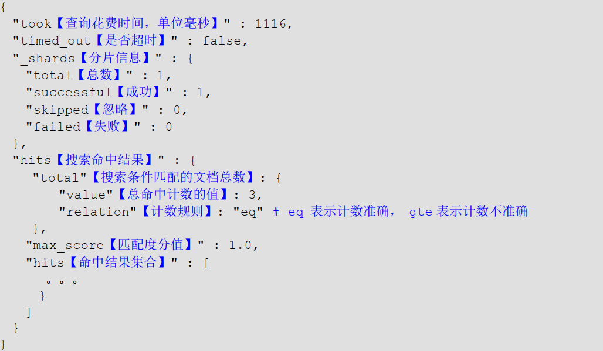

### 3、match

- 条件匹配，关键词会被分词

- 简单搜索

  ```json
  GET student/_search
  {
    "query": {
      "match": {
        "name": "zhangsan"
      }
    }
  }
  ```

- 指定参数

  ```json
  GET student/_search
  {
    "query": {
      "match": {
        "name": {
          "query": "to be or not to be",
          "operator": "and", 
          "minimum_should_match": 1, 
          "zero_terms_query": "all", 
          "fuzziness": 1,
          "auto_generate_synonyms_phrase_query": "true",
          "analyzer": "standard"
        }
      }
    }
  }
  ```

  1. query: 查询的关键词
  2. operator: match查询。关键词是会被分词，查询结果是bool类型，默认是or，可以指定为and，只有全部分词结果匹配才是目标数据。 
  3. minimum_should_match: 最小匹配数量，默认是1，比如my name li 分词后是三个词，若设置为2，只有其中两个匹配上了，才算匹配成功。
  4. zero_terms_query: 零词查询，ES查询默认是会对无效词进行过滤的，is、a、he、or这类词会被过滤掉。设置为"all"则不会被过滤，比如查询"to be or not to be"，就不能被过滤，否则没有结果。 
  5. fuzziness: 模糊查询最大误差，并非越大越好，最大误差越大，导致召回率高，但是结果不准确。
  6. auto_generate_synonyms_phrase_query: 启用同义词，比如like love 可以理解为同义词，ES查询时，默认时开启的。
  7. analyzer: 指定分词器，默认的是standard。

- 

### 4、term

- 关键词不会被分词，当作一个完整的短语进行匹配

  ```json
  GET product/_search
  {
    "query": {
      "term": {
        "name": {
          "value": "xiaomi phone"
        }
      }
    }
  }
  ```

  会使用完整的“xiaomi phone”进行数据匹配。所以有可能导致会搜索不到匹配的记录。

- 

### 5、terms

- 和term查询效果相同，但是可以指定多个值。只要其中任何一个满足条件，文档即匹配。

  ```json
  GET product/_search
  {
    "query": {
      "terms": {
        "name": [
          "phone",
          "nfc"
        ]
      }
    }
  }
  ```

- 

### 6、_source

- 指定查询字段。默认情况下，es查询结果会把_source包含的所有字段都返回。可以通过"__source"指定返回的字段。

- includes：来指定想要显示的字段

- excludes：来指定不想要显示的字段

  ```
  GET product/_search
  {
    "query": {
      "match": {
        "name": "xiaomi phone"
      }
    },
    "_source": ["name","price"], 
    "_source": {
      "excludes": ["desc","price"],
      "includes": ["desc","price"]
    }
  }
  ```

- 

### 6、prefix

### 7、sort排序

- 排序，desc、asc

  ```json
  GET product/_search
  {
    "query": {
      "match_all": {}
    },
    "sort": [
      {
        "price": {
          "order": "desc"
        },
        "_score": {
          "order": "asc"
        }
      }
    ]
  }
  ```

## 组合查询

- bool把各种其它查询通过must（必须 ）、 must_not（必须不）、 should（应该）的方式进行组合。

  ```json
  GET product/_search
  {
    "query": {
      "bool": {
        "must": [
          {}
        ],
        "must_not": [
          {}
        ],
        "should": [
          {}
        ],
        "filter": [
          {}
        ],
        "minimum_should_match": 1,
        "boost": 1
      }
    }
  }
  ```

- must

  必须包含，返回的文档必须满足must子句的条件，并且参与计算分值。

- must_not

  必须不包含，返回的文档必须不满足must_not定义的条件。不计算相关度分数。

- should

  可能包含，返回的文档可能满足should子句的条件。在一个Bool查询中，如果没有must或者filter，有一个或者多个should子句，那么只要满足一个就可以返回。

- filter

  过滤，返回的文档必须满足filter子句的条件。但是不会像Must一样参与计算分值。filter不会计算score，结果是会被缓存的。

- minimum_should_match

  minimum_should_match参数定义了至少满足几个子句。类似于sql中的in()，计算相关度分数。

- boost

  搜索权重

- filter缓存问题

  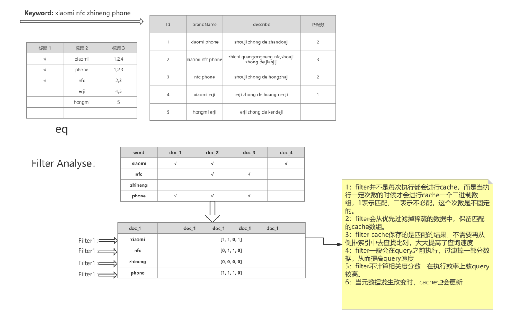

  1. filter只有当执行到一定次数的时候，才会对热数据进行缓存，缓存的时候会使用二进制数组的形式进行缓存，每条doc会对应0、1，1代表匹配，0代表不匹配。
  2. filer中保存的是匹配结果，所以搜索的时候，可以直接得到结果。
  3. 执行query的时候，filter一般会在query之前进行执行，过滤结果，也可以提高query查询速度。
  4. filter不会计算相关度分数。效率也会比query高。
  5. 当元数据（原始数据）更新的时候，cache也会更新。

## 范围查询

- 查询找出那些落在指定区间内的数字或者时间。 range 查询允许以下字符

  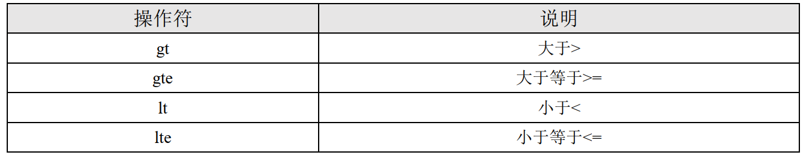

  ```
  GET product/_search
  {
    "query": {
      "range": {
        "price": {
          "gte": 3000,
          "lte": 4000
        }
      }
    }
  }
  ```

## 分页查询

- from：当前页的起始索引，默认从 0 开始。 from = (pageNum - 1) * size

- size：每页显示多少条

  ```
  GET product/_search
  {
    "query": {
      "match_all": {}
    },
    "from": 3,
    "size": 2
  }
  ```

- Deep pageing深度分页问题

  1.当数据超过1W，不要使用

  2.返回结果不要超过1000个，500以下为宜

  3.尽量避免深度分页查询

  4.使用游标查询Scroll search（只能下一页，没办法上一页，不适合实时查询）

  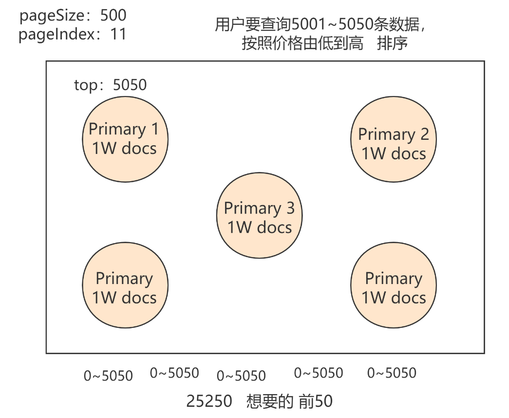

  数据分散在不同的分片中，当分页要查询1-500的数据时，每个分片都要查出500个数据，总共是2500，然后再整体进行查询，取1-500。涉及到数据的聚合。会导致性能下降特别多。如果分页数量较少，还可以，返回结果如果太多，影响较大。

  使用scrollSearch 滚动搜索，每次执行，都会返回一个id。查询的时候，使用id进行查询，就会查下一页，缺点是无法查询上一页。

- 游标滚动查询

  相当于mysql中生成快照的方式,所以如果在游标查询期间有增删改操作,是获取不到最新的数据的.在过期时间内,之后的查询的scroll_id是不变的.

  ```json
  GET product/_search?scroll=1m //过期时间为1分钟
  {
    "query": {
      "match_all": {}
    },
    "size": 2
  }
  
  GET _search/scroll
  {
    "scroll":"1m",
    "scroll_id":"第一次查询返回的_scroll_id"
  }
  ```

  返回结果

  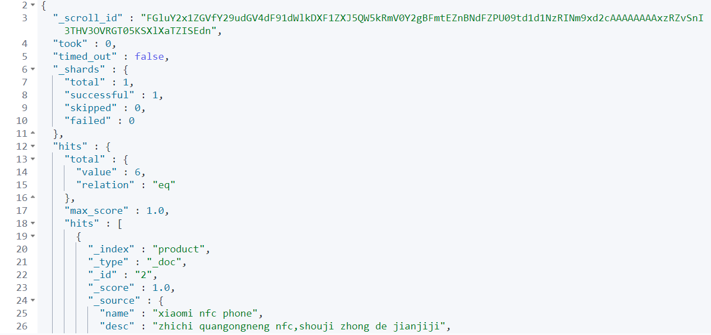

- 

## 模糊查询

- 返回包含与搜索字词相似的字词的文档。编辑距离是将一个术语转换为另一个术语所需的一个字符更改的次数。

- 这些更改可以包括：

  1、更改字符（box → fox）
  2、删除字符（black → lack）
  3、插入字符（sic → sick）
  4、转置两个相邻字符（act → cat）

- 为了找到相似的术语， fuzzy 查询会在指定的编辑距离内创建一组搜索词的所有可能的变体或扩展。然后查询返回每个扩展的完全匹配。

- 通过 fuzziness 修改编辑距离。一般使用默认值 AUTO，根据术语的长度生成编辑距离。

  ```json
  GET product/_search
  {
    "query": {
      "fuzzy": {
        "name": {
          "value": "phronee",
          "fuzziness": 2
        }
      }
    }
  }
  ```

## 聚合查询

- 聚合允许使用者对 es 文档进行统计分析，类似关系型数据库中的 group by，也有很多其他的聚合，例如取最大值、平均值等等。

- 聚合使用aggs关键字，使用"size": 0，可以不返回原始数据

  ```json
  GET product/_search
  {
    "aggs": {
      "MAX_XIAOMI": {
        "max": {//获取最大值
          "field": "price"
        }
      },
      "AGV_XIAOMI":{
        "avg": {//获取平均值
          "field": "price"
        }
      },
      "distinct_age":{
        "cardinality": {//去重之后取总数
          "field": "price"
        }
      },
      "stats":{
        "stats": {//一次返回count， max， min， avg 和 sum 五个指标
          "field": "price"
        }
      },
      "price_groupby":{
        "terms": {//桶聚合，相当于group by分组统计
          "field": "price",
          "size": 10
        },
        "aggs": {//桶聚合嵌套聚合查询
          "price_sum": {
            "sum": {
              "field": "price"
            }
          }
        }
      }
    },
    "size": 0
  }
  ```

  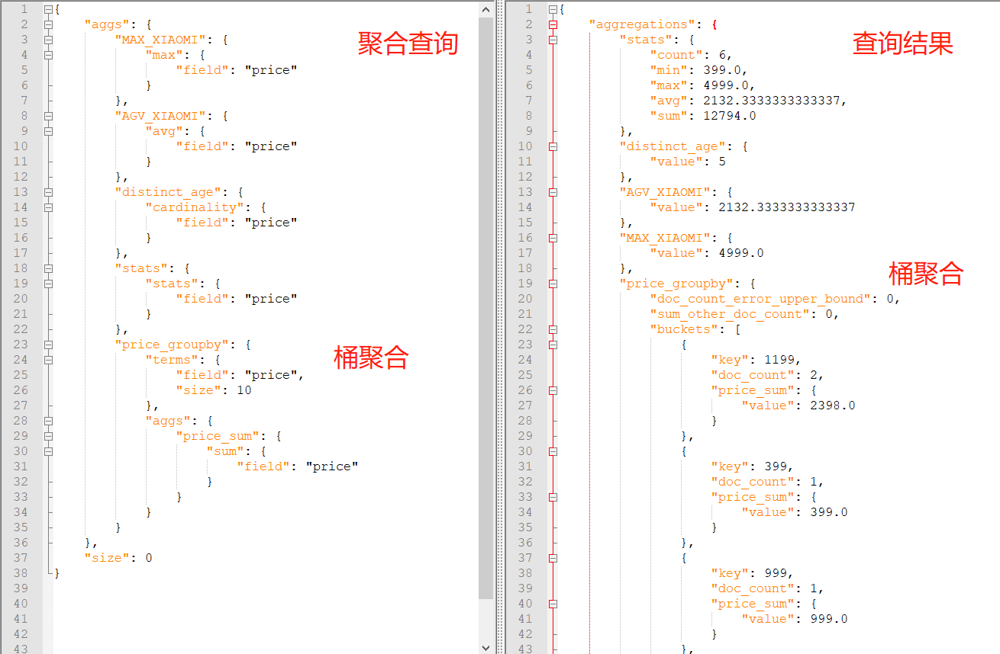

  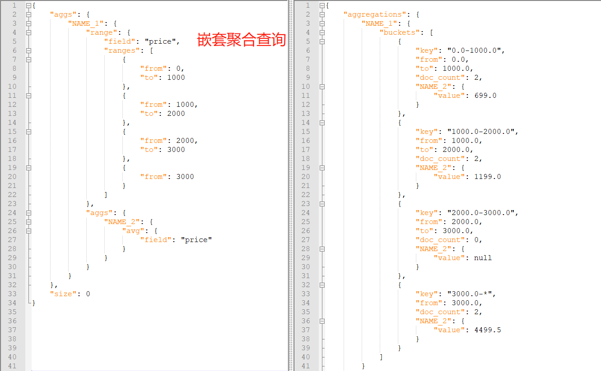

- s

## 批量查询

- mget实现批量查询，可以一次查询同一索引下的数据，也可以查询不同索引下的数据。get路径中如果包含了index，则body中可以省略。

- 如果查询超时了，会返回超时前查询到的所有数据。

  ```json
  GET /_mget
  GET /<index>/_mget
  body参数说明
  {
      "_id":必填
      "ids":["id1","id2"]也可以使用这种形式查询
      "_index":索引，如果path中指定了，此处可以省略
      "_source"：指定结果中的字段，默认返回所有["field1","field2"]
      "_source": {
          "include": [ "user" ],
          "exclude": [ "user.location" ]
        }
      "_stored_fields":查询store设置为true的字段["field1","field2"]
  }
  ```

  ```json
  GET product2/_mget
  {
    "ids": ["1","2"]
  }
  GET /_mget
  {
    "docs": [
      {
        "_index": "product2",
        "_id": "1",
        "_source":["name"]
        //查询除了name外所有的数据
        "_source":{
          "exclude":["name"]
        }
        //查询store为true的数据
        "stored_fields": [ "field3", "field4" ]
      }
    ]
  }
  ```

- 

## 脚本script

- 查询时使用painless，source指定具体字段，使用doc['filedName'].value

  ```
  GET product/_search
  {
    "script_fields": {
      "price_query": {
        "script": {
          "lang": "painless",
          "source": "doc['price'].value+params.num",
          "params": {
            "num": 2
          }
        }
      }
    }
  }
  ```

  


## 相关性得分原理及排序规则优化

### 1、analyzer和search_analyzer

- analyzer：创建索引时，指定了analyzer分析器。会在插入数据的时候，根据指定的分析器进行分词，创建倒排索引。
- search_analyzer：在使用关键词进行搜索时，会使用search_analyzer分析器对关键词进行分词。如果没有特殊指定，一般情况下search_analyzer和analyzer是相同的，并且在查询mapping时，只会将两者不同的search_analyzer进行展示。
- 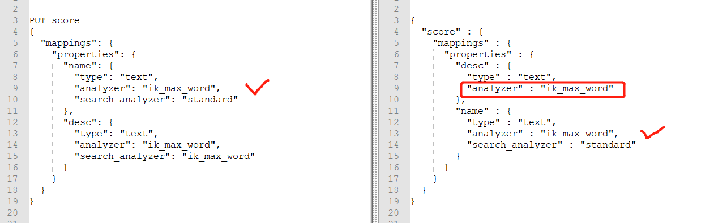

### 2、shard local IDF和global IDF（多shard下评分不准确问题解析）

- ES在计算相关性得分score时，会遵循三个条件：TF、IDF、相同条件下数据短的评分高。IDF评分是计算词条在当前分片下整个索引内的相关性，如果词频非常高，那么IDF评分就会比较低。所以如果数据分配不均，就会出现多shard下评分不准确的问题。比如某个分片下1万条数据，另一个分片下只10条数据，那么同一关键词在不同shard下的IDF评分就不同，当发生跨分片查询数据的情况时，就会导致数据不准确。
- 解决：各个分片大小尽量设置成一样大，并且生产环境极少出现这种问题，因为生产环境数据量大，各个分片配置的比较合理，最终误差会非常小。
- 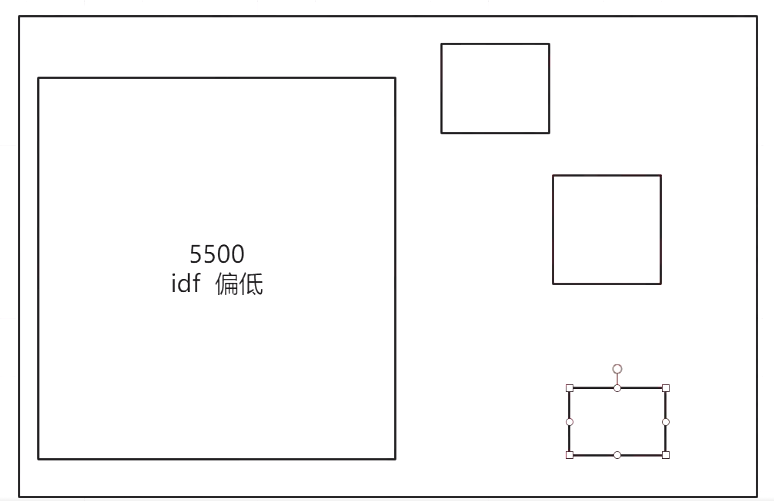

### 3、multi_match多字段搜索

- 测试数据

  ```json
  注意：中文分词需要把吃鸡、手机、快充、超级设置为热词。
  PUT score
  {
    "mappings": {
      "properties": {
        "name": {
          "type": "text",
          "analyzer": "ik_max_word",
          "search_analyzer": "ik_max_word"
        },
        "desc":{
          "type": "text",
          "analyzer": "ik_max_word",
          "search_analyzer": "ik_max_word"
        }
      }
    }
  }
  PUT /score/_doc/1
  {
    "name": "吃鸡手机，游戏神器，超级",
    "desc": "基于TX深度定制，流畅游戏不发热，物理外挂，快充",
    "price": 3999,
    "createtime": "2020-05-20",
    "collected_num": 99,
    "tags": [
      "性价比",
      "发烧",
      "不卡"
    ]
  }
  PUT /score/_doc/2
  {
    "name": "小米NFC手机",
    "desc": "支持全功能NFC,专业吃鸡，快充",
    "price": 4999,
    "createtime": "2020-05-20",
    "collected_num": 299,
    "tags": [
      "性价比",
      "发烧",
      "公交卡"
    ]
  }
  PUT /score/_doc/3
  {
    "name": "NFC手机，超级",
    "desc": "手机中的轰炸机",
    "price": 2999,
    "createtime": "2020-05-20",
    "collected_num": 1299,
    "tags": [
      "性价比",
      "发烧",
      "门禁卡"
    ]
  }
  PUT /score/_doc/4
  {
    "name": "小米耳机",
    "desc": "耳机中的黄焖鸡",
    "price": 999,
    "createtime": "2020-05-20",
    "collected_num": 9,
    "tags": [
      "低调",
      "防水",
      "音质好"
    ]
  }
  PUT /score/_doc/5
  {
    "name": "红米耳机",
    "desc": "耳机中的肯德基",
    "price": 399,
    "createtime": "2020-05-20",
    "collected_num": 0,
    "tags": [
      "牛逼",
      "续航长",
      "质量好"
    ]
  }
  ```

- 相关性分数计算规则

  ```
  搜索关键词：吃鸡手机
  GET score/_search
  {
    "query": {
      "bool": {
        "should": [
          {"match": {"name": "吃鸡手机"}},
          {"match": {"desc": "吃鸡手机"}}
        ]
      }
    }
  }
  结果分析：
  期望的匹配结果是doc1>doc2>doc3
  TF/IDF:
  TF: 关键词在每个doc中出现的次数
  IDF: 关键词在整个索引中出现的次数
  relevance score计算规则：每个query的分数，乘以matched query数量，除以总query数量
  1.它会执行 should 语句中的两个查询。
  2.加和两个查询的评分。
  3.乘以匹配语句的总数。
  4.除以所有语句总数
  算一下doc1的分数
  {"match": {"name": "吃鸡手机"}},
  	doc1:	吃鸡1次，手机1次，计2分	
  	doc2:	吃鸡0次，手机1次，计1分
  	doc3:	吃鸡0次，手机1次，计1分
  {"match": {"desc": "吃鸡手机"}}
  	doc1:	吃鸡0次，手机0次，计0分	
  	doc2:	吃鸡0次，手机1次，计1分
  	doc3:	吃鸡0次，手机1次，计1分
  总分：（query1+query2）*matched query / total query
  	doc1:	query1+query2：2		matched：1	total query：2		result：2*1/2=1
  	doc2:	query1+query2：2		matched：2	total query：2		result：2*2/2=2
  	doc3:	query1+query2：2		matched：2	total query：2		result：2*2/2=2
  matched query数量 = 2
  总query数量 = 2
  ```

  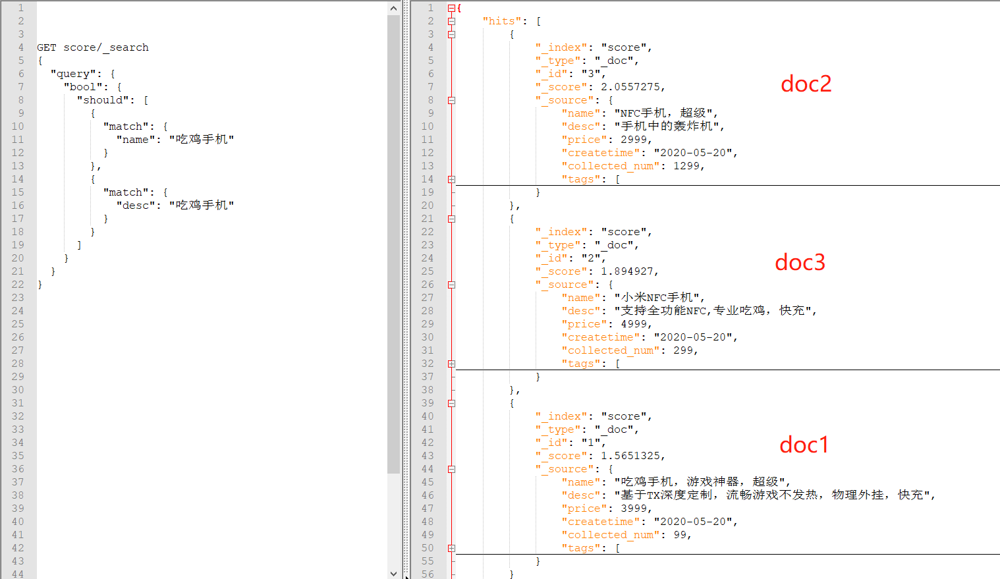

  因为相关性评分的计算规则，最应该匹配的doc1，相关性反而最低。结果是错误的。

- best_fields

  默认的搜索策略。对于同一个query，单个field匹配更多的term，则优先排序。当查询多个字段时，如果关键词在某个字段中被匹配的次数比较多，则这个字段是best_ields，最好的字段。其余字段匹配的相关性分数就会被忽略，这个词条的相关性分数就会以best_fields为准。

  使用dis_max，默认的搜索策略是best_fields。因为name这个字段，匹配“吃鸡手机”次数最多，score评分最高，所以是best_fields.

  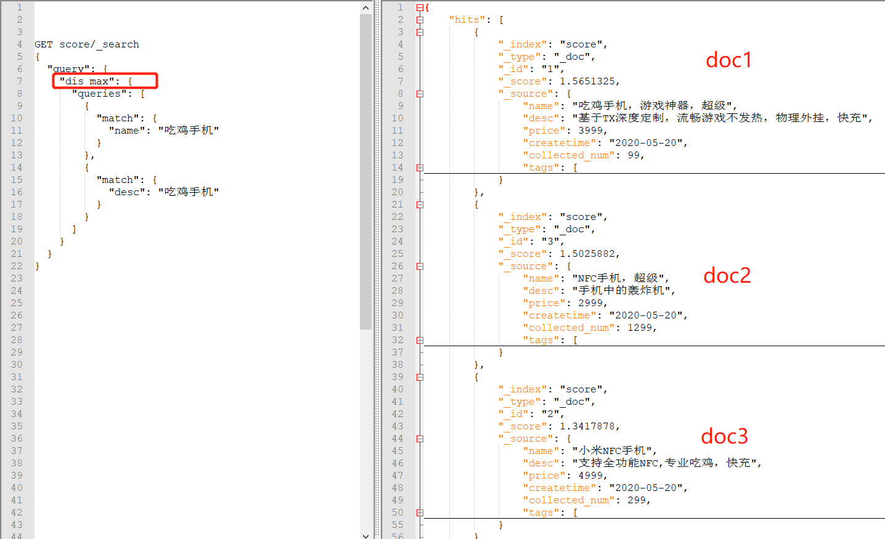

- most_fields

  如果一次请求中，对于同一个doc，匹配到某个term的field越多，则越优先排序。比如doc1，四个字段匹配到了关键词，doc2是3个字段匹配到了关键词。那么doc1优先展示。因为匹配的field最多。

- cross_fields

  测试数据：

  ```json
  POST /teacher/_bulk
  { "index": { "_id": "1"} }
  { "name" : {"姓" : "吴", "名" : "磊"} }
  { "index": { "_id": "2"} }	
  { "name" : {"姓" : "连", "名" : "鹏鹏"} }
  { "index": { "_id": "3"} }
  { "name" : { "姓" : "张","名" : "明明"} }
  { "index": { "_id": "4"} }
  { "name" : { "姓" : "周","名" : "志志"} }
  { "index": { "_id": "5"} }
  { "name" : {"姓" : "吴", "名" : "亦凡"} }
  { "index": { "_id": "6"} }
  { "name" : {"姓" : "吴", "名" : "京"} }
  { "index": { "_id": "7"} }
  { "name" : {"姓" : "吴", "名" : "彦祖"} }
  { "index": { "_id": "8"} }
  { "name" : {"姓" : "帅", "名" : "吴"} }
  { "index": { "_id": "9"} }
  { "name" : {"姓" : "连", "名" : "磊"} }
  { "index": { "_id": "10"} }
  { "name" : {"姓" : "周", "名" : "磊"} }
  { "index": { "_id": "11"} }
  { "name" : {"姓" : "张", "名" : "磊"} }
  { "index": { "_id": "12"} }
  { "name" : {"姓" : "马", "名" : "磊"} }
  { "name" : {"姓" : "诸葛", "名" : "吴磊"} }
  ```

  ```json
  GET teacher/_search
  {
    "query": {
      "multi_match": {
        "query": "吴磊",
        "type": "most_fields",
        "fields": [
          "name.姓",
          "name.名"
        ]
      }
    }
  }
  ```

  使用默认搜索策略或者most_fields进行搜索时，期望的吴磊不会在第一条。因为相关性评分有问题。在姓中，“吴”比较多，所以IDF会比较低，相反在名中IDF就会比较高。对于名“磊”，在名中IDF分低，姓中分高，所以就会导致问题。

  cross_fields交叉的字段。含义是关键词分词之后，每个关键字，必须在其中至少一个字段中匹配。

  比如“吴磊”，使用cross_fields策略，会产生俩个条件:

  1、姓或者名中,必须有吴
  2、姓或者名中,必须有磊

  默认是或操作。满足一条就行,存在吴,或者磊即可。可以使用and操作,只有两条都满足,存在完整的吴磊，才可以。

  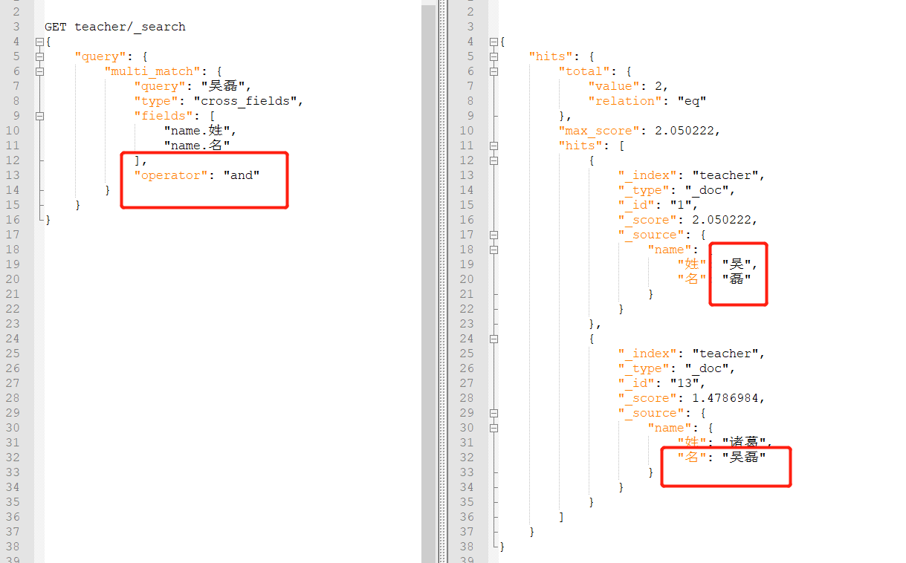

- dix_max

  dix_max查询（Disjunction Max Query）：将任何与任一查询匹配的文档作为结果返回，但只将最佳匹配的评分作为查询的评分结果返回。比如查询时name、desc两个字段，name的评分结果比desc高，则以name的评分为准进行返回，desc字段的评分将被忽略。

  dix_max默认的best_fields策略，会带来一个问题，当搜索词在fields字段中全部存在时，只会以其中一个字段的评分为准，当doc1只匹配一个字段，但是评分高，doc2匹配的2个字段，正常情况下，匹配2个字段的应该优先展示，但是因为best_fields策略，导致其余字段不参与评分，最终结果不准确。所以可以使用tie_breaker设置其余字段的参与度，官方建议0.1-0.4之间。太大的话，有可能导致喧宾夺主。

  ```json
  GET score/_search
  {
    "query": {
      "dis_max": {
        "queries": [
          {
            "match": {
              "name": "超级快充"
            }
          },
          {
            "match": {
              "desc": "超级快充"
            }
          }
        ],
        "tie_breaker": 0.3
      }
    }
  }
  ```

- tie_breaker

  取值范围 [0,1]，其中 0 代表使用 dis_max 最佳匹配语句的普通逻辑，1表示所有匹配语句同等重要。最佳的精确值需要根据数据与查询调试得出，但是合理值应该与零接近（处于 0.1 - 0.4 之间），这样就不会颠覆 dis_max 最佳匹配性质的根本。

- multi_match

  ```json
  GET score/_search
  {
    "query": {
      "multi_match": {
        "query": "超级快充",
        "fields": ["name","desc"],
        "type": "most_fields",
        "tie_breaker": 0.3
      }
    }
  }
  ```


### 4、function score query

- 必须定义一个查询和一个或多个函数，自定义函数会为查询返回的每个文档计算一个新分数。

  ```json
  {
  	"query": {
  		"function_score": {
  			"query": {},
  			"functions": [
  				{}
  			]
  		}
  	}
  }
  ```

1. field_value_factor

   ```json
   {
   	"query": {
   		"function_score": {
   			"query": {
   				"match_all": {}
   			},
   			"functions": [
   				{
   					"field_value_factor": {
   						"field": "collected_num",
   						"modifier": "ln2p",
   						"factor": 1.2
   					},
   					"weight": 1
   				}
   			]
   		}
   	}
   }
   ```

   将某个字段的值进行计算得出分数。

   - field：要计算的字段，（需要是数值型）
   - factor：当前分数计算，对整个结果产生的权重比。
   - modifier：以何种运算方式计算，接受以下枚举。
     1. none：不处理
     2. log：计算对数
     3. log1p：先将字段值 +1，再计算对数
     4. log2p：先将字段值 +2，再计算对数
     5. ln：计算自然对数
     6. ln1p：先将字段值 +1，再计算自然对数
     7. ln2p：先将字段值 +2，再计算自然对数
     8. square：计算平方
     9. sqrt：计算平方根
     10. reciprocal：计算倒数
   - weight：当前的分数计算函数，对整个结果产生的权重比。

2. random_score

   随机得到 0 到 1 分数。

   ```json
   {
   	"query": {
   		"function_score": {
   			"query": {
   				"match_all": {}
   			},
   			"random_score": {}
   		}
   	}
   }
   ```

3. script_score

   通过自定义脚本计算分值

   ```json
   {
   	"query": {
   		"function_score": {
   			"query": {
   				"match_all": {}
   			},
   			"script_score": {
   				"script": {
   					"source": "Math.log(1 + doc['price'].value)"
   				}
   			}
   		}
   	}
   }
   ```

4. boost_mode

   指定计算后的分数与原始的_score如何合并，有以下选项：

   1. imultiply：查询分数和函数分数相乘
   2. sum：查询分数和函数分数相加
   3. avg：取平均值
   4. replace：替换原始分数
   5. min：取查询分数和函数分数的最小值
   6. max：取查询分数和函数分数的最大值

   ```json
   {
   	"query": {
   		"function_score": {
   			"query": {
   				"match_all": {}
   			},
   			"boost_mode": "multiply"
   		}
   	}
   }
   ```

5. max_boost

   设置相关性分数的上限，比如"max_boost": 10，则计算的相关性分数最大为10，超过的限制为10，小于10的，仍然是原数据。

## Nested Search复杂类型查询

### 1、基本概念

- nested类型是object数据类型的专用版本，它允许以可以彼此独立地查询对象的方式对对象数组进行索引，当存储内部对象为复杂类型时应该使用nested而不是object。

- 默认的object类型，会将复杂类型所有数据中相同字段的值创建为同一个索引。

  ```
  PUT /order/_doc/1
  {
  	"order_name": "小米10 Pro订单",
  	"desc": "shouji zhong de zhandouji",
  	"goods_count": 3,
  	"total_price": 12699,
  	"goods_list": [
  		{
  			"name": "小米10 PRO MAX 5G",
  			"price": 4999
  		},
  		{
  			"name": "钢化膜",
  			"price": 19
  		},
  		{
  			"name": "手机壳",
  			"price": 199
  		}
  	]
  }
  ```

  虽然goods_list存在三条数据，但是在创建索引时，会将所有的name、price统一创建，实际应该按照三条数据进行分解查找，但是最终会汇聚成一条。

  ```json
  #三条数据变成了一条
  {
  	"name": [
  		"小米10",
  		"PRO",
  		"MAX",
  		"5G",
  		"钢化膜",
  		"手机壳"
  	],
  	"price": [
  		4999,
  		19,
  		199
  	]
  }
  ```

- 判断数据格式是嵌套类型，创建mapping时，字段类型应该指定为nested。如果不指定，默认会创建为object类型。导致按照条件查询时结果错误。

### 2、查询语法以及mapping

- 查询时要使用nested查询，path为nested嵌套的级别，nested对象的查询深度。query为子查询。

  ```json
  {
    "query": {
      "nested": {
        "path": "path_to_nested_doc",
        "query": {}
      }
    }
  }
  ```

- 创建mapping示例

  ```json
  {
  	"mappings": {
  		"properties": {
  			"goods_list": {
  				"type": "nested",
  				"properties": {
  					"name": {
  						"type": "text",
  						"fields": {
  							"keyword": {
  								"type": "keyword",
  								"ignore_above": 256
  							}
  						},
  						"analyzer": "ik_max_word"
  					},
  					"price": {
  						"type": "long"
  					}
  				}
  			}
  		}
  	}
  }
  ```

  goods_list为nested查询，所以要查询goods_list数据时，要使用nested，并且path使用goods_list。

  正确的查询结果

  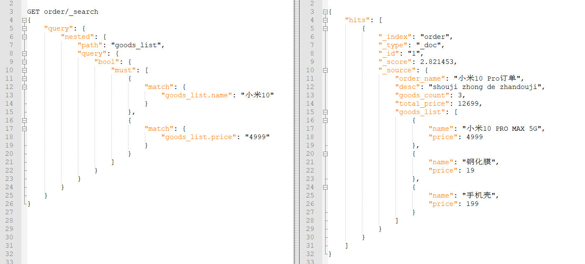

  如果不使用nested类型，查询时将会匹配goods_list所有的数据，并不只是按照每条单独匹配。

### 3、复杂查询示例

- 复杂的嵌套查询示例

  创建mapping

  ```json
  PUT /area
  {
    "mappings": {
      "properties": {
        "province": {
          "type": "nested",
          "properties": {
            "name": {
              "type": "text",
              "analyzer": "ik_max_word"
            },
            "cities": {
              "type": "nested",
              "properties": {
                "name": {
                  "type": "text",
                  "analyzer": "ik_max_word"
                },
                "district": {
                  "type": "nested",
                  "properties": {
                    "name": {
                      "type": "text",
                      "analyzer": "ik_max_word"
                    }
                  }
                }
              }
            }
          }
        }
      }
    }
  }
  ```

  插入数据

  ```json
  PUT /area/_doc/1
  {
    "province": {
      "name": "北京",
      "cities": [
        {
          "name": "北京市",
          "district": [
            {"name":"丰台区"},
            {"name":"海淀区"},
            {"name":"朝阳区"},
            {"name":"东城区"},
            {"name":"西城区"},
            {"name":"昌平区"}
            ]
        }
      ]
    }
  }
  PUT /area/_doc/2
  {
    "province": {
      "name": "河南省",
      "cities": [
        {
          "name": "郑州市",
          "district": [
            {"name":"金水区"},
            {"name":"高新区"},
            {"name":"郑东新区"},
            {"name":"二七区"},
            {"name":"中原区"},
            {"name":"惠济区"}
            ]
        },
         {
          "name": "鹤壁市",
          "district": [
            {"name":"山城区"},
            {"name":"淇滨区"},
            {"name":"鹤山区"},
            {"name":"朝歌"},
            {"name":"浚县"}
            ]
        }
      ]
    }
  }
  PUT /area/_doc/3
  {
    "province": {
      "name": "台湾省",
      "cities": [
        {
          "name": "台北市",
          "district": [
            {"name":"中正区"},
            {"name":"大同区"},
            {"name":"中山区"},
            {"name":"万华区"},
            {"name":"信义区"},
            {"name":"松山区"}
            ]
        },
         {
          "name": "高雄",
          "district": [
            {"name":"小港区"},
            {"name":"鼓山区"},
            {"name":"三民区"}
            ]
        }
      ]
    }
  }
  ```

  查询示例

  ```json
  #city为包含北京市 或者 包含淇滨区的省份信息
  GET area/_search
  {
    "query": {
      "nested": {
        "path": "province",
        "query": {
          "nested": {
            "path": "province.cities",
            "query": {
              "bool": {
                "should": [
                  {
                    "term": {
                      "province.cities.name": "北京"
                    }
                  },
                  {
                    "nested": {
                      "path": "province.cities.district",
                      "query": {
                        "term": {
                          "province.cities.district.name": "淇滨区"
                        }
                      }
                    }
                  }
                ]
              }
            }
          }
        }
      }
    }
  }
  ```

### 4、score_mode

- score_mode：聚合分数计算方式

  ```json
  {
    "query": {
      "nested": {
        "path": "path_to_nested_doc",
        "query": {},
        "score_mode": "avg"
      }
    }
  }
  ```

  1.	avg （默认）：使用所有匹配的子对象的平均相关性得分。
  2.	max：使用所有匹配的子对象中的最高相关性得分。
  3.	min：使用所有匹配的子对象中最低的相关性得分。
  4.	none：不要使用匹配的子对象的相关性分数。该查询为父文档分配得分为0。
  5.	sum：将所有匹配的子对象的相关性得分相加。

## Join查询

### 基本概念

- 在同一索引的文档中创建父/子关系

### 创建mapping

- 创建了一个字段，名称为my_join_field，type为join。指定上下级关系，上级为depart，下级为employee

  ```json
  PUT join_test
  {
    "mappings": {
      "properties": {
        "my_join_field": {
          "type": "join",
          "relations": {
            "depart": "employee"
          }
        }
      }
    }
  }
  ```

### 创建数据

- 创建父级的时候，join字段内要指明当前数据的join name。用于限定当前数据是否为父级。

- 创建子级数据的时候，除了要指定join name，还要指定routing=1(父级id)，要保证子级和父级在同一分片内。并且还要指定parent的id是哪个。

  ```json
  PUT join_test/_doc/1
  {
    "name": "行政部",
    "my_join_field": {
      "name": "depart"
    }
  }
  PUT join_test/_doc/2
  {
    "name": "财务部",
    "my_join_field": {
      "name": "depart"
    }
  }
  PUT join_test/_doc/3
  {
    "name": "研发部",
    "my_join_field": {
      "name": "depart"
    }
  }
  
  POST join_test/_doc?routing=1?refresh
  {
    "name": "张一",
    "my_join_field": {
      "name": "employee",
      "parent": "1"
    }
  }
  POST join_test/_doc?routing=1?refresh
  {
    "name": "张二",
    "my_join_field": {
      "name": "employee",
      "parent": "2"
    }
  }
  POST join_test/_doc?routing=1?refresh
  {
    "name": "张三",
    "my_join_field": {
      "name": "employee",
      "parent": "2"
    }
  }
  ```

### 数据查询

1. 查询父级数据

   使用has_child关键字进行查询，type指定子级的类型。并且只能查询出存在子级的父级数据。

   ```json
   GET join_test/_search
   {
     "query": {
       "has_child": {
         "type": "employee",
         "query": {
           "match_all": {}
         }
       }
     }
   }
   ```

2. 查询子级数据

   查询子级数据时，要使用has_parent关键字，并且parent_type指定为父级的类型。

   ```json
   GET join_test/_search
   {
     "query": {
       "has_parent": {
         "parent_type": "depart",
         "query": {
           "match_all": {}
         }
       }
     }
   }
   //指定id查询
   GET join_test/_search
   {
     "query": {
       "parent_id": {
         "type": "employee",
         "id": 2
       }
     },
     "aggs": {
       "conut": {
         "terms": {
           "field": "my_join_field"
         }
       }
     }
   }
   ```
