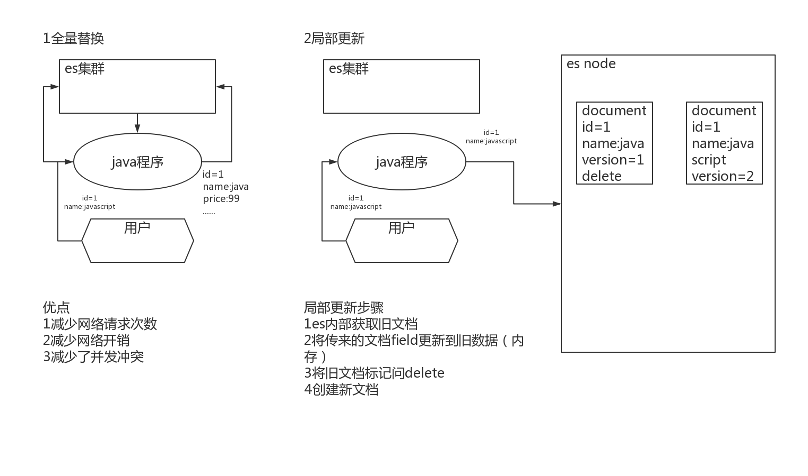

# **Elasticsearch**

## 数据修改

### 一、覆盖更新

- 单条覆盖更新

  使用与新增相同的url请求，当id不变时，每次新的请求体数据会覆盖旧的数据，并更新version。数据实际上没有被修改，只是按照唯一id，对数据生成了最新的版本。

  ```
  POST product/_doc/8888
  {
    "name": "AAA xiaomi phone",
    "desc": "shouji zhong de zhandouji",
    "price": 1199,
    "tags": [
      "xingjiabi",
      "fashao",
      "buka"
    ]
  }
  ```

- 批量覆盖更新


### 二、增量修改字段

- 单条数据修改

  使用_update关键字，对指定id下具体数据进行更新。“doc”实际为type，因为7.0之后弱化了type，默认为doc，所以更新时使用默认的“doc”。

  ```
  POST product/_update/8888
  {
    "doc": {
      "price": 2999//将price更新为2999
    }
  }
  ```

  

- 批量数据修改

### 三、update内部原理

- 无论时覆盖更新还是增量修改指定字段，内部都是对旧文档做delete标记，生成新文档，更新version版本号，并在后续由ES集群对标记为delete的历史数据进行清理操作。

  

### 四、painless脚本script

- Painless脚本语言，类似Java语法，是ES支持的默认的脚本语言，其他的还支持expression、mustache、java，但是支持的不是很好，有限制。

- ES首次执行脚本的时候，会对脚本进行编译并缓存。所以脚本中使用到的数据最好定义成变量，放到params中。这样不会影响到编译缓存，否则每次修改，ES都会重新编译。

- ctx._source默认语法，代表获取元数据。支持params定义参数。

  ```json
  POST product/_update/1
  {
    "script": {
      "lang": "painless",
      "source": "ctx._source.price += params.num",
      "params": {
        "num": 2
      }
    }
  }
  ```

- 查询时使用painless，source指定具体字段，使用doc['filedName'].value

  ```json
  GET product/_search
  {
    "script_fields": {
      "price_query": {
        "script": {
          "lang": "painless",
          "source": "doc['price'].value+params.num",
          "params": {
            "num": 2
          }
        }
      }
    }
  }
  ```

  

- ddd
