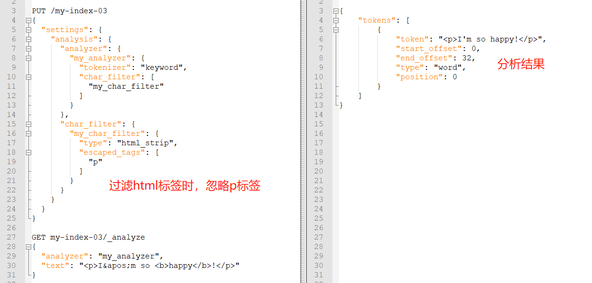
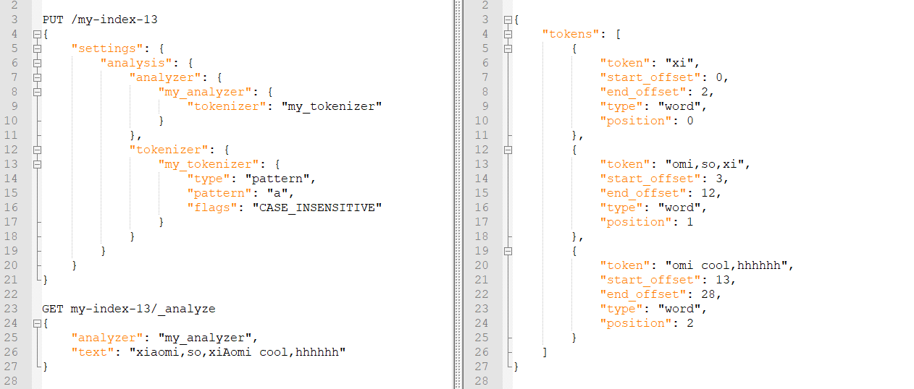

# **Elasticsearch**

## 一、自定义分析器

- 分析器四大组成部分

  ```
  PUT product2
  {
    "settings": {
      "analysis": {
        "analyzer": {},
        "char_filter": {},
        "filter": {},
        "tokenizer": {}
      }
    }
  }
  ```

1. char_filter

   - 字符过滤器：分词之前的预处理，包括过滤无用字符、标签，转换字符，比如A替换为B、&=>and 

   - 三种类型：HTML strip、Mapping、Pattern replace

   - HTML strip

     去掉类似<b>这样的HTML标签，并且可以通过escaped_tags参数，配置指定哪些标签不过滤。

     ```json
     PUT /my-index
     {
       "settings": {
         "analysis": {
           "analyzer": {
             "my_analyzer": {
               "tokenizer": "keyword",
               "char_filter": [
                 "my_char_filter"
               ]
             }
           },
           "char_filter": {//自定义char_filter
             "my_char_filter":{
               "type":"html_strip",
               "escaped_tags":["p"]//去掉html标签的时候，忽略p
             }
           }
         }
       }
     }
     GET my-index/_analyze
     {
       "analyzer": "my_analyzer",
       "text": "<p>I&apos;m so <b>happy</b>!</p>"
     }
     ```

     

   - Mapping

     配置指定字符串的替换规则。

     ```json
     {
     	"char_filter": {
     		"my_char_filter": {
     			"type": "mapping",
     			"mappings": [
     				"p => AAAA",//p替换为AAAA
     				"h => BBBB" //h替换为BBBB
     			]
     		}
     	}
     }
     ```

   - Pattern replace

     正则表达式匹配，pattern参数配置正则，replacement参数配置正则替换的字符。

     ```json
     {
     	"char_filter": {
     		"my_char_filter": {
     			"type": "pattern_replace",
     			"pattern": "\\d",
     			"replacement": "-Q-"//将匹配的任意数字，替换为-Q-
     		}
     	}
     }
     ```

2. filter

   可以对数据做一定的修改，比如停用词、时态转换、大小写转换、同义词转换、语气词处理等。比如：has=>have、him=>he apples=>apple、the/oh/a=>干掉。

   lowercase：把英文字符全部转为小写。

   ```json
   GET _analyze
   {
     "tokenizer" : "standard",
     "filter" : ["lowercase"],
     "text" : "THE Quick FoX JUMPs" //结果全为小写。
   }
   ```

3. tokenizer

   分词器，默认的是standard。

   ```json
   PUT /my-index-10
   {
     "settings": {
       "analysis": {
         "analyzer": {
           "my_analyzer": {
             "tokenizer": "my_tokenizer"
           }
         },
         "tokenizer": {
           "my_tokenizer": {
             "type": "standard",//默认地英文分词器
             "max_token_length": 4//最大分词的长度，默认255
           }
         }
       }
     }
   }
   ```

   正则匹配分隔符：pattern，将文本分成若干词项。

   "flags":"CASE_INSENSITIVE" 匹配的时候忽略大小写。（可选项）

   ```json
   PUT /my-index-13
   {
   	"settings": {
   		"analysis": {
   			"analyzer": {
   				"my_analyzer": {
   					"tokenizer": "my_tokenizer"
   				}
   			},
   			"tokenizer": {
   				"my_tokenizer": {
   					"type": "pattern",
   					"pattern": "a",//正则匹配，按照a进行分词
   					"flags": "CASE_INSENSITIVE"
   				}
   			}
   		}
   	}
   }
   
   GET my-index-13/_analyze
   {
   	"analyzer": "my_analyzer",
   	"text": "xiaomi,so,xiAomi cool,hhhhhh"
   }
   ```

   

   正则匹配词项：simple_pattern

   ```json
   PUT my-index-14
   {
     "settings": {
       "analysis": {
         "analyzer": {
           "my_analyzer": {
             "tokenizer": "my_tokenizer"
           }
         },
         "tokenizer": {
           "my_tokenizer": {
             "type": "simple_pattern",
             "pattern": "[0123456789]{3}"//匹配三位的数字
           }
         }
       }
     }
   }
   POST my-index-14/_analyze
   {
     "analyzer": "my_analyzer",
     "text": "fd-786-335-514-x"
   }
   匹配结果：786  335  514
   ```

4. analyzer

   ```json
   PUT /my_index
   {
   	"settings": {
   		"analysis": {
   			"char_filter": {
   				"&_to_and": {
   					"type": "mapping",
   					"mappings": ["&=> and "]
   				}
   			},
   			"filter": {
   				"my_stopwords": {
   					"type": "stop",
   					"stopwords": ["the","a"]
   				}
   			},
   			"tokenizer": {
   				"my_tokenizer": {
   					"type": "standard",
   					"max_token_length": 4
   				}
   			},
   			"analyzer": {
   				"my_analyzer": {
   					"type": "custom",
   					"char_filter": ["html_strip","&_to_and"],
   					"tokenizer": ["standard","my_tokenizer"],
   					"filter": ["lowercase","my_stopwords"]
   				}
   			}
   		}
   	}
   }
   ```

5. 
