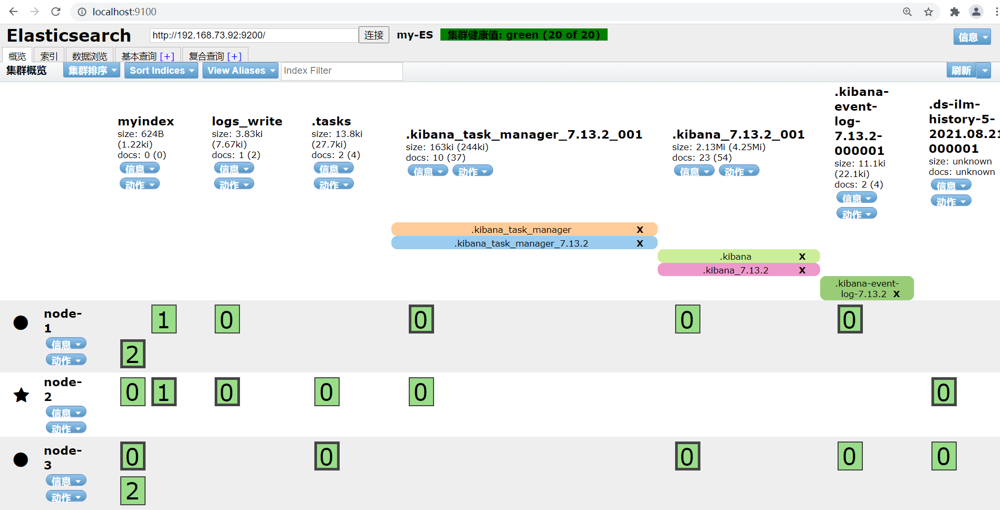

# **Elasticsearch**

## 一、Linux集群搭建

## 1、至少3台机器组成集群

## 2、集群节点配置

- 集群节点一

  修改config/elasticsearch.yml配置文件

  ```yaml
  #集群名称
  cluster.name: my-ES
  #节点名称， 每个节点的名称不能重复
  node.name: node-1
  #存储数据的路径，自定义。
  path.data: /path/to/data
  #存储日志的路径，自定义
  path.logs: /path/to/logs
  #是否锁定内存，禁止使用swap区。建议为true。否则会带来性能问题
  bootstrap.memory_lock: true
  #对外暴露的ip地址，最佳状态下一个es节点占用一台机器
  network.host: 192.168.73.90
  #设置对外服务的http端口，默认为9200
  http.port: 9200
  #集群结点之间通信端口
  transport.tcp.port: 9300
  #配置其他节点地址。
  discovery.seed_hosts: ["192.168.73.92:9300", "192.168.73.93:9300"]
  #配置初始化默认的master节点。省略初始情况下的集群选举
  cluster.initial_master_nodes: ["192.168.73.90"]
  #kibana访问，设置允许跨域
  http.cors.enabled: true
  http.cors.allow-origin: "*"
  #配置当前节点是否为master节点，设置为true，才会参与选举
  node.master: true
  #配置当前节点是否存储数据
  node.data: true
  ```

- 集群节点二

  ```yaml
  #集群名称
  cluster.name: my-ES
  #节点名称， 每个节点的名称不能重复
  node.name: node-2
  #存储数据的路径，自定义。
  path.data: /path/to/data
  #存储日志的路径，自定义
  path.logs: /path/to/logs
  #是否锁定内存，禁止使用swap区。建议为true。否则会带来性能问题
  bootstrap.memory_lock: true
  #对外暴露的ip地址，最佳状态下一个es节点占用一台机器
  network.host: 192.168.73.92
  #设置对外服务的http端口，默认为9200
  http.port: 9200
  #集群结点之间通信端口
  transport.tcp.port: 9300
  #配置其他节点地址。
  discovery.seed_hosts: ["192.168.73.90:9300", "192.168.73.93:9300"]
  #配置初始化默认的master节点。省略初始情况下的集群选举
  cluster.initial_master_nodes: ["192.168.73.90"]
  #kibana访问，设置允许跨域
  http.cors.enabled: true
  http.cors.allow-origin: "*"
  #配置当前节点是否为master节点，设置为true，才会参与选举
  node.master: true
  #配置当前节点是否存储数据
  node.data: true
  ```

  不同点配置

  ```yaml
  #节点名称， 每个节点的名称不能重复
  node.name: node-2
  #对外暴露的ip地址，最佳状态下一个es节点占用一台机器
  network.host: 192.168.73.92
  #配置其他节点地址。
  discovery.seed_hosts: ["192.168.73.90:9300", "192.168.73.93:9300"]
  ```

- 集群节点三

  ```yaml
  #集群名称
  cluster.name: my-ES
  #节点名称， 每个节点的名称不能重复
  node.name: node-3
  #存储数据的路径，自定义。
  path.data: /path/to/data
  #存储日志的路径，自定义
  path.logs: /path/to/logs
  #是否锁定内存，禁止使用swap区。建议为true。否则会带来性能问题
  bootstrap.memory_lock: true
  #对外暴露的ip地址，最佳状态下一个es节点占用一台机器
  network.host: 192.168.73.93
  #设置对外服务的http端口，默认为9200
  http.port: 9200
  #集群结点之间通信端口
  transport.tcp.port: 9300
  #配置其他节点地址。
  discovery.seed_hosts: ["192.168.73.90:9300", "192.168.73.92:9300"]
  #配置初始化默认的master节点。省略初始情况下的集群选举
  cluster.initial_master_nodes: ["192.168.73.90"]
  #kibana访问，设置允许跨域
  http.cors.enabled: true
  http.cors.allow-origin: "*"
  #配置当前节点是否为master节点，设置为true，才会参与选举
  node.master: true
  #配置当前节点是否存储数据
  node.data: true
  ```

  不同点配置

  ```yaml
  #节点名称， 每个节点的名称不能重复
  node.name: node-3
  #对外暴露的ip地址，最佳状态下一个es节点占用一台机器
  network.host: 192.168.73.93
  #配置其他节点地址。
  discovery.seed_hosts: ["192.168.73.90:9300", "192.168.73.92:9300"]
  ```

3、启动成功

- 查看集群节点信息

  

- head插件

  

- 创建myindex索引，3个分片，1个副本，创建完毕均匀分配到3台node上。
