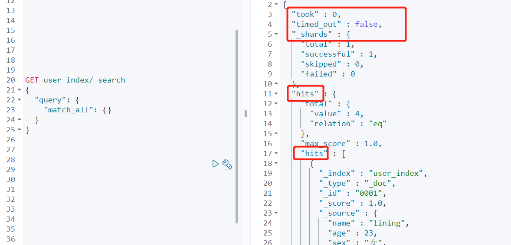

# **Elasticsearch**

## 一、Client

```java
import org.apache.http.HttpHost;
import org.elasticsearch.client.RestClient;
import org.elasticsearch.client.RestHighLevelClient;

public class ESTest_Client {
    public static void main(String[] args) throws Exception {

        // 创建ES客户端
        RestHighLevelClient esClient = new RestHighLevelClient(
                RestClient.builder(new HttpHost("localhost", 9200, "http"))
        );
        // 关闭ES客户端
        esClient.close();
    }
}
```

## 二、索引相关操作

### 1、创建索引

```java
CreateIndexRequest createIndexRequest = new CreateIndexRequest("java-index-1");
//create
CreateIndexResponse createIndexResponse = restHighLevelClient.indices().create(createIndexRequest, RequestOptions.DEFAULT);
boolean acknowledged = createIndexResponse.isAcknowledged();
```

### 2、查询索引

```java
GetIndexRequest getIndexRequest = new GetIndexRequest("my_index");
GetIndexResponse getIndexResponse = restHighLevelClient.indices().get(getIndexRequest, RequestOptions.DEFAULT);
System.out.println(getIndexResponse.getMappings());
System.out.println(getIndexResponse.getSettings());
```

### 3、修改索引

### 4、删除索引

```java
//删除索引
DeleteIndexRequest deleteIndexRequest = new DeleteIndexRequest("index");
AcknowledgedResponse delete = restHighLevelClient.indices().delete(deleteIndexRequest, RequestOptions.DEFAULT);
```

## 三、数据相关操作

### 1、数据新增

```java
public static void insertData(RestHighLevelClient client) throws IOException {
        // 新增文档 - 请求对象
        IndexRequest request = new IndexRequest();
        // 设置索引及唯一性标识
        request.index("user_index").id("0001");
        // 创建数据对象
        User user = new User();
        user.setAge(23);
        user.setName("lining");
        user.setSex("男");
        user.setId("0001");
        ObjectMapper objectMapper = new ObjectMapper();
        // 添加文档数据，数据格式为 JSON 格式
        String user_json = objectMapper.writeValueAsString(user);
        request.source(user_json, XContentType.JSON);
        // 客户端发送请求，获取响应对象
        IndexResponse response = client.index(request, RequestOptions.DEFAULT);
        // 打印结果信息
        System.out.println("_index:" + response.getIndex());
        System.out.println("_id:" + response.getId());
        System.out.println("_result:" + response.getResult());
    }
```

### 2、数据更新

```java
public static void updateData(RestHighLevelClient client) throws IOException {
        // 修改文档 - 请求对象
        UpdateRequest request = new UpdateRequest();
        // 配置修改参数
        request.index("user_index").id("0001");
        // 设置请求体，对数据进行修改
        request.doc(XContentType.JSON, "sex", "女");
        // 客户端发送请求，获取响应对象
        UpdateResponse response = client.update(request, RequestOptions.DEFAULT);
        System.out.println("_index:" + response.getIndex());
        System.out.println("_id:" + response.getId());
        System.out.println("_result:" + response.getResult());
    }
```

### 3、数据查询

```java
public static void queryData(RestHighLevelClient client) throws IOException {
        //1.创建请求对象
        GetRequest request = new GetRequest().index("user_index").id("0001");
        //2.客户端发送请求，获取响应对象
        GetResponse response = client.get(request, RequestOptions.DEFAULT);
        //3.打印结果信息
        System.out.println("_index:" + response.getIndex());
        System.out.println("_type:" + response.getType());
        System.out.println("_id:" + response.getId());
        System.out.println("source:" + response.getSourceAsString());
    }
```

### 4、数据删除

```java
public static void deleteData(RestHighLevelClient client) throws IOException {
        DeleteRequest request = new DeleteRequest("user_index").id("0001");
        DeleteResponse response = client.delete(request, RequestOptions.DEFAULT);
        System.out.println(response.toString());
    }
```

### 5、批量插入

```java
public static void bulkInsertData(RestHighLevelClient client) throws IOException {
        //创建批量新增请求对象
        BulkRequest request = new BulkRequest();
        request.add(new IndexRequest().index("user_index").id("1001").source(XContentType.JSON, "name", "zhangsan"));
        request.add(new IndexRequest().index("user_index").id("1002").source(XContentType.JSON, "name", "lisi"));
        request.add(new IndexRequest().index("user_index").id("1003").source(XContentType.JSON, "name", "wangwu"));
        //客户端发送请求，获取响应对象
        BulkResponse responses = client.bulk(request, RequestOptions.DEFAULT);
        //打印结果信息
        System.out.println("took:" + responses.getTook());
        System.out.println("items:" + responses.getItems());
    }
```

### 6、批量删除

```java
public static void bulkDeleteData(RestHighLevelClient client) throws IOException {
        BulkRequest bulkRequest = new BulkRequest();
        bulkRequest.add(new DeleteRequest().index("user_index").id("1001"));
        bulkRequest.add(new DeleteRequest().index("user_index").id("1002"));
        bulkRequest.add(new DeleteRequest().index("user_index").id("1003"));
        client.bulk(bulkRequest, RequestOptions.DEFAULT);
    }
```

### 7、条件搜索

通过SearchSourceBuilder构建查询条件，主要构建思路可参考在kibana中构建条件查询时的写法。

返回值的获取也可以参考kibana中的返回值的格式。



```java
public static void conditionSearch(RestHighLevelClient client) throws IOException {
        // 创建搜索请求对象
        SearchRequest request = new SearchRequest();
        request.indices("user_index");
        // 构建查询的请求体
        SearchSourceBuilder searchSourceBuilder = new SearchSourceBuilder();
        // 查询所有数据
        searchSourceBuilder.query(QueryBuilders.matchAllQuery());
        request.source(searchSourceBuilder);
        SearchResponse searchResponse = client.search(request, RequestOptions.DEFAULT);
        // 输出查询基本信息
        SearchHits searchHits = searchResponse.getHits();
        System.out.println("took:" + searchResponse.getTook());
        System.out.println("timeout:" + searchResponse.isTimedOut());
        System.out.println("total:" + searchHits.getTotalHits());
        System.out.println("MaxScore:" + searchHits.getMaxScore());
        // 输出每条数据
        SearchHit[] hits = searchResponse.getHits().getHits();
        for (SearchHit hit : hits) {
            Map<String, Object> sourceAsMap = hit.getSourceAsMap();
            System.out.println(sourceAsMap);
        }
    }
```

### 8、term

```java
SearchSourceBuilder searchSourceBuilder = new SearchSourceBuilder();
searchSourceBuilder.query(QueryBuilders.termQuery("name","lining"));
```

### 9、分页

```java
SearchSourceBuilder searchSourceBuilder = new SearchSourceBuilder();
searchSourceBuilder.query(QueryBuilders.termQuery("name","lining"));
//起始序号
searchSourceBuilder.from(0);
//查询数量
searchSourceBuilder.size(10);
```

