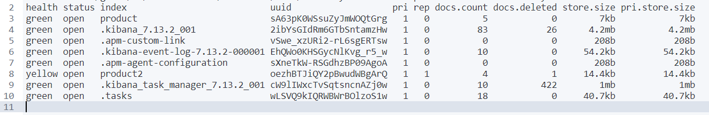
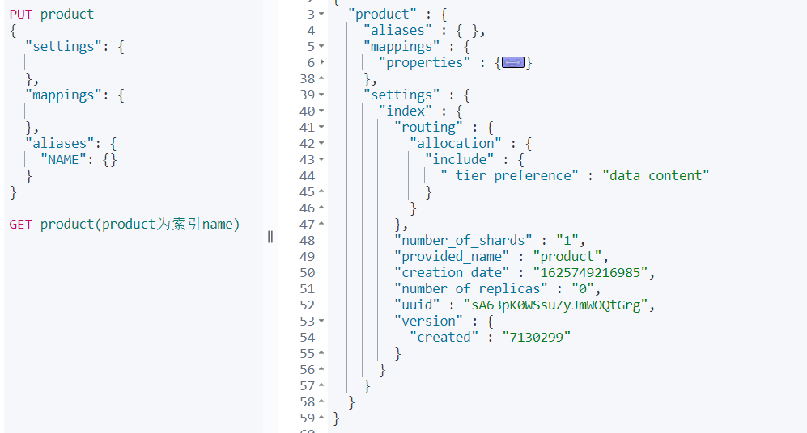
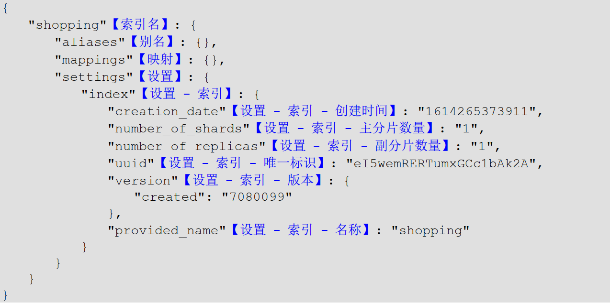

# Elasticsearch

## 一、索引创建

7.0之后，索引的默认分片数为1，7.0之前默认为5。

```
PUT product(索引name)
{
  "settings": {
    
  },
  "mappings": {
    
  },
  "aliases": {
    "NAME": {}
  }
}
```


cat命令：

```
/_cat/allocation      	#查看单节点的shard分配整体情况
/_cat/shards          #查看各shard的详细情况
/_cat/shards/{index}  	#查看指定分片的详细情况
/_cat/master          #查看master节点信息
/_cat/nodes           #查看所有节点信息
/_cat/indices         #查看集群中所有index的详细信息
/_cat/indices/{index} 	#查看集群中指定index的详细信息
/_cat/segments        #查看各index的segment详细信息,包括segment名, 所属shard, 内存(磁盘)占用大小, 是否刷盘
/_cat/segments/{index}#查看指定index的segment详细信息
/_cat/count           #查看当前集群的doc数量
/_cat/count/{index}   #查看指定索引的doc数量
/_cat/recovery        #查看集群内每个shard的recovery过程.调整replica。
/_cat/recovery/{index}#查看指定索引shard的recovery过程
/_cat/health          #查看集群当前状态：红、黄、绿
/_cat/pending_tasks   #查看当前集群的pending task
/_cat/aliases         #查看集群中所有alias信息,路由配置等
/_cat/aliases/{alias} #查看指定索引的alias信息
/_cat/thread_pool     #查看集群各节点内部不同类型的threadpool的统计信息,
/_cat/plugins         #查看集群各个节点上的plugin信息
/_cat/fielddata       #查看当前集群各个节点的fielddata内存使用情况
/_cat/fielddata/{fields}     #查看指定field的内存使用情况,里面传field属性对应的值
/_cat/nodeattrs              #查看单节点的自定义属性
/_cat/repositories           #输出集群中注册快照存储库
/_cat/templates              #输出当前正在存在的模板信息
```


## 二、索引查询

- 查询所有

  查询ES中存在的所有的索引，类似于MySQL中的show table。

  ```
  GET _cat/indices?v  _cat表示查看的含义，indices表示索引的集合
  ```

  

  

- 查询单条

  ```
  GET product(product为索引name)
  ```

  

  

## 三、索引修改

## 四、索引删除

```
DELETE product(索引name)
```


## 五、创建数据

创建数据时，数据要为json格式。_doc代表type，默认为__doc，7.0中已经不提倡使用type，8.0之后会剔除。

当不指定id时，必须为post请求，ES会生成默认的id。当指定id（示例8888）时，也可以用put请求。

```
POST product/_doc
{
  "name": "AAA xiaomi phone",
  "desc": "shouji zhong de zhandouji",
  "price": 1199,
  "tags": [
    "xingjiabi",
    "fashao",
    "buka"
  ]
}

PUT product/_doc/8888
{
  "name": "AAA xiaomi phone",
  "desc": "shouji zhong de zhandouji",
  "price": 1199,
  "tags": [
    "xingjiabi",
    "fashao",
    "buka"
  ]
}
```

