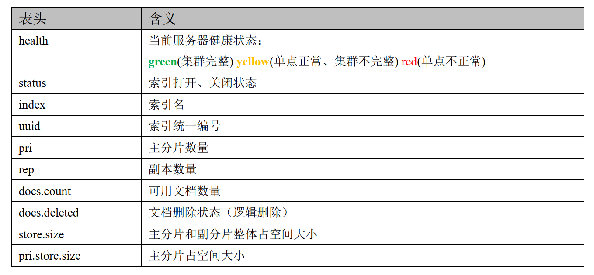
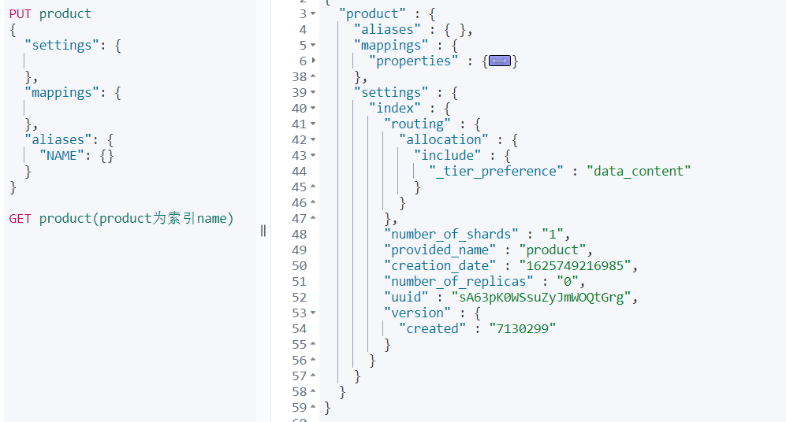
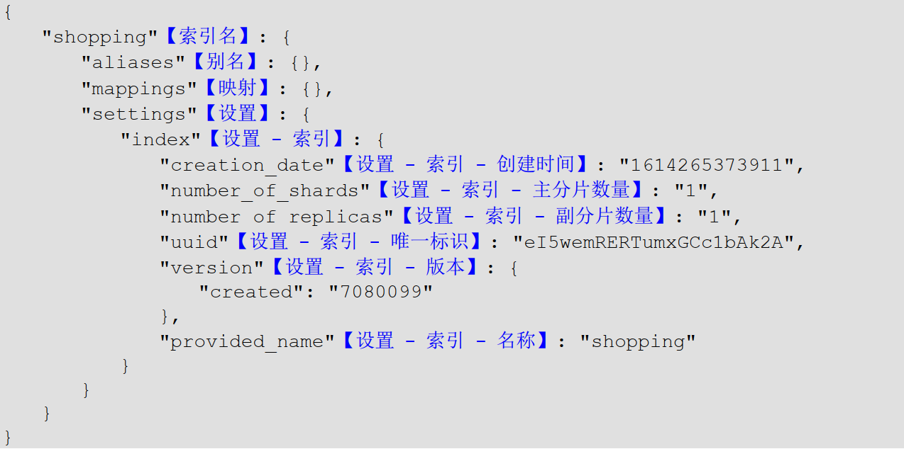

# Elasticsearch

## 一、索引创建

7.0之后，索引的默认分片数为1，7.0之前默认为5。

```
PUT product(索引name)
{
  "settings": {
    
  },
  "mappings": {
    
  },
  "aliases": {
    "NAME": {}
  }
}
```


## 二、索引查询

- 查询所有

  查询ES中存在的所有的索引，类似于MySQL中的show table。

  ```
  GET _cat/indices?v  _cat表示查看的含义，indices表示索引的集合
  ```

  

  

- 查询单条

  ```
  GET product(product为索引name)
  ```

  

  

## 三、索引修改

## 四、索引删除


## 五、查询QueryDSL

### term

### terms

### match


### match_all

