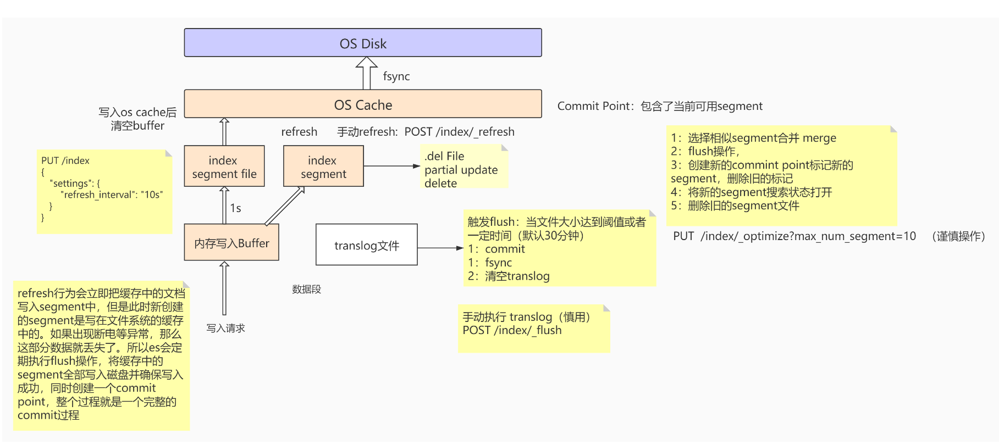

# Elasticsearch

## 一、写入原理

1. 写入请求将数据写入到内存buffer。
2. 默认（可设置）1s创建一个segment 文件，将数据存到磁盘。同时会对每一个请求，将操作记录下来，存到translog文件中，用于容灾备份。
3. segment会立马将数据同步到OS Cache，并将segment的status置为open，读请求可以访问，进行读操作。
4. OS Cache文件大小达到阈值或者默认（可设置）每30分钟，触发一次flush，将数据写入磁盘持久化。
5. **.del 文件：**在删除或者修改操作中，会将原有数据进行逻辑删除，标记位置为isdelete。
6. **segment文件：**提供读请求的数据。读写分离，使ES达到实时搜索。
7. **Commit Point：**记录当前可用的segment。当segment数量太多时，会触发合并操作，将相似的segment进行合并merge。紧接着执行flush操作。创建新的Commit Point标记，标记新的segment，删除旧的标记。将新的segment搜索状态打开，删除旧的segment文件。
8. **translog文件：**会记录每一次的请求操作。用于系统宕机之后的数据容灾备份。
9. **flush操作：**当OS Cache文件大小达到阈值、默认30分钟、或者手动触发。执行commit，将内存buffer中的数据立马写入到segment中，并将segment同步到OS Cache、开启open状态。OS Cache执行fsync同步磁盘操作。最后清空translog文件。
           segment 和 translog 最终肯定都是写文件，但是两者是各自写各自的，不相干， segment 是索引类的文件，在写之前要经过大量的计算，比如分词、构建倒排索引等，它存的是索引相关的数据，而 translog 只是简单的追加数据增删改的操作记录，只是为了后面服务意外中止时通过回放这个记录来减少数据的丢失。segment 记录的数据与 translog 是不一样的。
           那么涉及到写文件逻辑就一样了，都要 fsync 后才能保证真正落盘不丢数据，fsync 前数据是存在 OS 文件系统 Cache 里面的，如果服务意外中止，那么这部分数据就丢失了，即便重启也不会再 fsync。因此 translog 其实也是会丢数据的，所以才有translog 的相关参数(index.translog.sync_interval)来控制它 fsync 的频率，这个频率越高，丢的数据就越少。translog 一样会丢数据，要设置好相关参数，确保自己可以接受相应的数据丢失。

