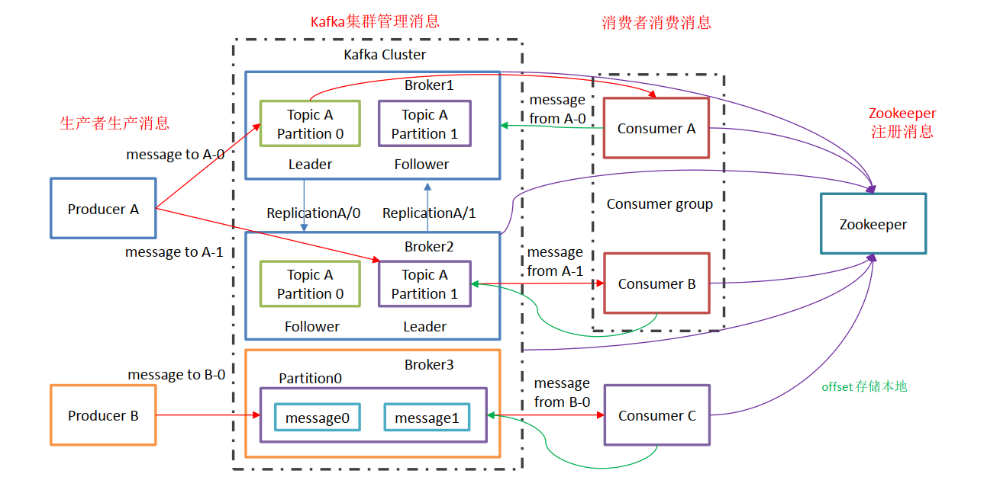
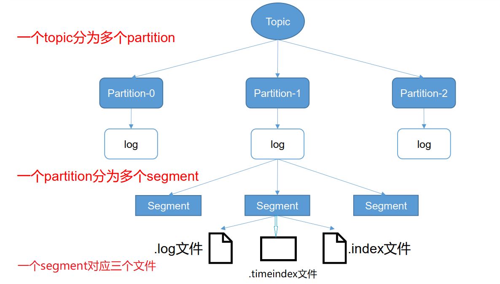
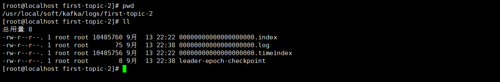
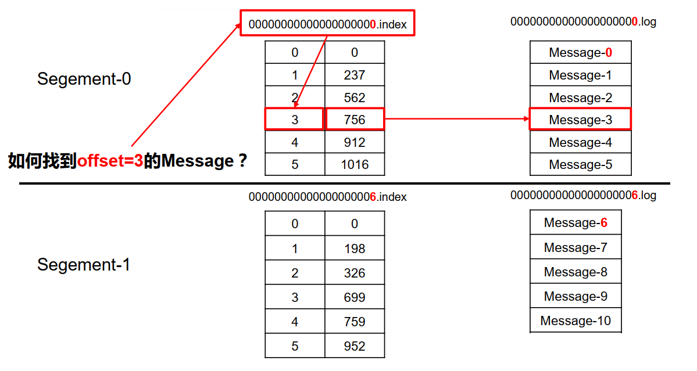
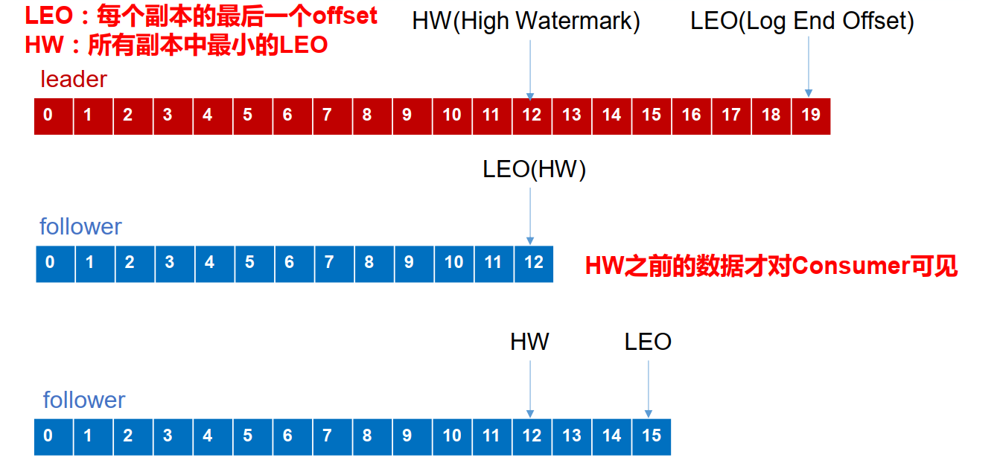
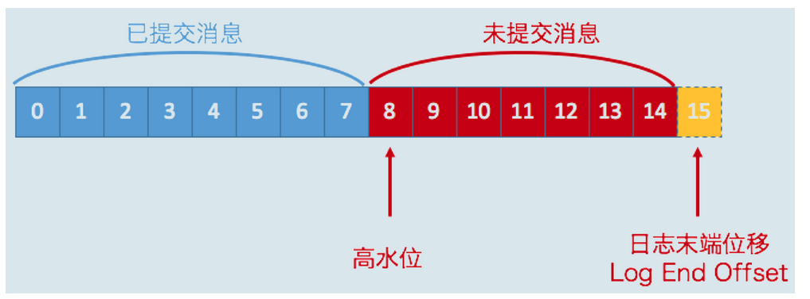

# Kafka

## 一、基础入门

- Kafka 是一个分布式的基于发布/订阅模式的消息队列（Message Queue） ， 主要应用于大数据实时处理领域。

- 使用消息队列的好处

  1. 解耦

     允许独立的扩展或修改两边的处理过程，只要确保它们遵守同样的接口约束。

  2. 可恢复性

     系统的一部分组件失效时，不会影响到整个系统。消息队列降低了进程间的耦合度，所以即使一个处理消息的进程挂掉，加入队列中的消息仍然可以在系统恢复后被处理。

  3. 缓冲

     Kafka有助于控制和优化数据流经过系统的速度， 解决生产消息和消费消息的处理速度不一致的问题。

  4. 灵活性 & 峰值处理能力

     在访问量剧增的情况下，应用仍然需要继续发挥作用，但是这样的突发流量并不常见。如果为以能处理这类峰值访问为标准来投入资源随时待命无疑是巨大的浪费。使用消息队列能够使关键组件顶住突发的访问压力，而不会因为突发的超负荷的请求而完全崩溃。

  5.  异步通信

     很多时候，用户不想也不需要立即处理消息。消息队列提供了异步处理机制，允许用户把一个消息放入队列，但并不立即处理它。想向队列中放入多少消息就放多少，然后在需要的时候再去处理它们。

### 1.1、Kafka基础架构

- Producer ： 消息生产者，就是向 kafka broker 发消息的客户端。
- Consumer ： 消息消费者，从kafka broker 取消息的客户端。
- Consumer Group （CG）： 消费者组，由多个 consumer 组成。 消费者组内每个消费者负责消费不同分区的数据，一个分区只能由一个组内消费者消费。消费者组之间互不影响。 所有的消费者都属于某个消费者组，即消费者组是逻辑上的一个订阅者。
- Broker ： 一台 kafka 服务器就是一个 broker。一个集群由多个 broker 组成。一个 broker可以容纳多个topic。
- Topic ： 可以理解为一个主题， 生产者和消费者面向的都是一个 topic；
- Partition： 分区。为了实现扩展性，一个非常大的 topic 可以分布到多个 broker（即服务器）上，一个 topic 可以分为多个 partition，每个 partition 是一个有序的队列。
- Replica： 副本，为保证当集群中的某个节点发生故障时， 该节点上的 partition 数据不丢失，且 kafka 仍然能够继续工作， kafka 提供了副本机制，一个 topic 的每个分区都有若干个副本，一个 leader 和若干个 follower。
- leader： 每个分区多个副本的“主”，生产者发送数据的对象，以及消费者消费数据的对象都是 leader。
- follower： 每个分区多个副本中的“从”，实时从 leader 中同步数据，保持和 leader 数据的同步。 leader 发生故障时，某个 follower 会成为新的 follower。

### 1.2、Topic

- Kafka 中消息是以 topic 进行分类的， 生产者生产消息，消费者消费消息，都是面向 topic的。topic 是逻辑上的概念，而partition是物理上的概念.

- 每个partition对应于一个log文件，该 log 文件中存储的就是 producer 生产的数据。 Producer 生产的数据会被不断追加到该log 文件末端，且每条数据都有自己的offset。 

- kafka broker在集群消费模式下，会记录消费者组的消费偏移量offset。

  

### 1.3、文件存储机制

- 由于生产者生产的消息会不断追加到log文件末尾，为防止log文件过大导致数据定位效率低下， Kafka 采取了分片和索引机制，将每个 partition 分为多个 segment。 每个 segment对应三个文件——“.index”文件、“.log”文件、“.timeindex”文件。 这些文件位于一个文件夹下， 该文件夹的命名规则为：topic 名称+分区序号。例如， first 这个 topic 有三个分区，则其对应的文件夹为 first-0，first-1，first-2。

  

- 创建topic时，--replication-factor指定文件副本数。--replication-factor  3 代表为每个partition分区创建3个副本。如果是3台机器组成的集群，那么对于同一个partition，每台机器上都会存在一个副本。每个partition文件夹内部有index、log、timeindex

  

- index 和 log 文件以当前 segment 的第一条消息的offset命名。

  .index文件存储大量的索引信息，.log文件存储大量的数据，索引文件中的元数据指向对应数据文件中 message 的物理偏移地址。

  index文件中并不会记录每条消息的地址索引，只会记录一个区间的某条消息的地址索引。搜索指定消息时，会根据指定的偏移量，去匹配离的最近的索引记录。

  

  

## 二、分区策略

### 2.1、分区的好处

1. 方便在集群中扩展，每个 Partition 可以通过调整以适应它所在的机器，而一个 topic又可以有多个 Partition 组成，因此整个集群就可以适应任意大小的数据了。
2. 可以提高并发，因为可以以 Partition 为单位读写了。

### 2.2、分区的原则

1. 指明 partition 的情况下，直接将指明的值直接作为 partiton 值。
2. 没有指明 partition 值但有 key 的情况下，将 key 的 hash 值与 topic 的 partition数进行取余得到 partition 值。
3. 既没有 partition 值又没有 key 值的情况下，第一次调用时随机生成一个整数（后面每次调用在这个整数上自增），将这个值与 topic 可用的 partition 总数取余得到 partition值，也就是常说的 round-robin 算法。

### 2.3、Kafka ACK消息可靠性保证

为保证 producer 发送的数据，能可靠的发送到指定的 topic， topic 的每个partition收到producer发送的数据后， 都需要向 producer 发送 ack（acknowledgement 确认收到） ，如果producer 收到 ack， 就会进行下一轮的发送，否则重新发送数据。producer在发送数据的时候，可以设置acks应答模式。

Kafka应答机制有三种模式：

1. acks=0：producer 不等待 broker 的 ack，这一操作提供了一个最低的延迟， broker 一接收到将消息写入pagecache中，但是还没有写入磁盘就已经返回，当 broker 故障时有可能丢失数据。
2. acks=1：producer 等待 broker 的 ack， partition 的 leader 落盘成功后返回 ack，如果在 follower同步成功之前 leader 故障，那么将会丢失数据。
3. acks=-1或者acks=all：producer 等待 broker 的 ack， partition 的 leader 和 follower 全部落盘成功后才返回 ack。但是如果在 follower 同步完成后， broker 发送 ack 之前， leader 发生故障，那么会造成数据重复。

Kafka过半同步成功，即代表数据落盘持久化成功，leader就会返回给producer ACK。一般集群的过半通过，这个半数，是固定的数量，当集群中某台机器宕机，这个数量是应该动态变化的，并且运维有可能会使用自动部署脚本对服务进行重启，当服务重启之后，就会进行数据同步。这段期间是会影响Kafka整体的效率的，并且机器宕机，并不是简单重启就能解决，使用自动化脚本重启，会导致服务频繁宕机、重启，会逐渐影响到整个服务不可用。所以Kafka为了解决这个问题引入ISR处理逻辑。

- ISR：Leader 维护了一个动态的 in-sync replica set (ISR)，意为和 leader 保持同步的 follower 集合。当 ISR 中的 follower 完成数据的同步之后， leader 就会给 follower 发送 ack。如果 follower长 时 间 未 向 leader 同 步 数 据 ， 则 该 follower 将 被 踢 出 ISR ， 该 时 间 阈 值 由replica.lag.time.max.ms 参数设定。 Leader 发生故障之后，就会从 ISR 中选举新的 leader。
- AR：分区的所有副本称为 「AR」（Assigned Replicas——已分配的副本）。
- OSR：由于follower副本同步滞后过多的副本（不包括 leader 副本）组成 「OSR」（Out-of-Sync Replias）。
- AR = ISR + OSR：正常情况下，所有的follower副本都应该与leader副本保持同步，即AR = ISR，OSR集合为空。

## 三、故障恢复

- LEO：指的是每个副本最大的 offset。
- HW(高水位)：指的是消费者能见到的最大的 offset， ISR 队列中最小的 LEO。
  1. follower 故障
     follower 发生故障后会被临时踢出 ISR，待该 follower 恢复后， follower 会读取本地磁盘记录的上次的 HW，因为高水位下的数据，才被认为是已提交的数据，所以将 log 文件高于 HW 的部分截取掉，从 HW 开始向 leader 进行同步。等该 follower 的 LEO 大于等于该 Partition 的 HW，即 follower 追上 leader 之后，就可以重新加入 ISR 了。
  2. leader 故障
     leader 发生故障之后，会从 ISR 中选出一个新的 leader，之后，为保证多个副本之间的数据一致性， 其余的 follower 会先将各自的 log 文件高于 HW 的部分截掉，然后从新的 leader同步数据。
     注意： 这只能保证副本之间的数据一致性，并不能保证数据不丢失或者不重复。
